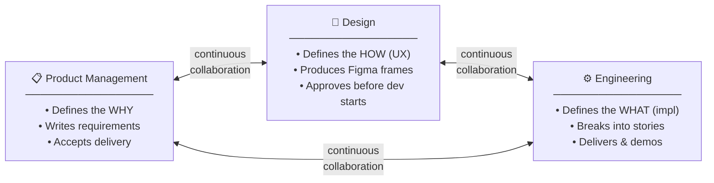
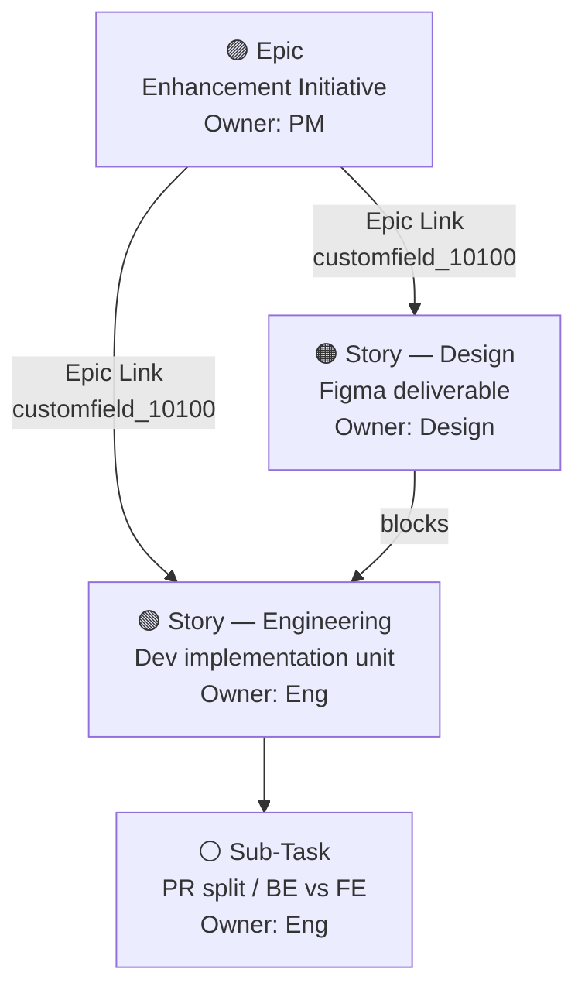
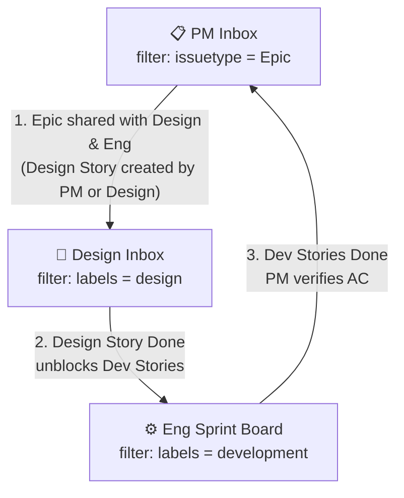
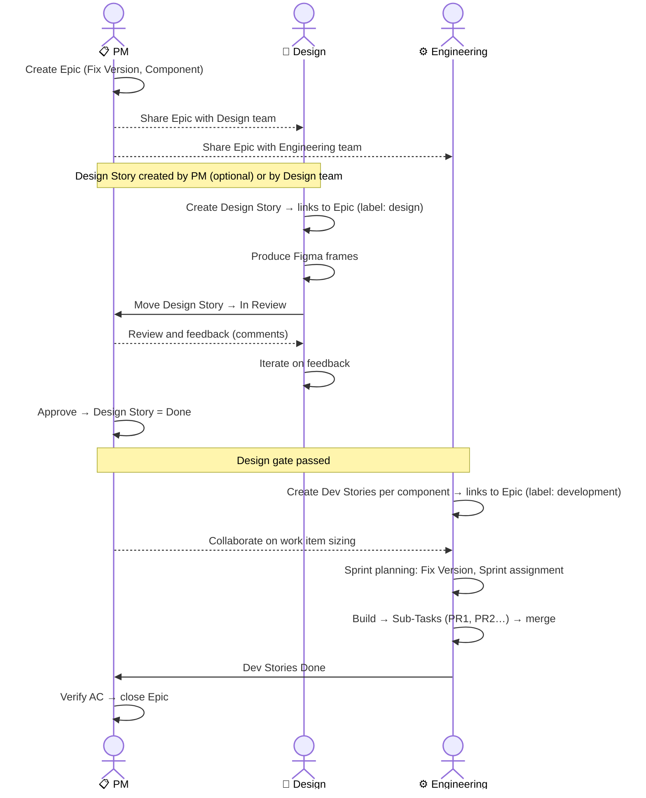
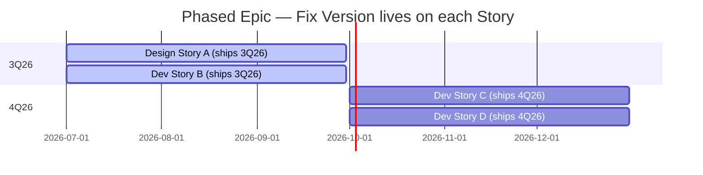
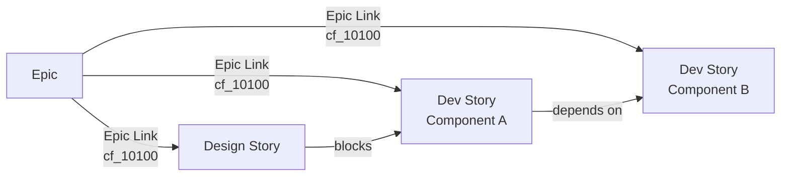
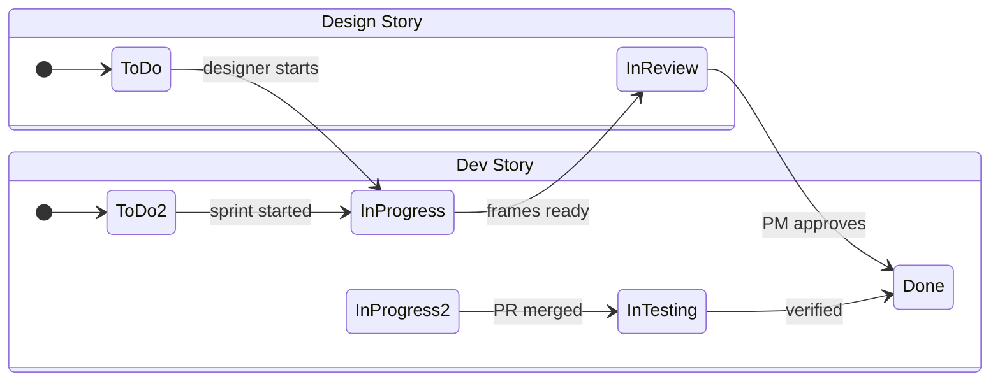
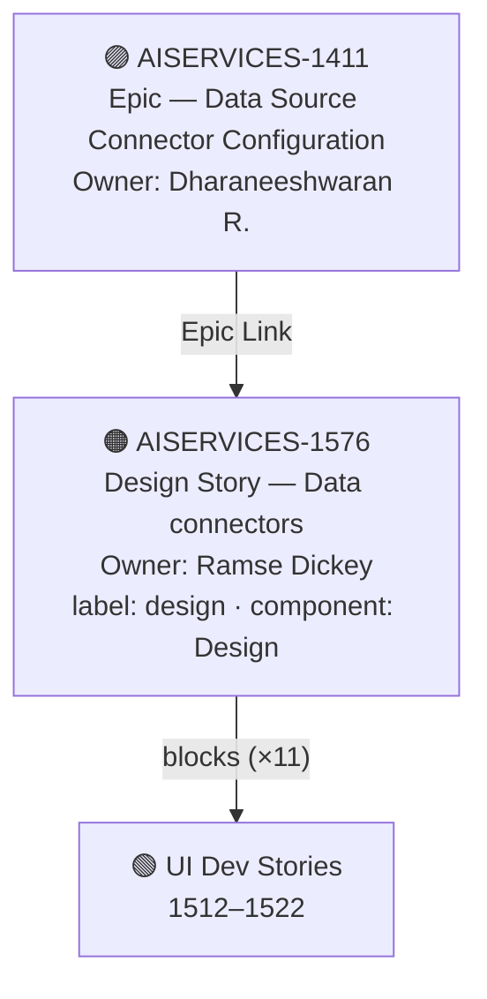

# Jira 3-in-a-Box Enhancement Workflow — AI Services

> A **3-in-a-box model** (Product Management · Design · Engineering) for managing product enhancements from idea to delivery, grounded in the **AISERVICES** Jira project's actual issue types, components, fix versions and custom fields.

---

## 1. What is 3-in-a-Box?

3-in-a-box means all three disciplines — **Product Management, Design, and Engineering** — are equal co-owners of an enhancement. No discipline throws work over the wall to the next. Each has a defined role at every stage, and no stage begins without the previous owner completing their gate.

---

## 2. Issue Hierarchy

Every enhancement flows through three levels. Epic is owned by PM; Design Story by Design; Dev Story by Engineering.

| Level | Issue Type | Owner | Purpose |
|---|---|---|---|
| **Epic** | `Epic` | PM | Strategic container. Groups all work for one enhancement. Stays open until all Stories are Done. |
| **Design Story** | `Story` (label: `design`) | Design | Produces Figma frames for the Epic. **One Design Story per Epic (or per distinct UX area).** Gates all UI dev stories. |
| **Dev Story** | `Story` (label: `development`) | Eng | Implementation unit per component. One Epic → N Dev Stories split by component. |
| **Sub-Task** | `Sub-Task` | Eng | PR splits using existing `PR<N>:` naming (e.g. `PR1: …`, `PR2: …`). |

---

## 3. The Three Inboxes

One AISERVICES project — three label-driven views. Each discipline filters their own inbox.

### PM inbox responsibilities
- Creates Epic with `Fix Version` and `Component`
- Optionally creates the Design Story linked to the Epic; assigns to designer (`label: design`)
- Approves Design Story frames; transitions story to **Done**
- Accepts completed Dev Stories against AC; closes Epic

### Design inbox responsibilities
- If PM has not created the Design Story: creates a `Story` linked to the Epic; sets component `Design`; `label: design`
- Produces Figma frames; attaches Figma URL to description
- Moves story → **In Review** when frames are ready; iterates on PM feedback
- **Done** = design gate passed — unblocks Engineering

### Engineering inbox responsibilities

- Creates Dev Stories per component linked to the Epic; sets `Fix Version`, `Component`, Sprint; `label: development`
- Only starts work after the linked Design Story is **Done** (or `label: no-design-needed` is set on the Epic)
- Collaborates with PM on work item sizing before committing to a sprint
- Uses `PR<N>:` Sub-Tasks for parallel work streams

---

## 4. End-to-End Lifecycle

---

## 5. Phased Delivery — One Epic, Multiple Fix Versions

Epics can span quarters. **Fix Version lives on the Stories and Sub-Tasks**, not the Epic.

**Rules:**
1. Fix Version on the **Story**, **Sub-Task**, **Bug** — not the Epic
2. Each Fix Version is mapped to a release (Eg 1Q26, 2Q26, 3Q26)
3. Each Story must be **independently shippable**; use `Depends on` links if ordering matters
4. Future-quarter Stories must have Fix Version mapped to Future Releases
5. Do **not** close the Epic until **all** Stories across all phases are Done

---

## 6. Issue Links Reference

| Link type | Between | Meaning |
|---|---|---|
| **Epic Link** (`customfield_10100`) | Story (Design or Dev) → Epic | Rolls issue into Epic's child list in Jira |
| **Blocks** | Design Story → Dev Story | Eng cannot start until Design Story is Done |
| **Relates to** | Design Story ↔ Epic | Design work covers the UX for this initiative |
| **Depends on** | Dev Story → Dev Story | Sequencing constraint (e.g. API Story before UI Story) |

---

## 7. Components, Labels & Fix Versions

### Project components (AISERVICES)

| Component | Lead | Typical issue types |
|---|---|---|
| `Design` | Susan Jasinski| Design Stories, Figma |
| `UI` | Ryan Edgell | UI Stories, Sub-Tasks, Bugs |
| `APIs & InterOp` | Ryan Edgell | API & InterOp Stories, Sub-Tasks, Bugs |
| `Orchestration` | Yussuf Shaikh | Orchestration Stories, Sub-Tasks, Bugs |
| `Use Cases` | Dharaneeshwaran R. | Use cases Stories, Sub-Tasks, Bugs |
| `Productization` | Tanvi Sambari | OSSC Stories, Sub-Tasks, Offering Deliverables |
| `Automation+QE+DevOps` | Manjunath AC | CI/CD, test-coverage Stories, Automation Stories, Bugs |
| `Performance` | Theresa Xu | Benchmark Epics / Stories |
| `Documentation` | Ira Pandey | Doc Stories / Tasks / Sub-Tasks |

### Label conventions

| Label | Applied to | Inbox filter |
|---|---|---|
| `design` | Design Story | Design inbox |
| `development` | Dev Story | Eng sprint board |
| `no-design-needed` | Epic | Bypasses design gate (back-end / infra only) |
| `UI` | Sub-Tasks (existing) | Retain existing convention |
| `productization` | Productization issues (existing) | Signals offering deliverable scope |

### Fix versions (existing)

| Version | Window | Status |
|---|---|---|
| `1Q26` | — | Released ✓ |
| `2Q26` | — | Released ✓ |
| `3Q26` | Jun 1 – Sep 30 2026 | Unreleased |
| `4Q26` | Oct 1 2026 – | Unreleased |

---

## 8. Saved Filters / Board Views

| View | Audience | JQL |
|---|---|---|
| PM Inbox | Product | `project = AISERVICES AND issuetype = Epic AND status != Done ORDER BY priority DESC` |
| Design Inbox | Design | `project = AISERVICES AND issuetype = Story AND labels = design AND status != Done ORDER BY updated DESC` |
| Design Gate Check | All | `project = AISERVICES AND labels = development AND status = "To Do" AND issueFunction in linkedIssuesOf("labels = design AND status != Done", "blocks")` |
| Eng Sprint Board | Eng | `project = AISERVICES AND labels = development AND sprint in openSprints() ORDER BY component` |
| 3Q26 Roadmap | All | `project = AISERVICES AND issuetype = Epic AND fixVersion = "3Q26" ORDER BY status` |

---

## 9. Status Transitions

---

## 10. Worked Example — Data Source Connectors (AISERVICES-1411)

> This section shows the 3-in-a-box workflow applied to a real epic. Every rule from §§2–9 is illustrated with actual Jira issue keys.

### 10.1 Epic

| Field | Value |
|---|---|
| **Key** | [AISERVICES-1411](https://jsw.ibm.com/browse/AISERVICES-1411) |
| **Summary** | Data Source Connector Configuration — S3 and SSH/SFTP support |
| **Type** | Epic |
| **Status** | To Do |
| **Owner (PM)** | Dharaneeshwaran Ravichandran |
| **Fix Version** | `3Q26` |
| **Components** | `Design` · `Orchestration` · `UI` · `Use Cases` |

The epic spans the full stack: credential input UI forms, secure backend storage, connectivity validation, and sync scheduling for S3 (Cloud Object Store) and SSH/SFTP connectors.

---

### 10.2 Design Story (gates all UI dev stories)

Per §2, one Design Story is created and linked to the Epic via `Epic Link`. It carries `label: design` and `component: Design`, and **blocks** all UI dev stories until PM approves the frames.

| Field | Value |
|---|---|
| **Key** | [AISERVICES-1576](https://jsw.ibm.com/browse/AISERVICES-1576) |
| **Summary** | Data connectors |
| **Type** | Story |
| **Status** | To Do |
| **Owner (Design)** | Ramse Dickey |
| **Component** | `Design` |
| **Label** | `design` |
| **Epic Link** | AISERVICES-1411 |
| **Fix Version** | `3Q26` |
| **blocks →** | AISERVICES-1512, 1513, 1514, 1515, 1516, 1517, 1518, 1519, 1520, 1521, 1522 |

---

### 10.3 Dev Stories

All dev stories carry `label: development` and are linked to the Epic via `Epic Link`. They are split by **component** — UI, Use Cases, and Orchestration — reflecting the three engineering workstreams.

#### UI stories — blocked by AISERVICES-1576 until design is approved

| Key | Summary | Status | Assignee | Component |
|---|---|---|---|---|
| [AISERVICES-1512](https://jsw.ibm.com/browse/AISERVICES-1512) | Connectors > left navigation | 🔄 In Progress | Pranith Rao | `UI` |
| [AISERVICES-1513](https://jsw.ibm.com/browse/AISERVICES-1513) | Connectors > Data Source landing panel | To Do | Ryan Edgell | `UI` |
| [AISERVICES-1514](https://jsw.ibm.com/browse/AISERVICES-1514) | Connectors > Remove data source | To Do | Ryan Edgell | `UI` |
| [AISERVICES-1515](https://jsw.ibm.com/browse/AISERVICES-1515) | Connectors > add data source | To Do | Ryan Edgell | `UI` |
| [AISERVICES-1516](https://jsw.ibm.com/browse/AISERVICES-1516) | Connectors > data source details | To Do | Ryan Edgell | `UI` |
| [AISERVICES-1517](https://jsw.ibm.com/browse/AISERVICES-1517) | Connectors > test connection | To Do | Ryan Edgell | `UI` |
| [AISERVICES-1518](https://jsw.ibm.com/browse/AISERVICES-1518) | Connectors > update keys | To Do | Ryan Edgell | `UI` |
| [AISERVICES-1519](https://jsw.ibm.com/browse/AISERVICES-1519) | Digital assistant and Service > view list of data sources | To Do | Ryan Edgell | `UI` |
| [AISERVICES-1520](https://jsw.ibm.com/browse/AISERVICES-1520) | Digital assistant > connect data source | To Do | Pranith Rao | `UI` |
| [AISERVICES-1521](https://jsw.ibm.com/browse/AISERVICES-1521) | Digital assistant > remove data source | To Do | Ryan Edgell | `UI` |
| [AISERVICES-1522](https://jsw.ibm.com/browse/AISERVICES-1522) | Deploy tearsheet > upload data source | To Do | Ryan Edgell | `UI` |

#### Use Cases / backend stories

| Key | Summary | Status | Assignee | Component |
|---|---|---|---|---|
| [AISERVICES-1412](https://jsw.ibm.com/browse/AISERVICES-1412) | S3 connector — credential input, secure storage, connectivity validation | To Do | Prachi Kurade | `Use Cases` · `Orchestration` |
| [AISERVICES-1433](https://jsw.ibm.com/browse/AISERVICES-1433) | POC for S3 Data Source connector | ✅ Done | Manjunath A C | `Use Cases` |
| [AISERVICES-1434](https://jsw.ibm.com/browse/AISERVICES-1434) | POC for SSH/SFTP Data source connector | ✅ Done | Sathvik S | `Use Cases` |
| [AISERVICES-1526](https://jsw.ibm.com/browse/AISERVICES-1526) | [Implementation] Data Source Connectors logic on Digitize | 🔄 In Progress | Sathvik S | `Use Cases` |

#### Orchestration / Catalog stories

| Key | Summary | Status | Assignee |
|---|---|---|---|
| [AISERVICES-1523](https://jsw.ibm.com/browse/AISERVICES-1523) | Proposal Document for Datasource Connectors - Catalog | 🔄 In Progress | Prachi Kurade |
| [AISERVICES-1560](https://jsw.ibm.com/browse/AISERVICES-1560) | Catalog DB: Datasource Connectors | 🔄 In Progress | Prachi Kurade |
| [AISERVICES-1561](https://jsw.ibm.com/browse/AISERVICES-1561) | Catalog: Connector Assets | 🔄 In Progress | Prachi Kurade |
| [AISERVICES-1562](https://jsw.ibm.com/browse/AISERVICES-1562) | Catalog: DataSource CRUD APIs | To Do | Prachi Kurade |
| [AISERVICES-1563](https://jsw.ibm.com/browse/AISERVICES-1563) | Catalog: Application - Datasource APIs | To Do | Prachi Kurade |
| [AISERVICES-1564](https://jsw.ibm.com/browse/AISERVICES-1564) | Catalog: Application Lifecycle integration with Datasource | To Do | Prachi Kurade |
| [AISERVICES-1565](https://jsw.ibm.com/browse/AISERVICES-1565) | Catalog: Connector Sync Job | To Do | Prachi Kurade |
| [AISERVICES-1566](https://jsw.ibm.com/browse/AISERVICES-1566) | Catalog: Encryption Implementation | To Do | Prachi Kurade |

---

### 10.4 Full Issue Hierarchy

```mermaid
graph TD
    EPIC["🟣 AISERVICES-1411\nEpic\nData Source Connector Configuration"]

    DES["🟠 AISERVICES-1576\nDesign Story — Data connectors\nlabel: design"]

    subgraph UI ["🟢 UI Dev Stories (label: development · component: UI)"]
        U1["1512 Connectors > left navigation 🔄"]
        U2["1513 Connectors > Data Source landing panel"]
        U3["1514 Connectors > Remove data source"]
        U4["1515 Connectors > add data source"]
        U5["1516 Connectors > data source details"]
        U6["1517 Connectors > test connection"]
        U7["1518 Connectors > update keys"]
        U8["1519 Digital assistant > view list of data sources"]
        U9["1520 Digital assistant > connect data source"]
        U10["1521 Digital assistant > remove data source"]
        U11["1522 Deploy tearsheet > upload data source"]
    end

    subgraph BE ["🟢 Backend Dev Stories (label: development)"]
        B1["1412 S3 connector — credential input & storage"]
        B2["1433 POC for S3 connector ✅"]
        B3["1434 POC for SSH/SFTP connector ✅"]
        B4["1526 Data Source Connectors logic on Digitize 🔄"]
    end

    subgraph ORC ["🟢 Orchestration / Catalog Stories (label: development)"]
        O1["1523 Proposal Document 🔄"]
        O2["1560 Catalog DB 🔄"]
        O3["1561 Connector Assets 🔄"]
        O4["1562 DataSource CRUD APIs"]
        O5["1563 Application - Datasource APIs"]
        O6["1564 Application Lifecycle integration"]
        O7["1565 Connector Sync Job"]
        O8["1566 Encryption Implementation"]
    end

    EPIC -->|"Epic Link"| DES
    EPIC -->|"Epic Link"| U1
    EPIC -->|"Epic Link"| U2
    EPIC -->|"Epic Link"| B1
    EPIC -->|"Epic Link"| O1

    DES -->|"blocks"| U1
    DES -->|"blocks"| U2
    DES -->|"blocks"| U3
    DES -->|"blocks"| U4
    DES -->|"blocks"| U5
    DES -->|"blocks"| U6
    DES -->|"blocks"| U7
    DES -->|"blocks"| U8
    DES -->|"blocks"| U9
    DES -->|"blocks"| U10
    DES -->|"blocks"| U11
```

---

### 10.5 Workflow Rules Illustrated

| Rule (§) | How it applies in this Epic |
|---|---|
| **§2 Issue hierarchy** | Epic 1411 → Design Story 1576 → 11 UI Dev Stories; separate backend / Orchestration stories per component |
| **§3 Three inboxes** | PM filters on `issuetype = Epic`; Design filters on `labels = design` (finds 1576); Eng filters on `labels = development` (finds all 23 dev stories) |
| **§6 Issue links** | 1576 carries `blocks` links to all 11 UI stories; Epic Link (`customfield_10100`) set on all child stories |
| **§7 Components & labels** | UI stories → `component: UI`, `label: development`; Design story → `component: Design`, `label: design`; Orchestration stories → `component: Orchestration`, `label: development`; Use Cases stories → `component: Use Cases`, `label: development` |
| **§7 Fix versions** | All stories carry `Fix Version: 3Q26` |
| **§5 Phased delivery** | Fix Version lives on each Story, not the Epic — allows individual stories to shift quarters independently |
| **§4 Lifecycle** | Design gate: 1576 must reach **Done** (PM approved) before any of the 11 blocked UI stories can start |
