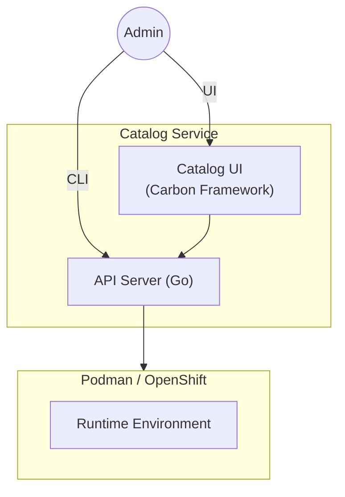
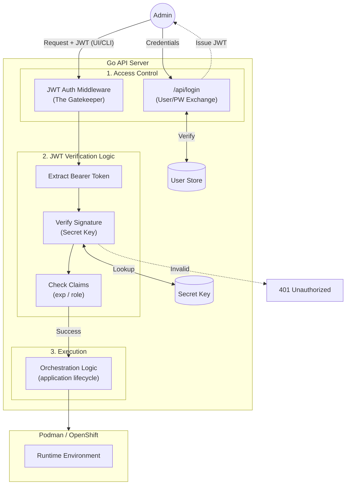
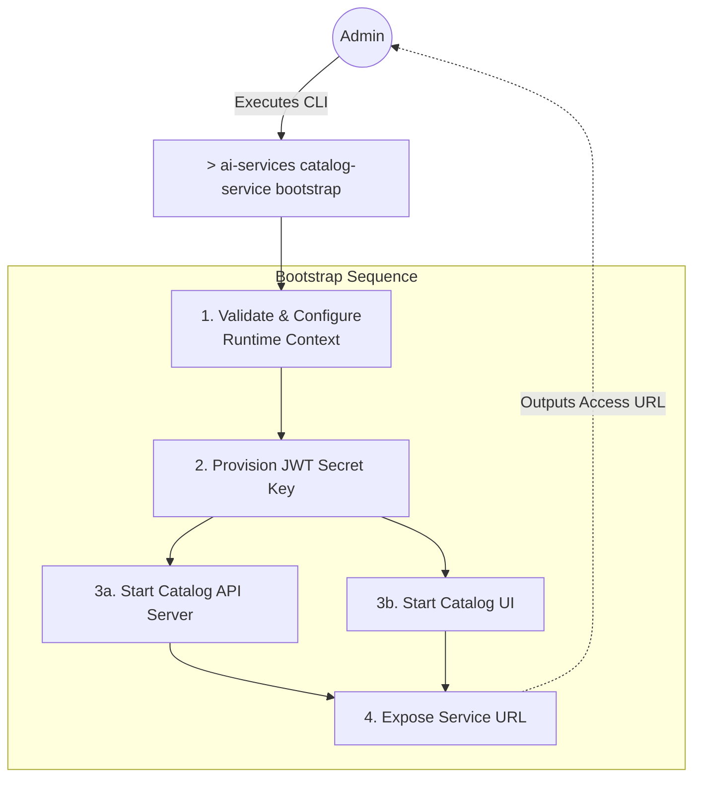

## Design Proposal: Catalog UI & Orchestration Service

**Subject:** Secure Enterprise Interface for IBM AI Services

**Target Platform:** RHEL LPAR(Standalone) / OpenShift(Clustered)

**Status:** Draft / Proposal

---

### 1. Executive Summary

The **Catalog UI Service** provides a centralized, authenticated web portal for managing the lifecycle of AI applications. By providing a high-fidelity interface, the service empowers users to discover application templates, **deploy AI services with one click**, and monitor real-time logs through a stable REST façade. This architecture eliminates the need for manual CLI interaction, providing a secure, single-origin experience for the enterprise.

---

### 2. Service Architecture

The architecture is centered on the **Catalog UI** as the entry point, utilizing a specialized Go API Server to handle orchestration and security.

* **Catalog UI (Carbon Framework)**: A frontend built with IBM’s Carbon Design System, providing a professional and accessible interface for template browsing and app management.
* **Go API Server (Orchestrator)**: A compiled, high-concurrency backend responsible for identity management, request validation, and the execution of orchestration logic.
* **AI Services Runtime**: The underlying infrastructure layer (Podman on LPAR or Kubernetes on OpenShift) that hosts vLLM inference servers and vector databases.



---

### 3. Core Functional Capabilities

The Catalog UI transforms manual workflows into automated, repeatable processes:

* **Template Discovery**: A curated library of AI application templates, allowing users to browse pre-configured models and RAG (Retrieval-Augmented Generation) stacks.

* **Accelerated Deployment**: A "One-Click" deployment flow that automates container AI Services provisioning and service exposer.

* **Lifecycle Observability**: Integrated real-time log streaming and status monitoring, providing immediate feedback on AI services health and resource utilization.

---

### 4. Security Framework (Simple Auth)

Security is managed at the Catalog UI Service level through a robust JWT-based authentication system.

* **Authentication**: The UI captures credentials and exchanges them with the Go API for a JWT.
* **JWT Middleware (The Gatekeeper)**:
1. **Extracts** the token from the header on every request.
2. **Verifies Signature** The server uses a locally stored Secret Key to recalculate the signature of the incoming header and payload. If it doesn't match the signature provided in the JWT, the request is rejected immediately.
3. **Claims Validation**: Checks expiration (`exp`) and roles (e.g., admin vs. viewer) before triggering any orchestration logic.



Here is the proposed addition to your design document. I recommend adding this as a new section (Section 5) to clearly define the operational rollout of the service.

---

Got it. Shifting from auto-detection to an explicit, user-defined runtime flag is a great design choice for CLI tools. It provides the administrator with deterministic control over the deployment target and avoids unexpected behavior in complex environments.

Here is the revised **Section 5** reflecting the explicit `--runtime` configuration.

---

### 5. Service Bootstrapping

To streamline the installation and operational readiness of the Catalog Service, administrators utilize a unified initialization command. This command uses a global flag to explicitly define the target infrastructure context before executing the bootstrap sequence.

**Command:**

```bash
$ ai-services catalog-service --runtime <podman|openshift> bootstrap

```

**Execution Flow:**
This command acts as the primary deployment mechanism, automating the orchestration of the management plane based on the provided configuration. When executed, it performs the following sequence:

1. **Runtime Validation:** Parses the `--runtime` flag to configure the orchestration context for either local execution (`podman` on RHEL LPAR) or clustered execution (`openshift`). If an invalid or missing flag is detected, the CLI halts and returns a usage error.
2. **Secret Generation:** Automatically generates, securely stores, and mounts the cryptographic Secret Key required for the Go API Server's JWT validation layer.
3. **Component Deployment:** Concurrently spins up both the **Catalog API Server** and the **Catalog UI** components within the targeted runtime environment.
4. **Network Binding & Routing:** Establishes the secure connection between the UI and API, exposes the frontend port, and returns the live access URL to the administrator.


