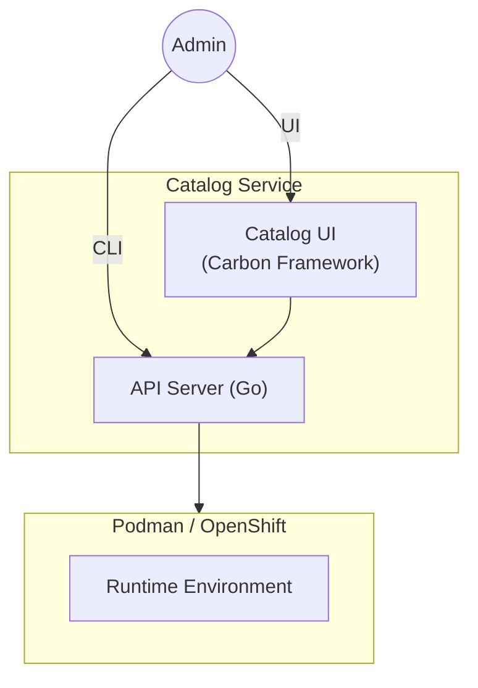
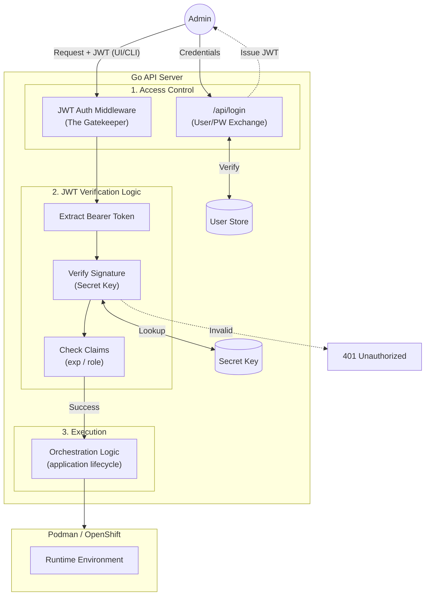

## Design Proposal: Catalog UI & Orchestration Service

**Subject:** Secure Enterprise Interface for IBM AI Services

**Target Platform:** RHEL LPAR(Standalone) / OpenShift(Clustered)

**Status:** Draft / Proposal

---

### 1. Executive Summary

The **Catalog UI Service** provides a centralized, authenticated web portal for managing the lifecycle of AI applications. By providing a high-fidelity interface, the service empowers users to discover application templates, **deploy AI services with one click**, and monitor real-time logs through a stable REST façade. This architecture eliminates the need for manual CLI interaction, providing a secure, single-origin experience for the enterprise.

---

### 2. Service Architecture

The architecture is centered on the **Catalog UI** as the entry point, utilizing a specialized Go API Server to handle orchestration and security.

* **Catalog UI (Carbon Framework)**: A frontend built with IBM’s Carbon Design System, providing a professional and accessible interface for template browsing and app management.
* **Go API Server (Orchestrator)**: A compiled, high-concurrency backend responsible for identity management, request validation, and the execution of orchestration logic.
* **AI Services Runtime**: The underlying infrastructure layer (Podman on LPAR or Kubernetes on OpenShift) that hosts vLLM inference servers and vector databases.

---

### 3. Core Functional Capabilities

The Catalog UI transforms manual workflows into automated, repeatable processes:

* **Template Discovery**: A curated library of AI application templates, allowing users to browse pre-configured models and RAG (Retrieval-Augmented Generation) stacks.

* **Accelerated Deployment**: A "One-Click" deployment flow that automates container AI Services provisioning and service exposer.

* **Lifecycle Observability**: Integrated real-time log streaming and status monitoring, providing immediate feedback on AI services health and resource utilization.

---

### 4. Security Framework (Simple Auth)

Security is managed at the Catalog UI Service level through a robust JWT-based authentication system.

* **Authentication**: The UI captures credentials and exchanges them with the Go API for a JWT.
* **JWT Middleware (The Gatekeeper)**:
1. **Extracts** the token from the header on every request.
2. **Verifies Signature** The server uses a locally stored Secret Key to recalculate the signature of the incoming header and payload. If it doesn't match the signature provided in the JWT, the request is rejected immediately.
3. **Claims Validation**: Checks expiration (`exp`) and roles (e.g., admin vs. viewer) before triggering any orchestration logic.

