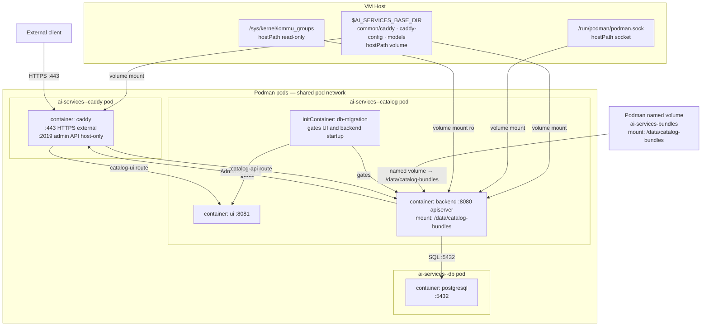
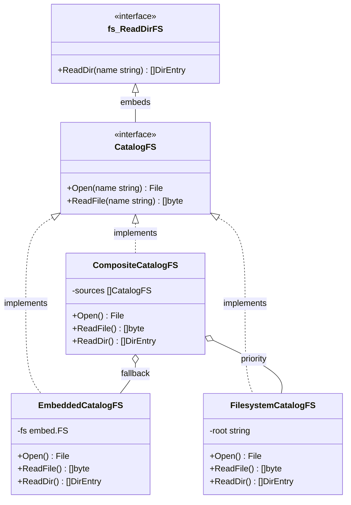
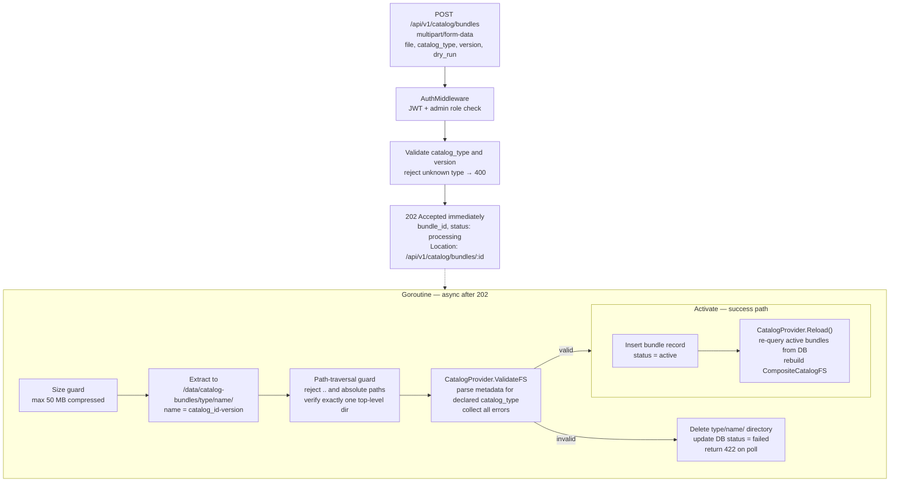
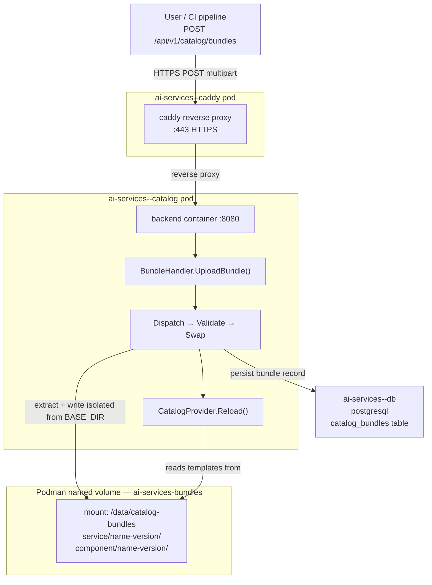
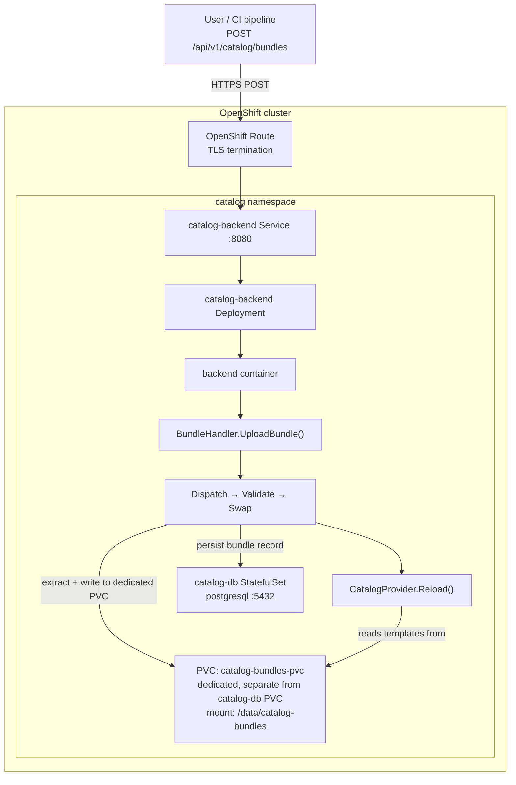

# Custom Service Templates for Customer Asset Onboarding

**Version:** 1.0
**Date:** Aug 2026
**Status:** Draft

---

## Table of Contents

1. [Executive Summary](#1-executive-summary)
2. [Background and Motivation](#2-background-and-motivation)
3. [Catalog Pod Architecture](#3-catalog-pod-architecture)
4. [New Asset Structure](#4-new-asset-structure)
5. [Template Provider Design](#5-template-provider-design)
6. [CatalogProvider Integration](#6-catalogprovider-integration)
7. [API Upload](#7-api-upload)
8. [Custom Template Directory Structure](#8-custom-template-directory-structure)
9. [Usage Examples](#9-usage-examples)
10. [Backward Compatibility](#10-backward-compatibility)
11. [Future Enhancements](#11-future-enhancements)

---

## 1. Executive Summary

Enterprise customers deploying AI Services on their own infrastructure often bring proprietary workloads, domain-specific models, and internal service patterns that are not represented in the platform's built-in catalog. Today there is no supported path for customers to introduce their own services into a running deployment without modifying the platform binary itself — a process that is impractical at scale and incompatible with air-gapped or regulated environments.

This proposal introduces **Custom Service Templates** — a first-class mechanism for customers to onboard their own AI service assets into the catalog at runtime. A customer packages their service definition as a `.tar.gz` bundle and uploads it to the running catalog backend over HTTPS. The platform validates, registers, and hot-reloads the new service immediately — with no pod restart, no host filesystem access, and no changes to the platform binary required. The mechanism is identical on Podman single-VM deployments and OpenShift clusters.

Built-in platform services are protected: a bundle whose `catalog_id` conflicts with an embedded service is rejected at validation time, ensuring the integrity of the core catalog is never compromised.

| Property | Detail |
|---|---|
| **Use case** | Onboard customer-authored service assets into a live catalog deployment |
| **Delivery** | `POST /api/v1/catalog/bundles` — `.tar.gz` archive uploaded over HTTPS to the running catalog |
| **Podman** | ✅ — bundle stored in dedicated named volume `ai-services-bundles` |
| **OpenShift** | ✅ — bundle stored in dedicated PVC `catalog-bundles-pvc` |
| **Live reload** | Automatic — `CatalogProvider` hot-reloads after successful extraction, no pod restart |
| **Audit trail** | `catalog_bundles` table in PostgreSQL — every upload is recorded with uploader identity and timestamp |
| **Best for** | Enterprise customers, air-gapped deployments, regulated environments, CI/CD-driven asset promotion |

---

## 2. Background and Motivation

### 2.1 Current Asset Architecture

The catalog uses a **service-oriented** decomposition. All platform assets are compiled into the binary at build time via `go:embed`, living under three roots in `assets.CatalogFS` (declared in [`ai-services/assets/fs.go`](ai-services/assets/fs.go:11)):

| Root | Purpose |
|---|---|
| `ai-services/assets/architectures/` | Architecture metadata (e.g. `rag`) declaring which services compose it |
| `ai-services/assets/services/` | Per-service assets: `chat`, `digitize`, `similarity`, `summarize` |
| `ai-services/assets/components/` | Reusable component providers: `llm`, `embedding`, `vector_store`, `reranker` |

All loading flows through [`CatalogProvider`](ai-services/internal/pkg/catalog/catalog.go:32), which walks `CatalogFS` at startup and caches every `metadata.yaml` it finds. Deployment is driven by the catalog **apiserver** running inside a pod — not by the CLI host process. Because the catalog is embedded in the binary, adding a new service today requires a full platform build and redeployment.

### 2.2 Problem Statement

Enterprise customers operate AI Services in environments where the built-in service catalog does not fully represent their workloads. Key pain points include:

- **Proprietary services** — customers have internal AI workloads (custom RAG pipelines, domain-specific inference services, internal tooling) that need to be deployable through the same catalog-driven workflow as built-in services.
- **Operational constraints** — air-gapped environments, regulated industries, and on-premises VM deployments make it impractical to request a platform rebuild each time a customer needs to register a new service.
- **CI/CD asset promotion** — teams need to promote service definitions through staging and production deployments programmatically, without manual intervention on each host.
- **Partner and ISV onboarding** — system integrators and technology partners need a supported path to register their own service assets alongside IBM-certified ones.

Currently, there is no supported mechanism to extend the catalog at runtime. Custom assets are delivered by uploading a `.tar.gz` bundle to the running catalog API over HTTPS. The apiserver extracts it to isolated storage, validates it, and hot-reloads `CatalogProvider` — no pod restart, no CLI host access required, and no changes to the platform binary needed.

### 2.3 Goals

1. Provide a secure, authenticated API endpoint (`POST /api/v1/catalog/bundles`) through which customers can register new service assets into a live deployment without platform downtime.
2. At apiserver startup, compose customer-uploaded bundles with the embedded `CatalogFS` via a `CompositeCatalogFS`, presenting a unified catalog that includes both platform and customer services.
3. Protect the integrity of built-in platform services — bundles that attempt to use a reserved `catalog_id` are rejected; the embedded catalog is immutable at runtime.
4. Maintain full backward compatibility — in the absence of any uploaded bundles, behaviour is identical to the current release.

---

## 3. Catalog Pod Architecture

Understanding how the catalog runs as pods is essential context for where custom templates plug in.

### 3.1 Catalog pod topology



### 3.2 Why this matters for custom templates

The catalog backend's `CatalogProvider` runs **inside the `ai-services--catalog` container**, not on the CLI host. `assets.CatalogFS` is baked into the binary at build time (via `go:embed`). For custom templates to be visible at runtime they must reach the container and be overlaid onto the embedded FS.

Custom assets are delivered via the running catalog API: the client POSTs a `.tar.gz` bundle over HTTPS, and the apiserver writes the extracted contents to a dedicated named volume (`ai-services-bundles` on Podman, `catalog-bundles-pvc` on OpenShift) that it already owns. Both runtimes mount the volume at the well-known path `/data/catalog-bundles` inside the container. Bundles are stored under `<catalog_type>/<name>/` where `name = <catalog_id>-<version>` (e.g. `service/chat-2.0.0/`). At startup, `CatalogProvider` queries the DB for all `status = 'active'` rows, resolves each to its named directory, and builds a `CompositeCatalogFS`. Hot-reload happens in-process after every successful upload; no pod restart is needed.

### 3.3 OpenShift path

For OpenShift, `catalog configure` runs [`openshift.DeployCatalog`](ai-services/internal/pkg/catalog/cli/configure/openshift/configure.go:24), which uses Helm to install/upgrade the catalog chart from `assets/catalog/openshift/`. No chart change is required for bundle support: once the catalog is deployed, users POST bundles to the Route-exposed API endpoint. The backend writes to the `catalog-bundles-pvc` PVC it already mounts (see §7.6).

---

## 4. New Asset Structure

### 4.1 Built-in service assets (existing)

Each service under `ai-services/assets/services/` has the following layout, shown for `chat`:

```
ai-services/assets/services/chat/
├── metadata.yaml              # Service identity & dependencies (id: chat)
├── podman/
│   ├── metadata.yaml          # Runtime metadata: version, resources, podTemplateExecutions
│   ├── values.yaml            # Default parameter values
│   ├── values.schema.json     # JSON Schema for parameter validation
│   ├── templates/
│   │   └── chat-bot.yaml.tmpl # Pod spec template
│   └── steps/
│       ├── info.md
│       └── vars_file.yaml
└── openshift/
    ├── Chart.yaml
    ├── metadata.yaml
    ├── values.yaml
    └── templates/
        ├── chat-bot-backend-deployment.yaml
        └── ...
```

Key fields from [`assets/services/chat/metadata.yaml`](ai-services/assets/services/chat/metadata.yaml:1):

```yaml
id: chat
name: "Question and answer"
type: service
certified_by: "IBM"
architectures:
  - rag
dependencies:
  - id: vector_store
  - id: embedding
  - id: llm
standalone: false
```

### 4.2 Architecture assets (existing)

`assets/architectures/rag/metadata.yaml` declares which services compose the `rag` architecture and which components are shared globally across all services:

```yaml
id: rag
name: "Digital Assistant"
type: architecture
global_components:
  - type: vector_store
  - type: embedding
services:
  - id: chat
  - id: digitize
  - id: similarity
```

### 4.3 Custom service assets (proposed)

A user-supplied bundle mirrors the same `services/` root. Only the entries present in the bundle are overlaid; everything else falls through to the embedded assets.

```
my-bundle.tar.gz
└── services/
    └── my-service/
        ├── metadata.yaml           # required
        └── podman/
            ├── metadata.yaml       # required (version, resources, podTemplateExecutions)
            ├── values.yaml         # required
            ├── values.schema.json  # optional
            └── templates/
                └── my-service.yaml.tmpl
```

Only `services/` is a valid top-level directory in a bundle; any other roots are silently skipped (forward-compatible for future `components/` support). The `catalog_id` inside the bundle must **not** match any built-in service — if it does, validation rejects the bundle with a `422` error.

---

## 5. Template Provider Design

### 5.1 Provider hierarchy



### 5.2 Interface

```go
// CatalogFS abstracts the filesystem used by CatalogProvider.
type CatalogFS interface {
    fs.ReadDirFS
    Open(name string) (fs.File, error)
    ReadFile(name string) ([]byte, error)
}
```

### 5.3 FilesystemCatalogFS

```go
// FilesystemCatalogFS reads catalog assets from a local directory.
// Inside the container this is the active bundle directory written by BundleService.
type FilesystemCatalogFS struct {
    root string // e.g. "/data/catalog-bundles/service/chat-2.0.0"
}
```

Validates at construction that `services/` exists under `root`, providing an actionable early error. Entries other than `services/` are ignored.

### 5.4 CompositeCatalogFS

```go
// CompositeCatalogFS merges multiple CatalogFS instances.
// Lookup checks each source in order; the first hit wins.
// WalkDir visits all sources and deduplicates paths.
type CompositeCatalogFS struct {
    sources []CatalogFS // [bundleFS, embeddedFS]
}
```

When `WalkDir` encounters the same relative path (e.g. `services/chat/metadata.yaml`) in both sources, the first source (bundle) wins and the embedded version is silently skipped.

### 5.5 Factory function

At startup the apiserver builds one `FilesystemCatalogFS` per active bundle (see §6.3). The factory below is the helper used when there is exactly one bundle path to overlay — for example in tests or single-bundle tooling:

```go
// NewCatalogFS returns the CatalogFS to use.
// bundlePath="" → returns the embedded FS only (no active bundle).
// bundlePath set → returns a composite that overlays that single bundle directory.
// For multiple active bundles use NewCompositeCatalogFS directly (see §6.3).
func NewCatalogFS(bundlePath string) (CatalogFS, error) {
    embedded := &EmbeddedCatalogFS{fs: &assets.CatalogFS}
    if bundlePath == "" {
        return embedded, nil
    }
    bundle, err := NewFilesystemCatalogFS(bundlePath)
    if err != nil {
        logger.Warningf("bundle path '%s' invalid, using built-in only: %v", bundlePath, err)
        return embedded, nil
    }
    return NewCompositeCatalogFS(bundle, embedded), nil
}
```

### 5.6 Resolution priority

At startup, `CatalogProvider` reads active bundle versions from the DB and constructs one `FilesystemCatalogFS` per active item, all layered before the embedded FS:

| Priority | Source | Condition |
|---|---|---|
| 1..N | `FilesystemCatalogFS` (one per active bundle) | DB has `status = 'active'` rows; paths are `/data/catalog-bundles/<catalog_type>/<name>/` |
| N+1 | `EmbeddedCatalogFS` (built-in) | Always present as fallback |

---

## 6. CatalogProvider Integration

### 6.1 Current loading (single embedded FS)

[`loadCatalogItems`](ai-services/internal/pkg/catalog/catalog.go:56) today walks `assets.CatalogFS` directly, dispatching on the first path segment (`"architectures"`, `"services"`, `"components"`) and storing results in `sharedItems`:

```go
err := fs.WalkDir(&assets.CatalogFS, ".", func(path string, d fs.DirEntry, err error) error {
    return processMetadataFile(ctx, path, items)
})
```

### 6.2 Proposed: inject CatalogFS

`NewCatalogProvider` gains an optional functional option:

```go
func NewCatalogProvider(opts ...Option) (*CatalogProvider, error)

// WithBundlePath overlays the active bundle directory on top of the embedded catalog.
func WithBundlePath(dir string) Option
```

When provided, `loadCatalogItems` receives the `CompositeCatalogFS` instead of `&assets.CatalogFS`. The `processMetadataFile`, `parseService`, `parseArchitecture`, `parseComponent` functions are unchanged — they work against any `CatalogFS`.

### 6.3 Apiserver startup loads active bundle paths from the DB

The bundle volume is always mounted at `/data/catalog-bundles`. No env var is needed. At startup, the apiserver queries the `catalog_bundles` table for all `status = 'active'` rows, resolves each one to its versioned directory on disk, and builds a `CompositeCatalogFS` with one `FilesystemCatalogFS` per active item:

```go
// catalogBundlesDir is the well-known container mount path for the bundles volume.
// It is fixed by the pod spec (Podman named volume / OpenShift PVC).
const catalogBundlesDir = "/data/catalog-bundles"

// In the apiserver main/start path:
activeBundles, err := bundleRepo.ListActive(ctx) // SELECT WHERE status='active'
var fsList []CatalogFS
for _, b := range activeBundles {
    // path: /data/catalog-bundles/<catalog_type>/<name>/
    // name is derived server-side as <catalog_id>-<version>
    p := filepath.Join(catalogBundlesDir, b.CatalogType, b.Name)
    if fs, err := NewFilesystemCatalogFS(p); err == nil {
        fsList = append(fsList, fs)
    }
}
fsList = append(fsList, &EmbeddedCatalogFS{fs: &assets.CatalogFS})
provider, err := catalog.NewCatalogProvider(catalog.WithCompositeCatalogFS(fsList...))
```

If there are no active bundles, only `EmbeddedCatalogFS` is used — behaviour is identical to today.

---

## 7. API Upload

Custom catalog assets are delivered by uploading a `.tar.gz` bundle to the running catalog backend over its existing HTTPS endpoint. A bundle is a generic container — it can carry any mix of catalog root types (`services/`, `components/`, and others in future). The archive is extracted, validated per root type, and hot-reloaded into `CatalogProvider` — with no pod restart required for either Podman or OpenShift.

> **Scope for this release:** only `services/` is processed. `components/` and other roots are accepted in the archive but skipped by the dispatcher — they will be activated in a future release without any change to the bundle format or API contract.

### 7.1 Design goals

| Goal | Detail |
|---|---|
| No restart required | `CatalogProvider` reloads the custom layer in-process after a successful upload |
| Idempotent | Re-uploading the same `catalog_id` + `version` replaces the existing directory in-place |
| Independent bundles | Each uploaded bundle exists separately; multiple bundles for different `catalog_id` values are all active simultaneously |
| Authenticated | Uses the existing JWT `BearerAuth` middleware; only admin-role tokens are accepted |
| Consistent across runtimes | Same API endpoint works for Podman and OpenShift; only the storage backend differs |
| Bounded size | Configurable `MAX_BUNDLE_SIZE` (default 50 MB); enforced at the HTTP layer before extraction |

---

### 7.2 New API endpoints

Three endpoints are added to the existing router in [`apiserver/router.go`](ai-services/internal/pkg/catalog/apiserver/router.go:18) under the authenticated `catalog` group:

| Method | Path | Description |
|---|---|---|
| `POST` | `/api/v1/catalog/bundles` | Upload a new bundle (`.tar.gz`). Each bundle is registered independently and activated on success. |
| `GET` | `/api/v1/catalog/bundles` | List all uploaded bundles (id, status, uploaded_at, size). |
| `GET` | `/api/v1/catalog/bundles/:id` | Get the status of a specific bundle by ID. Used to poll after a `202` upload response. |

#### 7.2.1 Upload bundle — `POST /api/v1/catalog/bundles`

The request uses `multipart/form-data` so that the binary `.tar.gz` file and the text fields can travel together in the same request. The server validates `catalog_type` and `version` before touching the archive, then extracts directly into the versioned directory on the bundle volume.

```
POST /api/v1/catalog/bundles
Content-Type: multipart/form-data
Authorization: Bearer <admin-jwt>

Form fields:
  file         (required)  — .tar.gz archive containing the catalog item
                             assets; max 50 MB compressed
  catalog_type (required)  — type of the catalog item in this bundle;
                             accepted values: "service", "component"
  version      (required)  — semantic version of this bundle, e.g. "1.0.0";
                             used as the directory name under
                             /data/catalog-bundles/<type>/<name>/
                             where name = <catalog_id>-<version>
  dry_run      (optional)  — "true" validates the archive without activating it
```

**Example (curl):**
```bash
curl -X POST https://catalog-api.<domain>/api/v1/catalog/bundles \
  -H "Authorization: Bearer $TOKEN" \
  -F "file=@my-bundle.tar.gz" \
  -F "catalog_type=service" \
  -F "version=1.0.0"
```

**Responses:**

| Status | Meaning |
|---|---|
| `202 Accepted` | Bundle accepted; extraction and validation running asynchronously. Use the `Location` header to poll for status. |
| `400 Bad Request` | Missing `file`, `catalog_type`, or `version` field; unrecognised `catalog_type`; invalid version format; wrong content-type; or archive exceeds size limit. |
| `401 Unauthorized` | Missing or invalid JWT. |
| `403 Forbidden` | Token does not carry admin role. |
| `422 Unprocessable Entity` | Archive extracted but validation failed (structured error list returned). |

The response includes a `Location` header pointing to the status resource:

```
HTTP/1.1 202 Accepted
Location: /api/v1/catalog/bundles/bnd_01JW4X9K2M8VQRP3T5YZ
```

`catalog_type` is known immediately from the request field. `catalog_id` is resolved from the directory name inside the archive during extraction and populated once the archive is unpacked. Both are present in the `202` body:

```json
// 202 response body
{
  "id":           "bnd_01JW4X9K2M8VQRP3T5YZ",
  "name":         "my-service-1.0.0",
  "status":       "processing",
  "uploaded_at":  "2026-05-12T09:14:02Z",
  "size_bytes":   143360,
  "catalog_type": "service",
  "catalog_id":   "my-service",
  "version":      "1.0.0",
  "uploaded_by":  "admin"
}
```

Once the bundle reaches `active` or `failed` status, the polled response reflects the final outcome:

```json
// after activation — GET /api/v1/catalog/bundles/bnd_01JW4X9K2M8VQRP3T5YZ
{
  "id":           "bnd_01JW4X9K2M8VQRP3T5YZ",
  "name":         "my-service-1.0.0",
  "status":       "active",
  "uploaded_at":  "2026-05-12T09:14:02Z",
  "size_bytes":   143360,
  "catalog_type": "service",
  "catalog_id":   "my-service",
  "version":      "1.0.0",
  "uploaded_by":  "admin"
}
```

#### 7.2.2 List bundles — `GET /api/v1/catalog/bundles`

Each bundle record carries `catalog_type` (the type declared by the uploader — `"service"` or `"component"`) and `catalog_id` (the item id within that type). Multiple bundles for different catalog items are all active simultaneously and each is listed independently.

```json
{
  "bundles": [
    {
      "id":           "bnd_01JW4X9K2M8VQRP3T5YZ",
      "status":       "active",
      "uploaded_at":  "2026-05-12T09:14:02Z",
      "size_bytes":   143360,
      "name":         "my-service-1.0.0",
      "catalog_type": "service",
      "catalog_id":   "my-service",
      "version":      "1.0.0",
      "uploaded_by":  "admin"
    },
    {
      "id":           "bnd_02CD8Y3NF1P9WQS4U6VA",
      "name":         "my-llm-provider-1.0.0",
      "status":       "active",
      "uploaded_at":  "2026-05-13T11:30:00Z",
      "size_bytes":   98304,
      "catalog_type": "component",
      "catalog_id":   "my-llm-provider",
      "version":      "1.0.0",
      "uploaded_by":  "admin"
    }
  ]
}
```

---

### 7.3 Bundle format

A bundle is scoped to **one catalog item** — the type is declared by the client as a form field (`catalog_type`), and the `catalog_id` is derived from the top-level directory inside the archive. The archive must be a gzip-compressed tar (`.tar.gz`). The `version` form field combines with the `catalog_id` to form the unique on-disk directory name (`<catalog_id>-<version>`), ensuring each bundle has an isolated location on the volume.

```
my-bundle.tar.gz
└── my-service/                     ← single item; directory name = catalog_id
    ├── metadata.yaml
    └── podman/
        ├── metadata.yaml
        ├── values.yaml
        └── templates/
            └── my-service.yaml.tmpl
```

The server derives `catalog_id` from this top-level directory name and validates it matches the `catalog_type` form field. The `version` form field (e.g. `"1.0.0"`) determines where the extracted contents are stored on the volume.

**Rules:**
- Paths containing `..` or absolute paths are rejected immediately (path-traversal guard, same principle as [`SanitizeFilePath`](ai-services/internal/pkg/catalog/utils/common.go:90)).
- The archive must contain exactly one top-level directory; multiple items per archive are not supported.
- Total uncompressed size must not exceed `MAX_BUNDLE_SIZE_UNCOMPRESSED` (default 200 MB).
- The `catalog_id` derived from the top-level directory name must not match any built-in service already present in `assets.CatalogFS` — if it does, validation returns `422` and the extracted directory is deleted.
- All `metadata.yaml` files must pass validation for the declared `catalog_type` before the bundle is marked `active`.

---

### 7.4 Server-side processing pipeline



**Key implementation notes:**

- Extraction and validation run in a goroutine; the HTTP handler returns `202` immediately. The client polls `GET /api/v1/catalog/bundles/:id` until `status` is `active` or `failed`.
- Each bundle gets its own named directory on the volume (`<type>/<name>/`) — uploading `service/my-service-1.0.0` and `service/chat-1.0.0` are entirely independent; neither touches the other.
- Extraction goes directly into `<type>/<name>/` — no staging directory needed. Since the named directory is new and unique, there is nothing live to corrupt.
- If validation fails, the newly written `<type>/<name>/` directory is deleted. All other active bundles remain unaffected.
- The DB never marks a bundle `active` until validation passes — so even a partial extraction (e.g. process killed mid-way) is safe: `CatalogProvider` will not load a directory that has no `active` DB row.
- `CatalogProvider.Reload()` re-queries the DB for all `status = 'active'` rows and rebuilds the `CompositeCatalogFS` under `sync.RWMutex`.
- Bundle files are stored in a **dedicated named Podman volume** (`ai-services-bundles`) or **separate PVC** (`catalog-bundles-pvc`) — isolated from `$BASE_DIR` so that a `catalog delete --skip-cleanup` affecting application data never touches bundle storage.
- The `catalog_bundles` table is added via a new Goose migration following the same pattern as [`20260430094502_create_applications_table.sql`](ai-services/internal/pkg/catalog/db/migrations/assets/20260430094502_create_applications_table.sql).

---

### 7.5 New database migration

Each row in `catalog_bundles` represents one uploaded bundle. The `name` column is derived server-side as `<catalog_id>-<version>` (e.g. `chat-2.0.0`) — it uniquely identifies a versioned bundle in a human-readable form and is used as the directory name on the volume. The `status` column tracks lifecycle: `processing → active` on success, `failed` on validation error. Multiple bundles for different `catalog_id` values are all `active` simultaneously; each exists independently.

```sql
-- +goose Up
-- +goose StatementBegin
CREATE TYPE bundle_status AS ENUM (
    'processing',
    'active',
    'failed'
);

CREATE TABLE catalog_bundles (
    id               VARCHAR(30)    PRIMARY KEY,
    -- e.g. bnd_01JW4X9K2M8VQRP3T5YZ

    -- Human-readable versioned name: <catalog_id>-<version>, e.g. "chat-2.0.0"
    -- Used as the directory name on the bundle volume.
    name             VARCHAR(200)   NOT NULL,

    status           bundle_status  NOT NULL DEFAULT 'processing',
    size_bytes       BIGINT,

    -- The catalog item type declared by the uploader: "service", "component", …
    catalog_type     VARCHAR(50)    NOT NULL,
    -- The id of the catalog item: e.g. "my-service", "my-llm-provider"
    catalog_id       VARCHAR(100)   NOT NULL,
    -- Semantic version of this bundle: e.g. "1.0.0", "2.1.0"
    version          VARCHAR(50)    NOT NULL,

    error            TEXT,
    uploaded_by      VARCHAR(100),
    uploaded_at      TIMESTAMPTZ    NOT NULL DEFAULT NOW(),
    activated_at     TIMESTAMPTZ
);
-- +goose StatementEnd

-- +goose Down
-- +goose StatementBegin
DROP TABLE  IF EXISTS catalog_bundles;
DROP TYPE   IF EXISTS bundle_status;
-- +goose StatementEnd
```

---

### 7.6 Storage per runtime

Bundle storage is **intentionally isolated** from `$AI_SERVICES_BASE_DIR`. This prevents a `catalog delete` or application-data wipe from destroying uploaded bundles, and makes the storage unit independently snapshotable.

#### Volume directory layout

The volume is organised as `<catalog_type>/<name>/` where `name` is `<catalog_id>-<version>` (e.g. `chat-2.0.0`). Each uploaded bundle gets its own named directory. Bundles for different `catalog_id` values coexist on disk and are each independently `active`. Extraction writes directly into the named directory; no staging or rename step is needed.

```
/data/catalog-bundles/
├── service/
│   ├── chat-2.0.0/              ← active
│   │   ├── metadata.yaml
│   │   └── podman/...
│   └── my-service-1.0.0/        ← active (independent)
│       ├── metadata.yaml
│       └── podman/...
└── component/
    └── my-llm-provider-1.0.0/   ← active (independent)
        └── metadata.yaml
```

The `CatalogProvider` resolves each active item's path as:
```
/data/catalog-bundles/<catalog_type>/<name>/
```
where `name = <catalog_id>-<version>`.

#### Podman — named volume `ai-services-bundles`

A dedicated Podman named volume is created by `catalog configure` and mounted into the catalog backend container at `/data/catalog-bundles`. Because Podman named volumes are managed independently of `hostPath` directories, they survive `catalog delete --skip-cleanup` and do not depend on any host filesystem path.

```
Volume name:  ai-services-bundles
Mount point (inside container):  /data/catalog-bundles/
```

**`catalog.yaml.tmpl` addition** (new volume entry alongside the existing `ai-services-data` mount):

```yaml
# new volume declaration
- name: catalog-bundles
  persistentVolumeClaim:
    claimName: "ai-services-bundles"   # Podman named volume, treated as PVC in pod spec
```

```yaml
# new container volumeMount on backend container
- mountPath: /data/catalog-bundles
  name: catalog-bundles
```

#### OpenShift — dedicated PVC `catalog-bundles-pvc`

A separate `PersistentVolumeClaim` is added to the catalog Helm chart (`assets/catalog/openshift/`) rather than reusing the existing `catalog-db` PVC. This keeps bundle lifecycle independent of the database and allows different storage classes (e.g. `ReadWriteMany` for multi-replica deployments in future).

```yaml
# new PVC in catalog Helm chart
apiVersion: v1
kind: PersistentVolumeClaim
metadata:
  name: catalog-bundles-pvc
spec:
  accessModes: [ReadWriteOnce]
  resources:
    requests:
      storage: 1Gi     # tunable via chart values: catalog.bundleStorage
```

```yaml
# volumeMount on catalog-backend Deployment
- mountPath: /data/catalog-bundles
  name: catalog-bundles

# corresponding volume
- name: catalog-bundles
  persistentVolumeClaim:
    claimName: catalog-bundles-pvc
```

**Layout inside the PVC** is identical to the Podman volume layout above, so `BundleService` needs no runtime-specific code paths. Both runtimes mount at `/data/catalog-bundles` — the same well-known constant the apiserver uses.

---

### 7.7 Flow diagrams

#### Podman — upload flow



#### OpenShift — upload flow



---

### 7.8 Handler skeleton (Go)

This shows how `BundleHandler` fits the existing handler pattern in [`apiserver/handlers/`](ai-services/internal/pkg/catalog/apiserver/handlers):

```go
// BundleHandler handles catalog bundle upload and listing.
// It follows the same pattern as ApplicationHandler and CatalogHandler.
type BundleHandler struct {
    bundleService BundleServiceInterface
}

// UploadBundle godoc
//
//  @Summary     Upload a custom catalog bundle
//  @Description Accepts a .tar.gz archive for a single catalog item. The
//               caller declares the catalog_type ("service" or "component").
//               The archive is validated and, if valid, hot-reloaded into
//               the running CatalogProvider.
//  @Tags        Catalog
//  @Accept      multipart/form-data
//  @Produce     json
//  @Security    BearerAuth
//  @Param       file         formData  file    true   ".tar.gz bundle archive (max 50 MB)"
//  @Param       catalog_type formData  string  true   "Catalog item type: service or component"
//  @Param       version      formData  string  true   "Semantic version of this bundle, e.g. 1.0.0"
//  @Param       dry_run      formData  string  false  "Validate only, do not apply (default: false)"
//  @Success     202  {object}  BundleResponse   "Bundle accepted and processing"
//  @Failure     400  {object}  ErrorResponse    "Invalid request or archive too large"
//  @Failure     401  {object}  ErrorResponse    "Unauthorized"
//  @Failure     403  {object}  ErrorResponse    "Admin role required"
//  @Failure     422  {object}  BundleErrorResponse "Validation failed"
//  @Router      /catalog/bundles [post]
func (h *BundleHandler) UploadBundle(c *gin.Context) {
    // 1. Enforce size limit before reading into memory
    c.Request.Body = http.MaxBytesReader(c.Writer, c.Request.Body, maxBundleSizeBytes)

    // 2. Validate catalog_type before touching the archive
    catalogType := c.PostForm("catalog_type")
    if catalogType == "" {
        c.JSON(http.StatusBadRequest, ErrorResponse{Error: "catalog_type is required"})
        return
    }
    if !isValidCatalogType(catalogType) {
        c.JSON(http.StatusBadRequest, ErrorResponse{Error: fmt.Sprintf("unsupported catalog_type %q; accepted: service, component", catalogType)})
        return
    }

    version := c.PostForm("version")
    if version == "" {
        c.JSON(http.StatusBadRequest, ErrorResponse{Error: "version is required"})
        return
    }

    file, header, err := c.Request.FormFile("file")
    if err != nil {
        c.JSON(http.StatusBadRequest, ErrorResponse{Error: "missing or unreadable file field"})
        return
    }
    defer file.Close()

    if !strings.HasSuffix(header.Filename, ".tar.gz") {
        c.JSON(http.StatusBadRequest, ErrorResponse{Error: "file must be a .tar.gz archive"})
        return
    }

    dryRun := c.PostForm("dry_run") == "true"
    userID := c.GetString(middleware.CtxUserIDKey)

    resp, err := h.bundleService.ProcessBundle(c.Request.Context(), file, header.Size, userID, catalogType, version, dryRun)
    if err != nil {
        if valErr, ok := err.(*ValidationError); ok {
            c.JSON(valErr.Code, ErrorResponse{Error: valErr.Message})
            return
        }
        c.JSON(http.StatusInternalServerError, ErrorResponse{Error: "bundle processing failed"})
        return
    }

    c.JSON(http.StatusAccepted, resp)
}
```

---

## 8. Custom Template Directory Structure

### 8.1 Minimum layout for a new service

```
services/
└── <service-id>/
    ├── metadata.yaml                    # required
    └── podman/                          # for podman runtime
        ├── metadata.yaml                # required (version, resources, podTemplateExecutions)
        ├── values.yaml                  # required
        ├── values.schema.json           # optional – enables param validation
        └── templates/
            └── <service>.yaml.tmpl      # at least one required
```

Package as a `.tar.gz` with `services/` at the top level:

```bash
tar -czf my-bundle.tar.gz services/
```

### 8.2 Service top-level `metadata.yaml`

```yaml
id: my-service                   # unique across built-in + custom services
name: "My Custom Service"
description: "..."
type: service                    # must be "service"
certified_by: "Custom"
architectures:
  - rag                          # reference an existing built-in architecture
dependencies:
  - id: llm                      # component types this service requires
standalone: true
```

### 8.3 Runtime `metadata.yaml` (Podman)

```yaml
name: my-service
version: "1.0.0"
podTemplateExecutions:
  - [dependency-secret.yaml.tmpl] # layer 1 – runs first
  - [my-service.yaml.tmpl]        # layer 2 – runs after layer 1 is ready
resources:
  cpu: 4
  memory: 8589934592              # bytes
  storage: 10737418240            # bytes
```

### 8.4 Built-in service IDs are reserved

A bundle whose top-level directory name matches an existing built-in service (`chat`, `digitize`, `similarity`, `summarize`) will be rejected by the validation step with a `422` error. Custom bundles must use a unique `catalog_id` that does not conflict with any embedded service or architecture.

Built-in IDs reserved at this time: `chat`, `digitize`, `similarity`, `summarize`, `rag`.

---

## 9. Usage Examples

### 9.1 Upload a custom service bundle

```bash
# Authenticate
curl -X POST https://catalog-api.<domain>/api/v1/auth/login \
  -H "Content-Type: application/json" \
  -d '{"username":"admin","password":"<password>"}' \
  | jq -r .access_token > token.txt

# Package the custom service directory
tar -czf my-bundle.tar.gz services/

# Upload the bundle (catalog_type and version are required fields)
curl -X POST https://catalog-api.<domain>/api/v1/catalog/bundles \
  -H "Authorization: Bearer $(cat token.txt)" \
  -F "file=@my-bundle.tar.gz" \
  -F "catalog_type=service" \
  -F "version=1.0.0"

# Poll for activation using the bundle ID from the 202 response
curl -s https://catalog-api.<domain>/api/v1/catalog/bundles/bnd_01JW4X9K2M8VQRP3T5YZ \
  -H "Authorization: Bearer $(cat token.txt)" | jq .status
# "active"
```

### 9.2 Create an application from the custom service

The application creation endpoint (`POST /api/v1/applications/`) accepts a `CreateApplicationRequest` with `name`, `catalog_id`, `version`, and a `services` array. Each service entry requires its own `catalog_id`, `version`, and `components` list.

```bash
curl -X POST https://catalog-api.<domain>/api/v1/applications/ \
  -H "Authorization: Bearer $(cat token.txt)" \
  -H "Content-Type: application/json" \
  -d '{
    "name": "my-deployment",
    "catalog_id": "my-service",
    "version": "1.0.0",
    "services": [
      {
        "catalog_id": "my-service",
        "version": "1.0.0",
        "components": [
          {
            "component_type": "llm",
            "provider_id": "vllm-cpu",
            "version": "1.0.0",
            "params": { "model": "granite-3.3-8b-instruct" }
          }
        ]
      }
    ]
  }'
# Returns 202 Accepted with {"id": "<application-uuid>"}
```

### 9.3 Attempt to use a reserved built-in ID (rejected)

Uploading a bundle whose `catalog_id` matches a built-in service is rejected at validation time — the extracted directory is cleaned up and no activation occurs:

```bash
# Attempting to upload a bundle with catalog_id "chat" (a built-in service)
tar -czf chat-bundle.tar.gz services/chat

curl -X POST https://catalog-api.<domain>/api/v1/catalog/bundles \
  -H "Authorization: Bearer $(cat token.txt)" \
  -F "file=@chat-bundle.tar.gz" \
  -F "catalog_type=service" \
  -F "version=2.0.0"

# Poll for result — validation rejects the bundle
curl -s https://catalog-api.<domain>/api/v1/catalog/bundles/bnd_03EF9Z2GH4Q7RST5V8WX \
  -H "Authorization: Bearer $(cat token.txt)" | jq '{status, error}'
# {
#   "status": "failed",
#   "error":  "catalog_id \"chat\" is reserved by a built-in service and cannot be overridden"
# }
```

### 9.4 List custom services via the catalog API

After uploading a bundle, custom services appear alongside built-in ones. The `GET /api/v1/services` endpoint returns an array of `ServiceSummary` objects (not a wrapped object), so the `jq` filter uses `.[].id`:

```bash
curl -s https://catalog-api.<domain>/api/v1/services \
  -H "Authorization: Bearer $(cat token.txt)" | jq '.[].id'

# "chat"
# "digitize"
# "similarity"
# "summarize"
# "my-service"   ← custom
```

### 9.5 Dry-run validation before applying

```bash
# Validate without activating — useful in CI before promoting to production
# All required fields (catalog_type, version) must be present even for dry_run
curl -X POST https://catalog-api.<domain>/api/v1/catalog/bundles \
  -H "Authorization: Bearer $(cat token.txt)" \
  -F "file=@my-bundle.tar.gz" \
  -F "catalog_type=service" \
  -F "version=1.0.0" \
  -F "dry_run=true"
# Returns 202 with status: "validated" (not promoted to active)
```

---

## 10. Backward Compatibility

| Scenario | Behaviour |
|---|---|
| No bundle uploaded yet | Identical to current — `EmbeddedCatalogFS` only |
| Volume mounted but no `status='active'` rows in DB | Only `EmbeddedCatalogFS` is used; behaviour identical to today |
| Custom service has same `id` as built-in | Bundle is rejected with `422`; built-in is never shadowed |
| Multiple bundles for different `catalog_id` values | All are `active` simultaneously; each is fully independent |
| Existing applications in the database | Unaffected; records reference `catalog_id` strings which remain stable |
| `catalog_type` value not in the accepted list | Rejected immediately with `400` before the archive is touched |
| New `catalog_type` value introduced in a future release | Existing clients that receive an unfamiliar `catalog_type` string are unaffected — they simply don't render that bundle type in their UI |
| `assets.ApplicationFS` and existing `application/` packages | Not touched; independent of `CatalogProvider` |
| OpenShift deployment | Same API endpoint and bundle format; only the storage backend differs (PVC vs named volume) |

---

## 11. Future Enhancements

1. **Scaffolding generator** — `ai-services catalog scaffold --service my-service --runtime podman` emits a minimal but correct directory skeleton ready to be tar'd and uploaded.
2. **Template validation command** — `dry_run=true` already supported in §7.2.1; a dedicated CLI command `ai-services catalog validate --bundle <file>` wraps this for local use.
3. **Remote catalog repositories** — fetch a bundle from an OCI registry or HTTPS URL; the server pulls and applies it directly, removing the need for a client upload.
4. **Schema enforcement on custom `metadata.yaml`** — reuse the existing [`validators.ApplicationValidator`](ai-services/internal/pkg/catalog/validators/validation.go) to reject malformed custom metadata at validation time.
5. **Version compatibility checks** — validate that a custom service's `version` satisfies any `>=x.y.z` constraint declared by the built-in architecture that references it.
6. **Role-based upload access** — introduce a `catalog-editor` JWT role that can upload bundles but cannot perform `DELETE /applications` or other destructive operations.
7. **Component support in bundles** — when `components/` is promoted from reserved to active in the bundle processor, users can ship custom component providers (e.g. a private LLM backend) alongside their services in the same archive.
8. **Multi-VM deployment — Approach A: control-plane catalog server with existing worker agents** *(Recommended)* — a **hub-and-spoke** topology in which a single control-plane catalog server acts as the authoritative bundle registry. A worker agent is already present on each VM as part of the existing platform deployment. This agent can be extended to fetch bundles from the control plane on demand — specifically at the point when an Application creation is requested — with no shared storage infrastructure, no object store dependency, and no background synchronisation required.

   **How it works:**

   - A customer uploads a bundle once to the **control-plane catalog server** using the same `POST /api/v1/catalog/bundles` API defined in this proposal.
   - When a request to **create an Application** arrives at a VM, the existing worker agent checks whether the required bundle is already present in its local bundle volume.
   - If the bundle is not present locally, the agent queries the control-plane catalog server for the bundle, fetches the `.tar.gz` archive over HTTPS, extracts it to its local volume, and triggers `CatalogProvider.Reload()` — the same hot-reload path already defined in this proposal.
   - The Application creation then proceeds using the locally loaded service template. There is no background polling or push notification — bundles are fetched **lazily, only when needed**.
   - The local catalog process on each VM uses the extracted files via `FilesystemCatalogFS` — no new loading mechanism is needed on the VM side.

   **Storage implication for the current design:**

   Today, `BundleService.ProcessBundle` discards the original `.tar.gz` after extraction — only the extracted files are kept on the volume. For Approach A to work, the control-plane server must be able to serve the original archive to agents that request it. This means the **raw `.tar.gz` must also be retained** on the control-plane volume alongside the extracted directory. A `raw_archive` sub-path (e.g. `/data/catalog-bundles/raw/<name>.tar.gz`) or a dedicated `raw_path` column in `catalog_bundles` pointing to the stored archive would be sufficient. This is a minor additive change to `BundleService` that does not affect current single-VM behaviour.

9. **Multi-VM deployment — Approach B: object storage backing** — an alternative for environments that already operate object storage infrastructure. Rather than routing bundle fetches through the control plane, a shared object store (S3, MinIO, or IBM COS) acts as the distribution layer. All VMs read bundles directly from the bucket; no agent involvement is required for bundle delivery.

   The design deliberately isolates all bundle I/O behind two thin interfaces, making this straightforward to introduce later:

   - **Read path** — `CatalogFS` interface (`§5.2`). `FilesystemCatalogFS` today calls `os.Open`. An `ObjectStoreCatalogFS` would implement the same three methods (`Open`, `ReadFile`, `ReadDir`) against an object-store prefix. `CatalogProvider`, `loadCatalogItems`, and every existing handler are completely unaware of the change.
   - **Write path** — `BundleService.ProcessBundle`. Swapping the write target to an object store bucket is a single-function change. The DB row already stores `catalog_type`, `catalog_id`, `name`, and `version`; adding an `object_key` column requires only a minor migration.

   Object-store reads have latency, so `CatalogProvider` would cache bundle files to a local staging directory at startup and after each hot-reload, then serve from that cache — preserving the zero-latency template rendering that `FilesystemCatalogFS` provides today. For **OpenShift multi-replica** deployments this approach also eliminates the need for `ReadWriteMany` PVCs.

   **Relationship to Approach A:** the two approaches are not mutually exclusive. A future architecture could use the control plane as the upload target and object storage as the distribution medium that worker agents pull from, combining the simplicity of Approach A with the scalability of Approach B.
