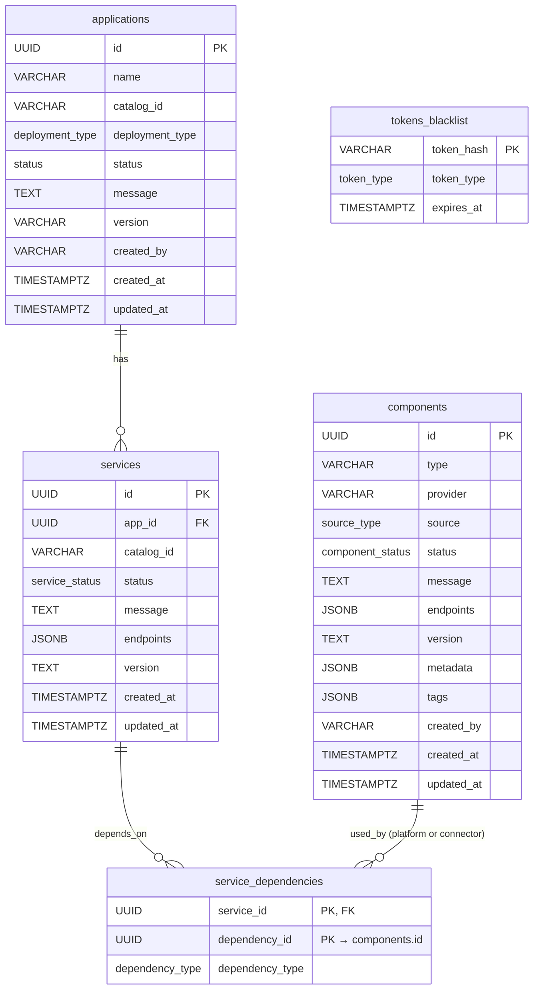

# Model Management & Connectors — Design Proposal

**Version:** 1.0
**Date:** July 2026  
**Status:** Draft / Proposal

---

## Table of Contents

1. [Executive Summary](#1-executive-summary)
2. [Background and Motivation](#2-background-and-motivation)
3. [Architecture Overview](#3-architecture-overview)
4. [New Concepts](#4-new-concepts)
   - [4.1 Models](#41-models)
   - [4.2 Connectors](#42-connectors)
5. [Database Schema](#5-database-schema)
   - [5.1 Guiding Principle](#51-guiding-principle)
   - [5.2 Additions to Existing `components` Table](#52-additions-to-existing-components-table)
   - [5.3 New and Extended ENUM Types](#53-new-and-extended-enum-types)
   - [5.4 Full Entity Relationship Diagram](#54-full-entity-relationship-diagram)
6. [API Specification](#6-api-specification)
   - [6.1 Component Endpoints (models and connectors)](#61-component-endpoints-models-and-connectors)
   - [6.2 Query Parameters for Filtering](#62-query-parameters-for-filtering)
   - [6.3 Extensions to Existing Endpoints](#63-extensions-to-existing-endpoints)
7. [API Endpoint Details](#7-api-endpoint-details)
   - [7.1 Create / Deploy a Component](#71-create--deploy-a-component)
   - [7.2 List Components](#72-list-components)
   - [7.3 Get Component Details](#73-get-component-details)
   - [7.4 Update a Component](#74-update-a-component)
   - [7.5 Delete / Undeploy a Component](#75-delete--undeploy-a-component)
   - [7.6 Get Component Resource Usage](#76-get-component-resource-usage)
   - [7.7 Validate a Connector Component](#77-validate-a-connector-component)
   - [7.8 List Supported Parameters for a Connector Provider](#78-list-supported-parameters-for-a-connector-provider)
8. [Pre-flight Resource Check](#8-pre-flight-resource-check)
9. [LiteLLM Gateway Integration](#9-litellm-gateway-integration)
10. [Deployment Flow](#10-deployment-flow)
11. [Key Design Decisions](#11-key-design-decisions)
12. [Common Queries](#12-common-queries)
13. [Error Handling](#13-error-handling)
14. [Future Considerations](#14-future-considerations)

---

## 1. Executive Summary

This proposal extends the existing Catalog Service with two new capabilities:

1. **Model Management** — dynamic deploy, undeploy, list, and status of model inference backends (`llm`, `embedding`, `reranker` roles) across all supported runtimes (Podman, OpenShift, Docker Compose). Models are no longer bundled statically inside application pods; they are standalone deployable components managed independently and exposed to consumer services through a **LiteLLM Gateway** — a universal model proxy that sits between applications and any backend provider.

2. **Connectors** — a way to register external service endpoints (WatsonX, OpenAI-compatible, external vector stores) without deploying any local pod. Credentials are stored as **Podman secrets** — exactly as they are today for vLLM API keys — never in the database. The secret name is persisted in `components.metadata` so the `ModelManager` can delete it at undeploy time.

**Core design principle: everything is a `components` row.** A new `source` column discriminates between two kinds:

| `source` | Meaning | Pod? | Podman secret? | Examples |
|---|---|---|---|---|
| `platform` | Platform deployed a pod and owns its lifecycle | ✅ | optional | vLLM, OpenSearch, LiteLLM Gateway |
| `connector` | User registered an external endpoint; no pod | ❌ | ✅ always | WatsonX, OpenAI-compatible, external Pinecone |

Three new columns on `components` (`tags`, `created_by`, `source`) and no new tables are the complete schema delta. Credentials never touch the database.

---

## 2. Background and Motivation

### Current State

The current catalog deploys vLLM or WatsonX as `components` that are tightly coupled to an application at creation time. Changing the model requires deleting and recreating the entire application. There is no concept of reusing a running model backend across applications, no support for dynamically switching providers at runtime, and no way to register an externally-hosted model endpoint without forking a template.

### Problems

- Model lifecycle is locked to application lifecycle; a model upgrade forces full application re-deployment.
- No mechanism to connect to an already-running WatsonX, OpenAI, or vLLM endpoint outside of the platform.
- Consumer services (`chatbot`, `digitize`, `similarity`, `summarize`) hold direct references to provider-specific endpoints — swapping providers requires re-deploying those services.
- No pre-flight validation of available resources (CPU, memory, Spyre cards) before attempting deployment, leading to silent pod failures.
- `component_status` enum only has `Initializing`, `Running`, `Error` — insufficient to express the `Deploying` lifecycle state needed for async model deployment.

### Goals

1. Decouple model lifecycle from application lifecycle.
2. Introduce a universal gateway (LiteLLM) so consumer services are provider-agnostic.
3. Enable connection to external model endpoints via Connectors without deploying local pods.
4. Gate all model deployments behind a pre-flight resource check.
5. Persist all model state in the Catalog DB by extending the existing `components` table — minimal schema delta, no new model table.

---

## 3. Architecture Overview

```
  ┌──────────────────────────────────────────────────────────────────────┐
  │                        Catalog API Server                             │
  │                                                                       │
  │  POST   /api/v1/components          ← deploy model or connector       │
  │  GET    /api/v1/components          ← list (filter by source/type)    │
  │  GET    /api/v1/components/:id      ← status / detail                 │
  │  PUT    /api/v1/components/:id      ← update connector only           │
  │  DELETE /api/v1/components/:id      ← undeploy model / delete conn.   │
  │  GET    /api/v1/components/:id/resources   ← live resource usage      │
  │  POST   /api/v1/components/:id/validate    ← probe connector          │
  └────────────────────────┬─────────────────────────────────────────────┘
                           │
              ┌────────────▼────────────┐
              │      ModelManager       │  reads deployment_strategy
              │  (Podman / OCP / DC)    │  from assets/components/…
              └──────┬──────────────────┘
                     │
         ┌───────────▼───────────┐
         │   Pre-flight Check    │  CPU · Memory · Spyre cards
         └───────────┬───────────┘  (platform only; skipped for connector)
                     │ pass
         ┌───────────▼───────────┐
         │   Runtime Executor    │
         │  pod | secret-only    │
         └───────────┬───────────┘
                     │
  ┌──────────────────▼───────────────────────────────────────────┐
  │                  LiteLLM Gateway Pod                         │
  │     (catalog asset: assets/catalog/podman/templates/)        │
  │      deployed once during catalog configure                  │
  │                                                              │
  │  POST   /model/new      ← register route on model deploy     │
  │  DELETE /model/delete   ← deregister route on undeploy       │
  │                                                              │
  │  route table: "llm" → backend, "embedding" → backend, …     │
  └──────────────────┬───────────────────────────────────────────┘
                     │ all traffic to   litellm:<app>:4000/v1
       ┌─────────────┼───────────────┐
       ▼             ▼               ▼
  vLLM pod      WatsonX.ai     OpenAI-compat
  (platform)    (connector)    (connector)
  local pod     external API   external API
       │             │               │
       └─────────────▼───────────────┘
            Consumer Services
       (chatbot · digitize · similarity)
       call model="llm" — never a specific backend URL
```

**Three deployment tiers:**

| Tier | When | `source` | Example |
|---|---|---|---|
| Catalog configure | `catalog configure` | `platform` (pipeline-created) | PostgreSQL, Caddy, **LiteLLM Gateway** |
| Platform model | `POST /api/v1/components` | `platform` (user-created) | vLLM-CPU, vLLM-Spyre |
| Connector | `POST /api/v1/components` | `connector` (user-created) | WatsonX, OpenAI-compatible |

---

## 4. New Concepts

### 4.1 Models

A **Model** is an inference backend for a specific role (`llm`, `embedding`, `reranker`) deployed and managed independently of an application. Both kinds are a `components` row — distinguished by `source`:

| `source` | Example providers | Pod? | Podman secret? |
|---|---|---|---|
| `platform` | `vllm-cpu`, `vllm-spyre` | ✅ Yes | optional (API key protection) |
| `connector` | `watsonx`, `openai-compatible` | ❌ No | ✅ always (credentials) |

Both kinds are registered as a route in the **LiteLLM Gateway** pod. Consumer services only ever talk to the LiteLLM gateway — they have no knowledge of which `source` is behind it.

The key differences from today's application-coupled components:

| | Today | New |
|---|---|---|
| Created by | Application deployment | Independent `POST /api/v1/components` |
| Lifecycle | Deleted with application | Explicit undeploy required |
| Provider endpoint | Exposed directly to services | Always proxied via LiteLLM Gateway |
| Pre-flight resource check | None | Required for `source=platform` models |
| WatsonX | Deploys a per-app LiteLLM proxy pod | `source=connector` row — Podman secret + LiteLLM route, no pod |

### 4.2 Connectors

A **Connector** is a `components` row with `source = 'connector'`. It has no pod. Credentials are stored as a **Podman secret** (identical pattern to today's `watsonx-secret-<slug>` and `vllm-secret-<slug>`). The secret name is persisted in `components.metadata.podman_secret_name` so the `ModelManager` can delete it at undeploy time.

| `source` | Pod | Podman secret | `metadata.podman_secret_name` | `endpoints` |
|---|---|---|---|---|
| `platform` | ✅ | optional | set if secret created | Pod URL |
| `connector` | ❌ | ✅ always | always set | External service URL |

Credentials are passed by the user at creation time, written to a Podman secret, and **never stored in the database**. The DB only stores the secret's name — not its content.

**Connector types (by `type` + `provider` on `components`):**

| `type` | `provider` | Description | Podman secret fields |
|---|---|---|---|
| `llm` | `watsonx` | IBM WatsonX.ai LLM | `apiKey` |
| `llm` | `openai-compatible` | Any OpenAI-compatible endpoint | `apiKey` (optional) |
| `llm` | `huggingface` | HuggingFace Hub token (weight pull) | `token` |
| `vector_store` | `pinecone` | External Pinecone index | `apiKey` |
| `vector_store` | `weaviate` | External Weaviate cluster | `apiKey` or none |

---

## 5. Database Schema

### 5.1 Guiding Principle

> **Everything is a `components` row.** A new `source` column discriminates between a pod the platform deployed (`platform`) and an external endpoint the user registered (`connector`). Credentials never enter the database — they live in Podman secrets, exactly as they do today.

| Provider | `source` | Pod? | Podman secret? | `metadata.podman_secret_name` |
|---|---|---|---|---|
| OpenSearch | `platform` | ✅ | ❌ | — |
| postgres | `platform` | ✅ | ❌ | — |
| vLLM (cpu / spyre) | `platform` | ✅ | optional | set if API key provided |
| LiteLLM Gateway | `platform` | ✅ | ❌ | — |
| WatsonX | `connector` | ❌ | ✅ | always set |
| OpenAI-compatible | `connector` | ❌ | ✅ | always set |
| HuggingFace (weight token) | `connector` | ❌ | ✅ | always set |
| External Pinecone | `connector` | ❌ | ✅ | always set |

`service_dependencies.dependency_id` always points at `components.id` regardless of `source`. The UI, the joins, and the dependency graph work identically for both kinds — no UNION, no second table.

---

### 5.2 Additions to Existing `components` Table

No existing columns are changed or removed. **Three** new columns are added; `component_status` is extended with new lifecycle and validation values.

#### New columns

```sql
ALTER TABLE components
    ADD COLUMN tags       JSONB        DEFAULT '{}',                -- free-form labels; "name" key carries the human-readable label
    ADD COLUMN created_by VARCHAR(100),                             -- NULL for app-pipeline infra
    ADD COLUMN source     source_type NOT NULL DEFAULT 'platform';  -- 'platform' | 'connector'
```

| Column | Data Type | Nullable | Description |
|---|---|---|---|
| `tags` | JSONB | Yes, DEFAULT `'{}'` | Free-form label bag. The `"name"` key carries the human-readable label (e.g., `{"name": "granite-llm"}`). Additional keys such as `"env"`, `"team"`, or `"app"` may be added freely without schema changes |
| `created_by` | VARCHAR(100) | Yes | User who created this row via `POST /api/v1/components`. NULL for components created by the application pipeline |
| `source` | `source_type` | No, DEFAULT `'platform'` | `platform` — pod owned by the platform. `connector` — external endpoint registered by user; no pod, credentials stored as a Podman secret |

> **No `credentials` column.** Credentials are written to a Podman secret at deploy time and never stored in the database. Only the secret name is persisted — in `components.metadata.podman_secret_name`.

#### Extended `component_status` enum

Six new values are added. Existing `Initializing`, `Running`, `Error` values are unchanged and continue to work for all `platform` components.

```sql
-- Platform model lifecycle (pod-backed)
ALTER TYPE component_status ADD VALUE 'Deploying';   -- async pod creation in progress
-- Connector validation states
ALTER TYPE component_status ADD VALUE 'Unverified';  -- connector created, never probed
ALTER TYPE component_status ADD VALUE 'Invalid';     -- last probe returned auth failure
ALTER TYPE component_status ADD VALUE 'Unreachable'; -- last probe timed out
```

Full enum after migration:

| Value | `source` | Meaning |
|---|---|---|
| `Initializing` | `platform` | Infra container starting (opensearch, postgres) |
| `Deploying` | `platform` | Async pod creation + LiteLLM registration in progress |
| `Running` | `platform` | Pod healthy and serving |
| `Error` | both | Deployment or runtime failure |
| `Unverified` | `connector` | Created, never probed |
| `Running` | `connector` | Last validation probe succeeded (reuses existing value) |
| `Invalid` | `connector` | Last probe returned auth failure |
| `Unreachable` | `connector` | Last probe timed out |

> `Running` is the healthy state for both: a `platform` pod is healthy when running, a `connector` is healthy when its last probe passed.

#### `metadata` JSONB — per-source fields

`platform` model rows (`vllm-spyre`) — value stored in `components.metadata`:
```json
{
  "model_name": "ibm-granite/granite-3.3-8b-instruct"
}
```

`connector` rows (`watsonx`) — value stored in `components.metadata`:
```json
{
  "model_name": "ibm/granite-3-8b-instruct",
  "endpoint_url": "https://us-south.ml.cloud.ibm.com",
  "project_id": "my-watsonx-project-id",
  "podman_secret_name": "watsonx-secret-my-rag-app--llm-watsonx"
}
```

| `metadata` key | `platform` | `connector` |
|---|---|---|
| `model_name` | ✅ | ✅ always |
| `endpoint_url` | ❌ | ✅ always |
| `project_id` | ❌ | ✅ (watsonx) |
| `podman_secret_name` | ❌ | ✅ always |

---

### 5.3 New and Extended ENUM Types

```sql
-- New: source discriminator on components
CREATE TYPE source_type AS ENUM (
    'platform',   -- pod deployed and owned by the platform
    'connector'   -- external endpoint registered by user; Podman secret, no pod
);

-- Extended (existing): new values added to component_status
ALTER TYPE component_status ADD VALUE 'Deploying';    -- platform: async pod creation in progress
ALTER TYPE component_status ADD VALUE 'Unverified';   -- connector: created, secret exists, never probed
ALTER TYPE component_status ADD VALUE 'Invalid';      -- connector: last probe returned auth failure
ALTER TYPE component_status ADD VALUE 'Unreachable';  -- connector: last probe timed out
```

---

### 5.4 Full Entity Relationship Diagram



> **No new tables. No credentials column.** Credentials live in Podman secrets; only `metadata.podman_secret_name` is persisted in the DB so the `ModelManager` can delete the secret at undeploy time.

---

## 6. API Specification

### 6.1 Component Endpoints (models and connectors)

All endpoints require `Authorization: Bearer <access_token>`. Models and connectors are both `components` rows — distinguished by `source`. `component_type` (`llm`, `embedding`, `reranker`) is a path segment on collection-level operations so the router enforces it before any handler logic runs; instance-level operations address by UUID only.

| Method | Path | Description | Response |
|---|---|---|---|
| `POST` | `/api/v1/components/:type` | Deploy a model or register a connector of the given type | `202 Accepted` / `201 Created` |
| `GET` | `/api/v1/components/:type` | List managed components of the given type | `200 OK` |
| `GET` | `/api/v1/components/:id` | Get status/details of a specific component | `200 OK` |
| `PUT` | `/api/v1/components/:id` | Update a connector's endpoint, credentials, or config | `200 OK` |
| `DELETE` | `/api/v1/components/:id` | Undeploy a model or delete a connector | `202 Accepted` / `204 No Content` |
| `GET` | `/api/v1/components/:id/resources` | Live resource usage for a deployed `platform` component | `200 OK` |
| `POST` | `/api/v1/components/:id/validate` | Probe a connector's endpoint and update status | `200 OK` |
| `GET` | `/api/v1/components/:type/providers/:provider/params?source=<source>` | List supported parameters for a provider + source; both required | `200 OK` |

> **`:type`** is one of `llm`, `embedding`, `reranker`. The router rejects any other value with `400 Bad Request` before the handler is invoked.
>
> **`:id` vs `:type` routing:** collection routes use `:type` literals; instance routes use UUIDs. They occupy the same path depth so route registration must declare the `:type` routes explicitly before the `:id` catch-all, or use a router that validates the `:type` enum at parse time.
>
> **Existing read-only endpoint superseded:** `GET /api/v1/components/{component_type}/providers/{provider_id}/params` is replaced by `GET /api/v1/components/:type/providers/:provider/params?source=<source>` which adds the mandatory `source` query parameter. The old path should be aliased during a transition period.

### 6.2 Query Parameters for Filtering

The `GET /api/v1/components/:type` list endpoint uses query parameters to further scope results within the typed collection:

| Parameter | Values | Effect |
|---|---|---|
| `source` | `platform`, `connector` | Filter by deployment kind |
| `provider` | e.g., `watsonx`, `vllm-spyre` | Filter by backend provider |

> `type` is no longer a query parameter — it is the `:type` path segment. The old `?type=llm` query parameter is dropped; callers must migrate to the path form.

Example: `GET /api/v1/components/llm` → all LLM components.
Example: `GET /api/v1/components/llm?source=connector` → LLM connectors only.
Example: `GET /api/v1/components/embedding?source=platform` → platform embedding models only.

### 6.3 Extensions to Existing Endpoints

| Existing Endpoint | Change |
|---|---|
| `GET /api/v1/applications/:id` | Response includes `components` array alongside `services` — `source` field discriminates pod vs connector |
| `GET /api/v1/architectures/:id/deploy-options` | `providers` list under `llm`/`embedding`/`reranker` includes `connector` options alongside `vllm-cpu`, `vllm-spyre`; WatsonX is listed under `connector`, not as a pod provider |

---

## 7. API Endpoint Details

### 7.1 Create / Deploy a Component

**Endpoint:** `POST /api/v1/components/:type`

**Path Parameters:**

| Parameter | Description |
|---|---|
| `:type` | Component type: `llm`, `embedding`, `reranker` |

**Description:** Creates a new managed component of the given type. The `source` field in the request body drives the execution path:

- **`source: platform`** (`vllm-cpu`, `vllm-spyre`): starts a pod and registers a LiteLLM route. Returns `202 Accepted` — creation is async.
- **`source: connector`** (`watsonx`, `openai-compatible`, `huggingface`): writes credentials to a Podman secret and registers a LiteLLM route — no pod. Returns `201 Created` — creation is synchronous.

> **One endpoint shape per type.** `source` + `provider` together determine which execution path is taken. The client posts to `POST /api/v1/components/llm`, `POST /api/v1/components/embedding`, or `POST /api/v1/components/reranker` as appropriate — never to the bare `/api/v1/components`.

**Request Headers:**
```
Authorization: Bearer <access_token>
Content-Type: application/json
```

**Request Body — platform model (`POST /api/v1/components/llm`, `vllm-spyre`):**

```json
{
  "tags": { "name": "granite-llm" },
  "source": "platform",
  "provider": "vllm-spyre",
  "metadata": {
    "model_name": "ibm-granite/granite-3.3-8b-instruct"
  }
}
```

**Request Body — connector (`POST /api/v1/components/llm`, `watsonx`):**

```json
{
  "tags": { "name": "prod-watsonx" },
  "source": "connector",
  "provider": "watsonx",
  "auth_type": "api-key",
  "credentials": {
    "api_key": "sk-xxxxxxxxxxxxxxxxxxxxxxxxxxxxxxxx"
  },
  "metadata": {
    "model_name": "ibm/granite-3-8b-instruct",
    "endpoint_url": "https://us-south.ml.cloud.ibm.com",
    "project_id": "my-watsonx-project-id"
  }
}
```

**Request Schema (unified):**

| Field | Type | Required | Description |
|---|---|---|---|
| `tags` | object | Yes | Label bag. Must include `"name"` key (3–100 chars, slug-safe). Additional keys (`"env"`, `"team"`, etc.) stored as-is |
| `source` | string | **Yes** | `"platform"` or `"connector"`. The client must be explicit — `provider` alone does not uniquely identify the deployment kind (e.g. `vllm-spyre` can be deployed as a pod or registered as a connector pointing at an external vLLM instance). |
| `provider` | string | Yes | Backend: `vllm-cpu`, `vllm-spyre`, `watsonx`, `openai-compatible`, `huggingface`, `generic-http` |
| `metadata` | object | Conditional | Provider-specific key-value bag. Stored as-is in `components.metadata` alongside server-generated keys. **Platform**: must include `model_name`. **Connector (watsonx)**: must include `model_name`, `endpoint_url`, `project_id` |
| `auth_type` | string | Conditional | Required for `connector` providers. `api-key`, `bearer-token`, `basic`, `none` |
| `credentials` | object | Conditional | Required when `auth_type` != `none`. Written to Podman secret; **never stored in DB** |

**Credentials shapes (connector providers):**

`api-key`: `{ "api_key": "sk-..." }` | `bearer-token`: `{ "token": "eyJ..." }` | `basic`: `{ "username": "user", "password": "pass" }`

**Response — `source=platform` (`202 Accepted`, async):**

```json
{
  "id": "7f3a1c2d-8e4b-4f5a-9d6e-1a2b3c4d5e6f",
  "source": "platform",
  "tags": { "name": "granite-llm" },
  "type": "llm",
  "provider": "vllm-spyre",
  "metadata": { "model_name": "ibm-granite/granite-3.3-8b-instruct" },
  "status": "Deploying",
  "created_at": "2026-07-01T10:00:00Z",
  "updated_at": "2026-07-01T10:00:00Z"
}
```

**Response — `source=connector` (`201 Created`, synchronous):**

```json
{
  "id": "c1d2e3f4-a5b6-7890-cdef-123456789abc",
  "source": "connector",
  "tags": { "name": "prod-watsonx" },
  "type": "llm",
  "provider": "watsonx",
  "status": "Unverified",
  "auth_type": "api-key",
  "metadata": {
    "model_name": "ibm/granite-3-8b-instruct",
    "endpoint_url": "https://us-south.ml.cloud.ibm.com",
    "project_id": "my-watsonx-project-id"
  },
  "created_by": "user@example.com",
  "created_at": "2026-07-01T11:00:00Z",
  "updated_at": "2026-07-01T11:00:00Z"
}
```

> Connector components are created synchronously and start in `status = 'Unverified'`. Call `POST /api/v1/components/:id/validate` to probe the endpoint and advance to `Running`.

**Response Schema (common fields):**

| Field | Type | Description |
|---|---|---|
| `id` | string (UUID) | `components.id` |
| `source` | string | `"platform"` or `"connector"` |
| `tags` | object | Label bag; always includes `"name"` key |
| `type` | string | Component type: `llm`, `embedding`, `reranker` |
| `provider` | string | Backend provider |
| `status` | string | `Deploying`/`Running`/`Error` (`platform`); `Unverified`/`Running`/`Invalid`/`Unreachable` (`connector`) |
| `metadata` | object | `platform`: `{"model_name":"…"}`. `connector (watsonx)`: `{"model_name":"…","endpoint_url":"…","project_id":"…"}` |
| `auth_type` | string | Auth scheme — `connector` only |

**Error Responses:**

| Status | Condition |
|---|---|
| `400 Bad Request` | Missing required fields; invalid `type` / `provider` / `auth_type` combination |
| `401 Unauthorized` | Invalid or missing access token |
| `409 Conflict` | A component with the same `type` is already `Running` or `Deploying` |
| `500 Internal Server Error` | Pod start, Podman secret write failure, or unexpected error |

---

### 7.2 List Components

**Endpoint:** `GET /api/v1/components/:type`

**Path Parameters:**

| Parameter | Description |
|---|---|
| `:type` | Component type: `llm`, `embedding`, `reranker` |

**Description:** Lists `components` rows for the given type. Use `source` to further filter by deployment kind within the typed collection.

**Query Parameters:**

| Parameter | Type | Required | Default | Description |
|---|---|---|---|---|
| `source` | string | No | — | `platform` or `connector` |
| `provider` | string | No | — | Provider: `vllm-spyre`, `watsonx`, etc. |
| `page` | integer | No | 1 | Page number (1-indexed) |
| `page_size` | integer | No | 20 | Items per page (max 100) |

**Response (200 OK):**

```json
{
  "data": [
    {
      "id": "7f3a1c2d-8e4b-4f5a-9d6e-1a2b3c4d5e6f",
      "source": "platform",
      "tags": { "name": "granite-llm" },
      "type": "llm",
      "provider": "vllm-spyre",
      "metadata": { "model_name": "ibm-granite/granite-3.3-8b-instruct" },
      "status": "Running",
      "created_at": "2026-07-01T10:00:00Z",
      "updated_at": "2026-07-01T10:05:00Z"
    },
    {
      "id": "c1d2e3f4-a5b6-7890-cdef-123456789abc",
      "source": "connector",
      "tags": { "name": "prod-watsonx" },
      "type": "llm",
      "provider": "watsonx",
      "metadata": { "model_name": "ibm/granite-3-8b-instruct", "endpoint_url": "https://us-south.ml.cloud.ibm.com" },
      "status": "Running",
      "created_at": "2026-07-01T11:00:00Z",
      "updated_at": "2026-07-01T11:05:00Z"
    }
  ],
  "pagination": {
    "page": 1,
    "page_size": 20,
    "total_items": 2,
    "total_pages": 1,
    "has_next": false,
    "has_prev": false
  }
}
```

> `source` on each item identifies pod-backed (`platform`) vs external connector (`connector`). Filter `?source=connector` for connectors only; `?source=platform` for pods only. `type` is implicit from the path — all items in the response share the same `component_type`.

---

### 7.3 Get Component Details

**Endpoint:** `GET /api/v1/components/:id`

**Description:** Returns the full record for any managed component. Response shape varies by `source`.

**Response (200 OK) — `source=platform`:**

```json
{
  "id": "7f3a1c2d-8e4b-4f5a-9d6e-1a2b3c4d5e6f",
  "source": "platform",
  "tags": { "name": "granite-llm" },
  "type": "llm",
  "provider": "vllm-spyre",
  "metadata": { "model_name": "ibm-granite/granite-3.3-8b-instruct" },
  "status": "Running",
  "message": "Model running",
  "endpoints": [
    { "type": "api", "url": "http://my-rag-app--llm-granite:8000/v1" }
  ],
  "in_use_by": [
    {
      "application_id": "a1b2c3d4-1234-5678-abcd-ef0123456789",
      "app_name": "my-rag-app",
      "service_id": "svc-uuid-here",
      "service_role": "llm"
    }
  ],
  "created_at": "2026-07-01T10:00:00Z",
  "updated_at": "2026-07-01T10:05:00Z"
}
```

**Response (200 OK) — `source=connector`:**

```json
{
  "id": "c1d2e3f4-a5b6-7890-cdef-123456789abc",
  "source": "connector",
  "tags": { "name": "prod-watsonx" },
  "type": "llm",
  "provider": "watsonx",
  "status": "Running",
  "message": "Endpoint reachable and credentials accepted",
  "auth_type": "api-key",
  "metadata": {
    "model_name": "ibm/granite-3-8b-instruct",
    "endpoint_url": "https://us-south.ml.cloud.ibm.com",
    "project_id": "my-watsonx-project-id"
  },
  "in_use_by": [
    {
      "application_id": "a1b2c3d4-1234-5678-abcd-ef0123456789",
      "app_name": "my-rag-app",
      "service_id": "svc-uuid-here",
      "service_role": "llm"
    }
  ],
  "created_by": "user@example.com",
  "created_at": "2026-07-01T11:00:00Z",
  "updated_at": "2026-07-01T11:05:00Z"
}
```

> `in_use_by` is present on both `source=platform` and `source=connector` rows. It lists all applications/services that have a `service_dependencies` reference to this component.

**`in_use_by` SQL (server-side):**

```sql
SELECT sd.service_id, s.app_id AS application_id, a.name AS app_name,
       sd.dependency_type AS service_role
FROM service_dependencies sd
JOIN services s ON s.id = sd.service_id
JOIN applications a ON a.id = s.app_id
WHERE sd.dependency_id = :id
  AND sd.dependency_type = 'component';
```

**Error Responses:** `401 Unauthorized`, `404 Not Found`

---

### 7.4 Update a Component

**Endpoint:** `PUT /api/v1/components/:id`

**Description:** Updates a connector component's `metadata` or `credentials`. Only applicable to `source=connector` rows — platform pod components are immutable after deploy. If `credentials` is supplied the Podman secret is overwritten and `status` resets to `Unverified`.

**Request Body (all fields optional):**

```json
{
  "credentials": {
    "api_key": "sk-new-key-here"
  },
  "metadata": {
    "endpoint_url": "https://eu-de.ml.cloud.ibm.com",
    "project_id": "new-project-id"
  }
}
```

**Processing steps when `credentials` is present:**

1. Overwrite Podman secret (`metadata.podman_secret_name`) with new credentials JSON.
2. Reset `components.status = 'Unverified'`.
3. Merge supplied `metadata` keys into `components.metadata` (omitted keys preserved).
4. Update `updated_at`.

**Response (200 OK):** Full component object in same shape as §7.3 connector response.

**Error Responses:**

| Status | Condition |
|---|---|
| `400 Bad Request` | Invalid field values; or attempted on a `source=platform` component |
| `401 Unauthorized` | Invalid or missing access token |
| `403 Forbidden` | Authenticated user is not `created_by` |
| `404 Not Found` | Component not found |
| `500 Internal Server Error` | Podman secret overwrite failure |

---

### 7.5 Delete / Undeploy a Component

**Endpoint:** `DELETE /api/v1/components/:id`

**Description:** Removes a managed component. The server inspects `source` to decide the teardown path — the client always calls the same endpoint:

| `source` | Server action | Response |
|---|---|---|
| `platform` | Stop + delete pod → delete row | `202 Accepted` (async) |
| `connector` | Delete Podman secret (`metadata.podman_secret_name`) → delete row | `202 Accepted` |

**Query Parameters:**

| Parameter | Type | Required | Default | Description |
|---|---|---|---|---|
| `keep_data` | boolean | No | `false` | `platform` only: preserve host volume / PVC; stop pod, keep weights |

**Response — platform or active connector (`202 Accepted`):**

```json
{
  "id": "7f3a1c2d-8e4b-4f5a-9d6e-1a2b3c4d5e6f",
  "message": "Undeploy initiated"
}
```

**Response — inactive connector hard-delete (`204 No Content`):** empty body.

**Error Responses:**

| Status | Condition |
|---|---|
| `401 Unauthorized` | Invalid or missing access token |
| `403 Forbidden` | Authenticated user is not `created_by` |
| `404 Not Found` | Component not found or not managed |
| `409 Conflict` | `platform` component is already being deleted |

---

### 7.6 Get Component Resource Usage

**Endpoint:** `GET /api/v1/components/:id/resources`

**Description:** Returns live CPU, memory, and accelerator consumption for a `source=platform` component. Returns `404` for `source=connector` components — they consume no local resources.

**Response (200 OK):**

```json
{
  "id": "7f3a1c2d-8e4b-4f5a-9d6e-1a2b3c4d5e6f",
  "tags": { "name": "granite-llm" },
  "cpu": { "requested": 8.0, "used": 5.3 },
  "memory": { "requested_bytes": 161061273600, "used_bytes": 143165997670 },
  "accelerators": {
    "ibm.com/spyre_pf": {
      "requested": 4,
      "allocated": ["spyre-card-0", "spyre-card-1", "spyre-card-2", "spyre-card-3"]
    }
  }
}
```

**Error Responses:** `401 Unauthorized`, `404 Not Found` (including `source=connector` components)

---

### 7.7 Validate a Connector Component

**Endpoint:** `POST /api/v1/components/:id/validate`

**Description:** Synchronously probes the connector's endpoint using credentials read from the Podman secret (`metadata.podman_secret_name`). Updates `components.status` based on the probe result.

| `provider` | Validation Probe |
|---|---|
| `watsonx` | `GET {metadata.endpoint_url}/ml/v1/foundation_model_specs` with `Authorization: Bearer <api_key>` |
| `openai-compatible` | `GET {metadata.endpoint_url}/models` with `Authorization: Bearer <api_key>` |
| `huggingface` | `GET https://huggingface.co/api/whoami` with `Authorization: Bearer <token>` |
| `generic-http` | `GET {metadata.endpoint_url}` with configured auth header; 2xx = valid |

**Status transitions:**

| Probe outcome | New `components.status` |
|---|---|
| 2xx response | `Running` |
| 4xx auth error | `Invalid` |
| Timeout / network error | `Unreachable` |

**Response (200 OK) — probe succeeded:**

```json
{ "id": "c1d2e3f4-a5b6-7890-cdef-123456789abc", "status": "Running", "message": "Endpoint reachable and credentials accepted" }
```

**Response (200 OK) — probe failed:**

```json
{ "id": "c1d2e3f4-a5b6-7890-cdef-123456789abc", "status": "Invalid", "message": "Authentication failed: 401 Unauthorized from endpoint" }
```

> Always returns `200 OK`. Probe outcome is in `status`, consistent with the `component_status` enum.

**Error Responses:**

| Status | Condition |
|---|---|
| `401 Unauthorized` | Invalid or missing access token |
| `404 Not Found` | Component not found or not a `source=connector` component |
| `500 Internal Server Error` | Could not read Podman secret or unexpected error |

---

### 7.8 List Supported Parameters for a Provider

**Endpoint:** `GET /api/v1/components/:type/providers/:provider/params`

**Description:** Returns the set of supported configuration parameters for a given `type` + `provider` + `source` combination. All three are required — `provider` alone does not uniquely identify the deployment kind (e.g. `vllm-spyre` can be a `platform` pod or a `connector`) and `type` scopes which asset schema is loaded (`llm` vs `embedding` vs `reranker`). This mirrors the shape of the existing deployment wizard endpoint exactly.

For `source=connector` the platform additionally fetches live model info from the LiteLLM Admin API (`GET /model/info`) and merges it with the static schema from `metadata.yaml`. For `source=platform` only the static schema is returned.

This endpoint is called by the UI *before* `POST /api/v1/components/:type` to render the correct form fields.

**Path Parameters:**

| Parameter | Description |
|---|---|
| `:type` | Component type: `llm`, `embedding`, `reranker` |
| `:provider` | Provider identifier — e.g. `watsonx`, `openai-compatible`, `huggingface`, `generic-http`, `vllm-spyre`, `vllm-cpu` |

**Query Parameters:**

| Parameter | Required | Values | Description |
|---|---|---|---|
| `source` | **Yes** | `connector`, `platform` | Deployment kind. `connector` → LiteLLM enrichment + static fallback. `platform` → static `metadata.yaml` schema only. |

**Request Headers:**
```
Authorization: Bearer <access_token>
```

**Examples:**
```
# WatsonX LLM connector form
GET /api/v1/components/llm/providers/watsonx/params?source=connector

# vLLM-Spyre registered as an external LLM connector
GET /api/v1/components/llm/providers/vllm-spyre/params?source=connector

# vLLM-Spyre deployed as a local LLM pod
GET /api/v1/components/llm/providers/vllm-spyre/params?source=platform

# Embedding model connector params
GET /api/v1/components/embedding/providers/openai-compatible/params?source=connector
```

**LiteLLM source of truth — `watsonx` example:**

The platform calls the LiteLLM Admin API internally:

```
GET http://litellm:4000/model/info
Authorization: Bearer <LITELLM_MASTER_KEY>
```

LiteLLM returns per-model parameter metadata (supported params, their types, whether they are required, and default values). The platform extracts the provider-level superset — i.e., the union of all params seen across all models registered for that provider — and exposes it through this endpoint.

**Response (200 OK):**

```json
{
  "provider": "watsonx",
  "source": "litellm+static",
  "params": [
    {
      "name": "model_name",
      "type": "string",
      "required": true,
      "description": "The WatsonX foundation model ID (e.g. `ibm/granite-3-8b-instruct`)",
      "example": "ibm/granite-3-8b-instruct"
    },
    {
      "name": "endpoint_url",
      "type": "string",
      "required": true,
      "description": "WatsonX regional API base URL",
      "example": "https://us-south.ml.cloud.ibm.com"
    },
    {
      "name": "project_id",
      "type": "string",
      "required": true,
      "description": "WatsonX project ID scoping inference requests"
    },
    {
      "name": "max_tokens",
      "type": "integer",
      "required": false,
      "description": "Maximum number of tokens the model will generate",
      "default": 4096
    },
    {
      "name": "temperature",
      "type": "number",
      "required": false,
      "description": "Sampling temperature (0.0 – 2.0)",
      "default": 1.0
    },
    {
      "name": "top_p",
      "type": "number",
      "required": false,
      "description": "Nucleus sampling probability mass",
      "default": 1.0
    },
    {
      "name": "timeout",
      "type": "integer",
      "required": false,
      "description": "Request timeout in seconds",
      "default": 600
    }
  ]
}
```

**Response Schema:**

| Field | Type | Description |
|---|---|---|
| `provider` | string | The provider this schema applies to |
| `source` | string | `"litellm+static"` when LiteLLM enrichment succeeded; `"static"` when only the asset schema is available (gateway not yet running or provider not registered) |
| `params` | array | Ordered list of parameter descriptors |
| `params[].name` | string | Parameter key used in the `metadata` or `credentials` object of `POST /api/v1/components` |
| `params[].type` | string | JSON type: `string`, `integer`, `number`, `boolean` |
| `params[].required` | boolean | Whether the field is mandatory for `POST /api/v1/components` |
| `params[].description` | string | Human-readable label shown in the UI |
| `params[].default` | any | Default value applied by LiteLLM when omitted (optional — omitted if there is no default) |
| `params[].example` | string | Illustrative value for the UI placeholder (optional) |

**Provider coverage:**

| `provider` | LiteLLM enrichment | Static fallback asset path |
|---|---|---|
| `watsonx` | ✅ `GET /model/info` → filter `custom_llm_provider = watsonx` | `assets/components/llm/watsonx/metadata.yaml` |
| `openai-compatible` | ✅ `GET /model/info` → filter `custom_llm_provider = openai` | `assets/components/llm/openai-compatible/metadata.yaml` |
| `huggingface` | ✅ `GET /model/info` → filter `custom_llm_provider = huggingface` | `assets/components/llm/huggingface/metadata.yaml` |
| `generic-http` | ❌ No LiteLLM enrichment | `assets/components/llm/generic-http/metadata.yaml` |

> **Note:** `source=platform` delegates to the same static asset lookup as the existing `GET /api/v1/components/{component_type}/providers/{provider_id}/params` wizard endpoint — it is surfaced here for UI consistency so the frontend can use a single endpoint shape for both sources.

**Caching:** The platform caches the LiteLLM `/model/info` response for **60 seconds** to avoid hammering the gateway on every form render. The cache key is `provider`. The `source` field in the response reflects whether the live LiteLLM data was used (`litellm+static`) or the cached/static fallback (`static`).

**Error Responses:**

| Status | Condition |
|---|---|
| `400 Bad Request` | `source` query parameter is missing or not one of `connector` / `platform` |
| `401 Unauthorized` | Invalid or missing access token |
| `404 Not Found` | `provider` is not a known provider for the given `source` |
| `502 Bad Gateway` | `source=connector`, LiteLLM Admin API was unreachable, and no static fallback exists for the provider |

---

## 8. Pre-flight Resource Check

Before any model pod is created, the platform validates that the host or cluster has sufficient CPU, memory, and Spyre accelerator cards. All constraint violations are collected and returned together — not just the first failure.

**Triggered by:** `POST /api/v1/components` for `platform` providers.

**Check sequence:**

1. Load `ResourceRequirements` from `assets/components/<type>/<provider>/<runtime>/metadata.yaml`.
2. Query the existing `GET /api/v1/resources` for current system info (CPU, memory, accelerators).
3. Check CPU available >= required.
4. Check Memory available >= required.
5. If `provider == vllm-spyre` and runtime is Podman: enumerate `/dev/vfio` for free Spyre cards; check `free >= required["ibm.com/spyre_pf"]`.
6. If runtime is OpenShift: query node allocatable for accelerator resources via Kubernetes API.
7. If any check fails: return `HTTP 422` with the full violations array.

**Error Response (422 Unprocessable Entity):**

```json
{
  "error": "Model deployment pre-flight check failed",
  "violations": [
    {
      "resource": "memory",
      "required": "150Gi",
      "available": "42Gi",
      "unit": "bytes",
      "satisfied": false
    },
    {
      "resource": "accelerators.ibm.com/spyre_pf",
      "required": "4",
      "available": "1",
      "unit": "cards",
      "satisfied": false
    },
    {
      "resource": "cpu",
      "required": "8",
      "available": "12",
      "unit": "cores",
      "satisfied": true
    }
  ]
}
```

---

## 9. LiteLLM Gateway Integration

### LiteLLM as a Catalog Asset

The LiteLLM Gateway is promoted from a static WatsonX-only component to the **universal model proxy** for all providers. It is deployed **once, as part of `catalog configure`** — the same command that starts PostgreSQL, Caddy, and the Catalog API server. It is not deployed per-application.

The gateway lives inside the Catalog asset (`assets/catalog/podman/templates/`) alongside the existing Catalog templates. Two new files are added: `litellm-master-key-secret.yaml.tmpl` (generates the `LITELLM_MASTER_KEY` Podman secret) and `litellm.yaml.tmpl` (starts the gateway pod). These are rendered as part of the existing `podTemplateExecutions` sequence in [`assets/catalog/podman/metadata.yaml`](ai-services/assets/catalog/podman/metadata.yaml).

All applications share the single LiteLLM gateway instance. Consumer services point to it at creation time and never need reconfiguring when the backing model provider changes — only the gateway route table changes.

### Route Registration

When a model reaches `Running` status (pod healthy / connector validated), the platform registers a route via the LiteLLM Admin API.

**Register (on deploy):**
```
POST http://litellm:4000/model/new
Authorization: Bearer <LITELLM_MASTER_KEY>

{
  "model_name": "granite-3.3-8b-instruct-vllm-spyre",
  "litellm_params": {
    "model": "ibm-granite/granite-3.3-8b-instruct",
    "custom_llm_provider": "hosted_vllm",
    "api_base": "http://my-rag-app--llm-granite:8000/v1",
    "api_key": "none"
  }
}
```

**Deregister (on undeploy):**
```
DELETE http://litellm:4000/model/delete
Authorization: Bearer <LITELLM_MASTER_KEY>

{ "id": "granite-3.3-8b-instruct-vllm-spyre" }
```

**Route ID convention:** The route ID registered in LiteLLM is `{model_name}-{provider}` — e.g. `granite-3.3-8b-instruct-vllm-spyre`. This is unique per deployed model and allows multiple models to coexist in the gateway simultaneously. Consumer services reference models by this ID.

### WatsonX via Connector

When deploying with `provider: watsonx`, no local pod is created. The platform reads credentials from the Podman secret (`metadata.podman_secret_name`) in-memory at route-registration time — they are never written to the DB:

```json
{
  "model_name": "granite-3-8b-instruct-watsonx",
  "litellm_params": {
    "model": "ibm/granite-3-8b-instruct",
    "custom_llm_provider": "watsonx",
    "api_base": "<from metadata.endpoint_url>",
    "api_key": "<read from Podman secret at registration time — never stored in DB>",
    "watsonx_project_id": "<from metadata.project_id>"
  }
}
```

The `components` row for this model has `source = 'connector'` and `endpoints = [{"url": "https://us-south.ml.cloud.ibm.com"}]`. No `connector_id` foreign key is used — the row itself is the connector record.

---

## 10. Deployment Flow

### Flow: Catalog Configure — LiteLLM Gateway (one-time setup)

```
catalog configure  (same command that starts postgres, caddy, catalog API)

  Read assets/catalog/podman/metadata.yaml → podTemplateExecutions sequence

  Existing steps (unchanged):
    1. Render catalog-secret.yaml.tmpl, catalog-db-secret.yaml.tmpl, auth-secret.yaml.tmpl
    2. Render catalog-db.yaml.tmpl, caddy.yaml.tmpl
    3. Render catalog.yaml.tmpl

  New steps added to the sequence:
    4. [NEW] Generate LITELLM_MASTER_KEY (UUID)
    5. [NEW] Render litellm-master-key-secret.yaml.tmpl → CreateSecret
    6. [NEW] Render litellm.yaml.tmpl → CreatePod (LiteLLM Gateway)
    7. [NEW] Poll InspectPod until liveness probe passes
    8. [NEW] INSERT components (type='llm', provider='litellm', source='platform',
                                status='Running', created_by=NULL,
                                metadata={model_name: "litellm"})

  All applications share this single gateway instance.
```

### Flow: Deploy vLLM (Podman + Spyre) — `source=platform`

```
POST /api/v1/components
{ type: "llm", provider: "vllm-spyre", model_name: "ibm-granite/granite-3.3-8b-instruct" }

  Read assets/components/llm/vllm-spyre/metadata.yaml → deployment_strategy: pod

  1. Validate request fields
  2. Pre-flight check → 422 if insufficient
  3. Render vllm-server.yaml.tmpl → CreatePod
  4. INSERT into components (type=llm, provider=vllm-spyre, source='platform',
                             status='Deploying', tags={"name":"granite-llm"}, created_by=<user>,
                             metadata={model_name: "ibm-granite/granite-3.3-8b-instruct"})  ← from request metadata.model_name
  5. Return 202 {source: "platform", id: components.id, status: "Deploying", ...}
  6. [async] Poll InspectPod until liveness probe passes
  7. [async] POST /model/new to LiteLLM Gateway (api_base = pod URL)
  8. [async] UPDATE components SET status='Running'
```

### Flow: Deploy WatsonX — `source=connector` (no pod)

```
POST /api/v1/components
{ type: "llm", provider: "watsonx", auth_type: "api-key", credentials: {api_key: "sk-..."},
  metadata: {model_name: "ibm/granite-3-8b-instruct", endpoint_url: "https://us-south.ml.cloud.ibm.com",
             project_id: "my-watsonx-project-id"} }

  Read assets/components/llm/watsonx/metadata.yaml → deployment_strategy: connector

  1. Validate request fields
  2. No pod, no pre-flight resource check
  3. ModelManager.CreateSecret(name="watsonx-secret-<slug>", data=credentials)  ← no template
  4. INSERT into components (type=llm, provider=watsonx, source='connector',
                             status='Unverified', tags={"name":<name>}, created_by=<user>,
                             endpoints=[{type:"api", url: metadata.endpoint_url}],
                             metadata={model_name: ...,       ← from request metadata.model_name
                                       endpoint_url: ...,     ← from request metadata.endpoint_url
                                       project_id: ...,       ← from request metadata.project_id
                                       podman_secret_name: "watsonx-secret-<slug>"})    ← server-generated
  5. Return 201 {source: "connector", id: components.id, status: "Unverified", ...}
  6. [async] LiteLLM Gateway reads secret via mounted volume
             POST /model/new (watsonx params — api_key read from Podman secret at gateway)
  7. [async] UPDATE components SET status='Running'
```

### Flow: Undeploy `source=platform` model

```
DELETE /api/v1/components/:id

  1. Verify components row: source='platform', type IN (llm,embedding,reranker), created_by=user
  2. Return 202
  3. [async] DELETE /model/delete from LiteLLM Gateway
  4. [async] StopPod → DeletePod
  5. [async] DELETE components row
```

### Flow: Undeploy `source=connector` model

```
DELETE /api/v1/components/:id

  1. Verify components row: source='connector', type IN (llm,embedding,reranker), created_by=user
  2. Return 202
  3. [async] DELETE /model/delete from LiteLLM Gateway
  4. [async] DeleteSecret (metadata.podman_secret_name)
  5. [async] DELETE components row
```

---

## 11. Key Design Decisions

### 1. One Table for Everything: `components.source` Discriminates Pod vs Connector

`components` is the universal registry for all runtime dependencies — whether the platform deployed a pod (`source=platform`) or the user registered an external endpoint (`source=connector`). `service_dependencies.dependency_id` always points at `components.id` regardless of `source`. No UNION queries, no second table, no schema divergence.

### 2. Credentials Never Enter the Database

Credentials are written to Podman secrets at deploy time — exactly as they are today for `watsonx-secret-<slug>` and `vllm-secret-<slug>`. The DB stores only the secret name in `metadata.podman_secret_name`. At undeploy time, both `platform` and `connector` paths call `DeleteSecret(metadata.podman_secret_name)` — the same step, no special casing.

### 3. `source` Column is the Only Branch Point

At undeploy time, the `ModelManager` reads `components.source`:
- `platform` → stop pod + delete pod
- `connector` → read `metadata.podman_secret_name` → delete Podman secret

Without this column, the `ModelManager` would have to re-read `metadata.yaml` assets to infer the teardown path — fragile and coupling runtime behaviour to static asset files.

### 4. Managed Model Identity: `created_by IS NOT NULL`

The API layer distinguishes user-created components from infrastructure components deployed by the application pipeline by `created_by IS NOT NULL`. Both `source` values can be user-created.

### 5. Undeploy Always Deletes the Row

`DELETE /api/v1/components/:id` deregisters the LiteLLM route, wipes the Podman secret (for connectors, using `metadata.podman_secret_name`), stops and deletes the pod (for platform), and hard-deletes the `components` row — regardless of `source`.

### 6. `deployment_strategy` in `metadata.yaml` Drives the ModelManager Deploy Path

`deployment_strategy: pod | connector` means zero provider string comparisons in Go code at deploy time. Adding a new provider (e.g., `azure-openai`) needs only a new `metadata.yaml` — no code change.

### 7. `Running` is the Healthy State for Both Sources

`component_status.Running` means pod is healthy for `platform`, and last validation probe passed for `connector`. UI status display logic is uniform — green = Running, regardless of source.

### 8. LiteLLM Route ID = `{model_name}-{provider}`

Registering routes under a `{model_name}-{provider}` ID (e.g. `granite-3.3-8b-instruct-vllm-spyre`) uniquely identifies each deployed model in the gateway and allows multiple models to coexist simultaneously. The same ID is used for deregistration at undeploy time.

### 9. Pre-flight Returns All Violations, Not Just First

The pre-flight response always includes every constraint result (satisfied or not) so operators see the full resource gap at once. Connector providers skip pre-flight entirely — they consume no local resources.

---

## 12. Common Queries

### All active models for an application — single query:
```sql
SELECT
    id, source, tags->>'name' AS name, type, provider, status,
    endpoints,
    metadata->>'model_name' AS model_name    -- platform only; NULL for connectors
FROM components
WHERE created_by IS NOT NULL
  AND type IN ('llm', 'embedding', 'reranker')
  AND status != 'Error'
ORDER BY type, source;
```

### Full application view — services + models (all sources):
```sql
SELECT
    a.id AS app_id, a.name AS app_name,
    s.id AS service_id, s.catalog_id AS service_type,
    c.id AS model_id, c.source AS model_source,
    c.type AS model_role, c.provider, c.status AS model_status,
    c.metadata->>'model_name' AS model_name
FROM applications a
LEFT JOIN services s ON s.app_id = a.id
LEFT JOIN components c ON c.created_by IS NOT NULL
WHERE a.id = 'application-uuid-here'
ORDER BY c.type, c.source;
```

### Get connectors never validated:
```sql
SELECT id, tags->>'name' AS name, provider, endpoints, created_at
FROM components
WHERE source = 'connector'
  AND status = 'Unverified'
ORDER BY created_at DESC;
```

---

## 13. Error Handling

All error responses follow the existing catalog error format:

```json
{ "error": "Human-readable error message" }
```

Pre-flight failures extend this with a `violations` array (see §8):

```json
{
  "error": "Model deployment pre-flight check failed",
  "violations": [ ... ]
}
```

### HTTP Status Codes

| Code | Usage |
|---|---|
| `200 OK` | Successful synchronous request |
| `201 Created` | Connector created |
| `202 Accepted` | Async operation initiated (model deploy, undeploy) |
| `204 No Content` | Connector deleted |
| `400 Bad Request` | Missing required fields, invalid enum values, malformed body |
| `401 Unauthorized` | Missing or invalid Bearer token |
| `403 Forbidden` | Authenticated but not the `created_by` owner |
| `404 Not Found` | Component/connector/application not found |
| `409 Conflict` | Duplicate connector name; model for this type already active; connector in use |
| `422 Unprocessable Entity` | Pre-flight resource check failed |
| `500 Internal Server Error` | Unexpected server error |

---

## 14. Future Considerations

1. **Component Swap API** — `PUT /api/v1/components/:id/swap` to atomically swap the active model under a given LiteLLM alias with zero consumer-service downtime (register new route before removing the old one).
2. **Multiple Models Per Role (Fallback)** — LiteLLM supports listing multiple models under the same alias for automatic failover. Relax the one-active-model-per-role constraint to allow a primary + fallback pair per role.
3. **Model Catalog Browse** — `GET /api/v1/model-catalog` to enumerate available providers, their resource requirements, and compatible model IDs from component `metadata.yaml` assets — analogous to the architecture/service catalog endpoints.
4. **RBAC on Connectors** — Connectors currently belong to the creating user. Future: share connectors across a team, or mark them platform-wide, via a `visibility` field (`private` / `shared` / `global`).
5. **Connector Key Rotation** — Scheduled validation jobs to proactively detect stale API keys before they impact deployed models.
6. **Audit Logging** — Add `updated_by` to `connectors` and populate it on credential update or status change.
7. **OpenShift Accelerator Pre-flight** — Extend `GetSystemInfo` on the OpenShift runtime to surface node-level allocatable GPU/accelerator counts from the Kubernetes node API, replacing the VFIO-based Spyre enumeration used on Podman.
8. **Deployment History** — Consider adding an audit/history table to record past component deployments if operators need a record after row deletion.
