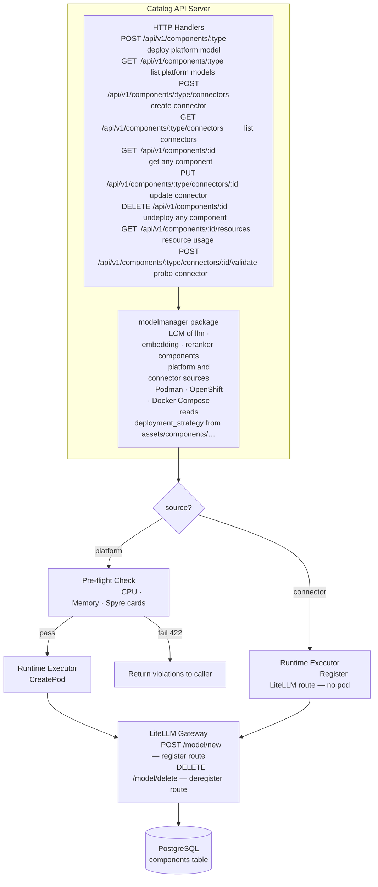
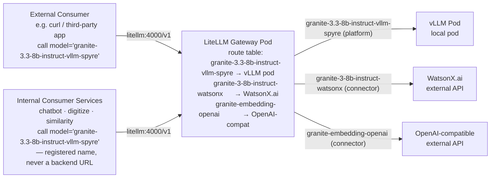
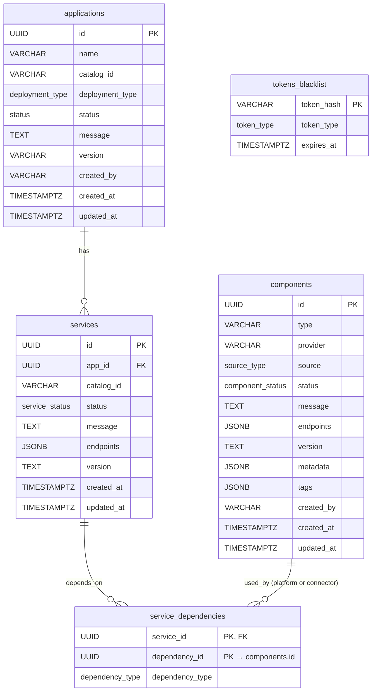

# Model Management & Connectors — Design Proposal

**Version:** 1.0
**Date:** July 2026  
**Status:** Draft / Proposal

---

## Table of Contents

1. [Executive Summary](#1-executive-summary)
2. [Background and Motivation](#2-background-and-motivation)
3. [Architecture Overview](#3-architecture-overview)
4. [LiteLLM Gateway Integration](#4-litellm-gateway-integration)
   - [LiteLLM as a Catalog Asset](#litellm-as-a-catalog-asset)
   - [Route Registration](#route-registration)
   - [WatsonX via Connector](#watsonx-via-connector)
5. [New Concepts](#5-new-concepts)
   - [5.1 Models](#51-models)
   - [5.2 Connectors](#52-connectors)
6. [Database Schema](#6-database-schema)
   - [6.1 Guiding Principle](#61-guiding-principle)
   - [6.2 Additions to Existing `components` Table](#62-additions-to-existing-components-table)
   - [6.3 New and Extended ENUM Types](#63-new-and-extended-enum-types)
   - [6.4 Full Entity Relationship Diagram](#64-full-entity-relationship-diagram)
7. [API Specification](#7-api-specification)
   - [7.1 Platform Model Endpoints](#71-platform-model-endpoints)
   - [7.2 Connector Endpoints](#72-connector-endpoints)
   - [7.3 Shared Instance Endpoints](#73-shared-instance-endpoints)
   - [7.4 Extensions to Existing Endpoints](#74-extensions-to-existing-endpoints)
8. [API Endpoint Details](#8-api-endpoint-details)
   - [8.1 Deploy a Platform Model](#81-deploy-a-platform-model)
   - [8.2 List Platform Models](#82-list-platform-models)
   - [8.3 Create a Connector](#83-create-a-connector)
   - [8.4 List Connectors](#84-list-connectors)
   - [8.5 Get Component Details](#85-get-component-details)
   - [8.6 Update a Connector](#86-update-a-connector)
   - [8.7 Delete / Undeploy a Component](#87-delete--undeploy-a-component)
   - [8.8 Get Component Resource Usage](#88-get-component-resource-usage)
   - [8.9 Validate a Connector](#89-validate-a-connector)
   - [8.10 List Supported Parameters for a Provider](#810-list-supported-parameters-for-a-provider)
9. [Pre-flight Resource Check](#9-pre-flight-resource-check)
10. [Deployment Flow](#10-deployment-flow)
11. [Key Design Decisions](#11-key-design-decisions)
12. [Common Queries](#12-common-queries)
13. [Error Handling](#13-error-handling)
14. [Future Considerations](#14-future-considerations)

---

## 1. Executive Summary

This proposal extends the existing Catalog Service with two new capabilities:

1. **Model Management** — dynamic deploy, undeploy, list, and status of model inference backends (`llm`, `embedding`, `reranker` roles) across all supported runtimes (Podman, OpenShift, Docker Compose). Models are no longer bundled statically inside application pods; they are standalone deployable components managed independently and exposed to consumer services through a **LiteLLM Gateway** — a universal model proxy that sits between applications and any backend provider.

2. **Connectors** — a way to register external model endpoints (WatsonX, OpenAI-compatible, HuggingFace) without deploying any local pod. Credentials are passed directly to the **LiteLLM Gateway** at route-registration time and stored there — they never enter the Catalog database or a Podman secret.

> **`modelmanager` is a Go package inside the Catalog API server process** — not a separate service or sidecar. The HTTP handlers call into it directly; there is no inter-process communication. It owns the full lifecycle (deploy, update, undeploy, status) of all three component types: `llm`, `embedding`, and `reranker` — for both `platform` and `connector` sources.

**Core design principle: everything is a `components` row.** A new `source` column discriminates between two kinds:

| `source` | Meaning | Pod? | Podman secret? | Credentials stored in | Examples |
|---|---|---|---|---|---|
| `platform` | Platform deployed a pod and owns its lifecycle | ✅ | optional | Podman secret (optional API key) | vLLM |
| `connector` | User registered an external model endpoint; no pod | ❌ | ❌ | LiteLLM Gateway | WatsonX, OpenAI-compatible, HuggingFace |

Three new columns on `components` (`tags`, `created_by`, `source`) and no new tables are the complete schema delta. Credentials never touch the database.

---

## 2. Background and Motivation

### Current State

The current catalog deploys vLLM or WatsonX as `components` that are tightly coupled to an application at creation time. Changing the model requires deleting and recreating the entire application. There is no concept of reusing a running model backend across applications, no support for dynamically switching providers at runtime, and no way to register an externally-hosted model endpoint without forking a template.

### Problems

- Model lifecycle is locked to application lifecycle; a model upgrade forces full application re-deployment.
- No mechanism to connect to an already-running WatsonX, OpenAI, or vLLM endpoint outside of the platform.
- Consumer services (`chatbot`, `digitize`, `similarity`, `summarize`) hold direct references to provider-specific endpoints — swapping providers requires re-deploying those services.
- No pre-flight validation of available resources (CPU, memory, Spyre cards) before attempting deployment, leading to silent pod failures.
- `component_status` enum only has `Initializing`, `Running`, `Error` — insufficient to express the `Deploying` lifecycle state needed for async model deployment.

### Goals

1. Decouple model lifecycle from application lifecycle.
2. Introduce a universal gateway (LiteLLM) so consumer services are provider-agnostic.
3. Enable connection to external model endpoints via Connectors without deploying local pods.
4. Gate all model deployments behind a pre-flight resource check.
5. Persist all model state in the Catalog DB by extending the existing `components` table — minimal schema delta, no new model table.

---

## 3. Architecture Overview

**Deploy / lifecycle request flow:**



**Model traffic flow (runtime):**



**Three deployment tiers:**

| Tier | When | `source` | Example |
|---|---|---|---|
| Catalog configure | `catalog configure` | `platform` (pipeline-created) | PostgreSQL, Caddy, **LiteLLM Gateway** |
| Platform model | `POST /api/v1/components/:type` | `platform` (user-created) | vLLM-CPU, vLLM-Spyre |
| Connector | `POST /api/v1/components/:type/connectors` | `connector` (user-created) | WatsonX, OpenAI-compatible |

---

## 4. LiteLLM Gateway Integration

### LiteLLM as a Catalog Asset

The LiteLLM Gateway is promoted from a static WatsonX-only component to the **universal model proxy** for all providers. It is deployed **once, as part of `catalog configure`** — the same command that starts PostgreSQL, Caddy, and the Catalog API server. It is not deployed per-application.

The gateway lives inside the Catalog asset (`assets/catalog/podman/templates/`) alongside the existing Catalog templates. Two new files are added: `litellm-master-key-secret.yaml.tmpl` (generates the `LITELLM_MASTER_KEY` Podman secret) and `litellm.yaml.tmpl` (starts the gateway pod). These are rendered as part of the existing `podTemplateExecutions` sequence in [`assets/catalog/podman/metadata.yaml`](ai-services/assets/catalog/podman/metadata.yaml).

All applications share the single LiteLLM gateway instance. Consumer services point to it at creation time and never need reconfiguring when the backing model provider changes — only the gateway route table changes.

### Route Registration

When a model reaches `Running` status (pod healthy / connector validated), the platform registers a route via the LiteLLM Admin API.

**Register (on deploy):**
```
POST http://litellm:4000/model/new
Authorization: Bearer <LITELLM_MASTER_KEY>

{
  "model_name": "granite-3.3-8b-instruct-vllm-spyre",
  "litellm_params": {
    "model": "ibm-granite/granite-3.3-8b-instruct",
    "custom_llm_provider": "hosted_vllm",
    "api_base": "http://my-rag-app--llm-granite:8000/v1",
    "api_key": "none"
  }
}
```

**Deregister (on undeploy):**
```
DELETE http://litellm:4000/model/delete
Authorization: Bearer <LITELLM_MASTER_KEY>

{ "id": "granite-3.3-8b-instruct-vllm-spyre" }
```

**Route ID convention:** The route ID registered in LiteLLM is `{model_name}-{provider}` — e.g. `granite-3.3-8b-instruct-vllm-spyre`. This is unique per deployed model and allows multiple models to coexist in the gateway simultaneously. Consumer services reference models by this ID.

### WatsonX via Connector

When deploying with `provider: watsonx`, no local pod is created. Credentials are passed directly to LiteLLM at route-registration time — they are never stored in the Catalog DB or a Podman secret. LiteLLM stores and manages them internally:

```json
{
  "model_name": "granite-3-8b-instruct-watsonx",
  "litellm_params": {
    "model": "ibm/granite-3-8b-instruct",
    "custom_llm_provider": "watsonx",
    "api_base": "<from params.endpoint_url>",
    "api_key": "<from params.auth — passed to LiteLLM at registration; never stored in Catalog DB>",
    "watsonx_project_id": "<from params.project_id>"
  }
}
```

---

## 5. New Concepts

### 5.1 Models

A **Model** is an inference backend for a specific role (`llm`, `embedding`, `reranker`) deployed and managed independently of an application. Both kinds are a `components` row — distinguished by `source`:

| `source` | Example providers | Pod? | Podman secret? |
|---|---|---|---|
| `platform` | `vllm-cpu`, `vllm-spyre` | ✅ Yes | optional (API key protection) |
| `connector` | `watsonx`, `openai-compatible` | ❌ No | ✅ always (credentials) |

Both kinds are registered as a route in the **LiteLLM Gateway** pod. Consumer services only ever talk to the LiteLLM gateway — they have no knowledge of which `source` is behind it.

The key differences from today's application-coupled components:

| | Today | New |
|---|---|---|
| Created by | Application deployment | Independent `POST /api/v1/components` |
| Lifecycle | Deleted with application | Explicit undeploy required |
| Provider endpoint | Exposed directly to services | Always proxied via LiteLLM Gateway |
| Pre-flight resource check | None | Required for `source=platform` models |
| WatsonX | Deploys a per-app LiteLLM proxy pod | `source=connector` row — credentials stored in LiteLLM, no pod, no Podman secret |

### 5.2 Connectors

A **Connector** is a `components` row with `source = 'connector'`. It has no pod and no Podman secret. Credentials are passed directly to the **LiteLLM Gateway** at route-registration time — LiteLLM stores and manages them. The Catalog DB stores only non-secret connection config (`params.endpoint_url`, `params.project_id`, `params.auth.type`) — never the secret values themselves.

| `source` | Pod | Podman secret | Credentials location | `endpoints` |
|---|---|---|---|---|
| `platform` | ✅ | optional | Podman secret (optional API key) | Pod URL |
| `connector` | ❌ | ❌ | LiteLLM Gateway | External service URL |

**Connector types (by `type` + `provider` on `components`):**

| `type` | `provider` | Description | LiteLLM auth fields |
|---|---|---|---|
| `llm` | `watsonx` | IBM WatsonX.ai LLM | `api_key` |
| `llm` | `openai-compatible` | Any OpenAI-compatible endpoint | `api_key` (optional) |
| `llm` | `huggingface` | HuggingFace Hub token (weight pull) | `token` |
| `embedding` | `openai-compatible` | Any OpenAI-compatible embedding endpoint | `api_key` (optional) |
| `reranker` | `openai-compatible` | Any OpenAI-compatible reranker endpoint | `api_key` (optional) |

---

## 6. Database Schema

### 6.1 Guiding Principle

> **Everything is a `components` row.** A new `source` column discriminates between a pod the platform deployed (`platform`) and an external endpoint the user registered (`connector`). Catalog DB credentials never enter the database — `platform` credentials live in Podman secrets; `connector` credentials live in LiteLLM.

| Provider | `source` | Pod? | Podman secret? | Credentials location |
|---|---|---|---|---|
| vLLM (cpu / spyre) | `platform` | ✅ | optional | Podman secret |
| WatsonX | `connector` | ❌ | ❌ | LiteLLM Gateway |
| OpenAI-compatible | `connector` | ❌ | ❌ | LiteLLM Gateway |
| HuggingFace | `connector` | ❌ | ❌ | LiteLLM Gateway |

`service_dependencies.dependency_id` always points at `components.id` regardless of `source`. The UI, the joins, and the dependency graph work identically for both kinds — no UNION, no second table.

---

### 6.2 Additions to Existing `components` Table

No existing columns are changed or removed. **Three** new columns are added; `component_status` is extended with new lifecycle and validation values.

#### New columns

```sql
ALTER TABLE components
    ADD COLUMN tags       JSONB        DEFAULT '{}',                -- free-form labels; "name" key carries the human-readable label
    ADD COLUMN created_by VARCHAR(100),                             -- NULL for app-pipeline infra
    ADD COLUMN source     source_type NOT NULL DEFAULT 'platform';  -- 'platform' | 'connector'
```

| Column | Data Type | Nullable | Description |
|---|---|---|---|
| `tags` | JSONB | Yes, DEFAULT `'{}'` | Free-form label bag. The `"name"` key carries the human-readable label (e.g., `{"name": "granite-llm"}`). Additional keys such as `"env"`, `"team"`, or `"app"` may be added freely without schema changes |
| `created_by` | VARCHAR(100) | Yes | User who created this row via `POST /api/v1/components`. NULL for components created by the application pipeline |
| `source` | `source_type` | No, DEFAULT `'platform'` | `platform` — pod owned by the platform. `connector` — external endpoint registered by user; no pod, credentials stored in LiteLLM Gateway |

> **No `credentials` column.** `platform` credentials are written to a Podman secret at deploy time. `connector` credentials are passed directly to LiteLLM at route-registration time. Neither is ever stored in the Catalog database.

#### Extended `component_status` enum

Two new values are added. Existing `Initializing`, `Running`, `Error` values are unchanged and continue to work for all components.

```sql
-- Platform model lifecycle (pod-backed)
ALTER TYPE component_status ADD VALUE 'Deploying';  -- async pod creation in progress
-- Connector lifecycle
ALTER TYPE component_status ADD VALUE 'Syncing';    -- connector created, validation probe in progress
```

Full enum after migration:

| Value | `source` | Meaning |
|---|---|---|
| `Initializing` | `platform` | Infra container starting |
| `Deploying` | `platform` | Async pod creation in progress |
| `Syncing` | `connector` | Created, validation probe in progress |
| `Running` | both | Pod healthy (`platform`) / last probe succeeded (`connector`) |
| `Error` | both | Deployment failure (`platform`) / probe failed (`connector`) |

> `Running` and `Error` are shared terminal states — same enum value, same DB column, same UI treatment for both sources. `Deploying` and `Syncing` are the source-specific transient states.

#### `metadata` JSONB — per-source fields

`platform` model rows (`vllm-spyre`) — value stored in `components.metadata`:
```json
{
  "model_name": "ibm-granite/granite-3.3-8b-instruct"
}
```

`connector` rows (`watsonx`) — value stored in `components.metadata`:
```json
{
  "model_name": "ibm/granite-3-8b-instruct"
}
```

`connector` rows — non-secret connection config stored in `components.params`:
```json
{
  "endpoint_url": "https://us-south.ml.cloud.ibm.com",
  "project_id": "my-watsonx-project-id",
  "auth": { "type": "api-key" }
}
```

> Secret fields (`api_key`, `token`, etc.) are **never stored** in `components.params.auth` or anywhere in the Catalog DB — only `auth.type` is persisted so the UI knows what credential shape was registered. The actual secret lives in LiteLLM.

| `metadata` key | `platform` | `connector` |
|---|---|---|
| `model_name` | ✅ | ✅ |

| `params` key | `platform` | `connector` |
|---|---|---|
| `endpoint_url` | ❌ | ✅ |
| `project_id` | ❌ | ✅ (watsonx) |
| `auth.type` | ❌ | ✅ |

---

### 6.3 New and Extended ENUM Types

```sql
-- New: source discriminator on components
CREATE TYPE source_type AS ENUM (
    'platform',   -- pod deployed and owned by the platform
    'connector'   -- external endpoint registered by user; credentials in LiteLLM, no pod
);

-- Extended (existing): new values added to component_status
ALTER TYPE component_status ADD VALUE 'Deploying';  -- platform: async pod creation in progress
ALTER TYPE component_status ADD VALUE 'Syncing';    -- connector: created/updated, validation probe in progress
```

---

### 6.4 Full Entity Relationship Diagram



> **No new tables. No credentials column.** `platform` credentials live in Podman secrets. `connector` credentials are passed directly to LiteLLM at route-registration time and never touch the Catalog DB.

---

## 7. API Specification

### 7.1 Platform Model Endpoints

Platform models (`source=platform`) are deployed as pods by the `modelmanager` package. All endpoints require `Authorization: Bearer <access_token>`. `:type` is one of `llm`, `embedding`, `reranker` — the router rejects any other value with `400` before the handler runs.

| Method | Path | Description | Response |
|---|---|---|---|
| `POST` | `/api/v1/components/:type` | Deploy a platform model | `202 Accepted` |
| `GET` | `/api/v1/components/:type` | List deployed platform models of the given type | `200 OK` |

### 7.2 Connector Endpoints

Connectors (`source=connector`) register external model endpoints — no pod is created. Credentials go directly to LiteLLM; the Catalog DB stores only non-secret connection config.

| Method | Path | Description | Response |
|---|---|---|---|
| `POST` | `/api/v1/components/:type/connectors` | Register a connector of the given type | `201 Created` |
| `GET` | `/api/v1/components/connectors` | List connectors across all types — `?type=` filters to one or more | `200 OK` |
| `GET` | `/api/v1/components/:type/connectors` | List connectors of a single type (convenience alias) | `200 OK` |
| `PUT` | `/api/v1/components/:type/connectors/:id` | Update a connector's params or credentials | `200 OK` |
| `POST` | `/api/v1/components/:type/connectors/:id/validate` | Probe connector endpoint and update status | `200 OK` |
| `GET` | `/api/v1/components/:type/providers/:provider/params?source=<source>` | List supported params for a provider — reads `values.schema.json` for the given `type` + `provider`; no external calls | `200 OK` |

### 7.3 Shared Instance Endpoints

These operate on any component by UUID regardless of `source`. The server resolves `source` from the DB row and takes the appropriate teardown path.

| Method | Path | Description | Response |
|---|---|---|---|
| `GET` | `/api/v1/components/:id` | Get status / details of any component | `200 OK` |
| `DELETE` | `/api/v1/components/:id` | Undeploy platform model or delete connector | `202 Accepted` / `204 No Content` |
| `GET` | `/api/v1/components/:id/resources` | Live resource usage — `platform` only | `200 OK` |

> **Routing note:** The literal-segment route `GET /api/v1/components/connectors` must be registered **before** the `:id` UUID catch-all and the `:type` enum routes so the router resolves it correctly. `:type` enum routes (`llm`, `embedding`, `reranker`) must be declared before the `:id` catch-all.

### 7.4 Extensions to Existing Endpoints

| Existing Endpoint | Change |
|---|---|
| `GET /api/v1/applications/:id` | Response includes `components` array alongside `services` — `source` field discriminates pod vs connector |
| `GET /api/v1/architectures/:id/deploy-options` | `providers` list under `llm`/`embedding`/`reranker` includes `connector` options alongside `vllm-cpu`, `vllm-spyre`; WatsonX is listed under `connector`, not as a pod provider |

---

## 8. API Endpoint Details

### 8.1 Deploy a Platform Model

**Endpoint:** `POST /api/v1/components/:type`

**Path Parameters:**

| Parameter | Description |
|---|---|
| `:type` | Component type: `llm`, `embedding`, `reranker` |

**Description:** Deploys a new platform model of the given type. Starts a pod and registers a LiteLLM route. Returns `202 Accepted` — creation is async.

**Request Headers:**
```
Authorization: Bearer <access_token>
Content-Type: application/json
```

**Request Body (`POST /api/v1/components/llm`, `vllm-spyre`):**

```json
{
  "tags": { "name": "granite-llm" },
  "provider": "vllm-spyre",
  "metadata": {
    "model_name": "ibm-granite/granite-3.3-8b-instruct"
  }
}
```

**Request Schema:**

| Field | Type | Required | Description |
|---|---|---|---|
| `tags` | object | Yes | Label bag. Must include `"name"` key (3–100 chars, slug-safe) |
| `provider` | string | Yes | Platform backend: `vllm-cpu`, `vllm-spyre` |
| `metadata` | object | Yes | Model-level config — polymorphic on `provider` (see §8.10) |

**Polymorphic `metadata` — required fields per `provider`:**

The `modelmanager` package validates `metadata` against the `params` block in `assets/components/<type>/<provider>/metadata.yaml`. Adding a new provider requires only a new asset file.

| `provider` | Required `metadata` fields |
|---|---|
| `vllm-cpu`, `vllm-spyre` | `model_name` |

**Response (`202 Accepted`, async):**

```json
{ "id": "7f3a1c2d-8e4b-4f5a-9d6e-1a2b3c4d5e6f" }
```

> Use `GET /api/v1/components/:id` to poll status and full details.

**Error Responses:**

| Status | Condition |
|---|---|
| `400 Bad Request` | Missing required fields or unknown `provider` |
| `401 Unauthorized` | Invalid or missing access token |
| `409 Conflict` | A component with the same `type` is already `Running` or `Deploying` |
| `422 Unprocessable Entity` | Pre-flight resource check failed |
| `500 Internal Server Error` | Pod start failure |

---

### 8.2 List Platform Models

**Endpoint:** `GET /api/v1/components/:type`

**Path Parameters:**

| Parameter | Description |
|---|---|
| `:type` | Component type: `llm`, `embedding`, `reranker` |

**Description:** Lists deployed platform models of the given type.

**Query Parameters:**

| Parameter | Type | Required | Default | Description |
|---|---|---|---|---|
| `provider` | string | No | — | Filter by provider: `vllm-spyre`, `vllm-cpu` |
| `page` | integer | No | 1 | Page number (1-indexed) |
| `page_size` | integer | No | 20 | Items per page (max 100) |

**Response (200 OK):**

```json
{
  "data": [
    {
      "id": "7f3a1c2d-8e4b-4f5a-9d6e-1a2b3c4d5e6f",
      "source": "platform",
      "tags": { "name": "granite-llm" },
      "type": "llm",
      "provider": "vllm-spyre",
      "metadata": { "model_name": "ibm-granite/granite-3.3-8b-instruct" },
      "status": "Running",
      "created_at": "2026-07-01T10:00:00Z",
      "updated_at": "2026-07-01T10:05:00Z"
    }
  ],
  "pagination": {
    "page": 1,
    "page_size": 20,
    "total_items": 1,
    "total_pages": 1,
    "has_next": false,
    "has_prev": false
  }
}
```

---

### 8.3 Create a Connector

**Endpoint:** `POST /api/v1/components/:type/connectors`

**Path Parameters:**

| Parameter | Description |
|---|---|
| `:type` | Component type: `llm`, `embedding`, `reranker` |

**Description:** Registers an external model endpoint as a connector. Credentials are passed directly to LiteLLM — no pod, no Podman secret. Returns `201 Created` — synchronous.

**Request Body (`POST /api/v1/components/llm/connectors`, `watsonx`):**

```json
{
  "tags": { "name": "prod-watsonx" },
  "provider": "watsonx",
  "metadata": {
    "model_name": "ibm/granite-3-8b-instruct"
  },
  "params": {
    "endpoint_url": "https://us-south.ml.cloud.ibm.com",
    "project_id": "my-watsonx-project-id",
    "auth": {
      "type": "api-key",
      "api_key": "sk-xxxxxxxxxxxxxxxxxxxxxxxxxxxxxxxx"
    }
  }
}
```

**Request Schema:**

| Field | Type | Required | Description |
|---|---|---|---|
| `tags` | object | Yes | Label bag. Must include `"name"` key (3–100 chars, slug-safe) |
| `provider` | string | Yes | Connector backend: `watsonx`, `openai-compatible`, `huggingface`, `generic-http` |
| `metadata` | object | Conditional | Model-level config — polymorphic on `provider` (see §8.10) |
| `params` | object | Yes | Endpoint + auth — mirrors the fields defined in `values.schema.json` for this provider |
| `params.endpoint_url` | string | Yes | Remote service base URL |
| `params.auth` | object | Yes | Auth object — `type` discriminates the shape; secret fields passed to LiteLLM; **never stored in Catalog DB** |
| `params.auth.type` | string | Yes | `api-key`, `bearer-token`, `basic`, `none` |

**Polymorphic `metadata` — required fields per `provider`:**

| `provider` | Required `metadata` fields |
|---|---|
| `watsonx` | `model_name` |
| `openai-compatible` | `model_name` |
| `huggingface` | `model_name` |
| `generic-http` | — |

**Polymorphic `params.auth` — shape per `type`:**

| `params.auth.type` | Additional fields |
|---|---|
| `api-key` | `"api_key": "sk-..."` |
| `bearer-token` | `"token": "eyJ..."` |
| `basic` | `"username": "user"`, `"password": "pass"` |
| `none` | — (omit `auth` entirely) |

**Response (`201 Created`):**

```json
{ "id": "c1d2e3f4-a5b6-7890-cdef-123456789abc" }
```

> Connector starts in `status = 'Syncing'`. Use `GET /api/v1/components/:id` to poll status. The platform fires the validation probe in the background; status advances to `Running` on success or `Error` on failure. Call `POST /api/v1/components/:type/connectors/:id/validate` to re-probe at any time.

**Error Responses:**

| Status | Condition |
|---|---|
| `400 Bad Request` | Missing required fields or unknown `provider` |
| `401 Unauthorized` | Invalid or missing access token |
| `409 Conflict` | A connector with the same `type` is already `Running` |
| `500 Internal Server Error` | LiteLLM route registration failure |

---

### 8.4 List Connectors

#### 8.4.1 Cross-type list (primary)

**Endpoint:** `GET /api/v1/components/connectors`

**Description:** Lists registered connectors across all component types in a single call. This is the primary endpoint for the "Model endpoints" UI view — one request replaces the three per-type calls that would otherwise be needed. Optionally filter by type, provider, or status. Pass `?include_platform=true` to include platform models in the same response.

**Query Parameters:**

| Parameter | Type | Required | Default | Description |
|---|---|---|---|---|
| `type` | string (CSV) | No | — | Filter to one or more types: `llm`, `embedding`, `reranker`. Omit for all types. |
| `provider` | string | No | — | Filter by provider: `watsonx`, `openai-compatible`, etc. |
| `include_platform` | boolean | No | `false` | When `true`, platform models are included alongside connectors — `source` field discriminates |
| `status` | string | No | — | Filter by status: `Running`, `Syncing`, `Error` |
| `page` | integer | No | 1 | Page number (1-indexed) |
| `page_size` | integer | No | 20 | Items per page (max 100) |

**Request Headers:**
```
Authorization: Bearer <access_token>
```

**Examples:**
```
# All connectors across all types — UI "Model endpoints" tab
GET /api/v1/components/connectors

# LLM and embedding connectors only
GET /api/v1/components/connectors?type=llm,embedding

# All connectors + platform models (unified view)
GET /api/v1/components/connectors?include_platform=true

# Only WatsonX connectors
GET /api/v1/components/connectors?provider=watsonx
```

**Response (200 OK):**

```json
{
  "data": [
    {
      "id": "c1d2e3f4-a5b6-7890-cdef-123456789abc",
      "source": "connector",
      "tags": { "name": "prod-watsonx" },
      "type": "llm",
      "provider": "watsonx",
      "metadata": { "model_name": "ibm/granite-3-8b-instruct" },
      "params": {
        "endpoint_url": "https://us-south.ml.cloud.ibm.com",
        "project_id": "my-watsonx-project-id",
        "auth": { "type": "api-key" }
      },
      "status": "Running",
      "created_at": "2026-07-01T11:00:00Z",
      "updated_at": "2026-07-01T11:05:00Z"
    },
    {
      "id": "d2e3f4a5-b6c7-8901-defa-234567890bcd",
      "source": "connector",
      "tags": { "name": "prod-embeddings" },
      "type": "embedding",
      "provider": "openai-compatible",
      "metadata": { "model_name": "text-embedding-3-small" },
      "params": {
        "endpoint_url": "https://api.openai.com",
        "auth": { "type": "api-key" }
      },
      "status": "Running",
      "created_at": "2026-07-01T12:00:00Z",
      "updated_at": "2026-07-01T12:05:00Z"
    }
  ],
  "pagination": {
    "page": 1,
    "page_size": 20,
    "total_items": 2,
    "total_pages": 1,
    "has_next": false,
    "has_prev": false
  }
}
```

> When `?include_platform=true`, platform model items appear with `"source": "platform"` and no `params` field — `source` is the discriminator. Items are ordered by `type` then `created_at` descending.

**Backing SQL:**

```sql
SELECT *
FROM components
WHERE source = 'connector'
  AND (ARRAY[:types] IS NULL OR type = ANY(ARRAY[:types]))
  AND (:provider IS NULL OR metadata->>'provider' = :provider)
  AND (:status  IS NULL OR status = :status)
ORDER BY type, created_at DESC
LIMIT :page_size OFFSET (:page - 1) * :page_size;
```

With `include_platform=true` the `source = 'connector'` predicate is removed (or changed to `source IN ('connector', 'platform')`).

**Error Responses:**

| Status | Condition |
|---|---|
| `400 Bad Request` | Unknown value in `type` CSV or unknown `status` value |
| `401 Unauthorized` | Invalid or missing access token |

---

#### 8.4.2 Per-type list (convenience alias)

**Endpoint:** `GET /api/v1/components/:type/connectors`

**Description:** Equivalent to `GET /api/v1/components/connectors?type=<type>`. Provided for ergonomics when the caller already knows the type — e.g. from a context where only LLM connectors are relevant. Accepts the same query parameters as §8.4.1 except `type` (which is fixed by the path).

**Path Parameters:**

| Parameter | Description |
|---|---|
| `:type` | Component type: `llm`, `embedding`, `reranker` |

**Query Parameters:** Same as §8.4.1 — `provider`, `include_platform`, `status`, `page`, `page_size`. The `type` query parameter is not accepted (use the path segment).

**Response:** Identical shape to §8.4.1, items filtered to the given `:type`.

**Error Responses:** Same as §8.4.1 plus `400 Bad Request` if an unsupported `:type` is given (router enforces this before the handler runs).

---

### 8.5 Get Component Details

**Endpoint:** `GET /api/v1/components/:id`

**Description:** Returns the full record for any managed component. Response shape varies by `source`.

**Response (200 OK) — `source=platform`:**

```json
{
  "id": "7f3a1c2d-8e4b-4f5a-9d6e-1a2b3c4d5e6f",
  "source": "platform",
  "tags": { "name": "granite-llm" },
  "type": "llm",
  "provider": "vllm-spyre",
  "metadata": { "model_name": "ibm-granite/granite-3.3-8b-instruct" },
  "status": "Running",
  "message": "Model running",
  "endpoints": [
    { "type": "api", "url": "http://my-rag-app--llm-granite:8000/v1" }
  ],
  "in_use_by": [
    {
      "application_id": "a1b2c3d4-1234-5678-abcd-ef0123456789",
      "app_name": "my-rag-app",
      "service_id": "svc-uuid-here",
      "service_role": "llm"
    }
  ],
  "created_at": "2026-07-01T10:00:00Z",
  "updated_at": "2026-07-01T10:05:00Z"
}
```

**Response (200 OK) — `source=connector`:**

```json
{
  "id": "c1d2e3f4-a5b6-7890-cdef-123456789abc",
  "source": "connector",
  "tags": { "name": "prod-watsonx" },
  "type": "llm",
  "provider": "watsonx",
  "status": "Running",
  "message": "Endpoint reachable and credentials accepted",
  "metadata": {
    "model_name": "ibm/granite-3-8b-instruct"
  },
  "params": {
    "endpoint_url": "https://us-south.ml.cloud.ibm.com",
    "project_id": "my-watsonx-project-id",
    "auth": { "type": "api-key" }
  },
  "in_use_by": [
    {
      "application_id": "a1b2c3d4-1234-5678-abcd-ef0123456789",
      "app_name": "my-rag-app",
      "service_id": "svc-uuid-here",
      "service_role": "llm"
    }
  ],
  "created_by": "user@example.com",
  "created_at": "2026-07-01T11:00:00Z",
  "updated_at": "2026-07-01T11:05:00Z"
}
```

> `in_use_by` is present on both `source=platform` and `source=connector` rows. It lists all applications/services that have a `service_dependencies` reference to this component.

**`in_use_by` SQL (server-side):**

```sql
SELECT sd.service_id, s.app_id AS application_id, a.name AS app_name,
       sd.dependency_type AS service_role
FROM service_dependencies sd
JOIN services s ON s.id = sd.service_id
JOIN applications a ON a.id = s.app_id
WHERE sd.dependency_id = :id
  AND sd.dependency_type = 'component';
```

**Error Responses:** `401 Unauthorized`, `404 Not Found`

---

### 8.6 Update a Connector

**Endpoint:** `PUT /api/v1/components/:type/connectors/:id`

**Path Parameters:**

| Parameter | Description |
|---|---|
| `:type` | Component type: `llm`, `embedding`, `reranker` |
| `:id` | Connector UUID |

**Description:** Updates a connector component's `metadata` or `params`. Only applicable to `source=connector` rows — platform pod components are immutable after deploy. If `params.auth` is supplied the LiteLLM route is updated with new credentials, `status` resets to `Syncing`, and the validation probe is re-fired immediately in the background.

**Request Body (all fields optional):**

```json
{
  "metadata": {
    "model_name": "ibm/granite-3-8b-instruct"
  },
  "params": {
    "endpoint_url": "https://eu-de.ml.cloud.ibm.com",
    "project_id": "new-project-id",
    "auth": {
      "type": "api-key",
      "api_key": "sk-new-key-here"
    }
  }
}
```

**Processing steps when `params.auth` is present:**

1. Re-register LiteLLM route (`DELETE /model/delete` then `POST /model/new`) with updated `params.auth` secret fields.
2. Reset `components.status = 'Syncing'`.
3. Merge supplied `metadata` and non-auth `params` fields into stored record (omitted keys preserved).
4. Update `updated_at`.

**Response (200 OK):** Full connector object in same shape as §8.3 response.

**Error Responses:**

| Status | Condition |
|---|---|
| `400 Bad Request` | Invalid field values; or attempted on a `source=platform` component |
| `401 Unauthorized` | Invalid or missing access token |
| `403 Forbidden` | Authenticated user is not `created_by` |
| `404 Not Found` | Component not found |
| `500 Internal Server Error` | LiteLLM route update failure |

---

### 8.7 Delete / Undeploy a Component

**Endpoint:** `DELETE /api/v1/components/:id`

**Description:** Removes a managed component. The server inspects `source` to decide the teardown path — the client always calls the same endpoint:

| `source` | Server action | Response |
|---|---|---|
| `platform` | Stop + delete pod → delete row | `202 Accepted` (async) |
| `connector` | Deregister LiteLLM route (removes credentials from LiteLLM) → delete row | `202 Accepted` |

**Query Parameters:**

| Parameter | Type | Required | Default | Description |
|---|---|---|---|---|
| `keep_data` | boolean | No | `false` | `platform` only: preserve host volume / PVC; stop pod, keep weights |

**Response — platform or active connector (`202 Accepted`):**

```json
{
  "id": "7f3a1c2d-8e4b-4f5a-9d6e-1a2b3c4d5e6f",
  "message": "Undeploy initiated"
}
```

**Response — inactive connector hard-delete (`204 No Content`):** empty body.

**Error Responses:**

| Status | Condition |
|---|---|
| `401 Unauthorized` | Invalid or missing access token |
| `403 Forbidden` | Authenticated user is not `created_by` |
| `404 Not Found` | Component not found or not managed |
| `409 Conflict` | `platform` component is already being deleted |

---

### 8.8 Get Component Resource Usage

**Endpoint:** `GET /api/v1/components/:id/resources`

**Description:** Returns live CPU, memory, and accelerator consumption for a `source=platform` component. Returns `404` for `source=connector` components — they consume no local resources.

**Response (200 OK):**

```json
{
  "id": "7f3a1c2d-8e4b-4f5a-9d6e-1a2b3c4d5e6f",
  "tags": { "name": "granite-llm" },
  "cpu": { "requested": 8.0, "used": 5.3 },
  "memory": { "requested_bytes": 161061273600, "used_bytes": 143165997670 },
  "accelerators": {
    "ibm.com/spyre_pf": {
      "requested": 4,
      "allocated": ["spyre-card-0", "spyre-card-1", "spyre-card-2", "spyre-card-3"]
    }
  }
}
```

**Error Responses:** `401 Unauthorized`, `404 Not Found` (including `source=connector` components)

---

### 8.9 Validate a Connector

**Endpoint:** `POST /api/v1/components/:type/connectors/:id/validate`

**Path Parameters:**

| Parameter | Description |
|---|---|
| `:type` | Component type: `llm`, `embedding`, `reranker` |
| `:id` | Connector UUID |

**Description:** Synchronously probes the connector's endpoint using credentials retrieved from the LiteLLM Gateway (`GET /model/info`). Sets `status` to `Running` on success or `Error` on any failure. The same probe logic runs automatically on creation and credential update.

| `provider` | Validation Probe |
|---|---|
| `watsonx` | `GET {metadata.endpoint_url}/ml/v1/foundation_model_specs` with `Authorization: Bearer <api_key>` |
| `openai-compatible` | `GET {metadata.endpoint_url}/models` with `Authorization: Bearer <api_key>` |
| `huggingface` | `GET https://huggingface.co/api/whoami` with `Authorization: Bearer <token>` |
| `generic-http` | `GET {metadata.endpoint_url}` with configured auth header; 2xx = valid |

**Status transitions:**

| Probe outcome | New `components.status` |
|---|---|
| 2xx response | `Running` |
| 4xx auth error | `Error` |
| Timeout / network error | `Error` |

**Response (200 OK) — probe succeeded:**

```json
{ "id": "c1d2e3f4-a5b6-7890-cdef-123456789abc", "status": "Running", "message": "Endpoint reachable and credentials accepted" }
```

**Response (200 OK) — probe failed:**

```json
{ "id": "c1d2e3f4-a5b6-7890-cdef-123456789abc", "status": "Error", "message": "Authentication failed: 401 Unauthorized from endpoint" }
```

> Always returns `200 OK`. Probe outcome is in `status`, consistent with the `component_status` enum.

**Error Responses:**

| Status | Condition |
|---|---|
| `401 Unauthorized` | Invalid or missing access token |
| `404 Not Found` | Connector not found or not a `source=connector` component |
| `500 Internal Server Error` | Could not retrieve credentials from LiteLLM or unexpected error |

---

### 8.10 List Supported Parameters for a Provider

**Endpoint:** `GET /api/v1/components/:type/providers/:provider/params`

**Description:** Returns the set of supported configuration parameters for a given `type` + `provider` + `source` combination.

- `:type` scopes which asset schema is loaded (`llm`, `embedding`, or `reranker`).
- `:provider` identifies the external service (e.g. `watsonx`) or platform backend (e.g. `vllm-spyre`).
- `source` query parameter discriminates between connector and platform deployments — the same `:provider` value can appear in both (e.g. `vllm-spyre` can be a local pod or an external connector).

For **both `source=connector` and `source=platform`** the `modelmanager` package reads the provider's `values.schema.json` asset file. This file is the single authoritative source for all supported params — their types, defaults, required/optional status, and descriptions. No runtime calls to LiteLLM or any other external service are made.

The UI calls this endpoint **before** opening the connector or deploy form so it can render the correct, provider-specific field set.

**Path Parameters:**

| Parameter | Description |
|---|---|
| `:type` | Component type: `llm`, `embedding`, `reranker` |
| `:provider` | Provider identifier — e.g. `watsonx`, `openai-compatible`, `huggingface`, `generic-http`, `vllm-spyre`, `vllm-cpu` |

**Query Parameters:**

| Parameter | Required | Values | Description |
|---|---|---|---|
| `source` | **Yes** | `connector`, `platform` | Deployment kind — scopes which `values.schema.json` is loaded (`connector` providers vs `platform` providers). |

**Request Headers:**
```
Authorization: Bearer <access_token>
```

**Examples:**
```
# WatsonX LLM connector params
GET /api/v1/components/llm/providers/watsonx/params?source=connector

# OpenAI-compatible embedding connector params
GET /api/v1/components/embedding/providers/openai-compatible/params?source=connector

# HuggingFace reranker connector params
GET /api/v1/components/reranker/providers/huggingface/params?source=connector

# vLLM-Spyre platform pod params
GET /api/v1/components/llm/providers/vllm-spyre/params?source=platform
```

---

#### `values.schema.json` — asset source of truth

Every provider ships a `values.schema.json` file under the component asset tree:

```
assets/components/
  llm/
    watsonx/
      values.schema.json
    openai-compatible/
      values.schema.json
    huggingface/
      values.schema.json
    generic-http/
      values.schema.json
    vllm-spyre/
      values.schema.json
    vllm-cpu/
      values.schema.json
  embedding/
    openai-compatible/
      values.schema.json
    ...
  reranker/
    huggingface/
      values.schema.json
    ...
```

This file follows standard [JSON Schema (draft-07)](https://json-schema.org/specification-links#draft-7) and describes every field a caller may pass in `params` or `metadata` when registering or deploying a component. Example (`watsonx`):

```json
{
  "$schema": "http://json-schema.org/draft-07/schema#",
  "title": "WatsonX Connector Parameters",
  "type": "object",
  "required": ["model_name", "endpoint_url", "project_id", "auth"],
  "properties": {
    "model_name": {
      "type": "string",
      "title": "Model Name",
      "description": "WatsonX foundation model ID",
      "examples": ["ibm/granite-3-8b-instruct"]
    },
    "endpoint_url": {
      "type": "string",
      "title": "Endpoint URL",
      "description": "WatsonX regional API base URL",
      "examples": ["https://us-south.ml.cloud.ibm.com"]
    },
    "project_id": {
      "type": "string",
      "title": "Project ID",
      "description": "WatsonX project ID scoping inference requests"
    },
    "auth": {
      "type": "object",
      "required": ["type"],
      "properties": {
        "type": {
          "type": "string",
          "title": "Auth Type",
          "description": "Authentication method",
          "enum": ["api_key", "iam_token"]
        },
        "api_key": {
          "type": "string",
          "title": "API Key",
          "description": "WatsonX API key — required when auth.type is api_key",
          "x-secret": true
        }
      }
    },
    "max_tokens": {
      "type": "integer",
      "title": "Max Tokens",
      "description": "Maximum tokens to generate",
      "default": 4096
    },
    "temperature": {
      "type": "number",
      "title": "Temperature",
      "description": "Sampling temperature (0.0 – 2.0)",
      "default": 1.0
    },
    "top_p": {
      "type": "number",
      "title": "Top P",
      "description": "Nucleus sampling probability mass",
      "default": 1.0
    },
    "stream": {
      "type": "boolean",
      "title": "Stream",
      "description": "Enable streaming responses",
      "default": false
    },
    "timeout": {
      "type": "integer",
      "title": "Timeout",
      "description": "Request timeout in seconds",
      "default": 600
    }
  }
}
```

> The `x-secret: true` extension marks credential fields. `modelmanager` uses this to strip those values before storing anything in the Catalog DB, and the UI uses it to render password inputs.

`modelmanager` resolves the file at `assets/components/<type>/<provider>/values.schema.json` and serves it (translated to the response shape below) without making any external calls.

---

#### Response (200 OK) — `source=connector`, `watsonx`

```json
{
  "provider": "watsonx",
  "type": "llm",
  "params": [
    {
      "name": "model_name",
      "type": "string",
      "required": true,
      "description": "WatsonX foundation model ID",
      "example": "ibm/granite-3-8b-instruct"
    },
    {
      "name": "endpoint_url",
      "type": "string",
      "required": true,
      "description": "WatsonX regional API base URL",
      "example": "https://us-south.ml.cloud.ibm.com"
    },
    {
      "name": "project_id",
      "type": "string",
      "required": true,
      "description": "WatsonX project ID scoping inference requests"
    },
    {
      "name": "auth.type",
      "type": "string",
      "required": true,
      "description": "Authentication method",
      "enum": ["api_key", "iam_token"]
    },
    {
      "name": "auth.api_key",
      "type": "string",
      "required": false,
      "description": "WatsonX API key — required when auth.type is api_key",
      "secret": true
    },
    {
      "name": "max_tokens",
      "type": "integer",
      "required": false,
      "description": "Maximum tokens to generate",
      "default": 4096
    },
    {
      "name": "temperature",
      "type": "number",
      "required": false,
      "description": "Sampling temperature (0.0 – 2.0)",
      "default": 1.0
    },
    {
      "name": "top_p",
      "type": "number",
      "required": false,
      "description": "Nucleus sampling probability mass",
      "default": 1.0
    },
    {
      "name": "stream",
      "type": "boolean",
      "required": false,
      "description": "Enable streaming responses",
      "default": false
    },
    {
      "name": "timeout",
      "type": "integer",
      "required": false,
      "description": "Request timeout in seconds",
      "default": 600
    }
  ]
}
```

> `secret: true` fields are included as param descriptors (sourced from `x-secret: true` in `values.schema.json`) so the UI can render a password input — they are **never** stored in the Catalog DB and are not returned by any GET endpoint.

---

#### Response (200 OK) — `source=platform`, `vllm-spyre`

```json
{
  "provider": "vllm-spyre",
  "type": "llm",
  "params": [
    {
      "name": "model_name",
      "type": "string",
      "required": true,
      "description": "HuggingFace model ID to load into vLLM",
      "example": "ibm-granite/granite-3.3-8b-instruct"
    }
  ]
}
```

---

#### Response Schema

| Field | Type | Description |
|---|---|---|
| `provider` | string | Provider this schema applies to |
| `type` | string | Component type (`llm`, `embedding`, `reranker`) |
| `params` | array | Ordered list of parameter descriptors — required fields first, then optional |
| `params[].name` | string | Key used in the `params` or `metadata` object of the relevant POST body |
| `params[].type` | string | JSON type: `string`, `integer`, `number`, `boolean`, `object` |
| `params[].required` | boolean | Whether the field must be present in the POST body — derived from the schema's `required` array |
| `params[].description` | string | Human-readable label shown in the UI form — from `description` in `values.schema.json` |
| `params[].default` | any | Default value — from `default` in `values.schema.json`; omitted if none defined |
| `params[].example` | string | Illustrative placeholder value for the UI — from `examples[0]` in `values.schema.json` (optional) |
| `params[].secret` | boolean | `true` when `x-secret: true` is set — UI renders a password input; value never stored in DB |
| `params[].enum` | array | Allowed values — from `enum` in `values.schema.json` (optional) |

---

#### Provider coverage

| `provider` | `values.schema.json` asset path |
|---|---|
| `watsonx` (connector) | `assets/components/llm/watsonx/values.schema.json` |
| `openai-compatible` (connector) | `assets/components/llm/openai-compatible/values.schema.json` |
| `huggingface` (connector) | `assets/components/llm/huggingface/values.schema.json` |
| `generic-http` (connector) | `assets/components/llm/generic-http/values.schema.json` |
| `vllm-spyre` (platform) | `assets/components/llm/vllm-spyre/values.schema.json` |
| `vllm-cpu` (platform) | `assets/components/llm/vllm-cpu/values.schema.json` |

The endpoint shape is identical for both `source=connector` and `source=platform` — the UI can use a single code path.

---

#### `modelmanager` implementation note

```
internal/catalog/modelmanager/
  params.go   ← GetProviderParams(ctx, compType, provider) ([]ParamDescriptor, error)
```

`GetProviderParams` is the sole function called by the HTTP handler. It:
1. Resolves `assets/components/<type>/<provider>/values.schema.json`.
2. Parses the JSON Schema — walks `properties`, checks membership in the top-level `required` array, reads `default`, `examples[0]`, `enum`, and `x-secret`.
3. Returns the ordered `[]ParamDescriptor` slice (required fields first).

No external calls are made. The HTTP handler at `GET /api/v1/components/:type/providers/:provider/params` requires no extra auth middleware beyond the standard bearer token check.

---

**Error Responses:**

| Status | Condition |
|---|---|
| `400 Bad Request` | `source` query parameter is missing or not one of `connector` / `platform` |
| `401 Unauthorized` | Invalid or missing access token |
| `404 Not Found` | No `values.schema.json` found for the given `type` + `provider` + `source` combination |

---

## 9. Pre-flight Resource Check

Before any model pod is created, the platform validates that the host or cluster has sufficient CPU, memory, and Spyre accelerator cards. All constraint violations are collected and returned together — not just the first failure.

**Triggered by:** `POST /api/v1/components` for `platform` providers.

**Check sequence:**

1. Load `ResourceRequirements` from `assets/components/<type>/<provider>/<runtime>/metadata.yaml`.
2. Query the existing `GET /api/v1/resources` for current system info (CPU, memory, accelerators).
3. Check CPU available >= required.
4. Check Memory available >= required.
5. If `provider == vllm-spyre` and runtime is Podman: enumerate `/dev/vfio` for free Spyre cards; check `free >= required["ibm.com/spyre_pf"]`.
6. If runtime is OpenShift: query node allocatable for accelerator resources via Kubernetes API.
7. If any check fails: return `HTTP 422` with the full violations array.

**Error Response (422 Unprocessable Entity):**

```json
{
  "error": "Model deployment pre-flight check failed",
  "violations": [
    {
      "resource": "memory",
      "required": "150Gi",
      "available": "42Gi",
      "unit": "bytes",
      "satisfied": false
    },
    {
      "resource": "accelerators.ibm.com/spyre_pf",
      "required": "4",
      "available": "1",
      "unit": "cards",
      "satisfied": false
    },
    {
      "resource": "cpu",
      "required": "8",
      "available": "12",
      "unit": "cores",
      "satisfied": true
    }
  ]
}
```

---

## 10. Deployment Flow

### Flow: Catalog Configure — LiteLLM Gateway (one-time setup)

```
catalog configure  (same command that starts postgres, caddy, catalog API)

  Read assets/catalog/podman/metadata.yaml → podTemplateExecutions sequence

  Existing steps (unchanged):
    1. Render catalog-secret.yaml.tmpl, catalog-db-secret.yaml.tmpl, auth-secret.yaml.tmpl
    2. Render catalog-db.yaml.tmpl, caddy.yaml.tmpl
    3. Render catalog.yaml.tmpl

  New steps added to the sequence:
    4. [NEW] Generate LITELLM_MASTER_KEY (UUID)
    5. [NEW] Render litellm-master-key-secret.yaml.tmpl → CreateSecret
    6. [NEW] Render litellm.yaml.tmpl → CreatePod (LiteLLM Gateway)
    7. [NEW] Poll InspectPod until liveness probe passes
    8. [NEW] INSERT components (type='llm', provider='litellm', source='platform',
                                status='Running', created_by=NULL,
                                metadata={model_name: "litellm"})

  All applications share this single gateway instance.
```

### Flow: Deploy vLLM (Podman + Spyre) — `source=platform`

```
POST /api/v1/components/llm
{ source: "platform", provider: "vllm-spyre", model_name: "ibm-granite/granite-3.3-8b-instruct" }

  Read assets/components/llm/vllm-spyre/metadata.yaml → deployment_strategy: pod

  1. Validate request fields
  2. Pre-flight check → 422 if insufficient
  3. Render vllm-server.yaml.tmpl → CreatePod
  4. INSERT into components (type=llm, provider=vllm-spyre, source='platform',
                             status='Deploying', tags={"name":"granite-llm"}, created_by=<user>,
                             metadata={model_name: "ibm-granite/granite-3.3-8b-instruct"})  ← from request metadata.model_name
  5. Return 202 {source: "platform", id: components.id, status: "Deploying", ...}
  6. [async] Poll InspectPod until liveness probe passes
  7. [async] UPDATE components SET status='Running'
```

### Flow: Deploy WatsonX — `source=connector` (no pod)

```
POST /api/v1/components/llm/connectors
{ provider: "watsonx",
  metadata: {model_name: "ibm/granite-3-8b-instruct"},
  params: {endpoint_url: "https://us-south.ml.cloud.ibm.com", project_id: "my-watsonx-project-id",
           auth: {type: "api-key", api_key: "sk-..."}} }

  Read assets/components/llm/watsonx/metadata.yaml → deployment_strategy: connector

  1. Validate request fields
  2. No pod, no pre-flight resource check
  3. POST /model/new to LiteLLM Gateway (passing params.auth secret fields directly — never stored in Catalog DB)
  4. INSERT into components (type=llm, provider=watsonx, source='connector',
                             status='Syncing', tags={"name":<name>}, created_by=<user>,
                             endpoints=[{type:"api", url: params.endpoint_url}],
                             metadata={model_name: ...},         ← from request metadata.model_name
                             params={endpoint_url: ...,          ← from request params.endpoint_url
                                     project_id: ...,            ← from request params.project_id
                                     auth: {type: "api-key"}     ← only auth.type stored; secret fields not stored})
  5. Return 201 {source: "connector", id: components.id, status: "Syncing", ...}
  6. [async] modelmanager probes endpoint via LiteLLM GET /model/info to validate credentials
  7. [async] UPDATE components SET status='Running' or status='Error'
```

### Flow: Undeploy `source=platform` model

```
DELETE /api/v1/components/:id

  Server resolves source='platform' from DB row

  1. Verify created_by=user
  2. Return 202
  3. [async] StopPod → DeletePod
  4. [async] DELETE components row
```

### Flow: Undeploy `source=connector`

```
DELETE /api/v1/components/:id

  Server resolves source='connector' from DB row

  1. Verify created_by=user
  2. Return 202
  3. [async] DELETE /model/delete from LiteLLM Gateway (removes credentials from LiteLLM)
  4. [async] DELETE components row
```

---

## 11. Key Design Decisions

### 1. One Table for Everything: `components.source` Discriminates Pod vs Connector

`components` is the universal registry for all runtime dependencies — whether the platform deployed a pod (`source=platform`) or the user registered an external endpoint (`source=connector`). `service_dependencies.dependency_id` always points at `components.id` regardless of `source`. No UNION queries, no second table, no schema divergence.

### 2. Credentials Never Enter the Database

`platform` credentials are written to Podman secrets at deploy time — exactly as they are today for `vllm-secret-<slug>`. `connector` credentials are passed directly to the LiteLLM Gateway at route-registration time. Neither is stored in the Catalog DB. At undeploy time, `platform` calls `DeleteSecret`; `connector` calls `DELETE /model/delete` on LiteLLM which removes the credentials from the gateway.

### 3. `source` Column is the Only Branch Point

At undeploy time, the `modelmanager package` reads `components.source`:
- `platform` → stop pod + delete pod
- `connector` → `DELETE /model/delete` on LiteLLM (credentials removed from gateway)

Without this column, the `modelmanager package` would have to re-read `metadata.yaml` assets to infer the teardown path — fragile and coupling runtime behaviour to static asset files.

### 4. Managed Model Identity: `created_by IS NOT NULL`

The API layer distinguishes user-created components from infrastructure components deployed by the application pipeline by `created_by IS NOT NULL`. Both `source` values can be user-created.

### 5. Undeploy Always Deletes the Row

`DELETE /api/v1/components/:id` is the single undeploy entry point for both sources. The server resolves `source` from the DB row and takes the appropriate path: deregister LiteLLM route (connector) or stop+delete pod (platform). The `components` row is always hard-deleted.

### 6. `deployment_strategy` in `metadata.yaml` Drives the `modelmanager` Package Deploy Path

`deployment_strategy: pod | connector` means zero provider string comparisons in Go code at deploy time. Adding a new provider (e.g., `azure-openai`) needs only a new `metadata.yaml` — no code change.

### 7. `Running` is the Healthy State for Both Sources

`component_status.Running` means pod is healthy for `platform`, and last validation probe passed for `connector`. UI status display logic is uniform — green = Running, regardless of source.

### 8. LiteLLM Route ID = `{model_name}-{provider}`

Registering routes under a `{model_name}-{provider}` ID (e.g. `granite-3.3-8b-instruct-vllm-spyre`) uniquely identifies each deployed model in the gateway and allows multiple models to coexist simultaneously. The same ID is used for deregistration at undeploy time.

### 9. Pre-flight Returns All Violations, Not Just First

The pre-flight response always includes every constraint result (satisfied or not) so operators see the full resource gap at once. Connector providers skip pre-flight entirely — they consume no local resources.

---

## 12. Common Queries

### All active models for an application — single query:
```sql
SELECT
    id, source, tags->>'name' AS name, type, provider, status,
    endpoints,
    metadata->>'model_name' AS model_name    -- platform only; NULL for connectors
FROM components
WHERE created_by IS NOT NULL
  AND type IN ('llm', 'embedding', 'reranker')
  AND status != 'Error'
ORDER BY type, source;
```

### Full application view — services + models (all sources):
```sql
SELECT
    a.id AS app_id, a.name AS app_name,
    s.id AS service_id, s.catalog_id AS service_type,
    c.id AS model_id, c.source AS model_source,
    c.type AS model_role, c.provider, c.status AS model_status,
    c.metadata->>'model_name' AS model_name
FROM applications a
LEFT JOIN services s ON s.app_id = a.id
LEFT JOIN components c ON c.created_by IS NOT NULL
WHERE a.id = 'application-uuid-here'
ORDER BY c.type, c.source;
```

### Get connectors still syncing (probe in progress):
```sql
SELECT id, tags->>'name' AS name, provider, endpoints, created_at
FROM components
WHERE source = 'connector'
  AND status = 'Syncing'
ORDER BY created_at DESC;
```

---

## 13. Error Handling

All error responses follow the existing catalog error format:

```json
{ "error": "Human-readable error message" }
```

Pre-flight failures extend this with a `violations` array (see §8):

```json
{
  "error": "Model deployment pre-flight check failed",
  "violations": [ ... ]
}
```

### HTTP Status Codes

| Code | Usage |
|---|---|
| `200 OK` | Successful synchronous request |
| `201 Created` | Connector created |
| `202 Accepted` | Async operation initiated (model deploy, undeploy) |
| `204 No Content` | Connector deleted |
| `400 Bad Request` | Missing required fields, invalid enum values, malformed body |
| `401 Unauthorized` | Missing or invalid Bearer token |
| `403 Forbidden` | Authenticated but not the `created_by` owner |
| `404 Not Found` | Component/connector/application not found |
| `409 Conflict` | Duplicate connector name; model for this type already active; connector in use |
| `422 Unprocessable Entity` | Pre-flight resource check failed |
| `500 Internal Server Error` | Unexpected server error |

---

## 14. Future Considerations

1. **Component Swap API** — `PUT /api/v1/components/:id/swap` to atomically swap the active model under a given LiteLLM alias with zero consumer-service downtime (register new route before removing the old one).
2. **Multiple Models Per Role (Fallback)** — LiteLLM supports listing multiple models under the same alias for automatic failover. Relax the one-active-model-per-role constraint to allow a primary + fallback pair per role.
3. **Model Catalog Browse** — `GET /api/v1/model-catalog` to enumerate available providers, their resource requirements, and compatible model IDs from component `metadata.yaml` assets — analogous to the architecture/service catalog endpoints.
4. **RBAC on Connectors** — Connectors currently belong to the creating user. Future: share connectors across a team, or mark them platform-wide, via a `visibility` field (`private` / `shared` / `global`).
5. **Connector Key Rotation** — Scheduled validation jobs to proactively detect stale API keys before they impact deployed models.
6. **Audit Logging** — Add `updated_by` to `connectors` and populate it on credential update or status change.
7. **OpenShift Accelerator Pre-flight** — Extend `GetSystemInfo` on the OpenShift runtime to surface node-level allocatable GPU/accelerator counts from the Kubernetes node API, replacing the VFIO-based Spyre enumeration used on Podman.
8. **Deployment History** — Consider adding an audit/history table to record past component deployments if operators need a record after row deletion.
