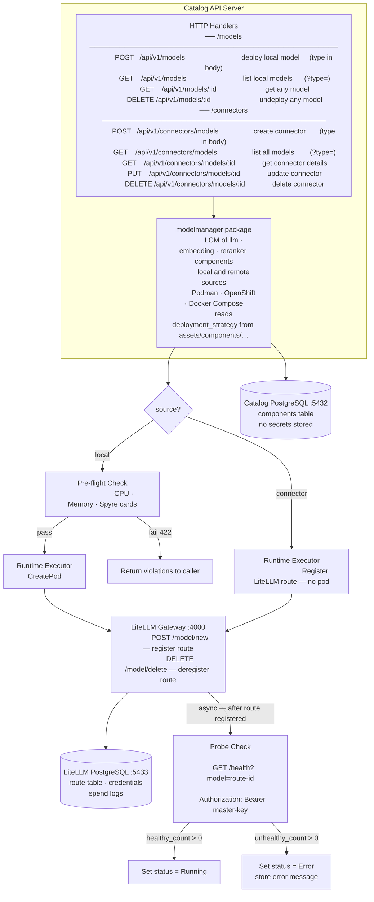

# Model Management & Connectors — Design Proposal

**Version:** 1.0
**Date:** July 2026  
**Status:** Draft / Proposal

---

## Table of Contents

1. [Executive Summary](#1-executive-summary)
2. [Background and Motivation](#2-background-and-motivation)
3. [Architecture Overview](#3-architecture-overview)
4. [LiteLLM Gateway Integration](#4-litellm-gateway-integration)
   - [LiteLLM as a Catalog Asset](#litellm-as-a-catalog-asset)
   - [Route Registration](#route-registration)
   - [Virtual Key Provisioning](#virtual-key-provisioning)
   - [WatsonX via Connector](#watsonx-via-connector)
5. [New Concepts](#5-new-concepts)
   - [5.1 Models](#51-models)
   - [5.2 Connectors](#52-connectors)
6. [Database Schema](#6-database-schema)
   - [6.1 Guiding Principle](#61-guiding-principle)
   - [6.2 Additions to Existing `components` Table](#62-additions-to-existing-components-table)
   - [6.3 New and Extended ENUM Types](#63-new-and-extended-enum-types)
   - [6.4 Full Entity Relationship Diagram](#64-full-entity-relationship-diagram)
7. [API Specification](#7-api-specification)
   - [7.1 Model Endpoints](#71-model-endpoints)
   - [7.2 Connector Endpoints](#72-connector-endpoints)
   - [7.3 Extensions to Existing Endpoints](#73-extensions-to-existing-endpoints)
8. [API Endpoint Details](#8-api-endpoint-details)
   - [8.1 Deploy a Local Model](#81-deploy-a-local-model)
   - [8.2 List Local Models](#82-list-local-models)
   - [8.3 Get Model Details](#83-get-model-details)
   - [8.4 Delete / Undeploy a Model](#84-delete--undeploy-a-model)
   - [8.5 Create a Connector](#85-create-a-connector)
   - [8.6 List Connectors](#86-list-connectors)
   - [8.7 Update a Connector](#87-update-a-connector)
   - [8.8 Get Connector Details](#88-get-connector-details)
   - [8.9 Delete a Connector](#89-delete-a-connector)
9. [Pre-flight Resource Check](#9-pre-flight-resource-check)
10. [Deployment Flow](#10-deployment-flow)
11. [Key Design Decisions](#11-key-design-decisions)
12. [Common Queries](#12-common-queries)
13. [Error Handling](#13-error-handling)
14. [Future Considerations](#14-future-considerations)
15. [CLI Commands](#15-cli-commands)
    - [15.1 Model Commands](#151-model-commands)
    - [15.2 Connector Commands](#152-connector-commands)
    - [15.3 LiteLLM Gateway Commands](#153-litellm-gateway-commands)
    - [15.4 Command Summary](#154-command-summary)

---

## 1. Executive Summary

This proposal extends the existing Catalog Service with two new capabilities:

1. **Model Management** — dynamic deploy, undeploy, list, and status of model inference backends (`llm`, `embedding`, `reranker`) across all supported runtimes (Podman, OpenShift, Docker Compose). Models are no longer bundled statically inside application pods; they are standalone deployable components managed independently and exposed to consumer services through a **LiteLLM Gateway** — a universal model proxy that sits between applications and any backend provider.

2. **Connectors** — a way to register external model endpoints (WatsonX, OpenAI-compatible, HuggingFace) without deploying any local pod. Credentials are passed directly to the **LiteLLM Gateway** at route-registration time and stored there — they never enter the Catalog database or a Podman secret.

> **`modelmanager` is a Go package inside the Catalog API server process** — not a separate service or sidecar. The HTTP handlers call into it directly; there is no inter-process communication. It owns the full lifecycle (deploy, update, undeploy, status) of all three component types: `llm`, `embedding`, and `reranker` — for both `local` and `remote` sources.

**Core design principle: everything is a `components` row.** A new `source` column discriminates between two kinds:

| `source` | Meaning | Pod? | Podman secret? | Credentials stored in | Examples |
|---|---|---|---|---|---|
| `local` | Locally deployed pod — owned and managed by the system | ✅ | optional | Podman secret (optional API key) | vLLM |
| `remote` | User registered an external model endpoint; no pod | ❌ | ❌ | LiteLLM Gateway | WatsonX, OpenAI-compatible, HuggingFace |

Three new columns on `components` (`tags`, `created_by`, `source`) and no new tables are the complete schema delta. Credentials never touch the database.

---

## 2. Background and Motivation

### Current State

The current catalog deploys vLLM or WatsonX as `components` that are tightly coupled to an application at creation time. Changing the model requires deleting and recreating the entire application. There is no concept of reusing a running model backend across applications, no support for dynamically switching providers at runtime, and no way to register an externally-hosted model endpoint without forking a template.

### Problems

- Model lifecycle is locked to application lifecycle; a model upgrade forces full application re-deployment.
- No mechanism to connect to an already-running WatsonX, OpenAI, or vLLM endpoint outside of the platform.
- Consumer services (`chatbot`, `digitize`, `similarity`, `summarize`) hold direct references to provider-specific endpoints — swapping providers requires re-deploying those services.
- No pre-flight validation of available resources (CPU, memory, Spyre cards) before attempting deployment, leading to silent pod failures.
- `component_status` enum only has `Initializing`, `Running`, `Error` — insufficient to express the `Deploying` lifecycle state needed for async model deployment.

### Goals

1. Decouple model lifecycle from application lifecycle.
2. Introduce a universal gateway (LiteLLM) so consumer services are provider-agnostic.
3. Enable connection to external model endpoints via Connectors without deploying local pods.
4. Gate all model deployments behind a pre-flight resource check.
5. Persist all model state in the Catalog DB by extending the existing `components` table — minimal schema delta, no new model table.

---

## 3. Architecture Overview

**Deploy / lifecycle request flow:**



**Model traffic flow (runtime):**


**Three deployment tiers:**

| Tier | When | `source` | Example |
|---|---|---|---|
| Catalog configure | `catalog configure` | `local` (pipeline-created) | Catalog PostgreSQL `:5432`, LiteLLM PostgreSQL `:5433`, LiteLLM Gateway, Caddy |
| Local model | `POST /api/v1/models` | `local` (user-created) | vLLM-CPU, vLLM-Spyre |
| Connector | `POST /api/v1/connectors/models` | `remote` (user-created) | WatsonX, OpenAI-compatible |

---

## 4. LiteLLM Gateway Integration

### LiteLLM as a Catalog Asset

The LiteLLM Gateway is promoted from a static WatsonX-only component to the **universal model proxy** for all providers. It is deployed **once, as part of `catalog configure`** — the same command that starts PostgreSQL, Caddy, and the Catalog API server. It is not deployed per-application.

The gateway lives inside the Catalog asset (`assets/catalog/podman/templates/`) alongside the existing Catalog templates. Two new files are added: `litellm-master-key-secret.yaml.tmpl` (generates the `LITELLM_MASTER_KEY` Podman secret) and `litellm.yaml.tmpl` (starts the gateway pod). These are rendered as part of the existing `podTemplateExecutions` sequence in [`assets/catalog/podman/metadata.yaml`](ai-services/assets/catalog/podman/metadata.yaml).

All applications share the single LiteLLM gateway instance. Consumer services point to it at creation time and never need reconfiguring when the backing model provider changes — only the gateway route table changes.

### LiteLLM PostgreSQL Instance

LiteLLM is configured with its **own dedicated PostgreSQL instance**, separate from the Catalog API database. This is deployed as part of `catalog configure` alongside the gateway pod itself.

**Why a separate Postgres instance for LiteLLM:**

| Reason | Detail |
|---|---|
| **Credential persistence** | LiteLLM stores the full `litellm_params` for every registered route — including secret fields (`api_key`, `token`, etc.) that the Catalog DB deliberately never holds. Without a DB these secrets are lost on gateway restart, breaking all connector routes. |
| **Route table durability** | On gateway restart, LiteLLM rehydrates its in-memory route table from the DB. Without it, every registered model (local and remote alike) would need to be re-registered by the Catalog API, introducing a complex reconciliation loop at startup. |
| **Separation of concerns** | Connector credentials must never enter the Catalog DB (design decision §11.2). Routing them through a LiteLLM-owned DB keeps the secret boundary clean — LiteLLM owns and manages what it stores; the Catalog API never reads it back. |
| **Spend / audit tracking** | LiteLLM uses its DB to persist request logs and spend data per virtual key. This enables per-model usage reporting without coupling it to the Catalog schema. |

**Configuration:**

```
DATABASE_URL=postgresql://litellm:<password>@localhost:5433/litellm
```

The LiteLLM DB runs on port **5433** to avoid conflict with the Catalog API's PostgreSQL instance on port **5432**. Both are started by `catalog configure`; both are backed by Podman secrets for their passwords.

`litellm.yaml.tmpl` passes `DATABASE_URL` as an environment variable to the LiteLLM pod. LiteLLM runs its own schema migrations on first start (`litellm --run_gunicorn` applies them automatically).

### Route Registration

When a model reaches `Running` status (pod healthy / connector validated), the platform registers a route via the LiteLLM Admin API.

**Register (on deploy):**
```
POST http://litellm:4000/model/new
Authorization: Bearer <LITELLM_MASTER_KEY>

{
  "model_name": "granite-3.3-8b-instruct-vllm-spyre",
  "litellm_params": {
    "model": "ibm-granite/granite-3.3-8b-instruct",
    "custom_llm_provider": "hosted_vllm",
    "api_base": "http://my-rag-app--llm-granite:8000/v1",
    "api_key": "none"
  }
}
```

**Deregister (on undeploy):**
```
DELETE http://litellm:4000/model/delete
Authorization: Bearer <LITELLM_MASTER_KEY>

{ "id": "granite-3.3-8b-instruct-vllm-spyre" }
```

**Route ID convention:** The route ID registered in LiteLLM is `{model_name}-{provider}` — e.g. `granite-3.3-8b-instruct-vllm-spyre`. This is unique per deployed model and allows multiple models to coexist in the gateway simultaneously. Consumer services reference models by this ID.

### Virtual Key Provisioning

Each time a new model route is registered in LiteLLM (on every successful deploy or connector creation), the platform generates a **per-model virtual key** scoped exclusively to that route. Virtual keys are bearer tokens that consumer services and external callers use to authenticate model inference requests. They are distinct from the `LITELLM_MASTER_KEY` — an internal admin credential that is never exposed outside the platform.

**Generate virtual key (after route registration, per model):**
```
POST http://litellm:4000/key/generate
Authorization: Bearer <LITELLM_MASTER_KEY>

{
  "key_name": "granite-3.3-8b-instruct-vllm-spyre",
  "models": ["granite-3.3-8b-instruct-vllm-spyre"],
  "duration": null
}
```

`"key_name"` matches the route ID (`{model_name}-{provider}`). `"models"` scopes the key to that single route — attempts to call any other route with this key return `401`. `"duration": null` makes the key non-expiring. LiteLLM returns a `key` value of the form `sk-...`.

**Storage — one Podman secret per model:**

The generated virtual key is stored as a **Podman secret** named after the model immediately after creation. It is never written to the Catalog DB.

```
# Secret name pattern: litellm-vkey-{model_name}
# Example for granite-3.3-8b-instruct-vllm-spyre:
CreateSecret(name="litellm-vkey-granite-3.3-8b-instruct-vllm-spyre", data={"key": "sk-..."})
```

**Consumers of the virtual key:**

| Consumer | How it receives the key |
|---|---|
| **Internal consumer services** (chatbot, digitize, similarity, summarize) | Pod definition mounts the per-model Podman secret (e.g. `litellm-vkey-granite-3.3-8b-instruct-vllm-spyre`) and sets it as `OPENAI_API_KEY` / `LITELLM_API_KEY` env var — injected at service creation time |
| **External callers** (developers, CI pipelines) | Retrieved via `ai-services component litellm key [model-name] --runtime podman` CLI command (see §15) — never printed to logs |

**Key revocation at undeploy:**

When a model or connector is deleted, `modelmanager` revokes the virtual key via the LiteLLM Admin API before removing the Podman secret. This ensures the key cannot be used after the route is gone.

```
POST http://litellm:4000/key/delete
Authorization: Bearer <LITELLM_MASTER_KEY>
Content-Type: application/json

{
  "keys": ["sk-WJIFUdKHNK8Jv9Iqa8Bn9w"]
}
```

**Response:**

```json
{ "deleted_keys": ["sk-WJIFUdKHNK8Jv9Iqa8Bn9w"] }
```

The `keys` array is the list of virtual key values (not key names) to revoke. On success LiteLLM echoes them back in `deleted_keys`. After this call the key is immediately invalid — any in-flight requests using it will receive `401`.

**Usage by consumer services:**

Consumer services call the LiteLLM gateway with the per-model virtual key as a standard bearer token:

```
POST http://litellm:4000/chat/completions
Authorization: Bearer <virtual-key>

{
  "model": "granite-3.3-8b-instruct-vllm-spyre",
  "messages": [{ "role": "user", "content": "Hello" }]
}
```

Each consumer service mounts only the secret(s) for the model(s) it uses. A service using granite does not hold the key for an embedding model — principle of least privilege. The virtual key is the **only credential** needed for model access, regardless of whether the backing provider is a local vLLM pod or an external WatsonX connector.

### Probe Check

After every route registration (both `local` and `connector`), `modelmanager` fires an async health probe against the LiteLLM gateway to confirm the backend is reachable and responding. The result drives the final `status` value written to the `components` table.

**Probe request:**

```
GET http://litellm:4000/health?model=<route-id>
Authorization: Bearer <LITELLM_MASTER_KEY>
```

The `model` query parameter is the route ID registered in the previous step (e.g. `granite-3.3-8b-instruct--vllm-spyre`).

**Healthy response — set `status = Running`:**

```json
{
  "healthy_endpoints": [
    {
      "api_base": "http://llm-d295596cd0:8000/v1",
      "model": "hosted_vllm/ibm-granite/granite-3.3-8b-instruct",
      "max_tokens": 5,
      "model_id": "d3d7aa41-67b1-4785-a7ae-d0a7ee1e6211"
    }
  ],
  "unhealthy_endpoints": [],
  "healthy_count": 1,
  "unhealthy_count": 0
}
```

`healthy_count > 0` → `components.status = 'Running'`.

**Unhealthy response — set `status = Error`:**

```json
{
  "healthy_endpoints": [],
  "unhealthy_endpoints": [
    {
      "api_base": "http://llm-d295596cd0:8000/v1",
      "model": "hosted_vllm/ibm-granite/granite-3.3-8b-instruct",
      "error": "litellm.InternalServerError: InternalServerError: Hosted_vllmException - Cannot connect to host llm-d295596cd0:8000 ssl:... [Name or service not known]",
      "model_id": "d3d7aa41-67b1-4785-a7ae-d0a7ee1e6211",
      "exception_status": 500
    }
  ],
  "healthy_count": 0,
  "unhealthy_count": 1
}
```

`unhealthy_count > 0` → `components.status = 'Error'`, and the `error` string from the first unhealthy endpoint is written to `components.message` for display in the API response and UI.

**Probe logic summary:**

| `healthy_count` | `unhealthy_count` | Action |
|---|---|---|
| `> 0` | `0` | Set `status = Running`, clear `message` |
| `0` | `> 0` | Set `status = Error`, store `unhealthy_endpoints[0].error` in `message` |
| `0` | `0` | Set `status = Error`, store `"No endpoints returned by health check"` in `message` |

> The probe is fire-and-forget from the caller's perspective. The `POST /api/v1/models` and `POST /api/v1/connectors/models` endpoints return immediately (`202` / `201`) while the probe runs in the background. Callers poll `GET /api/v1/models/:id` or `GET /api/v1/connectors/models/:id` to observe the status transition from `Deploying` / `Syncing` → `Running` or `Error`.

### WatsonX via Connector

When deploying with `provider: watsonx`, no local pod is created. Credentials are passed directly to LiteLLM at route-registration time — they are never stored in the Catalog DB or a Podman secret. LiteLLM stores and manages them internally:

```json
{
  "model_name": "granite-3-8b-instruct-watsonx",
  "litellm_params": {
    "model": "ibm/granite-3-8b-instruct",
    "custom_llm_provider": "watsonx",
    "api_base": "<from params.endpoint_url>",
    "api_key": "<from params.auth — passed to LiteLLM at registration; never stored in Catalog DB>",
    "watsonx_project_id": "<from params.project_id>"
  }
}
```

---

## 5. New Concepts

### 5.1 Models

A **Model** is an inference backend for a specific role (`llm`, `embedding`, `reranker`) deployed and managed independently of an application. Both kinds are a `components` row — distinguished by `source`:

| `source` | Example providers | Pod? | Podman secret? |
|---|---|---|---|
| `local` | `vllm-cpu`, `vllm-spyre` | ✅ Yes | optional (API key protection) |
| `remote` | `watsonx`, `openai-compatible` | ❌ No | ✅ always (credentials) |

Both kinds are registered as a route in the **LiteLLM Gateway** pod. Consumer services only ever talk to the LiteLLM gateway — they have no knowledge of which `source` is behind it.

The key differences from today's application-coupled components:

| | Today | New |
|---|---|---|
| Created by | Application deployment | Independent `POST /api/v1/models` |
| Lifecycle | Deleted with application | Explicit undeploy required |
| Provider endpoint | Exposed directly to services | Always proxied via LiteLLM Gateway |
| Pre-flight resource check | None | Required for `source=local` models |
| WatsonX | Deploys a per-app LiteLLM proxy pod | `source=remote` row — credentials stored in LiteLLM, no pod, no Podman secret |

### 5.2 Connectors

A **Connector** is a `components` row with `source = 'remote'`. It has no pod and no Podman secret. Credentials are passed directly to the **LiteLLM Gateway** at route-registration time — LiteLLM stores and manages them. The Catalog DB stores only non-secret connection config (`params.endpoint_url`, `params.project_id`, `params.auth.type`) — never the secret values themselves.

| `source` | Pod | Podman secret | Credentials location | `endpoints` |
|---|---|---|---|---|
| `local` | ✅ | optional | Podman secret (optional API key) | Pod URL |
| `remote` | ❌ | ❌ | LiteLLM Gateway | External service URL |

**Connector types (by `type` + `provider` on `components`):**

| `type` | `provider` | Description | LiteLLM auth fields |
|---|---|---|---|
| `llm` | `watsonx` | IBM WatsonX.ai LLM | `api_key` |
| `llm` | `openai-compatible` | Any OpenAI-compatible endpoint | `api_key` (optional) |
| `llm` | `huggingface` | HuggingFace Hub token (weight pull) | `token` |
| `embedding` | `openai-compatible` | Any OpenAI-compatible embedding endpoint | `api_key` (optional) |
| `reranker` | `openai-compatible` | Any OpenAI-compatible reranker endpoint | `api_key` (optional) |
---

## 6. Database Schema

### 6.1 Guiding Principle

> **Everything is a `components` row.** A new `source` column discriminates between a pod the platform deployed (`local`) and an external endpoint the user registered (`remote`). Catalog DB credentials never enter the database — `local` credentials live in Podman secrets; `remote` credentials live in LiteLLM.

| Provider | `source` | Pod? | Podman secret? | Credentials location |
|---|---|---|---|---|
| vLLM (cpu / spyre) | `local` | ✅ | optional | Podman secret |
| WatsonX | `remote` | ❌ | ❌ | LiteLLM Gateway |
| OpenAI-compatible | `remote` | ❌ | ❌ | LiteLLM Gateway |
| HuggingFace | `remote` | ❌ | ❌ | LiteLLM Gateway |

`service_dependencies.dependency_id` always points at `components.id` regardless of `source`. The UI, the joins, and the dependency graph work identically for both kinds — no UNION, no second table.

---

### 6.2 Additions to Existing `components` Table

No existing columns are changed or removed. **Three** new columns are added; `component_status` is extended with new lifecycle and validation values.

#### New columns

```sql
ALTER TABLE components
    ADD COLUMN tags       JSONB        DEFAULT '{}',                -- free-form labels; "name" key carries the human-readable label
    ADD COLUMN created_by VARCHAR(100),                             -- NULL for app-pipeline infra
    ADD COLUMN source     source_type NOT NULL DEFAULT 'local';  -- 'local' | 'remote'
```

| Column | Data Type | Nullable | Description |
|---|---|---|---|
| `tags` | JSONB | Yes, DEFAULT `'{}'` | Free-form label bag. The `"name"` key carries the human-readable label (e.g., `{"name": "granite-llm"}`). Additional keys such as `"env"`, `"team"`, or `"app"` may be added freely without schema changes |
| `created_by` | VARCHAR(100) | Yes | User who created this row via `POST /api/v1/models`. NULL for components created by the application pipeline |
| `source` | `source_type` | No, DEFAULT `'local'` | `local` — locally deployed pod. `remote` — external endpoint registered by user; no pod, credentials stored in LiteLLM Gateway |

> **No `credentials` column.** `local` credentials are written to a Podman secret at deploy time. `remote` credentials are passed directly to LiteLLM at route-registration time. Neither is ever stored in the Catalog database.

#### Extended `component_status` enum

Two new values are added. Existing `Initializing`, `Running`, `Error` values are unchanged and continue to work for all components.

```sql
-- Local model lifecycle (pod-backed)
ALTER TYPE component_status ADD VALUE 'Deploying';  -- async pod creation in progress
-- Connector lifecycle
ALTER TYPE component_status ADD VALUE 'Syncing';    -- connector created, validation probe in progress
```

Full enum after migration:

| Value | `source` | Meaning |
|---|---|---|
| `Initializing` | `local` | Infra container starting |
| `Deploying` | `local` | Async pod creation in progress |
| `Syncing` | `remote` | Created, validation probe in progress |
| `Running` | both | Pod healthy (`local`) / last probe succeeded (`remote`) |
| `Error` | both | Deployment failure (`local`) / probe failed (`remote`) |

> `Running` and `Error` are shared terminal states — same enum value, same DB column, same UI treatment for both sources. `Deploying` and `Syncing` are the source-specific transient states.

#### `metadata` JSONB — per-source fields

`local` model rows (`vllm-spyre`) — value stored in `components.metadata`:
```json
{
  "model_name": "ibm-granite/granite-3.3-8b-instruct"
}
```

`remote` rows (`watsonx`) — value stored in `components.metadata`:
```json
{
  "model_name": "ibm/granite-3-8b-instruct"
}
```

`remote` rows — non-secret connection config stored in `components.params`:
```json
{
  "endpoint_url": "https://us-south.ml.cloud.ibm.com",
  "project_id": "my-watsonx-project-id",
  "auth": { "type": "api-key" }
}
```

> Secret fields (`api_key`, `token`, etc.) are **never stored** in `components.params.auth` or anywhere in the Catalog DB — only `auth.type` is persisted so the UI knows what credential shape was registered. The actual secret lives in LiteLLM.

| `metadata` key | `local` | `remote` |
|---|---|---|
| `model_name` | ✅ | ✅ |

| `params` key | `local` | `remote` |
|---|---|---|
| `endpoint_url` | ❌ | ✅ |
| `project_id` | ❌ | ✅ (watsonx) |
| `auth.type` | ❌ | ✅ |

---

### 6.3 New and Extended ENUM Types

```sql
-- New: source discriminator on components
CREATE TYPE source_type AS ENUM (
    'local',   -- pod deployed and owned by the platform
    'remote'   -- external endpoint registered by user; credentials in LiteLLM, no pod
);

-- Extended (existing): new values added to component_status
ALTER TYPE component_status ADD VALUE 'Deploying';  -- local: async pod creation in progress
ALTER TYPE component_status ADD VALUE 'Syncing';    -- connector: created/updated, validation probe in progress
```

---

### 6.4 Full Entity Relationship Diagram


> **No new tables. No credentials column.** `local` credentials live in Podman secrets. `remote` credentials are passed directly to LiteLLM at route-registration time and never touch the Catalog DB.

---

## 7. API Specification

All endpoints require `Authorization: Bearer <access_token>`. `type` is supplied in the request body for writes and as a query parameter for reads — it is never a path segment, keeping the URL surface flat and extensible.

> **Routing note:** The static-segment route `GET /api/v1/connectors/models` must be registered **before** the `GET /api/v1/connectors/models/:id` UUID catch-all so the router resolves it correctly.

### 7.1 Model Endpoints

All `/api/v1/models` endpoints. Write operations create or manage local pods (`source=local`); the shared instance endpoints (`GET :id`, `DELETE :id`) operate on any model by UUID regardless of source.

| Method | Path | Description | Response |
|---|---|---|---|
| `POST` | `/api/v1/models` | Deploy a local model (`type` in request body) | `202 Accepted` |
| `GET` | `/api/v1/models` | List deployed local models; filter with `?type=` | `200 OK` |
| `GET` | `/api/v1/models/:id` | Get full status and details of any model | `200 OK` |
| `DELETE` | `/api/v1/models/:id` | Undeploy local model or delete remote connector | `202 Accepted` / `204 No Content` |

### 7.2 Connector Endpoints

All `/api/v1/connectors/models` endpoints. Connectors (`source=remote`) register external model endpoints — no pod is created. Credentials go directly to LiteLLM; the Catalog DB stores only non-secret connection config.

| Method | Path | Description | Response |
|---|---|---|---|
| `POST` | `/api/v1/connectors/models` | Register a connector (`type` in request body) | `201 Created` |
| `GET` | `/api/v1/connectors/models` | List all models (local and remote); filter with `?type=` | `200 OK` |
| `GET` | `/api/v1/connectors/models/:id` | Get full details of a connector | `200 OK` |
| `PUT` | `/api/v1/connectors/models/:id` | Update a connector's params or credentials | `200 OK` |
| `DELETE` | `/api/v1/connectors/models/:id` | Delete a connector and deregister its LiteLLM route | `202 Accepted` |

### 7.3 Extensions to Existing Endpoints

| Existing Endpoint | Change |
|---|---|
| `GET /api/v1/applications/:id` | Response includes `components` array alongside `services` — `source` field discriminates pod vs connector |
| `GET /api/v1/architectures/:id/deploy-options` | `providers` list under `llm`/`embedding`/`reranker` includes `remote` connector options alongside `vllm-cpu`, `vllm-spyre`; WatsonX is listed as `remote`, not as a pod provider |

---

## 8. API Endpoint Details

### 8.1 Deploy a Local Model

**Endpoint:** `POST /api/v1/models`

**Description:** Deploys a new local model. Starts a pod and registers a LiteLLM route. Returns `202 Accepted` — creation is async.

**Request Headers:**
```
Authorization: Bearer <access_token>
Content-Type: application/json
```

**Request Body (example: vLLM-Spyre LLM):**

```json
{
  "type": "llm",
  "tags": { "name": "granite-llm" },
  "provider": "vllm-spyre",
  "metadata": {
    "model_name": "ibm-granite/granite-3.3-8b-instruct"
  }
}
```

**Request Schema:**

| Field | Type | Required | Description |
|---|---|---|---|
| `type` | string | Yes | Component type: `llm`, `embedding`, `reranker` |
| `tags` | object | Yes | Label bag. Must include `"name"` key (3–100 chars, slug-safe) |
| `provider` | string | Yes | Local backend: `vllm-cpu`, `vllm-spyre` |
| `metadata` | object | Yes | Model-level config — polymorphic on `provider` |

**Polymorphic `metadata` — required fields per `provider`:**

The `modelmanager` package validates `metadata` against the `params` block in `assets/components/<type>/<provider>/metadata.yaml`. Adding a new provider requires only a new asset file.

| `provider` | Required `metadata` fields |
|---|---|
| `vllm-cpu`, `vllm-spyre` | `model_name` |

**Response (`202 Accepted`, async):**

```json
{ "id": "7f3a1c2d-8e4b-4f5a-9d6e-1a2b3c4d5e6f" }
```

> Use `GET /api/v1/models/:id` to poll status and full details.

**Error Responses:**

| Status | Condition |
|---|---|
| `400 Bad Request` | Missing required fields, unknown `type`, or unknown `provider` |
| `401 Unauthorized` | Invalid or missing access token |
| `409 Conflict` | A component with the same `type` is already `Running` or `Deploying` |
| `422 Unprocessable Entity` | Pre-flight resource check failed |
| `500 Internal Server Error` | Pod start failure |

---

### 8.2 List Local Models

**Endpoint:** `GET /api/v1/models`

**Description:** Lists all deployed local models. Optionally filter by type.

**Query Parameters:**

| Parameter | Type | Required | Default | Description |
|---|---|---|---|---|
| `type` | string | No | — | Filter by component type: `llm`, `embedding`, `reranker`. Omit for all types |
| `page` | integer | No | 1 | Page number (1-indexed) |
| `page_size` | integer | No | 20 | Items per page (max 100) |

**Response (200 OK):**

```json
{
  "data": [
    {
      "id": "7f3a1c2d-8e4b-4f5a-9d6e-1a2b3c4d5e6f",
      "source": "local",
      "tags": { "name": "granite-llm" },
      "type": "llm",
      "provider": "vllm-spyre",
      "metadata": { "model_name": "ibm-granite/granite-3.3-8b-instruct" },
      "status": "Running",
      "created_at": "2026-07-01T10:00:00Z",
      "updated_at": "2026-07-01T10:05:00Z"
    }
  ],
  "pagination": {
    "page": 1,
    "page_size": 20,
    "total_items": 1,
    "total_pages": 1,
    "has_next": false,
    "has_prev": false
  }
}
```

---

### 8.3 Get Model Details

**Endpoint:** `GET /api/v1/models/:id`

**Description:** Returns the full record for any managed component. Response shape varies by `source`.

**Response (200 OK) — `source=local`:**

```json
{
  "id": "7f3a1c2d-8e4b-4f5a-9d6e-1a2b3c4d5e6f",
  "source": "local",
  "tags": { "name": "granite-llm" },
  "type": "llm",
  "provider": "vllm-spyre",
  "metadata": { "model_name": "ibm-granite/granite-3.3-8b-instruct" },
  "status": "Running",
  "message": "Model running",
  "endpoints": [
    { "type": "api", "url": "http://my-rag-app--llm-granite:8000/v1" }
  ],
  "in_use_by": [
    {
      "application_id": "a1b2c3d4-1234-5678-abcd-ef0123456789",
      "app_name": "my-rag-app",
      "service_id": "svc-uuid-here",
      "service_role": "llm"
    }
  ],
  "created_at": "2026-07-01T10:00:00Z",
  "updated_at": "2026-07-01T10:05:00Z"
}
```

**Response (200 OK) — `source=remote`:**

```json
{
  "id": "c1d2e3f4-a5b6-7890-cdef-123456789abc",
  "source": "remote",
  "tags": { "name": "prod-watsonx" },
  "type": "llm",
  "provider": "watsonx",
  "status": "Running",
  "message": "Endpoint reachable and credentials accepted",
  "metadata": {
    "model_name": "ibm/granite-3-8b-instruct"
  },
  "params": {
    "endpoint_url": "https://us-south.ml.cloud.ibm.com",
    "project_id": "my-watsonx-project-id",
    "auth": { "type": "api-key" }
  },
  "in_use_by": [
    {
      "application_id": "a1b2c3d4-1234-5678-abcd-ef0123456789",
      "app_name": "my-rag-app",
      "service_id": "svc-uuid-here",
      "service_role": "llm"
    }
  ],
  "created_by": "user@example.com",
  "created_at": "2026-07-01T11:00:00Z",
  "updated_at": "2026-07-01T11:05:00Z"
}
```

> `in_use_by` is present on both `source=local` and `source=remote` rows. It lists all applications/services that have a `service_dependencies` reference to this component.

**`in_use_by` SQL (server-side):**

```sql
SELECT sd.service_id, s.app_id AS application_id, a.name AS app_name,
       sd.dependency_type AS service_role
FROM service_dependencies sd
JOIN services s ON s.id = sd.service_id
JOIN applications a ON a.id = s.app_id
WHERE sd.dependency_id = :id
  AND sd.dependency_type = 'component';
```

**Error Responses:** `401 Unauthorized`, `404 Not Found`

---

### 8.4 Delete / Undeploy a Model

**Endpoint:** `DELETE /api/v1/models/:id`

**Description:** Removes a managed component. The server inspects `source` to decide the teardown path — the client always calls the same endpoint:

| `source` | Server action | Response |
|---|---|---|
| `local` | Deregister LiteLLM route → revoke virtual key → delete Podman secret → stop + delete pod → delete row | `202 Accepted` (async) |
| `remote` | Deregister LiteLLM route → revoke virtual key → delete Podman secret → delete row | `202 Accepted` |

**Teardown steps (async, in order):**

| Step | Call | Detail |
|---|---|---|
| 1 | `DELETE /model/delete` on LiteLLM | Removes route and credentials from gateway |
| 2 | `POST /key/delete` on LiteLLM | Body: `{ "keys": ["<virtual-key>"] }` — revokes the per-model key; response: `{ "deleted_keys": ["<virtual-key>"] }` |
| 3 | `DeleteSecret` | Removes Podman secret `litellm-vkey-<route_id>` |
| 4 | `StopPod` / `DeletePod` | `local` only — no-op for `remote` |
| 5 | Delete `components` row | Final cleanup |

**Query Parameters:**

| Parameter | Type | Required | Default | Description |
|---|---|---|---|---|
| `keep_data` | boolean | No | `false` | `local` only: preserve host volume / PVC; stop pod, keep weights |

**Response — local model or active connector (`202 Accepted`):**

```json
{
  "id": "7f3a1c2d-8e4b-4f5a-9d6e-1a2b3c4d5e6f",
  "message": "Undeploy initiated"
}
```

**Response — inactive connector hard-delete (`204 No Content`):** empty body.

**Error Responses:**

| Status | Condition |
|---|---|
| `401 Unauthorized` | Invalid or missing access token |
| `403 Forbidden` | Authenticated user is not `created_by` |
| `404 Not Found` | Component not found or not managed |
| `409 Conflict` | `local` component is already being deleted |

---

### 8.5 Create a Connector

**Endpoint:** `POST /api/v1/connectors/models`

**Description:** Registers an external model endpoint as a connector. Credentials are passed directly to LiteLLM — no pod, no Podman secret. Returns `201 Created` — synchronous.

**Request Headers:**
```
Authorization: Bearer <access_token>
Content-Type: application/json
```

**Request Body (example: WatsonX LLM connector):**

```json
{
  "type": "llm",
  "tags": { "name": "prod-watsonx" },
  "provider": "watsonx",
  "metadata": {
    "model_name": "ibm/granite-3-8b-instruct"
  },
  "params": {
    "endpoint_url": "https://us-south.ml.cloud.ibm.com",
    "project_id": "my-watsonx-project-id",
    "auth": {
      "type": "api-key",
      "api_key": "sk-xxxxxxxxxxxxxxxxxxxxxxxxxxxxxxxx"
    }
  }
}
```

**Request Schema:**

| Field | Type | Required | Description |
|---|---|---|---|
| `type` | string | Yes | Component type: `llm`, `embedding`, `reranker` |
| `tags` | object | Yes | Label bag. Must include `"name"` key (3–100 chars, slug-safe) |
| `provider` | string | Yes | Connector backend: `watsonx`, `openai-compatible`, `huggingface`, `generic-http` |
| `metadata` | object | Conditional | Model-level config — polymorphic on `provider` |
| `params` | object | Yes | Endpoint + auth — mirrors the fields defined in `values.schema.json` for this provider |
| `params.endpoint_url` | string | Yes | Remote service base URL |
| `params.auth` | object | Yes | Auth object — `type` discriminates the shape; secret fields passed to LiteLLM; **never stored in Catalog DB** |
| `params.auth.type` | string | Yes | `api-key`, `bearer-token`, `basic`, `none` |

**Polymorphic `metadata` — required fields per `provider`:**

| `provider` | Required `metadata` fields |
|---|---|
| `watsonx` | `model_name` |
| `openai-compatible` | `model_name` |
| `huggingface` | `model_name` |
| `generic-http` | — |

**Polymorphic `params.auth` — shape per `type`:**

| `params.auth.type` | Additional fields |
|---|---|
| `api-key` | `"api_key": "sk-..."` |
| `bearer-token` | `"token": "eyJ..."` |
| `basic` | `"username": "user"`, `"password": "pass"` |
| `none` | — (omit `auth` entirely) |

**Response (`201 Created`):**

```json
{ "id": "c1d2e3f4-a5b6-7890-cdef-123456789abc" }
```

> Connector starts in `status = 'Syncing'`. Use `GET /api/v1/connectors/models/:id` to poll status. The platform fires the validation probe in the background; status advances to `Running` on success or `Error` on failure.

**Error Responses:**

| Status | Condition |
|---|---|
| `400 Bad Request` | Missing required fields, unknown `type`, or unknown `provider` |
| `401 Unauthorized` | Invalid or missing access token |
| `409 Conflict` | A connector with the same `type` is already `Running` |
| `500 Internal Server Error` | LiteLLM route registration failure |

---

### 8.6 List Connectors

**Endpoint:** `GET /api/v1/connectors/models`

**Description:** Lists registered connectors. Optionally filter by type.

**Query Parameters:**

| Parameter | Type | Required | Default | Description |
|---|---|---|---|---|
| `type` | string (CSV) | No | — | Filter to one or more types: `llm`, `embedding`, `reranker`. Omit for all types. |
| `page` | integer | No | 1 | Page number (1-indexed) |
| `page_size` | integer | No | 20 | Items per page (max 100) |

**Request Headers:**
```
Authorization: Bearer <access_token>
```

**Examples:**
```
# All connectors across all types — UI "Model endpoints" tab
GET /api/v1/connectors/models

# LLM and embedding connectors only
GET /api/v1/connectors/models?type=llm,embedding
```

**Response (200 OK):**

```json
{
  "data": [
    {
      "id": "c1d2e3f4-a5b6-7890-cdef-123456789abc",
      "source": "remote",
      "tags": { "name": "prod-watsonx" },
      "type": "llm",
      "provider": "watsonx",
      "metadata": { "model_name": "ibm/granite-3-8b-instruct" },
      "params": {
        "endpoint_url": "https://us-south.ml.cloud.ibm.com",
        "project_id": "my-watsonx-project-id",
        "auth": { "type": "api-key" }
      },
      "status": "Running",
      "created_at": "2026-07-01T11:00:00Z",
      "updated_at": "2026-07-01T11:05:00Z"
    },
    {
      "id": "d2e3f4a5-b6c7-8901-defa-234567890bcd",
      "source": "remote",
      "tags": { "name": "prod-embeddings" },
      "type": "embedding",
      "provider": "openai-compatible",
      "metadata": { "model_name": "text-embedding-3-small" },
      "params": {
        "endpoint_url": "https://api.openai.com",
        "auth": { "type": "api-key" }
      },
      "status": "Running",
      "created_at": "2026-07-01T12:00:00Z",
      "updated_at": "2026-07-01T12:05:00Z"
    }
  ],
  "pagination": {
    "page": 1,
    "page_size": 20,
    "total_items": 2,
    "total_pages": 1,
    "has_next": false,
    "has_prev": false
  }
}
```

**Backing SQL:**

```sql
SELECT *
FROM components
WHERE source = 'remote'
  AND (ARRAY[:types] IS NULL OR type = ANY(ARRAY[:types]))
ORDER BY type, created_at DESC
LIMIT :page_size OFFSET (:page - 1) * :page_size;
```

**Error Responses:**

| Status | Condition |
|---|---|
| `400 Bad Request` | Unknown value in `type`, `provider`, or `status` query parameter |
| `401 Unauthorized` | Invalid or missing access token |

---

### 8.7 Update a Connector

**Endpoint:** `PUT /api/v1/connectors/models/:id`

**Path Parameters:**

| Parameter | Description |
|---|---|
| `:id` | Connector UUID |

**Description:** Updates a connector's `metadata` or `params`. Only applicable to `source=remote` rows — local pod components are immutable after deploy. If `params.auth` is supplied the LiteLLM route is updated with new credentials, `status` resets to `Syncing`, and the validation probe is re-fired immediately in the background.

**Request Body (all fields optional):**

```json
{
  "metadata": {
    "model_name": "ibm/granite-3-8b-instruct"
  },
  "params": {
    "endpoint_url": "https://eu-de.ml.cloud.ibm.com",
    "project_id": "new-project-id",
    "auth": {
      "type": "api-key",
      "api_key": "sk-new-key-here"
    }
  }
}
```

**Processing steps when `params.auth` is present:**

1. Re-register LiteLLM route (`DELETE /model/delete` then `POST /model/new`) with updated `params.auth` secret fields.
2. Reset `components.status = 'Syncing'`.
3. Merge supplied `metadata` and non-auth `params` fields into stored record (omitted keys preserved).
4. Update `updated_at`.

**Response (200 OK):** Full connector object in same shape as §8.5 response.

**Error Responses:**

| Status | Condition |
|---|---|
| `400 Bad Request` | Invalid field values; or attempted on a `source=local` component |
| `401 Unauthorized` | Invalid or missing access token |
| `403 Forbidden` | Authenticated user is not `created_by` |
| `404 Not Found` | Component not found |
| `500 Internal Server Error` | LiteLLM route update failure |

---

### 8.8 Get Connector Details

**Endpoint:** `GET /api/v1/connectors/models/:id`

**Path Parameters:**

| Parameter | Description |
|---|---|
| `:id` | Connector UUID |

**Description:** Returns the full record for a connector (`source=remote`). Returns `404` for `source=local` components — use `GET /api/v1/models/:id` for those.

**Response (200 OK):**

```json
{
  "id": "c1d2e3f4-a5b6-7890-cdef-123456789abc",
  "source": "remote",
  "tags": { "name": "prod-watsonx" },
  "type": "llm",
  "provider": "watsonx",
  "status": "Running",
  "message": "Endpoint reachable and credentials accepted",
  "metadata": {
    "model_name": "ibm/granite-3-8b-instruct"
  },
  "params": {
    "endpoint_url": "https://us-south.ml.cloud.ibm.com",
    "project_id": "my-watsonx-project-id",
    "auth": { "type": "api-key" }
  },
  "in_use_by": [
    {
      "application_id": "a1b2c3d4-1234-5678-abcd-ef0123456789",
      "app_name": "my-rag-app",
      "service_id": "svc-uuid-here",
      "service_role": "llm"
    }
  ],
  "created_by": "user@example.com",
  "created_at": "2026-07-01T11:00:00Z",
  "updated_at": "2026-07-01T11:05:00Z"
}
```

**Error Responses:** `401 Unauthorized`, `404 Not Found`

---

### 8.9 Delete a Connector

**Endpoint:** `DELETE /api/v1/connectors/models/:id`

**Path Parameters:**

| Parameter | Description |
|---|---|
| `:id` | Connector UUID |

**Description:** Deletes a connector. Deregisters the LiteLLM route (removing credentials from the gateway), revokes the per-model virtual key, deletes the Podman secret, and removes the `components` row.

| Step | Call | Detail |
|---|---|---|
| 1 | `DELETE /model/delete` on LiteLLM | Removes route and credentials from gateway |
| 2 | `POST /key/delete` on LiteLLM | Body: `{ "keys": ["<virtual-key>"] }` — revokes the per-model key; response: `{ "deleted_keys": ["<virtual-key>"] }` |
| 3 | `DeleteSecret` | Removes Podman secret `litellm-vkey-<route_id>` |
| 4 | Delete `components` row | Final cleanup |

**Response (`202 Accepted`):**

```json
{ "id": "c1d2e3f4-a5b6-7890-cdef-123456789abc", "message": "Connector deletion initiated" }
```

**Error Responses:**

| Status | Condition |
|---|---|
| `401 Unauthorized` | Invalid or missing access token |
| `403 Forbidden` | Authenticated user is not `created_by` |
| `404 Not Found` | Connector not found or not a `source=remote` component |
| `409 Conflict` | Connector is in use by one or more active services |

---

## 9. Pre-flight Resource Check

Before any model pod is created, the platform validates that the host or cluster has sufficient CPU, memory, and Spyre accelerator cards. All constraint violations are collected and returned together — not just the first failure.

**Triggered by:** `POST /api/v1/models` for `local` providers.

**Check sequence:**

1. Load `ResourceRequirements` from `assets/components/<type>/<provider>/<runtime>/metadata.yaml`.
2. Query the existing `GET /api/v1/resources` for current system info (CPU, memory, accelerators).
3. Check CPU available >= required.
4. Check Memory available >= required.
5. If `provider == vllm-spyre` and runtime is Podman: enumerate `/dev/vfio` for free Spyre cards; check `free >= required["ibm.com/spyre_pf"]`.
6. If runtime is OpenShift: query node allocatable for accelerator resources via Kubernetes API.
7. If any check fails: return `HTTP 422` with the full violations array.

**Error Response (422 Unprocessable Entity):**

```json
{
  "error": "Model deployment pre-flight check failed",
  "violations": [
    {
      "resource": "memory",
      "required": "150Gi",
      "available": "42Gi",
      "unit": "bytes",
      "satisfied": false
    },
    {
      "resource": "accelerators.ibm.com/spyre_pf",
      "required": "4",
      "available": "1",
      "unit": "cards",
      "satisfied": false
    },
    {
      "resource": "cpu",
      "required": "8",
      "available": "12",
      "unit": "cores",
      "satisfied": true
    }
  ]
}
```

---

## 10. Deployment Flow

### Flow: Catalog Configure — LiteLLM Gateway (one-time setup)

```
catalog configure  (same command that starts postgres, caddy, catalog API)

  Read assets/catalog/podman/metadata.yaml → podTemplateExecutions sequence

  Existing steps (unchanged):
    1. Render catalog-secret.yaml.tmpl, catalog-db-secret.yaml.tmpl, auth-secret.yaml.tmpl
    2. Render catalog-db.yaml.tmpl, caddy.yaml.tmpl
    3. Render catalog.yaml.tmpl

  New steps added to the sequence:
    4. [NEW] Generate LITELLM_MASTER_KEY (UUID)
    5. [NEW] Render litellm-master-key-secret.yaml.tmpl → CreateSecret (LITELLM_MASTER_KEY)
    6. [NEW] Render litellm.yaml.tmpl → CreatePod (LiteLLM Gateway)
    7. [NEW] Poll InspectPod until liveness probe passes
    8. [NEW] INSERT components (type='llm', provider='litellm', source='local',
                                status='Running', created_by=NULL,
                                metadata={model_name: "litellm"})

  No gateway-wide virtual key is generated at configure time.
  Per-model virtual keys are created on each individual model deploy (see flows below).
  All applications share this single gateway instance.
```

### Flow: Deploy vLLM (Podman + Spyre) — `source=local`

```
POST /api/v1/models
{ type: "llm", source: "local", provider: "vllm-spyre",
  tags: {"name":"granite-llm"}, metadata: {model_name: "ibm-granite/granite-3.3-8b-instruct"} }

  Read assets/components/llm/vllm-spyre/metadata.yaml → deployment_strategy: pod

  1. Validate request fields
  2. Pre-flight check → 422 if insufficient
  3. Render vllm-server.yaml.tmpl → CreatePod
  4. INSERT into components (type=llm, provider=vllm-spyre, source='local',
                             status='Deploying', tags={"name":"granite-llm"}, created_by=<user>,
                             metadata={model_name: "ibm-granite/granite-3.3-8b-instruct"})  ← from request metadata.model_name
  5. Return 202 {source: "local", id: components.id, status: "Deploying", ...}
  6. [async] Poll InspectPod until liveness probe passes
  7. [async] UPDATE components SET status='Running'
  8. [async] POST /model/new to LiteLLM (model_name="granite-3.3-8b-instruct-vllm-spyre",
                                        custom_llm_provider="hosted_vllm")
             route_id = "{sanitised model_name}-{provider}"  (e.g. granite-3.3-8b-instruct-vllm-spyre)
  9. [async] POST /key/generate → LiteLLM Admin API
             body: { "key_name": "<route_id>", "models": ["<route_id>"], "duration": null }
 10. [async] CreateSecret(name="litellm-vkey-<route_id>", data={"key": "<sk-...>"})
```

### Flow: Deploy WatsonX — `source=remote` (no pod)

```
POST /api/v1/connectors/models
{ type: "llm", provider: "watsonx",
  tags: {"name":"prod-watsonx"}, metadata: {model_name: "ibm/granite-3-8b-instruct"},
  params: {endpoint_url: "https://us-south.ml.cloud.ibm.com", project_id: "my-watsonx-project-id",
           auth: {type: "api-key", api_key: "sk-..."}} }

  Read assets/components/llm/watsonx/metadata.yaml → deployment_strategy: remote

  1. Validate request fields
  2. No pod, no pre-flight resource check
  3. POST /model/new to LiteLLM Gateway (passing params.auth secret fields directly — never stored in Catalog DB)
             route_id = "{sanitised model_name}-{provider}"  (e.g. ibm-granite-3-8b-instruct-watsonx)
  4. INSERT into components (type=llm, provider=watsonx, source='remote',
                             status='Syncing', tags={"name":<name>}, created_by=<user>,
                             endpoints=[{type:"api", url: params.endpoint_url}],
                             metadata={model_name: ...},         ← from request metadata.model_name
                             params={endpoint_url: ...,          ← from request params.endpoint_url
                                     project_id: ...,            ← from request params.project_id
                                     auth: {type: "api-key"}     ← only auth.type stored; secret fields not stored})
  5. Return 201 {source: "remote", id: components.id, status: "Syncing", ...}
  6. [async] modelmanager probes endpoint via LiteLLM GET /model/info to validate credentials
  7. [async] UPDATE components SET status='Running' or status='Error'
  8. [async] (on Running) POST /key/generate → LiteLLM Admin API
             body: { "key_name": "<route_id>", "models": ["<route_id>"], "duration": null }
  9. [async] (on Running) CreateSecret(name="litellm-vkey-<route_id>", data={"key": "<sk-...>"})
```

### Flow: Undeploy `source=local` model

```
DELETE /api/v1/models/:id

  Server resolves source='local' from DB row
  route_id = "{sanitised model_name}-{provider}"  (derived from components row)

  1. Verify created_by=user
  2. Return 202
  3. [async] DELETE /model/delete from LiteLLM Gateway (deregisters the route)
  4. [async] DELETE /key/delete from LiteLLM Admin API (revokes the per-model virtual key)
  5. [async] DeleteSecret(name="litellm-vkey-<route_id>")
  6. [async] StopPod → DeletePod
  7. [async] DELETE components row
```

### Flow: Undeploy `source=remote`

```
DELETE /api/v1/models/:id

  Server resolves source='remote' from DB row
  route_id = "{sanitised model_name}-{provider}"  (derived from components row)

  1. Verify created_by=user
  2. Return 202
  3. [async] DELETE /model/delete from LiteLLM Gateway (removes route + credentials from LiteLLM)
  4. [async] DELETE /key/delete from LiteLLM Admin API (revokes the per-model virtual key)
  5. [async] DeleteSecret(name="litellm-vkey-<route_id>")
  6. [async] DELETE components row
```

---

## 11. Key Design Decisions

### 1. One Table for Everything: `components.source` Discriminates Local vs Remote

`components` is the universal registry for all runtime dependencies — whether the platform deployed a pod (`source=local`) or the user registered an external endpoint (`source=remote`). `service_dependencies.dependency_id` always points at `components.id` regardless of `source`. No UNION queries, no second table, no schema divergence.

### 2. Credentials Never Enter the Database

`local` credentials are written to Podman secrets at deploy time — exactly as they are today for `vllm-secret-<slug>`. `remote` credentials are passed directly to the LiteLLM Gateway at route-registration time. Neither is stored in the Catalog DB. At undeploy time, `local` calls `DeleteSecret`; `remote` calls `DELETE /model/delete` on LiteLLM which removes the credentials from the gateway.

### 3. `source` Column is the Only Branch Point

At undeploy time, the `modelmanager package` reads `components.source`:
- `local` → stop pod + delete pod
- `remote` → `DELETE /model/delete` on LiteLLM (credentials removed from gateway)

Without this column, the `modelmanager package` would have to re-read `metadata.yaml` assets to infer the teardown path — fragile and coupling runtime behaviour to static asset files.

### 4. Managed Model Identity: `created_by IS NOT NULL`

The API layer distinguishes user-created components from infrastructure components deployed by the application pipeline by `created_by IS NOT NULL`. Both `source` values can be user-created.

### 5. Undeploy Always Deletes the Row

`DELETE /api/v1/models/:id` is the single undeploy entry point for both sources. The server resolves `source` from the DB row and takes the appropriate path: deregister LiteLLM route (`remote`) or stop+delete pod (`local`). The `components` row is always hard-deleted.

### 6. `deployment_strategy` in `metadata.yaml` Drives the `modelmanager` Package Deploy Path

`deployment_strategy: pod | remote` means zero provider string comparisons in Go code at deploy time. Adding a new provider (e.g., `azure-openai`) needs only a new `metadata.yaml` — no code change.

### 7. `Running` is the Healthy State for Both Sources

`component_status.Running` means pod is healthy for `local`, and last validation probe passed for `remote`. UI status display logic is uniform — green = Running, regardless of source.

### 8. LiteLLM Route ID = `{model_name}-{provider}`

Registering routes under a `{model_name}-{provider}` ID (e.g. `granite-3.3-8b-instruct-vllm-spyre`) uniquely identifies each deployed model in the gateway and allows multiple models to coexist simultaneously. The same ID is used for deregistration at undeploy time.

### 9. Pre-flight Returns All Violations, Not Just First

The pre-flight response always includes every constraint result (satisfied or not) so operators see the full resource gap at once. Connector providers skip pre-flight entirely — they consume no local resources.

---

## 12. Common Queries

### All active models for an application — single query:
```sql
SELECT
    id, source, tags->>'name' AS name, type, provider, status,
    endpoints,
    metadata->>'model_name' AS model_name    -- local only; NULL for remote connectors
FROM components
WHERE created_by IS NOT NULL
  AND type IN ('llm', 'embedding', 'reranker')
  AND status != 'Error'
ORDER BY type, source;
```

### Full application view — services + models (all sources):
```sql
SELECT
    a.id AS app_id, a.name AS app_name,
    s.id AS service_id, s.catalog_id AS service_type,
    c.id AS model_id, c.source AS model_source,
    c.type AS model_role, c.provider, c.status AS model_status,
    c.metadata->>'model_name' AS model_name
FROM applications a
LEFT JOIN services s ON s.app_id = a.id
LEFT JOIN components c ON c.created_by IS NOT NULL
WHERE a.id = 'application-uuid-here'
ORDER BY c.type, c.source;
```

### Get connectors still syncing (probe in progress):
```sql
SELECT id, tags->>'name' AS name, provider, endpoints, created_at
FROM components
WHERE source = 'remote'
  AND status = 'Syncing'
ORDER BY created_at DESC;
```

---

## 13. Error Handling

All error responses follow the existing catalog error format:

```json
{ "error": "Human-readable error message" }
```

Pre-flight failures extend this with a `violations` array (see §8):

```json
{
  "error": "Model deployment pre-flight check failed",
  "violations": [ ... ]
}
```

### HTTP Status Codes

| Code | Usage |
|---|---|
| `200 OK` | Successful synchronous request |
| `201 Created` | Connector created |
| `202 Accepted` | Async operation initiated (model deploy, undeploy) |
| `204 No Content` | Connector deleted |
| `400 Bad Request` | Missing required fields, invalid enum values, malformed body |
| `401 Unauthorized` | Missing or invalid Bearer token |
| `403 Forbidden` | Authenticated but not the `created_by` owner |
| `404 Not Found` | Component/connector/application not found |
| `409 Conflict` | Duplicate connector name; model for this type already active; connector in use |
| `422 Unprocessable Entity` | Pre-flight resource check failed |
| `500 Internal Server Error` | Unexpected server error |

---

## 14. Future Considerations

1. **Component Swap API** — `PUT /api/v1/models/:id/swap` to atomically swap the active model under a given LiteLLM alias with zero consumer-service downtime (register new route before removing the old one).
2. **Multiple Models Per Role (Fallback)** — LiteLLM supports listing multiple models under the same alias for automatic failover. Relax the one-active-model-per-role constraint to allow a primary + fallback pair per role.
3. **Model Catalog Browse** — `GET /api/v1/model-catalog` to enumerate available providers, their resource requirements, and compatible model IDs from component `metadata.yaml` assets — analogous to the architecture/service catalog endpoints.
4. **RBAC on Connectors** — Connectors currently belong to the creating user. Future: share connectors across a team, or mark them platform-wide, via a `visibility` field (`private` / `shared` / `global`).
5. **Connector Key Rotation** — Scheduled validation jobs to proactively detect stale API keys before they impact deployed models.
6. **Audit Logging** — Add `updated_by` to `connectors` and populate it on credential update or status change.
7. **OpenShift Accelerator Pre-flight** — Extend `GetSystemInfo` on the OpenShift runtime to surface node-level allocatable GPU/accelerator counts from the Kubernetes node API, replacing the VFIO-based Spyre enumeration used on Podman.
8. **Deployment History** — Consider adding an audit/history table to record past component deployments if operators need a record after row deletion.

---

## 15. CLI Commands

Model commands live under `ai-services model` and map to the `/api/v1/models` endpoints. Connector commands live under `ai-services connector` and map to the `/api/v1/connectors/models` endpoints. Both follow the same flag style as `ai-services application`.

---

### 15.1 Model Commands

#### Deploy a local model

```
ai-services model deploy [name] --type <type> --provider <provider> --runtime podman
```

| Flag | Short | Required | Description |
|---|---|---|---|
| `--type` | `-t` | Yes | Component type: `llm`, `embedding`, `reranker` |
| `--provider` | `-p` | Yes | Backend provider: `vllm-cpu`, `vllm-spyre` |
| `--params` | | No | Inline metadata key=value pairs (e.g. `model_name=ibm-granite/granite-3.3-8b-instruct`) |

```bash
# Deploy a vLLM-Spyre LLM model
ai-services model deploy granite-llm \
  --type llm \
  --provider vllm-spyre \
  --params model_name=ibm-granite/granite-3.3-8b-instruct \
  --runtime podman

# Deploy a vLLM-CPU embedding model
ai-services model deploy granite-embed \
  --type embedding \
  --provider vllm-cpu \
  --params model_name=ibm-granite/granite-embedding-125m-english \
  --runtime podman
```

---

#### List local models

```
ai-services model list --runtime podman
```

| Flag | Short | Required | Description |
|---|---|---|---|
| `--type` | `-t` | No | Filter by component type: `llm`, `embedding`, `reranker` |
| `--provider` | `-p` | No | Filter by provider: `vllm-spyre`, `vllm-cpu` |
| `--status` | | No | Filter by status: `Running`, `Deploying`, `Error` |

```bash
# List all local models
ai-services model list --runtime podman

# List only LLM models
ai-services model list --type llm --runtime podman

# List only running models
ai-services model list --status Running --runtime podman
```

---

#### Get model details

```
ai-services model info [name] --runtime podman
```

```bash
ai-services model info granite-llm --runtime podman
```

---

#### Undeploy a model

```
ai-services model delete [name] --runtime podman
```

| Flag | Short | Required | Description |
|---|---|---|---|
| `--keep-data` | | No | Preserve host volume / PVC; stop pod but keep weights |
| `-y` | | No | Skip confirmation prompt |

```bash
ai-services model delete granite-llm --runtime podman

# Skip confirmation
ai-services model delete granite-llm -y --runtime podman

# Stop pod but keep downloaded weights
ai-services model delete granite-llm --keep-data --runtime podman
```

---

### 15.2 Connector Commands

#### Create a connector

```
ai-services connector create [name] --type <type> --provider <provider> --runtime podman
```

| Flag | Short | Required | Description |
|---|---|---|---|
| `--type` | `-t` | Yes | Component type: `llm`, `embedding`, `reranker` |
| `--provider` | `-p` | Yes | Connector provider: `watsonx`, `openai-compatible`, `huggingface` |
| `--auth-type` | | Yes | Auth scheme: `api-key`, `bearer-token`, `basic`, `none` |
| `--api-key` | | Conditional | API key (required when `--auth-type api-key`) — passed to LiteLLM, never stored in DB |
| `--params` | | No | Inline key=value pairs (e.g. `endpoint_url=...`, `project_id=...`, `model_name=...`) |

```bash
# Create a WatsonX LLM connector
ai-services connector create prod-watsonx \
  --type llm \
  --provider watsonx \
  --auth-type api-key \
  --api-key sk-xxxxxxxxxxxxxxxxxxxxxxxxxxxxxxxx \
  --params endpoint_url=https://us-south.ml.cloud.ibm.com,model_name=ibm/granite-3-8b-instruct,project_id=my-project-id \
  --runtime podman

# Create an OpenAI-compatible embedding connector
ai-services connector create openai-embed \
  --type embedding \
  --provider openai-compatible \
  --auth-type api-key \
  --api-key sk-xxxxxxxxxxxxxxxxxxxxxxxxxxxxxxxx \
  --params endpoint_url=https://api.openai.com,model_name=text-embedding-3-small \
  --runtime podman
```

---

#### List connectors

Lists all registered connectors (remote) and local models together. Use `--source` to narrow.

```
ai-services connector list --runtime podman
```

| Flag | Short | Required | Description |
|---|---|---|---|
| `--source` | | No | Filter by `local` or `remote`. Omit for all |
| `--type` | `-t` | No | Filter by component type: `llm`, `embedding`, `reranker` |
| `--provider` | `-p` | No | Filter by provider: `watsonx`, `openai-compatible`, etc. |
| `--status` | | No | Filter by status: `Running`, `Syncing`, `Error` |

```bash
# List all (local models + remote connectors)
ai-services connector list --runtime podman

# List only remote connectors
ai-services connector list --source remote --runtime podman

# List only LLM connectors
ai-services connector list --type llm --runtime podman

# List only WatsonX connectors
ai-services connector list --provider watsonx --runtime podman
```

---

#### Get connector details

```
ai-services connector info [name] --runtime podman
```

```bash
ai-services connector info prod-watsonx --runtime podman
```

---

#### Update a connector

Updates connection params or credentials. Supplying new credentials re-registers the LiteLLM route and resets status to `Syncing`.

```
ai-services connector update [name] --runtime podman
```

| Flag | Short | Required | Description |
|---|---|---|---|
| `--api-key` | | No | New API key — re-registers LiteLLM route, resets status to `Syncing` |
| `--params` | | No | Key=value pairs to update (e.g. `endpoint_url=...`, `project_id=...`) |

```bash
# Rotate the API key
ai-services connector update prod-watsonx \
  --api-key sk-new-key-here \
  --runtime podman

# Update endpoint only
ai-services connector update prod-watsonx \
  --params endpoint_url=https://eu-de.ml.cloud.ibm.com \
  --runtime podman
```

---

#### Delete a connector

```
ai-services connector delete [name] --runtime podman
```

| Flag | Short | Required | Description |
|---|---|---|---|
| `-y` | | No | Skip confirmation prompt |

```bash
ai-services connector delete prod-watsonx --runtime podman

# Skip confirmation
ai-services connector delete prod-watsonx -y --runtime podman
```

---

### 15.3 LiteLLM Gateway Commands

#### Retrieve the virtual key for a model

Prints the per-model LiteLLM virtual key stored in the Podman secret `litellm-vkey-<model-name>`. Use this to authenticate calls to `POST /chat/completions`, `POST /embeddings`, and other inference endpoints from external clients or scripts. The model name argument must match the deployed model name (as shown by `ai-services model list` or `ai-services connector list`).

```
ai-services model litellm key [model-name] --runtime podman
```

```bash
# Print the virtual key for granite to stdout
ai-services model litellm key granite-3.3-8b-instruct-vllm-spyre --runtime podman

# Example: use directly in a curl call
curl -s http://litellm:4000/chat/completions \
  -H "Authorization: Bearer $(ai-services model litellm key granite-3.3-8b-instruct-vllm-spyre --runtime podman)" \
  -H "Content-Type: application/json" \
  -d '{"model":"granite-3.3-8b-instruct-vllm-spyre","messages":[{"role":"user","content":"Hello"}]}'

# Retrieve key for a WatsonX connector model
ai-services model litellm key ibm-granite-3-8b-instruct-watsonx --runtime podman
```

> The virtual key is read from the `litellm-vkey-<model-name>` Podman secret. It is **never logged** by the CLI. Each model has its own secret; the key is scoped to that model only.

---

### 15.4 Command Summary

| Command | Maps to | Description |
|---|---|---|
| `ai-services model deploy [name]` | `POST /api/v1/models` | Deploy a local model pod |
| `ai-services model list` | `GET /api/v1/models` | List deployed local models |
| `ai-services model info [name]` | `GET /api/v1/models/:id` | Get full details of any model |
| `ai-services model delete [name]` | `DELETE /api/v1/models/:id` | Undeploy a model, revoke its key, delete its row |
| `ai-services connector create [name]` | `POST /api/v1/connectors/models` | Register a remote connector |
| `ai-services connector list` | `GET /api/v1/connectors/models` | List all models and connectors |
| `ai-services connector info [name]` | `GET /api/v1/connectors/models/:id` | Get full details of a connector |
| `ai-services connector update [name]` | `PUT /api/v1/connectors/models/:id` | Update connector credentials or params |
| `ai-services connector delete [name]` | `DELETE /api/v1/connectors/models/:id` | Delete connector, revoke key, deregister route |
| `ai-services model litellm key [model-name]` | — | Print the per-model LiteLLM virtual key |
