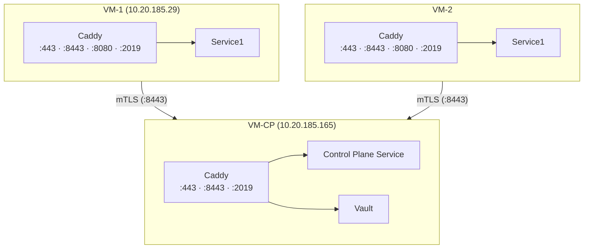
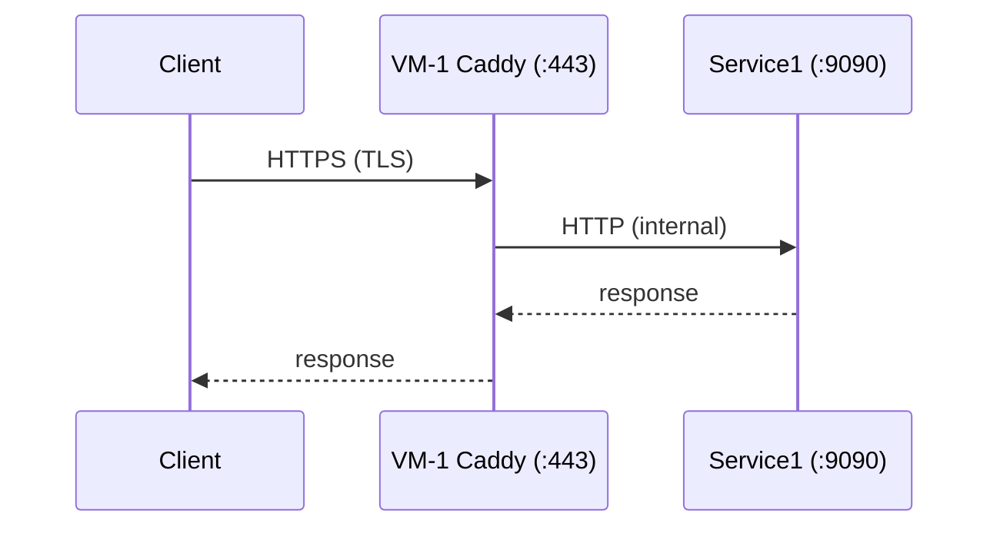
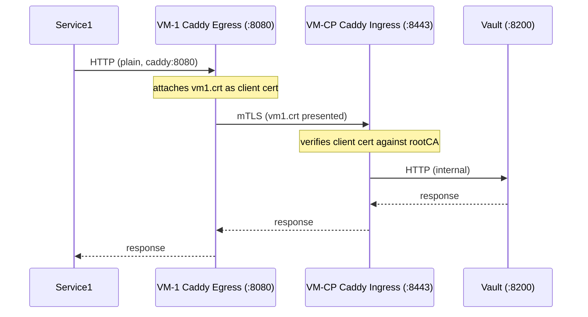
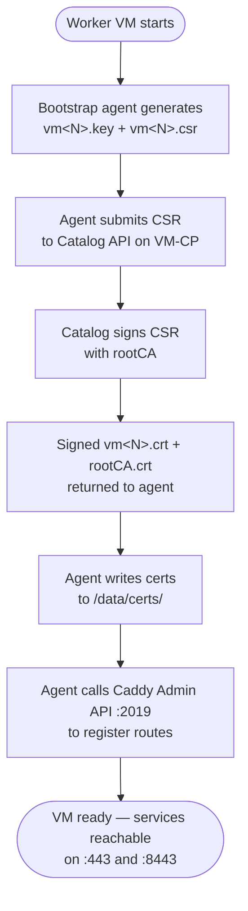

# mTLS VM Networking with Caddy — Design Proposal

**Version:** 1.0  
**Date:** July 2026  
**Status:** Draft / Proposal

---

## Table of Contents

1. [Overview](#1-overview)
2. [Goals](#2-goals)
3. [Architecture](#3-architecture)
   - [3.1 VM Roles](#31-vm-roles)
   - [3.2 Ports and Listeners](#32-ports-and-listeners)
   - [3.3 Traffic Flows](#33-traffic-flows)
4. [Certificate Authority and PKI](#4-certificate-authority-and-pki)
   - [4.1 Root CA](#41-root-ca)
   - [4.2 VM-CP Server Certificate](#42-vm-cp-server-certificate)
   - [4.3 Worker VM Client Certificate](#43-worker-vm-client-certificate)
5. [VM Bootstrap — Certificate Provisioning](#5-vm-bootstrap--certificate-provisioning)
6. [Public TLS — Certificate Modes](#6-public-tls--certificate-modes)
7. [Caddy Configuration](#7-caddy-configuration)
   - [7.1 VM-CP — mTLS Ingress](#71-vm-cp--mtls-ingress)
   - [7.2 Worker VM — Public Ingress (Automatic TLS)](#72-worker-vm--public-ingress-automatic-tls)
   - [7.3 Worker VM — Public Ingress (User-Provided Cert)](#73-worker-vm--public-ingress-user-provided-cert)
   - [7.4 Worker VM — mTLS Ingress](#74-worker-vm--mtls-ingress)
   - [7.5 Worker VM — mTLS Egress](#75-worker-vm--mtls-egress)
8. [Dynamic Route Registration](#8-dynamic-route-registration)
9. [Key Design Decisions](#9-key-design-decisions)
10. [Security Considerations](#10-security-considerations)

---

## 1. Overview

This proposal describes how Caddy is used to secure and route traffic between VMs in the AI-Services platform. There are two distinct concerns:

- **VM-to-VM (private):** Services on one VM call services on another over mutual TLS (mTLS), preventing any unauthenticated or unencrypted cross-VM traffic.
- **Public exposure:** Each VM exposes its services publicly over standard HTTPS (port 443). TLS for the public listener is either automatically managed by Caddy's internal issuer (using `nip.io` wildcard DNS) or supplied by the operator as a user-provided certificate — depending on the deployment environment.

All routing is **dynamic** — Caddy routes are registered at runtime via its Admin API as services are deployed, with no static config files requiring a restart.

---

## 2. Goals

| Goal | Approach |
|---|---|
| Encrypted VM-to-VM communication | mTLS on port 8443 with shared root CA |
| Authenticated callers only | Client certificate required and verified by root CA |
| Public HTTPS per service | Caddy on port 443 — automatic TLS (internal issuer) or user-provided certificate |
| No manual Caddy restarts | Caddy Admin API (`/config/`) for live route updates |
| Cert lifecycle tied to VM onboarding | Bootstrap agent generates key + CSR; catalog signs and delivers cert |

---

## 3. Architecture

### 3.1 VM Roles



### 3.2 Ports and Listeners

| Port | Purpose | TLS Mode |
|------|---------|----------|
| `443` | Public HTTPS — services exposed to clients | TLS (automatic via internal issuer, or user-provided cert) |
| `8443` | Private mTLS ingress — VM-to-VM calls inbound | mTLS (client cert required) |
| `8080` | Private mTLS egress proxy — outbound calls to other VMs | Plain HTTP locally; Caddy adds mTLS upstream |
| `2019` | Caddy Admin API — route registration | Localhost only, not exposed |

### 3.3 Traffic Flows

**Public client → Service on VM-1**



**Service on VM-1 → Service on VM-CP (e.g. Vault)**



---

## 4. Certificate Authority and PKI

The PKI is rooted in a single self-managed CA created on VM-CP during `catalog configure`. All certificates are signed by this CA.

> **Note:** The commands below document how certificates are created. In practice, this is performed automatically as part of the `catalog configure` step — operators do not run these commands manually.

### 4.1 Root CA

Created once on VM-CP and stored securely. The `rootCA.crt` is distributed to every VM so Caddy can verify peer certificates.

```bash
openssl genrsa -out rootCA.key 4096

openssl req -x509 -new -nodes -key rootCA.key -sha256 -days 3650 \
  -out rootCA.crt \
  -subj "/CN=AI-Services CA/O=IBM"
```

### 4.2 VM-CP Server Certificate

VM-CP needs a certificate that is valid for both `serverAuth` and `clientAuth` (it acts as both a server accepting inbound mTLS and a client when calling other VMs). The SAN is bound to VM-CP's `nip.io` domain.

```bash
openssl genrsa -out vmcp.key 2048
openssl req -new -key vmcp.key -out vmcp.csr \
  -subj "/CN=cp.ai-services.internal"

openssl x509 -req -in vmcp.csr -CA rootCA.crt -CAkey rootCA.key \
  -CAcreateserial -out vmcp.crt -days 825 -sha256 \
  -extfile <(cat <<EOF
extendedKeyUsage = serverAuth, clientAuth
subjectAltName = DNS:*.10.20.185.165.nip.io,DNS:10.20.185.165.nip.io
EOF
)
```

### 4.3 Worker VM Client Certificate

Each worker VM (VM-1, VM-2, …) gets a unique certificate. The wildcard SAN allows the same certificate to cover all service subdomains on that VM's IP.

> **Note:** The key generation and CSR submission steps below are performed automatically by the **bootstrap agent** when a new worker VM is onboarded (`bootstrap --agent`). Operators do not run these commands manually.

```bash
# On the worker VM — bootstrap agent generates key and CSR
openssl genrsa -out vm1.key 2048
openssl req -new -key vm1.key -out vm1.csr \
  -subj "/CN=*.10.20.185.29.nip.io" \
  -addext "subjectAltName = DNS:*.10.20.185.29.nip.io,DNS:10.20.185.29.nip.io"

# On VM-CP — Catalog signs the CSR
openssl x509 -req -in vm1.csr -CA rootCA.crt -CAkey rootCA.key \
  -CAcreateserial -out vm1.crt -days 825 -sha256 \
  -extfile <(echo "extendedKeyUsage = clientAuth,serverAuth")
```

The signed `vm1.crt` and `rootCA.crt` are returned to the bootstrap agent and written to `/data/certs/` on the worker VM.

---

## 5. VM Bootstrap — Certificate Provisioning

When a new worker VM is onboarded, the **AI-Services bootstrap agent** handles certificate provisioning automatically as part of its startup sequence:



This ensures every VM in the cluster has a CA-signed identity before any service traffic flows. No manual certificate handling is required.

---

## 6. Public TLS — Certificate Modes

For the public ingress listener (`:443`), two certificate modes are supported:

| Mode | When to use | How it works |
|---|---|---|
| **Automatic (internal issuer)** | Non-production or air-gapped environments using `nip.io` DNS | Caddy generates and self-signs a certificate for the `*.{IP}.nip.io` wildcard. No operator input required. |
| **User-provided certificate** | Production environments with a real domain and a CA-signed cert | Operator supplies a `cert.pem` and `key.pem`. Caddy loads them from disk via `tls.certificates.load_files`. |

The choice is made at `catalog configure` time and stored as part of the VM's Caddy bootstrap configuration. The mTLS listeners (`:8443`) are unaffected by this choice — they always use the internal PKI certificates.

---

## 7. Caddy Configuration

All Caddy configuration is applied via the Admin API (`POST /config/` or `POST /load`). The examples below show the full JSON payload for each VM role.

### 7.1 VM-CP — mTLS Ingress

VM-CP listens on `:8443` and requires a valid client certificate from any caller. Routes to internal services (e.g. Vault) are registered here.

```json
{
  "apps": {
    "tls": {
      "certificates": {
        "load_files": [
          {
            "certificate": "/data/certs/vmcp.crt",
            "key": "/data/certs/vmcp.key"
          }
        ]
      }
    },
    "http": {
      "servers": {
        "private_mtls_ingress": {
          "listen": [":8443"],
          "routes": [
            {
              "match": [{ "host": ["vault.10.20.185.165.nip.io"] }],
              "handle": [
                {
                  "handler": "reverse_proxy",
                  "upstreams": [{ "dial": "vault:8200" }]
                }
              ]
            }
          ],
          "tls_connection_policies": [
            {
              "client_authentication": {
                "mode": "require_and_verify",
                "trusted_ca_certs_pem_files": ["/data/certs/rootCA.crt"]
              }
            }
          ]
        }
      }
    }
  }
}
```

### 7.2 Worker VM — Public Ingress (Automatic TLS)

Each service is exposed publicly on `:443`. Caddy's internal issuer automatically provisions TLS for the `nip.io` wildcard domain — no ACME or manual cert management needed. This is the default mode.

```json
{
  "apps": {
    "tls": {
      "automation": {
        "policies": [
          {
            "subjects": ["*.10.20.185.29.nip.io"],
            "issuers": [{ "module": "internal" }]
          }
        ]
      }
    },
    "http": {
      "servers": {
        "public_ingress": {
          "listen": [":443"],
          "routes": [
            {
              "match": [{ "host": ["service1.10.20.185.29.nip.io"] }],
              "handle": [
                {
                  "handler": "reverse_proxy",
                  "upstreams": [{ "dial": "service1:9090" }]
                }
              ]
            }
          ]
        }
      }
    }
  }
}
```

### 7.3 Worker VM — Public Ingress (User-Provided Cert)

When an operator has a CA-signed certificate for a real domain, they supply `cert.pem` and `key.pem` at `catalog configure` time. Caddy loads them from disk via `tls.certificates.load_files`. The `automation` block is omitted entirely.

```json
{
  "apps": {
    "tls": {
      "certificates": {
        "load_files": [
          {
            "certificate": "/data/certs/cert.pem",
            "key": "/data/certs/key.pem"
          }
        ]
      }
    },
    "http": {
      "servers": {
        "public_ingress": {
          "listen": [":443"],
          "routes": [
            {
              "match": [{ "host": ["service1.example.com"] }],
              "handle": [
                {
                  "handler": "reverse_proxy",
                  "upstreams": [{ "dial": "service1:9090" }]
                }
              ]
            }
          ]
        }
      }
    }
  }
}
```

### 7.4 Worker VM — mTLS Ingress

Inbound mTLS calls from other VMs arrive on `:8443`. The client certificate must be signed by the shared root CA.

```json
{
  "private_mtls_ingress": {
    "listen": [":8443"],
    "routes": [
      {
        "match": [{ "host": ["service1.10.20.185.29.nip.io"] }],
        "handle": [
          {
            "handler": "reverse_proxy",
            "upstreams": [{ "dial": "service1:9090" }]
          }
        ]
      }
    ],
    "tls_connection_policies": [
      {
        "client_authentication": {
          "mode": "require_and_verify",
          "trusted_ca_certs_pem_files": ["/data/certs/rootCA.crt"]
        }
      }
    ]
  }
}
```

### 7.5 Worker VM — mTLS Egress

Outbound calls to other VMs are proxied through Caddy on `:8080`. A local service calls `caddy:8080/<target>` using plain HTTP; Caddy attaches the VM's client certificate and forwards the request over mTLS to the destination VM's `:8443` listener. For example, to reach Vault on the control plane a service calls `caddy:8080/vault`, which Caddy strips and proxies to `vault.10.20.185.165.nip.io:8443`.

```json
{
  "private_mtls_egress": {
    "listen": [":8080"],
    "routes": [
      {
        "match": [{ "path": ["/vault/*"] }],
        "handle": [
          {
            "handler": "rewrite",
            "strip_path_prefix": "/vault"
          },
          {
            "handler": "reverse_proxy",
            "transport": {
              "protocol": "http",
              "tls": {
                "client_certificate_file": "/data/certs/vm1.crt",
                "client_certificate_key_file": "/data/certs/vm1.key",
                "ca": {
                  "provider": "file",
                  "pem_files": ["/data/certs/rootCA.crt"]
                }
              }
            },
            "upstreams": [{ "dial": "vault.10.20.185.165.nip.io:8443" }]
          }
        ]
      }
    ]
  }
}
```

---

## 8. Dynamic Route Registration

Routes are never written to static Caddy config files. They are registered and updated at runtime via the Caddy Admin API on `localhost:2019`. This happens in two situations:

**On VM bootstrap** — the bootstrap agent registers the initial set of routes after certificate provisioning completes.

**On service deployment** — when a new service is deployed to a VM (via the catalog deploy flow), the catalog agent calls the Caddy Admin API on that VM to add the corresponding routes on both the public ingress (`:443`) and mTLS ingress (`:8443`) listeners.

The Admin API endpoint used for route insertion is:

```
POST http://127.0.0.1:2019/config/apps/http/servers/<server-name>/routes
```

Because Caddy applies changes live without reloading, there is zero downtime for existing routes during a registration or update.

---

## 9. Key Design Decisions

| Decision | Rationale |
|---|---|
| Caddy as ingress and egress proxy | Single binary handles TLS termination, client cert attachment, and reverse proxying without a separate sidecar per service |
| Shared root CA, per-VM leaf certs | Simple trust model — one CA to distribute, unique identity per VM |
| Wildcard SAN per VM IP | One certificate covers all service subdomains on a given VM; no cert issuance per service |
| `nip.io` for DNS | No DNS server required; IP-embedded hostnames resolve automatically |
| Egress via caddy:8080 | Services use plain HTTP internally; mTLS complexity is contained in Caddy |
| Admin API on localhost only | Port 2019 is not exposed externally; route management is an internal operation |

---

## 10. Security Considerations

- **Root CA key** is kept on VM-CP only. It is never distributed to worker VMs.
- **Client certificate verification** is set to `require_and_verify` on all mTLS ingress listeners — unauthenticated connections are rejected at the TLS handshake.
- **Certificate rotation** can be triggered by rerunning the bootstrap agent's provisioning step; Caddy reloads the new certificate via the Admin API without downtime.
- **Admin API** (`localhost:2019`) must be bound to loopback only and protected by host firewall rules to prevent unauthorized route manipulation.
- **rootCA.crt** is the only trust anchor that needs distribution. Compromising this file on a worker VM does not expose the CA private key.
