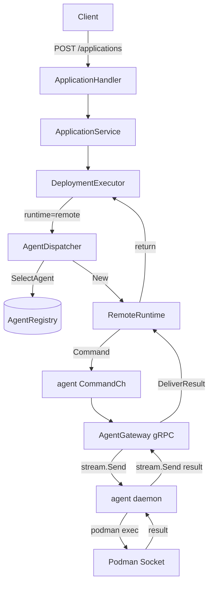
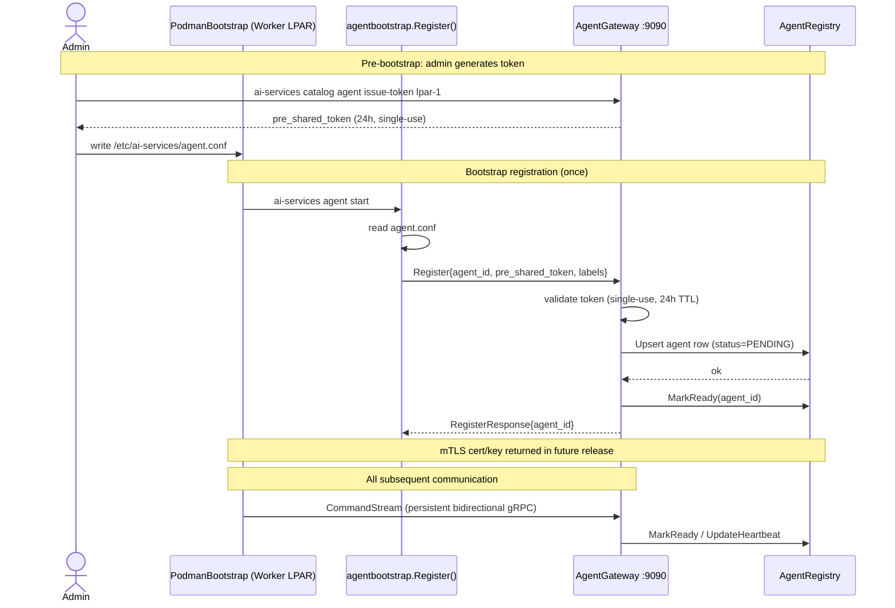
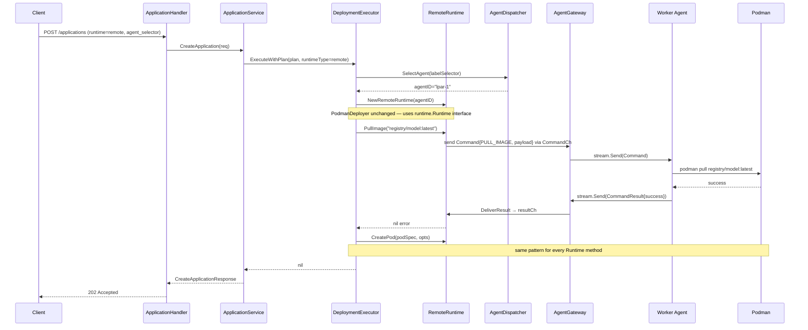
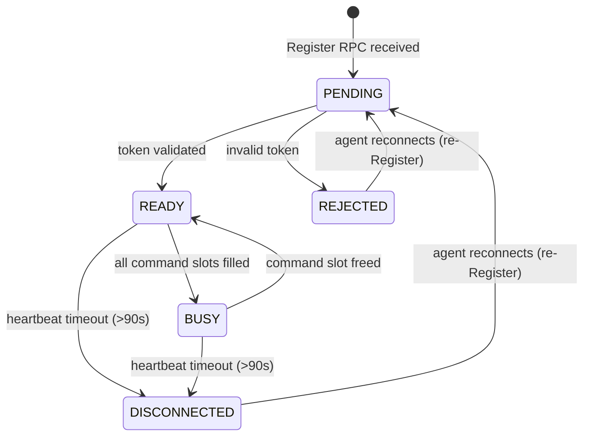

# Remote Worker Agent Proposal

## Table of Contents

1. [Executive Summary](#1-executive-summary)
2. [Background and Motivation](#2-background-and-motivation)
   - 2.1 [Current State](#21-current-state)
   - 2.2 [Problem Statement](#22-problem-statement)
   - 2.3 [Goals](#23-goals)
   - 2.4 [Non-Goals](#24-non-goals)
3. [System Topology](#3-system-topology)
4. [Architecture Overview](#4-architecture-overview)
   - 4.1 [Key Components](#41-key-components)
   - 4.2 [Component Interaction Diagram](#42-component-interaction-diagram)
5. [gRPC Protocol](#5-grpc-protocol)
   - 5.1 [Service Definition](#51-service-definition)
   - 5.2 [Command Types](#52-command-types)
6. [Bootstrap and Registration Flow](#6-bootstrap-and-registration-flow)
7. [Deployment Execution Flow](#7-deployment-execution-flow)
8. [Agent Registry State Machine](#8-agent-registry-state-machine)
9. [Database Schema](#9-database-schema)
10. [New CLI Commands](#10-new-cli-commands)
    - 10.1 [Control Plane Commands](#101-control-plane-commands)
    - 10.2 [Worker Agent Commands](#102-worker-agent-commands)
11. [Configuration Files](#11-configuration-files)
12. [Code Structure](#12-code-structure)
13. [Before vs After Comparison](#13-before-vs-after-comparison)
14. [Security Design](#14-security-design)
15. [Future Work](#15-future-work)

---

## 1. Executive Summary

This proposal describes the design and implementation of a **Remote Worker Agent** system for the AI Services Catalog. It enables the Catalog API Server (running on a Control Plane LPAR) to dispatch Podman runtime commands over a persistent bidirectional gRPC stream to one or more **Worker Agent daemons** running on separate LPARs (e.g. Power10 nodes with Spyre AI accelerators).

The existing `runtime.Runtime` interface and all its callers (`PodmanDeployer`, `SyncService`, `DeletionService`) are **unchanged**. The remote execution path is a new implementation of the same interface, selected at request time by specifying `runtime=remote`.

---

## 2. Background and Motivation

### 2.1 Current State

The AI Services Catalog deploys and manages AI service containers (RAG pipelines, chat, summarization, etc.) by invoking Podman commands **locally** — the Catalog API Server and the Podman socket must reside on the same LPAR.

```
┌───────────────────────────────────────────────────────┐
│  Single LPAR                                          │
│                                                       │
│  Catalog API Server  ──────►  Podman  ──►  Container  │
└───────────────────────────────────────────────────────┘
```

### 2.2 Problem Statement

There is currently no way to use a single AI Services Catalog installation as a control plane that manages deployments across multiple LPARs. Every deployment operation is executed locally — the Catalog API Server can only drive the Podman socket on the same LPAR it is running on.

This means that to deploy AI workloads on a second or third LPAR, an operator must install and maintain a completely independent Catalog instance on each one. There is no shared view of applications, no unified CLI, and no way to target a specific LPAR (for example, one carrying IBM Spyre AI accelerators) from a central management node.

### 2.3 Goals

1. Allow the Control Plane to deploy containers on **remote LPARs** without changing any existing deployer code.
2. Keep the local Podman path (`--runtime podman`) working with **zero regression**.
3. Support **multiple worker LPARs** with per-request agent selection via label selectors.
4. Provide **operational visibility** — list, status, and delete agents from the control plane CLI.
5. Provide a **secure bootstrap** process using single-use HMAC tokens (mTLS follow-up planned).

### 2.4 Non-Goals

- mTLS between control plane and agents (reserved for a follow-up; stubs are present).
- OpenShift-based remote deployment.
- Cross-LPAR container networking / storage management.

---

## 3. System Topology

```
┌───────────────────────────────────────────────────────┐
│                    Control Plane LPAR                 │
│                                                       │
│   ai-services CLI.                                    │
│         │  REST                                       │
│         ▼                                             │
│   Catalog API Server  :8080 (gin)                     │
│         │                                             │
│         ▼                                             │
│   AgentDispatcher                                     │
│         │                                             │
│         ▼                                             │
│   RemoteRuntime  ◄──────────────────────────┐         │
│         │                                   │         │
│         ▼                                   │         │
│   AgentGateway  :9090 (gRPC)                │         │
│         │  bidirectional stream             │         │
│         │                          AgentRegistry      │
│         │                          in-memory + DB     │
└─────────┼──────────────────────────────────┼──────────┘
          │                                  │
  ┌───────┴──────────┐              ┌────────┴─────────┐
  │  Worker LPAR-1   │              │  Worker LPAR-2   │
  │                  │              │                  │
  │  agent daemon    │              │  agent daemon    │
  │  (gRPC client)   │              │  (gRPC client)   │
  │       │          │              │       │          │
  │  Podman Socket   │              │  Podman Socket   │
  │       │          │              │       │          │
  │  Spyre / GPU     │              │  Spyre / GPU     │
  └──────────────────┘              └──────────────────┘
```

---

## 4. Architecture Overview

### 4.1 Key Components

| Component | Location | Responsibility |
|---|---|---|
| **AgentGateway** | Control Plane `:9090` | gRPC server; accepts `Register` and `CommandStream` RPCs from worker daemons |
| **AgentRegistry** | Control Plane | In-memory + PostgreSQL store; tracks agent state, heartbeats, and active command slots |
| **AgentDispatcher** | Control Plane | Selects the best available READY agent for a request, creates a `RemoteRuntime` bound to it |
| **RemoteRuntime** | Control Plane | Implements `runtime.Runtime`; serialises each method call into a `Command` proto, sends it via the agent's `CommandCh`, and awaits the `CommandResult` |
| **agent daemon** | Each Worker LPAR | Persistent process; opens a `CommandStream`, executes incoming `Command` messages against the local Podman socket, returns `CommandResult` messages |
| **agentbootstrap** | Worker LPAR (run once) | Reads `agent.conf`, calls `AgentGateway.Register` with the pre-shared token, receives and persists TLS material (future mTLS) |

### 4.2 Component Interaction Diagram



---

## 5. gRPC Protocol

### 5.1 Service Definition

Located at [`internal/pkg/agent/proto/agent.proto`](../../ai-services/internal/pkg/agent/proto/agent.proto):

```protobuf
service AgentGateway {
  // Called once at bootstrap time by a new worker agent.
  rpc Register(RegisterRequest) returns (RegisterResponse);

  // Long-lived bidirectional stream.
  // Agent sends CommandResult; control plane sends Command.
  rpc CommandStream(stream CommandResult) returns (stream Command);
}
```

The stream direction is **agent-initiated**: the worker daemon dials out to the control plane, which is important for firewall traversal — only outbound connections from the worker are required.

### 5.2 Command Types

Each `Command` proto carries a `CommandType` enum that maps 1-to-1 with every method on the `runtime.Runtime` interface:

| CommandType | Runtime method |
|---|---|
| `PULL_IMAGE` | `PullImage(image)` |
| `LIST_IMAGES` | `ListImages()` |
| `LIST_PODS` | `ListPods(filters)` |
| `CREATE_POD` | `CreatePod(spec, opts)` |
| `DELETE_POD` | `DeletePod(id, force)` |
| `START_POD` / `STOP_POD` | `StartPod` / `StopPod` |
| `INSPECT_POD` | `InspectPod(nameOrID)` |
| `POD_EXISTS` | `PodExists(nameOrID)` |
| `POD_LOGS` | `PodLogs(nameOrID)` |
| `GET_POD_RESOURCES` | `GetPodResources(nameOrID)` |
| `LIST_SECRETS` | `ListSecrets(filters)` |
| `DELETE_SECRET` | `DeleteSecret(name)` |
| `SECRET_EXISTS` | `SecretExists(nameOrID)` |
| `DELETE_VOLUME` | `DeleteVolume(name)` |
| `VOLUME_EXISTS` | `VolumeExists(nameOrID)` |
| `INSPECT_CONTAINER` | `InspectContainer(nameOrID)` |
| `CONTAINER_EXISTS` | `ContainerExists(nameOrID)` |
| `CONTAINER_LOGS` | `ContainerLogs(nameOrID)` |
| `LIST_ROUTES` | `ListRoutes()` |
| `DELETE_PVCS` | `DeletePVCs(appLabel)` |
| `GET_SYSTEM_INFO` | `GetSystemInfo()` |
| `RUNTIME_TYPE` | `RuntimeType()` |

---

## 6. Bootstrap and Registration Flow

This flow runs **once per Worker LPAR** before the agent daemon can receive commands.



**Key points:**

- The `pre_shared_token` is **single-use and 24-hour TTL**. Consumed on first `Register` call.
- `Register` is called **once** by `agentbootstrap.Register()` in `agent start`. The daemon's reconnect loop reconnects the `CommandStream` without re-registering.
- If the agent process is restarted, it must have a freshly issued token (or mTLS cert in future).

---

## 7. Deployment Execution Flow



---

## 8. Agent Registry State Machine



**Heartbeat watcher:** A background goroutine (`StartHeartbeatWatcher`) sweeps all `READY`/`BUSY` agents every 30 seconds and transitions any whose `last_heartbeat` is older than 90 seconds to `DISCONNECTED`.

**Agent selection:** `SelectAgent` only returns agents in `READY` status with a non-stale heartbeat matching the requested label selector.

---

## 9. Database Schema

A new `agents` table persists agent state across catalog restarts:

```sql
-- Migration: 20260707000001_create_agents_table.sql
CREATE TABLE agents (
    id              UUID        PRIMARY KEY DEFAULT gen_random_uuid(),
    agent_id        TEXT        NOT NULL UNIQUE,
    labels          JSONB       NOT NULL DEFAULT '{}',
    capabilities    JSONB       NOT NULL DEFAULT '{}',
    status          TEXT        NOT NULL DEFAULT 'pending',
                    -- pending | ready | busy | draining | disconnected | rejected
    last_heartbeat  TIMESTAMPTZ,
    registered_at   TIMESTAMPTZ NOT NULL DEFAULT now(),
    updated_at      TIMESTAMPTZ NOT NULL DEFAULT now()
);

CREATE INDEX idx_agents_status ON agents (status);
```

The in-memory registry is the **source of truth** for live routing decisions. The database provides durability for `ai-services catalog agent list` after a catalog restart.

---

## 10. New CLI Commands

### 10.1 Control Plane Commands

```
# Deploy the catalog with AgentGateway enabled on port 9090
ai-services catalog configure --runtime podman --agentgateway-port 9090

# Issue a bootstrap token for a new Worker LPAR (fills agent_id + pre_shared_token)
ai-services catalog agent issue-token lpar-1

# List all registered agents and their status
ai-services catalog agent list

# Show a specific agent's live status
ai-services catalog agent list   # (includes all agents)

# Remove an agent from the registry
ai-services catalog agent delete lpar-1

# Start the API server with AgentGateway
ai-services catalog apiserver --agentgateway-port 9090
```

**`issue-token` output** (paste directly into Worker LPAR):

```
# Copy the block below to /etc/ai-services/agent.conf on the Worker LPAR.
# Token expires in 24 h and is single-use.
# Then run:  ai-services agent start
#
# ---- BEGIN agent.conf ----
control_plane_url: <control-plane-host>:<agentgateway-port>
agent_id: "lpar-1"
pre_shared_token: "d3f1a2b4-..."
labels: {}
capabilities: {}
# ---- END agent.conf ----
```

### 10.2 Worker Agent Commands

```
# Register with the control plane and start the daemon (blocking)
ai-services agent start

# Show local conf + live connectivity status from control plane
ai-services agent status
```

**`agent status` output**:

```
Local Configuration
-------------------
Agent ID:       lpar-1
Control Plane:  control-plane:9090
Config file:    /etc/ai-services/agent.conf
Token set:      true

Live Status (from Control Plane)
--------------------------------
Status:         ready
Active slots:   0
Last heartbeat: 2026-07-14T10:23:01Z
Checked at:     2026-07-14T10:23:05Z
```

---

## 11. Configuration Files

### `/etc/ai-services/agent.conf` (Worker LPAR)

```yaml
control_plane_url: "control-plane.example.com:9090"   # gRPC AgentGateway address
agent_id: "lpar-1"                                     # unique identifier for this worker
pre_shared_token: "d3f1a2b4-..."                       # single-use bootstrap token
labels:
  zone: "gpu"
  model: "granite"
capabilities: {}
```

The `pre_shared_token` field is only used on the first `agent start`. After registration it is no longer checked by the control plane. In a future mTLS release the agent will use its signed certificate for all subsequent connections.

---

## 12. Code Structure

All new code is additive. No existing packages were deleted or renamed.

```
ai-services/
├── internal/pkg/agent/                         NEW PACKAGE
│   ├── proto/
│   │   ├── agent.proto                         gRPC service + message definitions
│   │   ├── agent.pb.go                         generated
│   │   └── agent_grpc.pb.go                    generated
│   ├── registry/
│   │   └── registry.go                         AgentRegistry + TokenStore
│   ├── gateway/
│   │   └── gateway.go                          AgentGateway gRPC server
│   ├── dispatcher/
│   │   └── dispatcher.go                       AgentDispatcher (SelectAgent)
│   ├── agentbootstrap/
│   │   └── agentbootstrap.go                   worker-side Register + conf loader
│   └── daemon/
│       └── daemon.go                           worker daemon (CommandStream loop)
│
├── internal/pkg/runtime/
│   ├── runtime.go                              MODIFIED: RuntimeTypeRemote added to switch
│   ├── types/types.go                          MODIFIED: RuntimeTypeRemote constant
│   └── remote/
│       └── remote.go                           NEW: RemoteRuntime implementing runtime.Runtime
│
├── internal/pkg/catalog/
│   ├── apiserver/
│   │   ├── apiserver.go                        MODIFIED: wires Gateway + HeartbeatWatcher
│   │   ├── router.go                           MODIFIED: /agents routes
│   │   ├── handlers/
│   │   │   └── agent_handler.go                NEW: IssueToken, ListAgents, GetAgent, DeleteAgent
│   │   └── services/deployment/
│   │       └── executor.go                     MODIFIED: executeRemoteDeployment case
│   ├── cli/configure/podman/
│   │   └── reset_agentgateway_port.go          NEW: hot-swap gateway port without full reinstall
│   ├── client/
│   │   └── client.go                           MODIFIED: IssueAgentToken, ListAgents, DeleteAgent, GetAgent
│   ├── db/migrations/assets/
│   │   └── 20260707000001_create_agents_table.sql  NEW
│   └── utils/common.go                         MODIFIED: AgentGatewayPort in PodmanConfigureOptions
│
├── assets/catalog/podman/
│   ├── values.yaml                             MODIFIED: backend.agentGatewayPort
│   └── templates/catalog.yaml.tmpl            MODIFIED: hostPort for AgentGateway container
│
└── cmd/ai-services/cmd/
    ├── root.go                                 MODIFIED: registers `agent` subcommand
    ├── catalog/
    │   ├── configure.go                        MODIFIED: --agentgateway-port flag
    │   ├── apiserver.go                        MODIFIED: --agentgateway-port flag
    │   └── agent/
    │       ├── agent.go                        NEW: `catalog agent` subcommand group
    │       ├── issue_token.go                  NEW: issue-token
    │       ├── list.go                         NEW: list
    │       └── delete.go                       NEW: delete
    └── agent/
        ├── agent.go                            NEW: `agent` subcommand group
        ├── start.go                            NEW: agent start
        └── status.go                           NEW: agent status
```

---

## 13. Before vs After Comparison

### Deployment path

| Aspect | Before | After |
|---|---|---|
| Podman target | Same LPAR as catalog | Any registered Worker LPAR |
| Runtime selection | `--runtime podman` only | `--runtime podman` (local) or `--runtime remote` (agent) |
| `runtime.Runtime` interface | Unchanged | Unchanged |
| Deployer code | Unchanged | Unchanged |
| Agent selection | N/A | Label selector on request; round-robin READY agents |

### Operational

| Aspect | Before | After |
|---|---|---|
| Worker visibility | N/A | `ai-services catalog agent list` |
| Worker health | N/A | Heartbeat every 30 s; auto-DISCONNECTED after 90 s |
| Worker registration | N/A | `ai-services agent start` (token-based) |
| Worker removal | N/A | `ai-services catalog agent delete <id>` |

### Protocol

```
Before:
  Catalog API ──► Podman socket (Unix socket, same host)

After (remote path):
  Catalog API ──► AgentGateway :9090 (gRPC, TCP) ──► agent daemon ──► Podman socket
                                 bidirectional stream
```

---

## 14. Security Design

| Concern | Current implementation | Planned (future) |
|---|---|---|
| Bootstrap token | Single-use UUID, 24h TTL, in-memory store | Persist to DB for restart safety |
| Transport | Plaintext gRPC (`insecure.NewCredentials()`) | mTLS — CA on control plane signs agent cert during `RegisterResponse` |
| Command authorisation | Agent trusts any command arriving on the stream | Agent verifies peer cert CN matches control-plane hostname |
| Secret payloads | Podman secrets passed inside gRPC payload | Encrypted in transit once mTLS is enabled |
| Token rotation | Re-run `agent start` with a new token | Admin revokes cert; agent re-registers |

The mTLS stubs are already present in the proto (`tls_cert_pem`, `tls_key_pem` fields in `RegisterResponse`) and in `agentbootstrap.writeTLSMaterial()`. The gateway currently returns empty strings for those fields.

---

## 15. Future Work

| Item | Notes |
|---|---|
| **mTLS** | Control-plane CA signs a per-agent cert during `Register`; agent uses it for all subsequent `CommandStream` connections |
| **Token DB persistence** | In-memory `TokenStore` is lost on catalog restart; persist issued tokens to PostgreSQL |
| **Agent drain** | Admin-triggered graceful drain: accept no new commands, wait for in-flight to complete, then `DISCONNECTED` |
| **Weighted selection** | Prefer agents with fewer active slots or specific capability labels |
| **OpenShift remote** | Route + passthrough TLS instead of `hostPort` for OCP deployments |
| **Metrics** | Prometheus counters for commands dispatched, errors, latency per agent |
