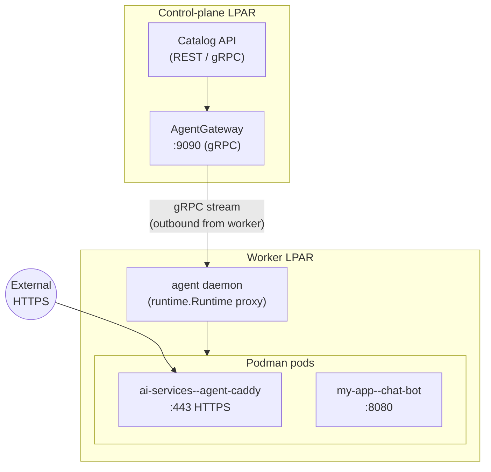
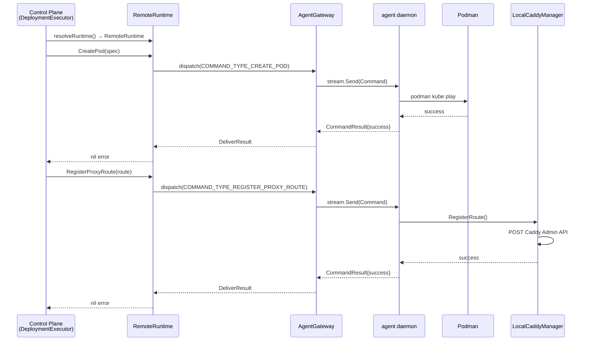
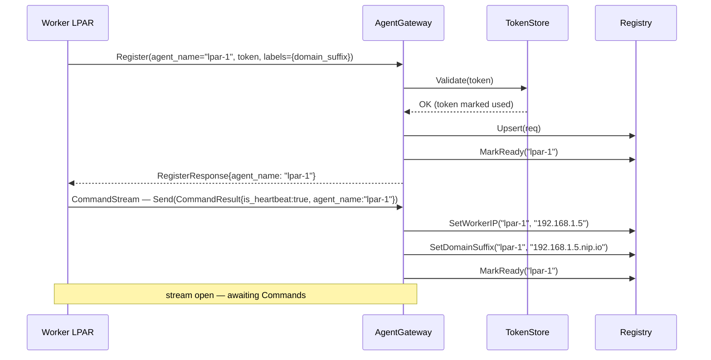
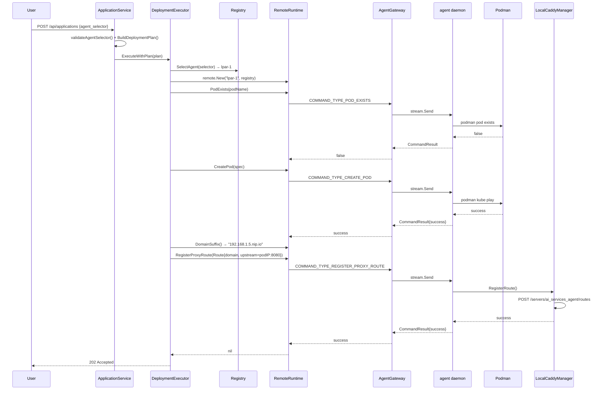
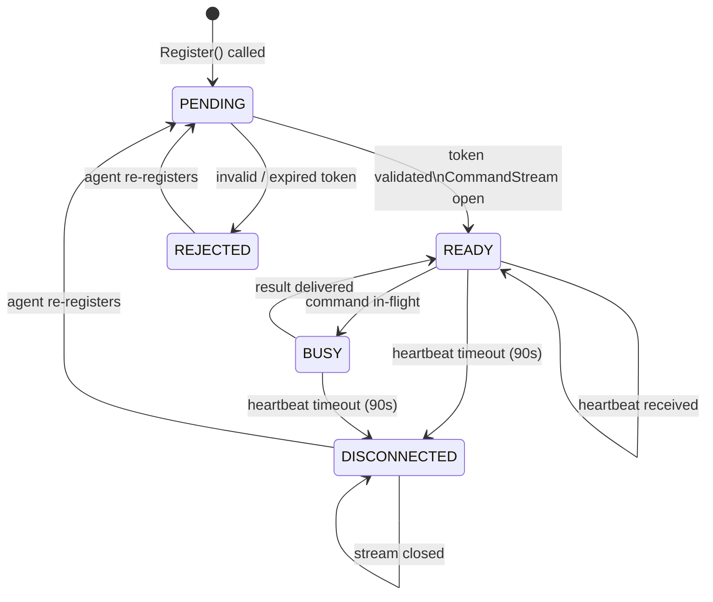

# Remote Worker Agent Proposal

## Table of Contents

1. [Executive Summary](#1-executive-summary)
2. [Background and Motivation](#2-background-and-motivation)
3. [System Topology](#3-system-topology)
4. [Architecture Overview](#4-architecture-overview)
5. [gRPC Protocol](#5-grpc-protocol)
6. [Bootstrap and Registration Flow](#6-bootstrap-and-registration-flow)
7. [Worker Caddy Proxy](#7-worker-caddy-proxy)
8. [Agent HTTP Proxy](#8-agent-http-proxy)
9. [Deployment Execution Flow](#9-deployment-execution-flow)
10. [Agent Registry and State Machine](#10-agent-registry-and-state-machine)
11. [Database Schema](#11-database-schema)
12. [CLI Commands](#12-cli-commands)
13. [Configuration Files and Assets](#13-configuration-files-and-assets)
14. [Code Structure](#14-code-structure)
15. [Security Design](#15-security-design)
16. [Current vs Proposed Comparison](#16-current-vs-proposed-comparison)
17. [Future Work](#17-future-work)

---

## 1. Executive Summary

This proposal describes the design of a **Remote Worker Agent** system for the AI Services platform. It would enable the Catalog API Server (running on a control-plane LPAR) to dispatch Podman runtime commands over a persistent bidirectional gRPC stream to one or more **Worker Agent daemons** running on separate IBM Power LPARs.

Two additional networking features are proposed alongside the core agent:

| Feature | What it would do |
|---|---|
| **Worker Caddy Proxy** | Each Worker LPAR would run its own Caddy instance. Routes would be registered dynamically after each pod deployment so external HTTPS traffic reaches deployed service endpoints directly on that worker. |
| **Agent HTTP Proxy** | The control plane would be able to tunnel HTTP requests to worker pod endpoints through the existing gRPC stream, with no new port required. |

---

## 2. Background and Motivation

### 2.1 Current State

The AI Services platform deploys AI application pods on the same LPAR that runs the control-plane Catalog service. The deployment engine calls the Podman API locally. This limits all compute to a single LPAR.

### 2.2 Problem Statement

There is currently no way to use a single AI Services Catalog installation as a control plane that manages deployments across multiple LPARs. Every deployment operation is executed locally — the Catalog API Server can only drive the Podman socket on the same LPAR it is running on.

This means that to deploy AI workloads on a second or third LPAR, an operator must install and maintain a completely independent Catalog instance on each one. There is no shared view of applications, no unified CLI, and no way to target a specific LPAR (for example, one carrying IBM Spyre AI accelerators) from a central management node.

### 2.3 Goals

- Allow AI application pods to be deployed on remote Worker LPARs from a single control plane.
- Route external HTTPS traffic to deployed services via a per-worker Caddy proxy.
- Allow the control plane to perform health checks and internal HTTP calls against remote pod endpoints over the gRPC stream, with no new exposed port.
- Minimal operational overhead: a single daemon binary, one `configure` + `start` workflow per Worker.
- All communication over a single outbound TCP connection from Worker → control plane (firewall-friendly).

### 2.4 Non-Goals

- OpenShift runtime support for worker Caddy (Podman only in this proposal).
- Streaming/chunked HTTP proxy responses (single request/response only).
- mTLS between agent and gateway (reserved fields would be present; treated as future work).

---

## 3. System Topology


```mermaid
graph TB
    subgraph CP["Control-plane LPAR"]
        API["Catalog API\n(REST / gRPC)"]
        GW["AgentGateway\n:9090 (gRPC)"]
        API --> GW
    end

    subgraph WK["Worker LPAR"]
        DAEMON["agent daemon\n(runtime.Runtime proxy)"]
        subgraph PODS["Podman pods"]
            CADDY["ai-services--agent-caddy\n:443 HTTPS"]
            APP["my-app--chat-bot\n:8080"]
        end
        DAEMON --> PODS
    end

    GW -- "gRPC stream\n(outbound from worker)" --> DAEMON
    EXTERNAL(("External\nHTTPS")) --> CADDY
```

---

## 4. Architecture Overview

### 4.1 Key Components

| Component | Location | Role |
|---|---|---|
| **AgentGateway** | Control plane | gRPC server that would accept agent connections on `:9090` |
| **Registry** | Control plane | In-memory + PostgreSQL state store for all registered agents |
| **RemoteRuntime** | Control plane | A `runtime.Runtime` implementation that would send commands over gRPC |
| **DeploymentExecutor** | Control plane | Would select a `RemoteRuntime` when deploying to a Worker |
| **AgentHTTPClient** | Control plane | Would tunnel HTTP requests through `RemoteRuntime.HTTPProxy` |
| **Agent Daemon** | Worker LPAR | Would receive gRPC commands, execute them on local Podman, and return results |
| **Worker Caddy** | Worker LPAR | Pod `ai-services--agent-caddy` — reverse proxy for deployed services |
| **LocalCaddyManager** | Worker LPAR | Interface to be injected into `PodmanClient` for route management |

### 4.2 Component Interaction (deployment)


```mermaid
sequenceDiagram
    participant CP as Control Plane<br/>(DeploymentExecutor)
    participant RR as RemoteRuntime
    participant GW as AgentGateway
    participant DA as agent daemon
    participant PM as Podman
    participant CM as LocalCaddyManager

    CP->>RR: resolveRuntime() → RemoteRuntime
    CP->>RR: CreatePod(spec)
    RR->>GW: dispatch(COMMAND_TYPE_CREATE_POD)
    GW->>DA: stream.Send(Command)
    DA->>PM: podman kube play
    PM-->>DA: success
    DA-->>GW: CommandResult{success}
    GW-->>RR: DeliverResult
    RR-->>CP: nil error

    CP->>RR: RegisterProxyRoute(route)
    RR->>GW: dispatch(COMMAND_TYPE_REGISTER_PROXY_ROUTE)
    GW->>DA: stream.Send(Command)
    DA->>CM: RegisterRoute()
    CM->>CM: POST Caddy Admin API
    CM-->>DA: success
    DA-->>GW: CommandResult{success}
    GW-->>RR: DeliverResult
    RR-->>CP: nil error
```

---

## 5. gRPC Protocol

### 5.1 Service Definition

The proposed `AgentGateway` gRPC service would be defined as follows:

```protobuf
service AgentGateway {
  // One-time call at bootstrap time.
  rpc Register(RegisterRequest) returns (RegisterResponse);

  // Long-lived bidirectional stream.
  // Agent initiates; sends CommandResult, receives Command.
  rpc CommandStream(stream CommandResult) returns (stream Command);
}

message RegisterRequest {
  string agent_name       = 1;
  string pre_shared_token = 2;
  map<string, string> labels       = 3;  // would include "domain_suffix"
  map<string, string> capabilities = 4;
}

message Command {
  string      command_id = 1;
  CommandType type       = 2;
  bytes       payload    = 3; // JSON-encoded
}

message CommandResult {
  string command_id   = 1;
  bool   success      = 2;
  bytes  data         = 3; // JSON-encoded response
  string error        = 4;
  bool   is_heartbeat = 5;
  string agent_name   = 6;
}
```

### 5.2 Command Types

The `CommandType` enum would cover all 29 operations needed to proxy the full `runtime.Runtime` interface:

| Value | Name | Payload | Description |
|---|---|---|---|
| 0 | `UNSPECIFIED` | — | Default / error |
| 1 | `LIST_IMAGES` | `{}` | List local images |
| 2 | `PULL_IMAGE` | `{Image}` | Pull an image |
| 3 | `LIST_PODS` | `{Filters}` | List pods with optional filters |
| 4 | `CREATE_POD` | `{Body, Opts}` | `podman kube play` |
| 5 | `DELETE_POD` | `{ID, Force}` | Remove a pod |
| 6 | `STOP_POD` | `{ID}` | Stop a pod |
| 7 | `START_POD` | `{ID}` | Start a pod |
| 8 | `INSPECT_POD` | `{NameOrID}` | Inspect pod details + port bindings |
| 9 | `POD_EXISTS` | `{NameOrID}` | Boolean existence check |
| 10 | `POD_LOGS` | `{NameOrID}` | Stream pod logs |
| 11 | `GET_POD_RESOURCES` | `{NameOrID}` | CPU / memory / accelerator usage |
| 12 | `LIST_SECRETS` | `{Filters}` | List secrets |
| 13 | `DELETE_SECRET` | `{Name}` | Remove a secret |
| 14 | `SECRET_EXISTS` | `{NameOrID}` | Boolean existence check |
| 15 | `DELETE_VOLUME` | `{Name}` | Remove a volume |
| 16 | `VOLUME_EXISTS` | `{NameOrID}` | Boolean existence check |
| 17 | `INSPECT_CONTAINER` | `{NameOrID}` | Inspect container details |
| 18 | `CONTAINER_EXISTS` | `{NameOrID}` | Boolean existence check |
| 19 | `CONTAINER_LOGS` | `{ContainerNameOrID}` | Stream container logs |
| 20 | `LIST_ROUTES` | `{}` | List OpenShift routes (stub on Podman) |
| 21 | `DELETE_PVCS` | `{AppLabel}` | Delete PVCs (OpenShift only) |
| 22 | `GET_SYSTEM_INFO` | `{}` | CPU / memory / Spyre card info |
| 23 | `RUNTIME_TYPE` | `{}` | Returns `"podman"` or `"openshift"` |
| 24 | `RUN_EPHEMERAL_CONTAINER` | `{Image, Cmd, Mounts}` | One-shot container |
| 25 | `REGISTER_PROXY_ROUTE` | `{ID, Domain, Upstream, Terminal, Type}` | Add route to worker Caddy |
| 26 | `UNREGISTER_PROXY_ROUTE` | `{RouteID}` | Remove route from worker Caddy |
| 27 | `GET_PROXY_ROUTE` | `{RouteID}` | Fetch route from worker Caddy |
| 28 | `PROXY_HEALTH_CHECK` | `{}` | Verify worker Caddy is reachable |
| 29 | `HTTP_PROXY` | `{Method, TargetURL, Headers, Body}` | Tunnel HTTP request to worker pod |

### 5.3 Protocol Flow

**Heartbeat mechanism:**
- The agent would send a heartbeat `CommandResult{is_heartbeat: true}` immediately on stream open as the first message (used by the gateway to identify the agent).
- A background goroutine on the agent would send heartbeats every **30 seconds**.
- The gateway would mark an agent `DISCONNECTED` if no heartbeat is received for **90 seconds** (checked every 30 seconds).

**Command flow:**
1. Control plane calls `RemoteRuntime.SomeMethod()`.
2. `dispatch()` would generate a UUID command ID, marshal the payload to JSON, register a result channel, and push a `Command` to the agent's `CommandCh`.
3. The gateway goroutine would read from `CommandCh` and write to the gRPC stream.
4. The agent daemon would call `executeCommand()` → `dispatchToRuntime()`, execute locally, and send back a `CommandResult`.
5. The gateway's receive goroutine would read the result and call `registry.DeliverResult()`.
6. `dispatch()` would receive on the result channel and return.
7. The default command timeout would be **5 minutes**, respecting `ctx.Deadline()` if shorter.

---

## 6. Bootstrap and Registration Flow

### 6.1 Control-plane setup

```bash
# Start the AgentGateway on the control plane
ai-services catalog configure --runtime podman --agentgateway-port 9090

# Issue a single-use bootstrap token (24-hour expiry)
ai-services catalog agent issue-token
# Output: <uuid-token>
```

Tokens would be stored in-memory in a `TokenStore`. Each token would be single-use: once consumed by `Register()` it would be marked used and rejected on any subsequent call.

### 6.2 Worker setup

```bash
# Step 1 — bootstrap the Worker LPAR (installs Podman, SELinux policies, etc.)
ai-services bootstrap configure --runtime podman

# Step 2 — deploy the worker Caddy proxy pod (run once)
ai-services agent configure --runtime podman [--https-port 443] [--domain-name example.com] \
    [--ssl-cert /path/cert.pem --ssl-key /path/key.pem]

# Step 3 — register with the control plane and start the daemon
ai-services agent start \
    --server lpar-0.example.com:9090 \
    --name lpar-1 \
    --token <uuid-token> \
    --runtime podman
```

### 6.3 Registration sequence


```mermaid
sequenceDiagram
    participant W as Worker LPAR
    participant GW as AgentGateway
    participant TS as TokenStore
    participant REG as Registry

    W->>GW: Register(agent_name="lpar-1", token, labels={domain_suffix})
    GW->>TS: Validate(token)
    TS-->>GW: OK (token marked used)
    GW->>REG: Upsert(req)
    GW->>REG: MarkReady("lpar-1")
    GW-->>W: RegisterResponse{agent_name: "lpar-1"}

    W->>GW: CommandStream — Send(CommandResult{is_heartbeat:true, agent_name:"lpar-1"})
    GW->>REG: SetWorkerIP("lpar-1", "192.168.1.5")
    GW->>REG: SetDomainSuffix("lpar-1", "192.168.1.5.nip.io")
    GW->>REG: MarkReady("lpar-1")
    Note over W,GW: stream open — awaiting Commands
```

**Worker IP capture:** The gateway would read the TCP source IP from the gRPC peer info on the stream context. This would be the address of the Worker LPAR as seen from the control plane.

**Domain suffix propagation:** `agent configure` would compute the domain suffix (cert CN > `--domain-name` > `workerIP.nip.io`) and persist it to `~/.config/ai-services/agent.json`. `agent start` would load this and send it as `labels["domain_suffix"]` in `RegisterRequest`. The gateway would extract it and store it in `AgentEntry.DomainSuffix`.

---

## 7. Worker Caddy Proxy

Each Worker LPAR would run its own Caddy instance for externally-visible HTTPS routing to deployed service pods. Routes would be registered dynamically by the agent daemon after each successful pod deployment.

### 7.1 Design principles

- **Same pattern as catalog Caddy.** The catalog configure command deploys a Caddy pod; the proposed `agent configure` command would do the same for the worker.
- **Admin port always random.** Setting `adminPort: "0"` in `values.yaml` would cause the OS to assign a random loopback port, resolved at runtime by inspecting the running pod.
- **No `--resume`.** Worker Caddy would not use `caddy run --resume` to avoid stale autosave state from a previous server name.
- **Server name `ai_services_agent`.** The Caddyfile global block would name the `:443` server `ai_services_agent`, so routes would be POSTed to `.../servers/ai_services_agent/routes`.
- **Admin port only on loopback.** The pod port binding would be `127.0.0.1:<random>:2019` — unreachable from outside the LPAR.

### 7.2 Worker Caddy pod

The proposed pod name would be `ai-services--agent-caddy`.

The pod template would render a port binding annotation such as:

```yaml
ai-services.io/ports: "127.0.0.1:{{ .Values.caddy.adminPort }}:2019, {{ .Values.caddy.httpsPort }}:443"
```

The proposed `values.yaml` defaults:

```yaml
caddy:
  image: icr.io/ai-services-cicd/caddy:v2.11.4-0
  adminPort: "0"   # OS-assigned random loopback port
  httpsPort: 443   # Default; overridden via --https-port
```

The proposed Caddyfile:

```
{
    admin 0.0.0.0:2019
    servers :443 {
        name ai_services_agent
    }
}

:443 {
    handle /internal/health {
        respond "OK" 200
    }
    tls internal
}

:8080 {
    respond /health "OK" 200
}
```

### 7.3 `agent configure` command

```
ai-services agent configure \
    --runtime podman          # required; only podman supported
    [--https-port 443]        # override caddy.httpsPort from values.yaml
    [--domain-name example.com]
    [--ssl-cert /path/cert.pem --ssl-key /path/key.pem]
    [--base-dir /var/lib/ai-services]
```

**Proposed steps for `DeployAgentCaddy()`:**

1. Read `values.yaml` (image, adminPort, httpsPort). Apply `--https-port` CLI override if provided.
2. Render the Caddyfile template and write to `<baseDir>/agent/caddy/Caddyfile`.
3. Force-remove any existing `ai-services--agent-caddy` pod (to handle stale or failed pods).
4. Render the pod template and deploy via readiness-checked pod deployment.
5. Resolve the admin URL: inspect the running pod → find the `2019/tcp` host port → `http://localhost:<port>`.
6. Health-check the Caddy admin API.
7. Compute the domain suffix (cert CN > `--domain-name` > `workerIP.nip.io`).
8. Persist `DomainSuffix` to `~/.config/ai-services/agent.json`.

**This command would be idempotent.** Re-running would always remove and redeploy the Caddy pod to ensure correct port bindings.

### 7.4 Admin URL resolution

```
GetCaddyAdminPort(rt, "ai-services--agent-caddy")
  └─ rt.InspectPod("ai-services--agent-caddy")
       └─ pod.Ports["2019/tcp"][0]  →  e.g. "37249"
  └─ returns "37249"

BuildAdminURL(rt)
  └─ "http://localhost:37249"
```

A single shared `GetCaddyAdminPort` utility would be used by both the catalog Caddy and the worker Caddy, with the catalog's local helper delegating to it.

### 7.5 Caddy manager injection at daemon start

When `agent start` runs, it would call an `injectCaddyManager` function:

```go
adminURL, err := BuildAdminURL(pc)  // pod inspect → random port
pm := NewCaddyManager(adminURL, AgentCaddyServerName)
caddyMgr := NewLocalCaddyManagerAdapter(pm)
pc.SetCaddyManager(caddyMgr)
```

If the Caddy pod is not running, a warning would be logged and the daemon would start normally — all other runtime operations would continue; only route registration would be unavailable until `agent configure` is run.

### 7.6 Route registration via gRPC

When the control plane deploys a service to a Worker, the deployer would call:

```go
rt.RegisterProxyRoute(ctx, types.ProxyRoute{
    ID:       "my-app-chat-bot",
    Domain:   "my-app-chat-bot.192.168.1.5.nip.io",
    Upstream: "10.88.0.5:8080",   // pod IP — see §7.7
    Terminal: true,
    Type:     "api",
})
```

This would dispatch `COMMAND_TYPE_REGISTER_PROXY_ROUTE` over gRPC. The daemon would call `RegisterProxyRoute()` on the local `PodmanClient`, which would call `caddyMgr.RegisterRoute()`, hitting the Caddy Admin API:

```
POST http://localhost:<port>/config/apps/http/servers/ai_services_agent/routes
```

**Domain suffix for worker routes** would come from `RemoteRuntime.DomainSuffix()` — read from the agent's registry entry, populated from `labels["domain_suffix"]` at stream open. The worker's domain suffix would be independent of the control-plane's `DOMAIN_SUFFIX` env var.

### 7.7 Upstream uses pod IP, not pod name

Caddy would run as a Podman pod. Pod name DNS (Podman's internal resolver) is only available inside Podman network namespaces, not from within the Caddy container when reaching other pods on the same host. Therefore:

- Route upstreams would use the **pod IP address** (e.g. `10.88.0.5:8080`), not the pod name.
- The deployer would resolve the pod IP by inspecting the pod's infra container: `InspectPod` → `InfraContainerID` → `InspectContainer` → `NetworkSettings.IPAddress`.

### 7.8 Proposed constants

| Constant | Proposed value | Package |
|---|---|---|
| `AgentCaddyServerName` | `"ai_services_agent"` | `constants` |
| `CaddyServerName` (existing) | `"ai_services"` | `constants` |
| `AgentCaddyPodName` | `"ai-services--agent-caddy"` | `agent/configure` |

---

## 8. Agent HTTP Proxy

The control plane cannot directly reach pod endpoints on the Worker LPAR (no direct network route; no extra port). The proposed `COMMAND_TYPE_HTTP_PROXY` (value 29) would tunnel a complete HTTP request/response through the existing gRPC stream.

### 8.1 Control-plane side

An `AgentHTTPClient` helper would provide a clean API for callers:

```go
client := httpclient.New(remoteRuntime)

// GET
resp, err := client.Get(ctx, "http://my-app--chat-bot:8080/health")

// POST
resp, err := client.Post(ctx, "http://my-app--chat-bot:8080/api/infer", jsonBody)

// Arbitrary method
resp, err := client.Do(ctx, "GET", url, headers, body)
```

`Do()` would call `rt.HTTPProxy(ctx, method, targetURL, headers, body)`.

`RemoteRuntime.HTTPProxy()` would dispatch `COMMAND_TYPE_HTTP_PROXY` over gRPC with payload:

```json
{
  "method":     "GET",
  "target_url": "http://my-app--chat-bot:8080/health",
  "headers":    {},
  "body":       null
}
```

The response would be an `HTTPProxyResponse{StatusCode, Headers, Body}`, returned as a single JSON blob in `CommandResult.Data`.

### 8.2 Worker daemon side

The daemon would dispatch to `rt.HTTPProxy(ctx, method, targetURL, headers, body)`. On the Worker, `PodmanClient.HTTPProxy` would run the actual HTTP call:

```go
// 1. Resolve pod name → IP  (pod name DNS not available on host OS)
resolvedURL, err := pc.resolvePodNameInURL(targetURL)

// 2. Execute the HTTP request
req, _ := http.NewRequestWithContext(ctx, method, resolvedURL, body)
resp, _ := http.DefaultClient.Do(req)
```

### 8.3 Pod name → IP resolution

Pod name DNS (e.g. `my-app--chat-bot`) resolves inside Podman network namespaces but not from the host OS where `http.DefaultClient` runs. A `resolvePodNameInURL` helper would handle this transparently:

```
resolvePodNameInURL("http://my-app--chat-bot:8080/health")
  └─ parse URL → host = "my-app--chat-bot"
  └─ net.ParseIP("my-app--chat-bot") == nil  → not an IP
  └─ podNameToIP("my-app--chat-bot")
       └─ pods.Inspect(ctx, "my-app--chat-bot", nil)
            └─ podReport.InfraContainerID = "abc123"
       └─ containers.Inspect(ctx, "abc123", nil)
            └─ ctr.NetworkSettings.IPAddress = "10.88.0.5"
            └─ (fallback) ctr.NetworkSettings.Networks[n].IPAddress
       └─ returns "10.88.0.5"
  └─ URL rewritten → "http://10.88.0.5:8080/health"
```

If the hostname is already an IP address or `localhost`, it would be passed through unchanged.

### 8.4 Last-hop security note

The HTTP proxy last hop (agent daemon → pod) would be plain HTTP on the host's Podman network. This would never leave the Worker LPAR. All traffic between control plane and agent — including HTTP proxy payloads — would be encrypted by the gRPC transport layer (or mTLS when enabled).

---

## 9. Deployment Execution Flow


```mermaid
sequenceDiagram
    participant U as User
    participant AS as ApplicationService
    participant DE as DeploymentExecutor
    participant REG as Registry
    participant RR as RemoteRuntime
    participant GW as AgentGateway
    participant DA as agent daemon
    participant PM as Podman
    participant CM as LocalCaddyManager

    U->>AS: POST /api/applications {agent_selector}
    AS->>AS: validateAgentSelector() + BuildDeploymentPlan()
    AS->>DE: ExecuteWithPlan(plan)
    DE->>REG: SelectAgent(selector) → lpar-1
    DE->>RR: remote.New("lpar-1", registry)

    DE->>RR: PodExists(podName)
    RR->>GW: COMMAND_TYPE_POD_EXISTS
    GW->>DA: stream.Send
    DA->>PM: podman pod exists
    PM-->>DA: false
    DA-->>GW: CommandResult
    GW-->>RR: false

    DE->>RR: CreatePod(spec)
    RR->>GW: COMMAND_TYPE_CREATE_POD
    GW->>DA: stream.Send
    DA->>PM: podman kube play
    PM-->>DA: success
    DA-->>GW: CommandResult{success}
    GW-->>RR: success

    DE->>RR: DomainSuffix() → "192.168.1.5.nip.io"
    DE->>RR: RegisterProxyRoute(Route{domain, upstream=podIP:8080})
    RR->>GW: COMMAND_TYPE_REGISTER_PROXY_ROUTE
    GW->>DA: stream.Send
    DA->>CM: RegisterRoute()
    CM->>CM: POST /servers/ai_services_agent/routes
    CM-->>DA: success
    DA-->>GW: CommandResult{success}
    GW-->>RR: success
    RR-->>DE: nil
    DE-->>U: 202 Accepted
```

---

## 10. Agent Registry and State Machine

### 10.1 Proposed AgentEntry fields

```go
type AgentEntry struct {
    AgentName     string
    Labels        map[string]string  // would include "domain_suffix"
    Capabilities  map[string]string
    Status        AgentStatus
    LastHeartbeat time.Time
    RegisteredAt  time.Time
    WorkerIP      string    // TCP source IP from gRPC peer info
    DomainSuffix  string    // from labels["domain_suffix"] at stream open
    CommandCh     chan *Command  // capacity 32
    results       map[string]chan *CommandResult
}
```

### 10.2 Status state machine


```mermaid
stateDiagram-v2
    [*] --> PENDING : Register() called

    PENDING --> READY : token validated\nCommandStream open
    PENDING --> REJECTED : invalid / expired token

    READY --> BUSY : command in-flight
    BUSY --> READY : result delivered
    READY --> READY : heartbeat received

    READY --> DISCONNECTED : heartbeat timeout (90s)
    BUSY --> DISCONNECTED : heartbeat timeout (90s)
    DISCONNECTED --> DISCONNECTED : stream closed

    DISCONNECTED --> PENDING : agent re-registers
    REJECTED --> PENDING : agent re-registers
```

Proposed status values: `pending`, `ready`, `busy`, `draining`, `disconnected`, `rejected`.

### 10.3 Agent selection

`registry.SelectAgent(selector)` would iterate all in-memory agents. An agent would match if:
- `Status == READY`
- Last heartbeat within 90 seconds
- All selector keys match: the reserved key `agent_name` would match against the agent's registered name directly; all other keys would match against `entry.Labels`.

### 10.4 Heartbeat watcher

A background goroutine would sweep all `READY`/`BUSY` agents every 30 seconds. Any agent with `now - LastHeartbeat > 90s` would be transitioned to `DISCONNECTED` and the status persisted to PostgreSQL.

---

## 11. Database Schema

A new `agents` table would persist agent state across catalog restarts:

```sql
CREATE TABLE agents (
    agent_name     TEXT PRIMARY KEY,
    labels         JSONB        NOT NULL DEFAULT '{}',
    capabilities   JSONB        NOT NULL DEFAULT '{}',
    status         TEXT         NOT NULL DEFAULT 'pending',
    last_heartbeat TIMESTAMPTZ  NOT NULL DEFAULT NOW(),
    registered_at  TIMESTAMPTZ  NOT NULL DEFAULT NOW(),
    updated_at     TIMESTAMPTZ  NOT NULL DEFAULT NOW()
);
```

The in-memory `Registry` would be the primary source of truth for live routing decisions. The database would provide durability so that `ai-services catalog agent list` works correctly after a catalog restart.

---

## 12. CLI Commands

### 12.1 Control-plane commands

**Issue a bootstrap token:**
```
ai-services catalog agent issue-token
```
Would output a single-use UUID token valid for 24 hours.

**List all registered agents:**
```
ai-services catalog agent list
```
Would display agent name, status, labels, last heartbeat, and active command slot count.

**Delete an agent:**
```
ai-services catalog agent delete --name <agent-name>
```
Would remove the agent from the in-memory registry and PostgreSQL.

**Start the AgentGateway:**
```
ai-services catalog configure --runtime podman --agentgateway-port 9090
```

### 12.2 Worker agent commands

**`agent configure`** — Deploy the worker Caddy proxy pod (run once before `agent start`):

```
ai-services agent configure \
    --runtime podman              # required; only podman supported
    [--https-port 443]            # default from values.yaml; can be overridden
    [--base-dir /var/lib/ai-services]
    [--domain-name example.com]
    [--ssl-cert /path/cert.pem --ssl-key /path/key.pem]
```

- Would be idempotent: always removes and redeploys the Caddy pod.
- `adminPort` would not be configurable via CLI — always from `values.yaml` (`"0"` = OS-assigned random port).
- Would persist `DomainSuffix` to `~/.config/ai-services/agent.json`.

**`agent start`** — Register and start the daemon:

```
ai-services agent start \
    --server lpar-0.example.com:9090   # required
    --name   lpar-1                     # required
    --token  <uuid>                     # required
    --runtime podman                    # required; no default
    [--tls-dir /var/lib/ai-services/agent/tls]
```

- Would load `DomainSuffix` from `~/.config/ai-services/agent.json` and send it as `labels["domain_suffix"]`.
- Would inject a `LocalCaddyManager` into the Podman runtime by inspecting the running Caddy pod.
- Would reconnect with exponential backoff (5s base, 120s max) on stream failure.

**`agent status`** — Show current agent state:
```
ai-services agent status
```

---

## 13. Configuration Files and Assets

### 13.1 Worker agent config

Proposed path: `~/.config/ai-services/agent.json`

```json
{
  "agent_name":    "lpar-1",
  "server":        "lpar-0.example.com:9090",
  "domain_suffix": "192.168.1.5.nip.io"
}
```

`agent configure` would write `domain_suffix`; `agent start` would write `agent_name` and `server`.

### 13.2 Worker Caddy assets

| File | Purpose |
|---|---|
| `assets/agent/podman/values.yaml` | Default values for image, adminPort, httpsPort |
| `assets/agent/podman/templates/agent-caddy.yaml.tmpl` | Kubernetes-style pod spec for the Caddy pod |
| `assets/agent/podman/templates/agent-caddyfile.tmpl` | Static Caddyfile written to `<baseDir>/agent/caddy/Caddyfile` |

Assets would be embedded into the binary via `go:embed`.

### 13.3 Domain suffix priority

Both catalog and worker would use the same `ComputeDomainConfig` function with the following priority:

```
Priority (highest to lowest):
  1. SSL certificate CN/SAN  (--ssl-cert provided)
  2. --domain-name flag
  3. <workerIP>.nip.io        (auto-detected)
```

---

## 14. Code Structure

The following new packages and files would be introduced. All additions are additive — no existing packages would be deleted or renamed.

```
ai-services/
├── assets/
│   ├── agent/
│   │   └── podman/
│   │       ├── values.yaml
│   │       └── templates/
│   │           ├── agent-caddy.yaml.tmpl
│   │           └── agent-caddyfile.tmpl
│   └── fs.go                           # AgentFS embed
│
├── cmd/ai-services/cmd/agent/
│   ├── agent.go                        # agent subcommand root
│   ├── configure.go                    # cobra command: agent configure
│   ├── start.go                        # cobra command: agent start
│   └── status.go                       # cobra command: agent status
│
└── internal/pkg/
    ├── agent/
    │   ├── proto/
    │   │   └── agent.proto             # gRPC service + CommandType enum (29 types)
    │   ├── agentbootstrap/
    │   │   └── bootstrap.go            # Register() call at agent start
    │   ├── agentconfig/
    │   │   └── agentconfig.go          # Load/Save agent.json (AgentName, Server, DomainSuffix)
    │   ├── configure/
    │   │   └── configure.go            # DeployAgentCaddy(), BuildAdminURL()
    │   ├── daemon/
    │   │   └── daemon.go               # Run() + dispatchToRuntime() (all 29 cases)
    │   ├── gateway/
    │   │   └── gateway.go              # AgentGateway gRPC server; captures WorkerIP + DomainSuffix
    │   ├── httpclient/
    │   │   └── httpclient.go           # AgentHTTPClient (Get/Post/Do over HTTPProxy)
    │   └── registry/
    │       └── registry.go             # Registry, AgentEntry, TokenStore
    │
    ├── constants/
    │   └── common.go                   # AgentCaddyServerName, CaddyServerName (additions)
    │
    ├── proxy/
    │   ├── caddy.go                    # CaddyManager: RegisterRoute, UnregisterRoute, etc.
    │   ├── caddy_adapter.go            # LocalCaddyManagerAdapter (proxy → podman interface)
    │   ├── runtime_proxy_manager.go    # RuntimeProxyManager: routes over gRPC
    │   ├── types.go                    # ProxyManager interface, Route type
    │   └── utils.go                    # GetCaddyAdminPort, BuildRoutesFromAnnotation
    │
    └── runtime/
        ├── interface.go                # Runtime interface (additions: proxy + HTTPProxy methods)
        ├── types/
        │   └── types.go                # ProxyRoute, HTTPProxyResponse (additions)
        ├── podman/
        │   └── podman.go               # HTTPProxy + resolvePodNameInURL (additions)
        ├── remote/
        │   └── remote.go               # RemoteRuntime: all 29 methods, WorkerIP(), DomainSuffix()
        └── openshift/
            └── openshift.go            # proxy + HTTPProxy stubs (unsupported, return error)
```

---

## 15. Security Design

### 15.1 Bootstrap token

- UUID v4, single-use, 24-hour expiry.
- Would be stored in-memory in a `TokenStore`; destroyed on process restart (operator would need to re-issue).
- Not bound to an agent name at issuance: the agent would supply its own name at registration time.
- Operators should rotate tokens regularly; a leaked token could not be used twice.

### 15.2 Transport encryption

The initial implementation would use plaintext gRPC (`insecure.NewCredentials()`) for simplicity. `RegisterResponse` would include reserved `tls_cert_pem` / `tls_key_pem` fields for a future mTLS upgrade (see §17).

Once mTLS is in place, all traffic over the gRPC stream — including `COMMAND_TYPE_HTTP_PROXY` payloads — would be encrypted end-to-end. No additional payload-level encryption would be needed.

### 15.3 Admin API isolation

The worker Caddy admin port (`2019`) would be bound exclusively to `127.0.0.1` on the host. It would be unreachable from outside the Worker LPAR. Only the agent daemon (running on the same host) would be able to manage routes.

### 15.4 Outbound-only from worker

The Worker LPAR would initiate all connections outbound to the control plane. No inbound ports would need to be opened on the Worker for the gRPC stream. Only `:443` would need to be reachable for external HTTPS traffic to deployed service pods.

### 15.5 Future: mTLS

The gateway would be designed to issue a short-lived client certificate per agent upon registration. The daemon would then use this certificate for all subsequent `CommandStream` connections, replacing the plaintext transport.

---

## 16. Current vs Proposed Comparison

### Deployment path

| | Current | Proposed |
|---|---|---|
| Target LPAR | Control-plane only | Any registered Worker LPAR |
| Runtime dispatch | Direct Podman API call | gRPC command over agent stream |
| Deployer selection | Fixed `PodmanDeployer` | `RemoteRuntime` wraps `PodmanDeployer` transparently |
| Pod networking | Local Podman | Worker Podman via gRPC |

### External routing

| | Current | Proposed |
|---|---|---|
| HTTPS entry point | Control-plane Caddy only | Per-worker Caddy instance |
| Route registration | Local Caddy Admin API | `COMMAND_TYPE_REGISTER_PROXY_ROUTE` over gRPC |
| Domain suffix | `DOMAIN_SUFFIX` env var (control plane) | `DomainSuffix` from `RegisterRequest.Labels["domain_suffix"]` |

### Internal HTTP access

| | Current | Proposed |
|---|---|---|
| Control plane → pod | Direct TCP (same host) | `COMMAND_TYPE_HTTP_PROXY` over gRPC stream |
| Pod name resolution | OS resolver | `InspectPod` → `InspectContainer` → `NetworkSettings.IPAddress` |
| New port required | N/A | No — reuses existing gRPC stream |

---

## 17. Future Work

| Item | Notes |
|---|---|
| mTLS | `RegisterResponse` would have reserved cert fields. The gateway should issue short-lived client certs per agent on registration. |
| Token persistence | The in-memory `TokenStore` would be lost on process restart. Consider a PostgreSQL-backed token store. |
| `BUSY` status | `AgentStatusBusy` would be defined but not actively set. In-flight command count tracking should be added. |
| Agent draining | `AgentStatusDraining` would be defined. Graceful drain before `agent stop` should be implemented. |
| Streaming logs | `POD_LOGS` / `CONTAINER_LOGS` would return once complete. True streaming would require a different wire protocol (server-side streaming RPC). |
| OpenShift worker | `OpenshiftClient` proxy methods would return `unsupported`. Future iterations could add OpenShift-based worker LPAR support. |
| Token UI | `issue-token` would output a raw token to stdout. Expiry display and active token listing should be added. |
| Models directory | Each worker can have its own custom directory that can be set agent data and used during remote application deployment. |
| Application management | Each application must have the target location which can be used by other applications related flow eg: delete, logs, etc. |
