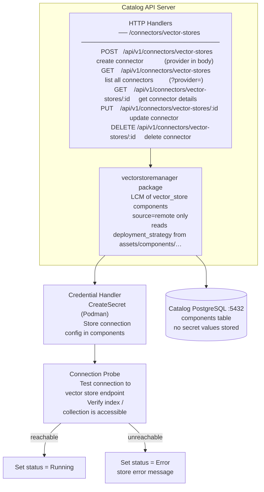
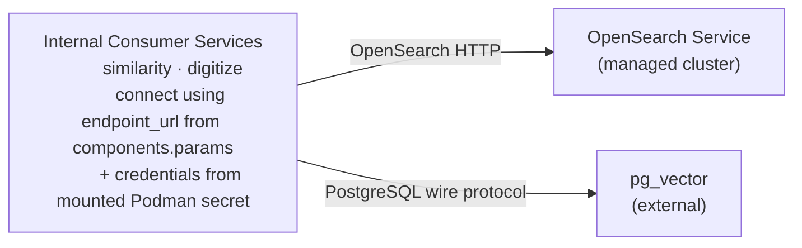
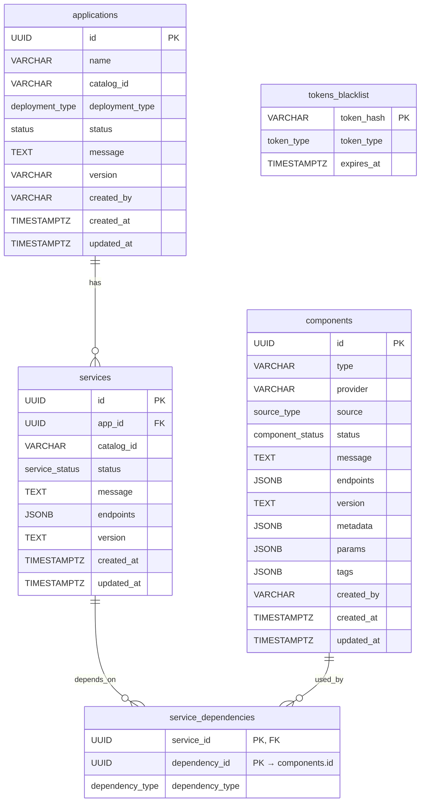

# Vector Store Connectors — Design Proposal

**Version:** 1.0
**Date:** July 2026  
**Status:** Draft / Proposal

---

## Table of Contents

1. [Executive Summary](#1-executive-summary)
2. [Background and Motivation](#2-background-and-motivation)
3. [Architecture Overview](#3-architecture-overview)
4. [New Concepts](#4-new-concepts)
   - [4.1 Vector Store Connectors](#41-vector-store-connectors)
5. [Database Schema](#5-database-schema)
   - [5.1 Guiding Principle](#51-guiding-principle)
   - [5.2 Additions to Existing `components` Table](#52-additions-to-existing-components-table)
   - [5.3 New and Extended ENUM Types](#53-new-and-extended-enum-types)
   - [5.4 Full Entity Relationship Diagram](#54-full-entity-relationship-diagram)
6. [API Specification](#6-api-specification)
   - [6.1 Vector Store Connector Endpoints](#61-vector-store-connector-endpoints)
   - [6.2 Extensions to Existing Endpoints](#62-extensions-to-existing-endpoints)
7. [API Endpoint Details](#7-api-endpoint-details)
   - [7.1 Create a Vector Store Connector](#71-create-a-vector-store-connector)
   - [7.2 List Vector Store Connectors](#72-list-vector-store-connectors)
   - [7.3 Get Vector Store Connector Details](#73-get-vector-store-connector-details)
   - [7.4 Update a Vector Store Connector](#74-update-a-vector-store-connector)
   - [7.5 Delete a Vector Store Connector](#75-delete-a-vector-store-connector)
8. [Connection Probe](#8-connection-probe)
9. [Connector Flow](#9-connector-flow)
10. [Key Design Decisions](#10-key-design-decisions)
11. [Common Queries](#11-common-queries)
12. [Error Handling](#12-error-handling)
13. [Future Considerations](#13-future-considerations)
14. [CLI Commands](#14-cli-commands)
    - [14.1 Vector Store Connector Commands](#141-vector-store-connector-commands)
    - [14.2 Command Summary](#142-command-summary)

---

## 1. Executive Summary

This proposal extends the existing Catalog Service with one new capability:

**Vector Store Connectors** — a way to register external vector store endpoints (OpenSearch, pg_vector on an external Postgres instance) without deploying any local pod. Credentials are stored securely as Podman secrets and managed by the platform — they never enter the Catalog database.

> **`vectorstoremanager` is a Go package inside the Catalog API server process** — not a separate service or sidecar. The HTTP handlers call into it directly; there is no inter-process communication. It owns the full lifecycle (create, update, delete, status) of the `vector_store` component type for `source=remote` connectors.

**Core design principle: everything is a `components` row.** The existing `source` column (introduced in the Model Management proposal) is fixed to `remote` for all vector store connectors:

| `source` | Meaning | Pod? | Podman secret? | Credentials stored in | Examples |
|---|---|---|---|---|---|
| `remote` | User registered an external vector store endpoint; no pod | ❌ | ✅ | Podman secret | OpenSearch Service, pg_vector (external Postgres) |

One new value (`vector_store`) on the existing `component_type` enum and no new tables are the complete schema delta. Credentials are always stored as Podman secrets, never in the Catalog database.

---

## 2. Background and Motivation

### Current State

The current catalog has no mechanism to register or manage external vector store endpoints. Consumer services that require a vector store — such as `similarity` and `digitize` — hold hard-coded connection strings or environment variables that must be manually provisioned and updated per deployment. There is no unified inventory of vector store endpoints, no standard lifecycle, and no credential management layer.

### Problems

- No mechanism to connect to an already-running OpenSearch cluster or an external Postgres+pg_vector instance and surface it as a managed platform component.
- Consumer services hold direct references to provider-specific connection strings — swapping providers requires re-deploying those services.
- No standard way to rotate credentials for an external vector store without updating every service that uses it.
- No visibility into which applications depend on a given external vector store endpoint.

### Goals

1. Enable registration of external vector store endpoints as connectors without deploying local pods.
2. Store only non-secret connection config in the Catalog DB; keep credentials exclusively in Podman secrets.
3. Persist all connector state in the Catalog DB by extending the existing `components` table — minimal schema delta, no new table.
4. Provide a standard lifecycle (create, update, delete, status) for vector store connectors consistent with the Model Management connector pattern.

---

## 3. Architecture Overview

**Connector request flow:**



**Vector store traffic flow (runtime):**



---

## 4. New Concepts

### 4.1 Vector Store Connectors

A **Vector Store Connector** is a `components` row with `source = 'remote'` and `type = 'vector_store'`. It has no pod. Credentials are stored as a Podman secret at connector-creation time — they are never written to the Catalog DB. The Catalog DB stores only non-secret connection config (`params.endpoint_url`, `params.auth.type`) — never the secret values themselves.

| `source` | Pod | Podman secret | Credentials location | `endpoints` |
|---|---|---|---|---|
| `remote` | ❌ | ✅ | Podman secret | External service URL |

**Connector providers (by `provider` on `components`):**

| `provider` | Description | Supported `params.auth.type` |
|---|---|---|
| `opensearch` | Amazon OpenSearch Service or any managed OpenSearch cluster | `basic` |
| `pg_vector` | External PostgreSQL instance with `pgvector` extension enabled | `basic` |

---

## 5. Database Schema

### 5.1 Guiding Principle

> **Everything is a `components` row.** The existing `source` column (introduced in the Model Management proposal) is always `remote` for vector store connectors. Catalog DB credential values never enter the database — credentials live exclusively in Podman secrets.

| Provider | `source` | Pod? | Podman secret? | Credentials location |
|---|---|---|---|---|
| OpenSearch Service (managed) | `remote` | ❌ | ✅ | Podman secret |
| pg_vector (external Postgres) | `remote` | ❌ | ✅ | Podman secret |

`service_dependencies.dependency_id` always points at `components.id`. The UI, the joins, and the dependency graph work identically to any other component type — no UNION, no second table.

---

### 5.2 Additions to Existing `components` Table

**No new columns are required.** The three columns added by the Model Management proposal (`tags`, `created_by`, `source`) fully support vector store connectors. The `component_status` enum values (`Syncing`, `Running`, `Error`) defined there apply unchanged.

The only new content is the `vector_store` value added to the existing `component_type` enum:

```sql
-- Extended (existing): new value added to component_type
ALTER TYPE component_type ADD VALUE 'vector_store';
```

#### `component_status` enum values used by vector store connectors

| Value | Meaning |
|---|---|
| `Syncing` | Connector created, connection probe in progress |
| `Running` | Last probe succeeded — endpoint reachable and credentials accepted |
| `Error` | Probe failed — endpoint unreachable or credentials rejected |

Non-secret connection config stored in `components.params`:
```json
{
  "endpoint_url": "https://my-opensearch-cluster.us-east-1.es.amazonaws.com",
  "auth": { "type": "basic", "username": "admin" }
}
```

> `password` is **never stored** in `components.params.auth` or anywhere in the Catalog DB — only `auth.type` and `auth.username` are persisted. The password lives exclusively in the Podman secret.

| `params` key | `opensearch` | `pg_vector` |
|---|---|---|
| `endpoint_url` | ✅ | ✅ |
| `auth.type` | ✅ | ✅ |
| `auth.username` | ✅ | ✅ |

---

### 5.3 New and Extended ENUM Types

```sql
-- Extended (existing): new value added to component_type
ALTER TYPE component_type ADD VALUE 'vector_store';

-- source_type, component_status — already defined by the Model Management proposal; no changes required
```

---

### 5.4 Full Entity Relationship Diagram



> **No new tables. No credentials column.** Credentials are stored as Podman secrets at connector-creation time and never touch the Catalog DB.

---

## 6. API Specification

All endpoints require `Authorization: Bearer <access_token>`. `provider` is supplied in the request body for writes and as a query parameter for reads — it is never a path segment, keeping the URL surface flat and extensible.

> **Routing note:** The static-segment route `GET /api/v1/connectors/vector-stores` must be registered **before** the `GET /api/v1/connectors/vector-stores/:id` UUID catch-all so the router resolves it correctly.

### 6.1 Vector Store Connector Endpoints

All `/api/v1/connectors/vector-stores` endpoints. All vector store components are `source=remote` — no pod is ever created.

| Method | Path | Description | Response |
|---|---|---|---|
| `POST` | `/api/v1/connectors/vector-stores` | Register a connector (`provider` in request body) | `201 Created` |
| `GET` | `/api/v1/connectors/vector-stores` | List all connectors; filter with `?provider=` | `200 OK` |
| `GET` | `/api/v1/connectors/vector-stores/:id` | Get full details of a connector | `200 OK` |
| `PUT` | `/api/v1/connectors/vector-stores/:id` | Update a connector's params or credentials | `200 OK` |
| `DELETE` | `/api/v1/connectors/vector-stores/:id` | Delete a connector and clean up its Podman secret | `202 Accepted` |

### 6.2 Extensions to Existing Endpoints

| Existing Endpoint | Change |
|---|---|
| `GET /api/v1/applications/:id` | Response includes `components` array alongside `services` — `type=vector_store` components appear alongside `llm`, `embedding`, `reranker` |
| `GET /api/v1/architectures/:id/deploy-options` | `providers` list under `vector_store` includes `opensearch` and `pg_vector` as `remote` connector options |

---

## 7. API Endpoint Details

### 7.1 Create a Vector Store Connector

**Endpoint:** `POST /api/v1/connectors/vector-stores`

**Description:** Registers an external vector store endpoint as a connector. Credentials are stored as a Podman secret — no pod created. Returns `201 Created` — synchronous for the row insert; the connection probe is async.

**Request Headers:**
```
Authorization: Bearer <access_token>
Content-Type: application/json
```

**Request Body (example: OpenSearch connector):**

```json
{
  "tags": { "name": "prod-opensearch" },
  "provider": "opensearch",
  "params": {
    "endpoint_url": "https://my-opensearch-cluster.us-east-1.es.amazonaws.com",
    "auth": {
      "type": "basic",
      "username": "admin",
      "password": "s3cret"
    }
  }
}
```

**Request Body (example: pg_vector connector):**

```json
{
  "tags": { "name": "prod-pgvector" },
  "provider": "pg_vector",
  "params": {
    "endpoint_url": "postgresql://my-db-host:5432",
    "auth": {
      "type": "basic",
      "username": "rag_user",
      "password": "s3cret"
    }
  }
}
```

**Request Schema:**

| Field | Type | Required | Description |
|---|---|---|---|
| `tags` | object | Yes | Label bag. Must include `"name"` key (3–100 chars, slug-safe) |
| `provider` | string | Yes | Connector backend: `opensearch`, `pg_vector` |
| `params` | object | Yes | Endpoint + auth — mirrors the fields defined in `values.schema.json` for this provider |
| `params.endpoint_url` | string | Yes | Remote service base URL or connection string |
| `params.auth` | object | Yes | Auth credentials — `username` and `password`; stored as Podman secret; **never stored in Catalog DB** |
| `params.auth.type` | string | Yes | Always `basic` |
| `params.auth.username` | string | Yes | Username — stored in Catalog DB (non-secret) |
| `params.auth.password` | string | Yes | Password — stored in Podman secret only, never in Catalog DB |

**Credential handling — Podman secret created at registration:**

```
# Secret name pattern: vector-store-creds-{tags.name}
# Example for prod-opensearch:
CreateSecret(name="vector-store-creds-prod-opensearch", data={"username": "admin", "password": "s3cret"})
```

`password` is extracted from `params.auth`, written to the Podman secret, and discarded before the `components` row is inserted. `params.auth.type` and `params.auth.username` are persisted in the DB.

**Response (`201 Created`):**

```json
{ "id": "e5f6a7b8-c9d0-e1f2-a3b4-c5d6e7f8a9b0" }
```

> Connector starts in `status = 'Syncing'`. Use `GET /api/v1/connectors/vector-stores/:id` to poll status. The platform fires the connection probe in the background; status advances to `Running` on success or `Error` on failure.

**Error Responses:**

| Status | Condition |
|---|---|
| `400 Bad Request` | Missing required fields, unknown `provider` |
| `401 Unauthorized` | Invalid or missing access token |
| `409 Conflict` | A connector with the same `tags.name` already exists |
| `500 Internal Server Error` | Podman secret creation failure |

---

### 7.2 List Vector Store Connectors

**Endpoint:** `GET /api/v1/connectors/vector-stores`

**Description:** Lists all registered vector store connectors. Optionally filter by provider.

**Query Parameters:**

| Parameter | Type | Required | Default | Description |
|---|---|---|---|---|
| `provider` | string (CSV) | No | — | Filter: `opensearch`, `pg_vector`. Omit for all. |
| `page` | integer | No | 1 | Page number (1-indexed) |
| `page_size` | integer | No | 20 | Items per page (max 100) |

**Request Headers:**
```
Authorization: Bearer <access_token>
```

**Examples:**
```
# All vector store connectors
GET /api/v1/connectors/vector-stores

# OpenSearch connectors only
GET /api/v1/connectors/vector-stores?provider=opensearch
```

**Response (200 OK):**

```json
{
  "data": [
    {
      "id": "e5f6a7b8-c9d0-e1f2-a3b4-c5d6e7f8a9b0",
      "source": "remote",
      "tags": { "name": "prod-opensearch" },
      "provider": "opensearch",
      "params": {
        "endpoint_url": "https://my-opensearch-cluster.us-east-1.es.amazonaws.com",
        "auth": { "type": "basic", "username": "admin" }
      },
      "status": "Running",
      "created_at": "2026-07-01T11:00:00Z",
      "updated_at": "2026-07-01T11:05:00Z"
    },
    {
      "id": "f7a8b9c0-d1e2-f3a4-b5c6-d7e8f9a0b1c2",
      "source": "remote",
      "tags": { "name": "prod-pgvector" },
      "provider": "pg_vector",
      "params": {
        "endpoint_url": "postgresql://my-db-host:5432",
        "auth": { "type": "basic", "username": "rag_user" }
      },
      "status": "Running",
      "created_at": "2026-07-01T12:00:00Z",
      "updated_at": "2026-07-01T12:05:00Z"
    }
  ],
  "pagination": {
    "page": 1,
    "page_size": 20,
    "total_items": 2,
    "total_pages": 1,
    "has_next": false,
    "has_prev": false
  }
}
```

**Backing SQL:**

```sql
SELECT *
FROM components
WHERE source = 'remote'
  AND type = 'vector_store'
  AND (ARRAY[:providers] IS NULL OR provider = ANY(ARRAY[:providers]))
ORDER BY provider, created_at DESC
LIMIT :page_size OFFSET (:page - 1) * :page_size;
```

**Error Responses:**

| Status | Condition |
|---|---|
| `400 Bad Request` | Unknown value in `provider` or `status` query parameter |
| `401 Unauthorized` | Invalid or missing access token |

---

### 7.3 Get Vector Store Connector Details

**Endpoint:** `GET /api/v1/connectors/vector-stores/:id`

**Path Parameters:**

| Parameter | Description |
|---|---|
| `:id` | Connector UUID |

**Description:** Returns the full record for a vector store connector.

**Response (200 OK):**

```json
{
  "id": "e5f6a7b8-c9d0-e1f2-a3b4-c5d6e7f8a9b0",
  "source": "remote",
  "tags": { "name": "prod-opensearch" },
  "type": "vector_store",
  "provider": "opensearch",
  "status": "Running",
  "message": "Endpoint reachable and credentials accepted",
  "params": {
    "endpoint_url": "https://my-opensearch-cluster.us-east-1.es.amazonaws.com",
    "auth": { "type": "basic", "username": "admin" }
  },
  "in_use_by": [
    {
      "application_id": "a1b2c3d4-1234-5678-abcd-ef0123456789",
      "app_name": "my-rag-app"
    }
  ],
  "created_by": "user@example.com",
  "created_at": "2026-07-01T11:00:00Z",
  "updated_at": "2026-07-01T11:05:00Z"
}
```

**`in_use_by` SQL (server-side):**

```sql
SELECT DISTINCT s.app_id AS application_id, a.name AS app_name
FROM service_dependencies sd
JOIN services s ON s.id = sd.service_id
JOIN applications a ON a.id = s.app_id
WHERE sd.dependency_id = :id
  AND sd.dependency_type = 'component';
```

**Error Responses:** `401 Unauthorized`, `404 Not Found`

---

### 7.4 Update a Vector Store Connector

**Endpoint:** `PUT /api/v1/connectors/vector-stores/:id`

**Path Parameters:**

| Parameter | Description |
|---|---|
| `:id` | Connector UUID |

**Description:** Updates a connector's `metadata` or `params`. If `params.auth` is supplied the Podman secret is updated with new credentials, `status` resets to `Syncing`, and the validation probe is re-fired immediately in the background.

**Request Body (all fields optional):**

```json
{
  "params": {
    "endpoint_url": "https://my-opensearch-cluster-v2.us-east-1.es.amazonaws.com",
    "auth": {
      "type": "basic",
      "username": "admin",
      "password": "new-s3cret"
    }
  }
}
```

**Processing steps when `params.auth` is present:**

1. Update the Podman secret `vector-store-creds-<tags.name>` with new credential values.
2. Reset `components.status = 'Syncing'`.
3. Merge supplied `metadata` and non-auth `params` fields into stored record (omitted keys preserved).
4. Update `updated_at`.
5. Re-fire connection probe in the background.

**Response (200 OK):** Full connector object in same shape as §7.3 response.

**Error Responses:**

| Status | Condition |
|---|---|
| `400 Bad Request` | Invalid field values |
| `401 Unauthorized` | Invalid or missing access token |
| `403 Forbidden` | Authenticated user is not `created_by` |
| `404 Not Found` | Connector not found |
| `500 Internal Server Error` | Podman secret update failure |

---

### 7.5 Delete a Vector Store Connector

**Endpoint:** `DELETE /api/v1/connectors/vector-stores/:id`

**Path Parameters:**

| Parameter | Description |
|---|---|
| `:id` | Connector UUID |

**Description:** Deletes a vector store connector. Removes the Podman secret holding the credentials and deletes the `components` row.

| Step | Call | Detail |
|---|---|---|
| 1 | `DeleteSecret` | Removes Podman secret `vector-store-creds-<tags.name>` |
| 2 | Delete `components` row | Final cleanup |

**Response (`202 Accepted`):**

```json
{ "id": "e5f6a7b8-c9d0-e1f2-a3b4-c5d6e7f8a9b0", "message": "Connector deletion initiated" }
```

**Error Responses:**

| Status | Condition |
|---|---|
| `401 Unauthorized` | Invalid or missing access token |
| `403 Forbidden` | Authenticated user is not `created_by` |
| `404 Not Found` | Connector not found |
| `409 Conflict` | Connector is in use by one or more active services |

---

## 8. Connection Probe

After every connector creation or credential update, `vectorstoremanager` fires an async connection probe against the external endpoint using the credentials from the Podman secret to verify the connection is working. The result drives the final `status` value written to the `components` table.

**Probe outcome:**

| Result | `components.status` | `components.message` |
|---|---|---|
| Connection succeeded | `Running` | `"Endpoint reachable and credentials accepted"` |
| Connection failed or credentials rejected | `Error` | Error detail from the probe attempt |
| No response within timeout | `Error` | `"Connection timed out"` |

> The probe is fire-and-forget from the caller's perspective. `POST /api/v1/connectors/vector-stores` returns `201` immediately while the probe runs in the background. Callers poll `GET /api/v1/connectors/vector-stores/:id` to observe the status transition from `Syncing` → `Running` or `Error`.

---

## 9. Connector Flow

### Flow: Create OpenSearch connector — `source=remote`

```
POST /api/v1/connectors/vector-stores
{ provider: "opensearch",
  tags: {"name":"prod-opensearch"},
  params: {endpoint_url: "https://my-opensearch-cluster.us-east-1.es.amazonaws.com",
           auth: {type: "basic", username: "admin", password: "s3cret"}} }

  Read assets/components/vector_store/opensearch/metadata.yaml → deployment_strategy: remote

  1. Validate request fields
  2. No pod, no pre-flight resource check
  3. CreateSecret(name="vector-store-creds-prod-opensearch",
                  data={"username": "admin", "password": "s3cret"})
  4. INSERT into components (type='vector_store', provider='opensearch', source='remote',
                             status='Syncing', tags={"name":"prod-opensearch"}, created_by=<user>,
                             endpoints=[{type:"api", url: params.endpoint_url}],
                             params={endpoint_url: ...,
                                     auth: {type: "basic", username: "admin"}  ← password not stored})
  5. Return 201 {source: "remote", id: components.id, status: "Syncing", ...}
  6. [async] vectorstoremanager probes endpoint using credentials from Podman secret
  7. [async] UPDATE components SET status='Running' or status='Error'
```

### Flow: Create pg_vector connector — `source=remote`

```
POST /api/v1/connectors/vector-stores
{ provider: "pg_vector",
  tags: {"name":"prod-pgvector"},
  params: {endpoint_url: "postgresql://my-db-host:5432",
           auth: {type: "basic", username: "rag_user", password: "s3cret"}} }

  Read assets/components/vector_store/pg_vector/metadata.yaml → deployment_strategy: remote

  1. Validate request fields
  2. No pod, no pre-flight resource check
  3. CreateSecret(name="vector-store-creds-prod-pgvector",
                  data={"username": "rag_user", "password": "s3cret"})
  4. INSERT into components (type='vector_store', provider='pg_vector', source='remote',
                             status='Syncing', tags={"name":"prod-pgvector"}, created_by=<user>,
                             endpoints=[{type:"api", url: params.endpoint_url}],
                             params={endpoint_url: ...,
                                     auth: {type: "basic", username: "rag_user"}  ← password not stored})
  5. Return 201 {source: "remote", id: components.id, status: "Syncing", ...}
  6. [async] vectorstoremanager probes endpoint using credentials from Podman secret
  7. [async] UPDATE components SET status='Running' or status='Error'
```

### Flow: Delete a connector

```
DELETE /api/v1/connectors/vector-stores/:id

  Server resolves source='remote' from DB row

  1. Verify created_by=user
  2. Return 202
  3. [async] DeleteSecret(name="vector-store-creds-<tags.name>")
  4. [async] DELETE components row
```

---

## 10. Key Design Decisions

### 1. One Table for Everything: `components.source = 'remote'`

`components` is the universal registry for all runtime dependencies. Vector store connectors are always `source=remote` — there is no local pod variant. `service_dependencies.dependency_id` always points at `components.id`. No UNION queries, no second table, no schema divergence.

### 2. Credentials Never Enter the Database

Credentials are written to a Podman secret (`vector-store-creds-<tags.name>`) at connector-creation time. Only `params.auth.type` and non-secret fields (e.g. `username`) are persisted in the Catalog DB. At delete time, `DeleteSecret` removes the secret before the row is deleted.

### 3. `deployment_strategy: remote` in `metadata.yaml` is the Only Branch Point

All vector store providers use `deployment_strategy: remote`. This means zero provider string comparisons in Go code. Adding a new provider (e.g., `weaviate`) needs only a new `metadata.yaml` — no code change.

### 4. Managed Component Identity: `created_by IS NOT NULL`

The API layer distinguishes user-created connectors from infrastructure components deployed by the application pipeline by `created_by IS NOT NULL`.

### 5. Delete Always Removes the Row

`DELETE /api/v1/connectors/vector-stores/:id` always hard-deletes the `components` row after removing the Podman secret. There is no soft-delete or deactivation state.

### 6. `Running` is the Healthy State

`component_status.Running` means the last connection probe succeeded — endpoint was reachable and credentials were accepted. UI status display logic is uniform — green = Running.

### 7. Secret Name = `vector-store-creds-{tags.name}`

Naming the Podman secret after the user-provided `tags.name` (e.g. `vector-store-creds-prod-opensearch`) allows consumer services and teardown logic to derive the secret name without an extra DB lookup.

---

## 11. Common Queries

### All active vector store connectors:
```sql
SELECT
    id, tags->>'name' AS name, provider, status,
    endpoints
FROM components
WHERE type = 'vector_store'
  AND source = 'remote'
  AND status != 'Error'
ORDER BY provider, created_at DESC;
```

### Get connectors still syncing (probe in progress):
```sql
SELECT id, tags->>'name' AS name, provider, endpoints, created_at
FROM components
WHERE type = 'vector_store'
  AND source = 'remote'
  AND status = 'Syncing'
ORDER BY created_at DESC;
```

### Get vector store connectors in use by a specific application:
```sql
SELECT c.id, c.provider, c.status,
       c.tags->>'name' AS name,
       c.metadata->>'index_name' AS index_name,
       c.metadata->>'table_name' AS table_name
FROM components c
JOIN service_dependencies sd ON sd.dependency_id = c.id
JOIN services s ON s.id = sd.service_id
WHERE s.app_id = 'application-uuid-here'
  AND c.type = 'vector_store';
```

---

## 12. Error Handling

All error responses follow the existing catalog error format:

```json
{ "error": "Human-readable error message" }
```

### HTTP Status Codes

| Code | Usage |
|---|---|
| `200 OK` | Successful synchronous request |
| `201 Created` | Connector created |
| `202 Accepted` | Async deletion initiated |
| `400 Bad Request` | Missing required fields, invalid enum values, malformed body |
| `401 Unauthorized` | Missing or invalid Bearer token |
| `403 Forbidden` | Authenticated but not the `created_by` owner |
| `404 Not Found` | Connector not found |
| `409 Conflict` | Duplicate connector name; connector in use by active services |
| `500 Internal Server Error` | Unexpected server error |

---

## 13. Future Considerations

1. **Index / Collection Management API** — `POST /api/v1/connectors/vector-stores/:id/indexes` to create, list, and delete named indexes or collections within a registered connector without re-creating the connector itself.
2. **Multiple Connectors Per Application (Fallback)** — Allow a primary + fallback pair per application, with automatic failover if the primary connector enters `Error` state.
3. **Vector Store Catalog Browse** — `GET /api/v1/vector-store-catalog` to enumerate available providers and their required `params` / `metadata` shapes from `metadata.yaml` assets — analogous to the architecture/service catalog endpoints.
4. **RBAC on Connectors** — Connectors currently belong to the creating user. Future: share connectors across a team, or mark them platform-wide, via a `visibility` field (`private` / `shared` / `global`).
5. **Credential Rotation** — Scheduled validation jobs to proactively detect stale credentials before they impact deployed applications.
6. **Audit Logging** — Add `updated_by` to `components` for vector store rows and populate it on credential update or status change.
7. **Additional Providers** — Weaviate, Milvus, Qdrant, Pinecone follow the same connector pattern; each requires only a new `metadata.yaml` asset and no code changes.

---

## 14. CLI Commands

Vector store connector commands live under `ai-services connector vector-store` and map to the `/api/v1/connectors/vector-stores` endpoints. They follow the same flag style as `ai-services connector` model commands.

---

### 14.1 Vector Store Connector Commands

#### Create a connector

```
ai-services connector vector-store create [name] --provider <provider> --runtime podman
```

| Flag | Short | Required | Description |
|---|---|---|---|
| `--provider` | `-p` | Yes | Connector provider: `opensearch`, `pg_vector` |
| `--username` | | Yes | Username — stored in Podman secret, `auth.username` also persisted in DB |
| `--password` | | Yes | Password — stored in Podman secret only, never in DB |
| `--params` | | No | Inline key=value pairs (e.g. `endpoint_url=...`) |

```bash
# Create an OpenSearch connector
ai-services connector vector-store create prod-opensearch \
  --provider opensearch \
  --username admin \
  --password s3cret \
  --params endpoint_url=https://my-opensearch-cluster.us-east-1.es.amazonaws.com \
  --runtime podman

# Create a pg_vector connector
ai-services connector vector-store create prod-pgvector \
  --provider pg_vector \
  --username rag_user \
  --password s3cret \
  --params endpoint_url=postgresql://my-db-host:5432 \
  --runtime podman
```

---

#### List connectors

```
ai-services connector vector-store list --runtime podman
```

| Flag | Short | Required | Description |
|---|---|---|---|
| `--provider` | `-p` | No | Filter by provider: `opensearch`, `pg_vector` |
| `--status` | | No | Filter by status: `Running`, `Syncing`, `Error` |

```bash
# List all vector store connectors
ai-services connector vector-store list --runtime podman

# List only OpenSearch connectors
ai-services connector vector-store list --provider opensearch --runtime podman

# List only connectors that are still syncing
ai-services connector vector-store list --status Syncing --runtime podman
```

---

#### Get connector details

```
ai-services connector vector-store info [name] --runtime podman
```

```bash
ai-services connector vector-store info prod-opensearch --runtime podman
```

---

#### Update a connector

Updates connection params or credentials. Supplying new credentials updates the Podman secret and resets status to `Syncing`.

```
ai-services connector vector-store update [name] --runtime podman
```

| Flag | Short | Required | Description |
|---|---|---|---|
| `--username` | | No | New username — updates Podman secret and DB, resets status to `Syncing` |
| `--password` | | No | New password — updates Podman secret, resets status to `Syncing` |
| `--params` | | No | Key=value pairs to update (e.g. `endpoint_url=...`) |

```bash
# Rotate the password
ai-services connector vector-store update prod-opensearch \
  --password new-s3cret \
  --runtime podman

# Update endpoint only
ai-services connector vector-store update prod-opensearch \
  --params endpoint_url=https://my-opensearch-cluster-v2.us-east-1.es.amazonaws.com \
  --runtime podman
```

---

#### Delete a connector

```
ai-services connector vector-store delete [name] --runtime podman
```

| Flag | Short | Required | Description |
|---|---|---|---|
| `-y` | | No | Skip confirmation prompt |

```bash
ai-services connector vector-store delete prod-opensearch --runtime podman

# Skip confirmation
ai-services connector vector-store delete prod-opensearch -y --runtime podman
```

---

### 14.2 Command Summary

| Command | Maps to | Description |
|---|---|---|
| `ai-services connector vector-store create [name]` | `POST /api/v1/connectors/vector-stores` | Register a vector store connector |
| `ai-services connector vector-store list` | `GET /api/v1/connectors/vector-stores` | List all vector store connectors |
| `ai-services connector vector-store info [name]` | `GET /api/v1/connectors/vector-stores/:id` | Get full details of a connector |
| `ai-services connector vector-store update [name]` | `PUT /api/v1/connectors/vector-stores/:id` | Update connector credentials or params |
| `ai-services connector vector-store delete [name]` | `DELETE /api/v1/connectors/vector-stores/:id` | Delete connector and remove its Podman secret |
