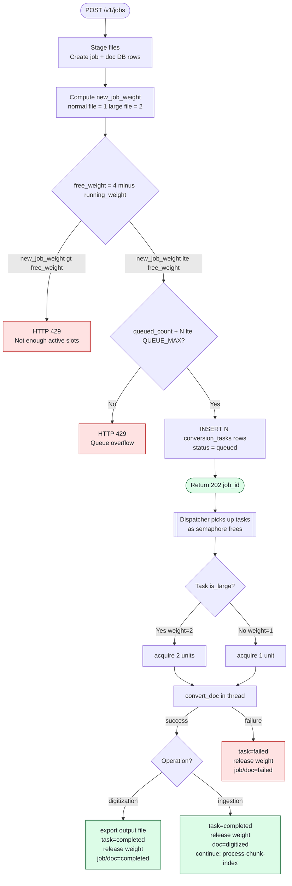
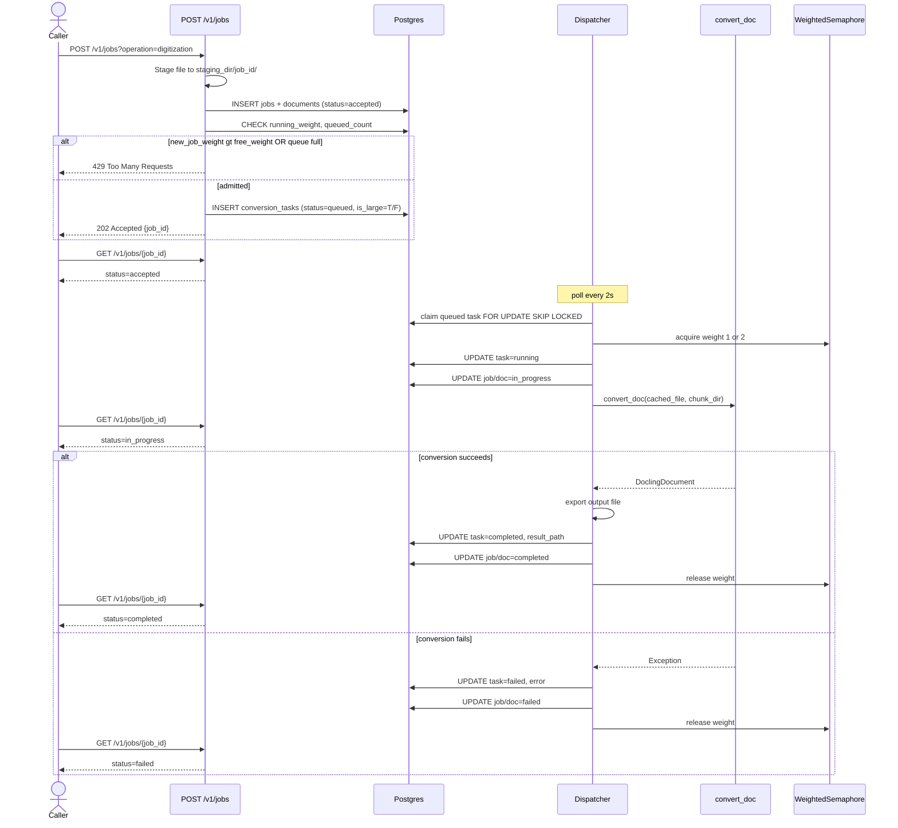
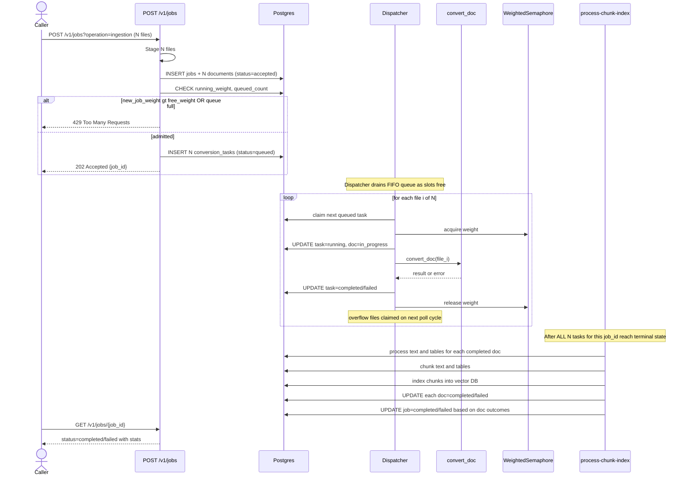
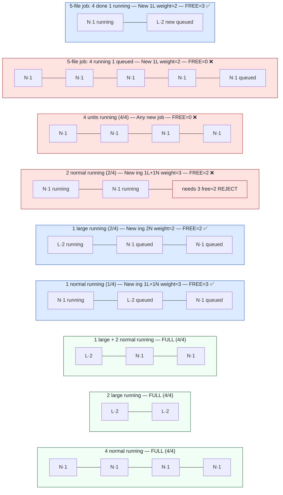
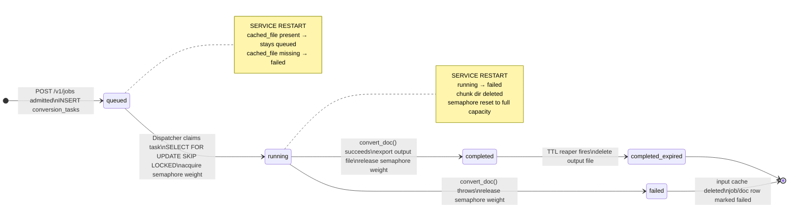

# Docling Conversion Queue — Design Proposal

## Executive Summary

This document proposes adding a shared, Postgres-backed conversion queue **inside the existing
`digitize` service** so that `convert_doc()` runs under a globally capped, weighted semaphore
that is durable across restarts.

**Motivation**

`convert_doc()` in `services/digitize/parsing/converter.py` is a CPU-heavy Docling operation
currently consumed directly by two pipelines:

- **Digitization** — `pipeline/digitize.py` → `convert_document_format()`
- **Ingestion** — `processing/orchestrator.py` → `convert_document()`

Two new consumers are planned:

- **Data Source Connectors** — sync remote data sources into the vector DB by running the
  ingestion pipeline. They have their own API endpoints, their own DB table, and their own
  concurrency limits, but they call the same `processing/orchestrator.py` → `convert_doc()`
  path that `POST /v1/jobs` (ingestion) uses today.
- **Extract & Tag service** — runs the full digitization pipeline (including Docling
  conversion) so it can attach a `doc_id` to a digitize document record. It therefore calls
  the same `pipeline/digitize.py` → `convert_doc()` path that `POST /v1/jobs` (digitization)
  uses today.

Both new consumers reach `convert_doc()` through the **same existing pipeline functions** —
they do not bypass them. The problem is purely that neither consumer can share the conversion
capacity budget with each other or with the API-driven pipelines, because that budget is
currently enforced at the request-admission layer (`workers/concurrency.py`) rather than at
the conversion layer.

Rather than introducing a new microservice (which would add deployment, networking, and auth
complexity), this proposal extends the digitize service with a conversion sub-queue that any
internal pipeline — regardless of which entry point triggered it — can enqueue work onto.

---

## Current State

### Where `convert_doc` is called today

| Caller | File | Mechanism |
|---|---|---|
| Digitization pipeline | `pipeline/digitize.py:60` | `ProcessPoolExecutor(max_workers=1)` → `convert_document_format()` |
| Ingestion pipeline | `processing/orchestrator.py:532` | `ProcessPoolExecutor(max_workers=N)` → `convert_document()` |

### Current concurrency control

`workers/concurrency.py` exposes a `ConcurrencyManager` with two `asyncio.BoundedSemaphore`
instances — one per operation type — controlled at the **API layer** in
`api/v1/jobs.py`.  Limits are:

- Ingestion: `ingestion_concurrency_limit` (default **1**)
- Digitization: `digitization_concurrency_limit` (default **2**)

This is request-level gating, not file-level.  Once a request is admitted it can start as
many `ProcessPoolExecutor` workers as the batch size allows, and there is no cap shared across
the Digitization and Ingestion paths or accessible to future consumers.

### Problems with the current approach

1. **No shared capacity budget** — a large ingestion batch and a concurrent digitization
   request each spawn their own process pools; combined CPU load can exceed what the node can
   sustain. Data Source Connectors and Extract & Tag will add two more uncoordinated
   process pools on top.
2. **Entry-point-specific gating** — the `ConcurrencyManager` semaphores are only acquired
   inside `api/v1/jobs.py`. A Data Source Connector going directly into the ingestion
   pipeline, or Extract & Tag going directly into the digitize pipeline, bypasses them
   entirely.
3. **Not durable** — if the process crashes mid-conversion, in-flight work is silently
   dropped; the job recovery in `utils/recovery.py` marks the job failed but cannot re-run
   the conversion.
4. **No queue depth limit** — a flood of requests could queue an unbounded number of
   `ProcessPoolExecutor` jobs in memory.

---

## Proposed Design

### 1. New Postgres table — `conversion_tasks`

One table added to the existing schema (managed by `Base.metadata.create_all` on startup).

```sql
CREATE TABLE conversion_tasks (
    task_id         VARCHAR(255)  PRIMARY KEY,
    -- link back to the digitize job/doc that owns this task
    job_id          VARCHAR(255)  REFERENCES jobs(job_id) ON DELETE SET NULL,
    doc_id          VARCHAR(255),                  -- digitize document id; informational
    caller_service  VARCHAR(100)  NOT NULL,        -- 'digitize' | 'connector' | 'extract-tag'
    -- input
    cached_file     TEXT          NOT NULL,        -- absolute path written at enqueue time
    output_format   VARCHAR(10)   NOT NULL         -- 'json' | 'md' | 'txt'
                    CHECK (output_format IN ('json','md','txt')),
    page_count      INTEGER,                       -- filled in during enqueue
    is_large        BOOLEAN       NOT NULL DEFAULT FALSE,
    -- lifecycle
    status          VARCHAR(50)   NOT NULL
                    CHECK (status IN ('queued','running','completed','failed')),
    result_path     TEXT,                          -- written on completion
    error           TEXT,
    queued_at       TIMESTAMPTZ   NOT NULL DEFAULT now(),
    started_at      TIMESTAMPTZ,
    completed_at    TIMESTAMPTZ,
    updated_at      TIMESTAMPTZ   NOT NULL DEFAULT now()
);

CREATE INDEX idx_ct_status_queued ON conversion_tasks (status, queued_at);
CREATE INDEX idx_ct_job_id        ON conversion_tasks (job_id);
CREATE INDEX idx_ct_doc_id        ON conversion_tasks (doc_id);
```

`is_large` is derived from `page_count >= heavy_doc_page_threshold` at enqueue time and
stored so the dispatcher can make a semaphore-weight decision from a single DB read.

#### Two-layer admission check

Job admission uses two separate checks, evaluated in order:

**1 — Semaphore headroom check (primary gate)**

Before a new ingestion or digitization job is accepted, compute the weight the new job needs
to start converting right now. That weight is the sum of weights of all files in the
submitted batch, capped at the semaphore capacity (4). Check whether that weight fits within
the currently **free** semaphore capacity (capacity minus weight of currently *running* tasks).

```python
# Computed at admission time, before any DB insert
running_weight = SUM(weight FOR task IN conversion_tasks WHERE status = 'running')
new_job_weight = SUM(2 if is_large(f) else 1 FOR f in submitted_files)
free_weight    = SEMAPHORE_CAPACITY - running_weight   # e.g. 4 - running_weight

if new_job_weight > free_weight:
    raise HTTP 429  # not enough active slots for this job right now
```

This check uses the *running* weight only — not the queued weight — because queued tasks
are not consuming CPU. This is what makes it possible for a large ingestion job to enqueue
its overflow files without blocking new jobs from starting if there is headroom.

**2 — Queue overflow safety check (backstop)**

After passing the semaphore check, verify the total number of queued (not yet running) tasks
across all jobs would not exceed `QUEUE_MAX` (default 10). This prevents a pathological case
where a single enormous job pre-fills the queue buffer indefinitely.

```sql
-- count only queued (not running) tasks
SELECT COUNT(*) FROM conversion_tasks WHERE status = 'queued'
```

If `queued_count + len(new_files) > QUEUE_MAX` → HTTP 429. This is a backstop, not the
primary gate. A job with many files that passes the semaphore check will almost never hit
this — it only fires when the queue buffer is already saturated by another job's overflow.

Both checks happen inside a single DB transaction (`SELECT … FOR UPDATE`) to prevent races.

---

### 2. Weighted semaphore — `workers/conversion_semaphore.py`

A new module alongside the existing `workers/concurrency.py`.

```
workers/
  concurrency.py           ← existing; unchanged
  conversion_semaphore.py  ← new
```

#### Weight rule

| File | Page threshold | Semaphore weight | Max concurrent at capacity 4 |
|---|---|---|---|
| Normal | ≤ 500 pages | 1 | 4 files |
| Large | > 500 pages | 2 | 2 files |
| 1 large + 2 normal | — | 2+1+1 = 4 | mixed |
| 2 large | — | 2+2 = 4 | mixed |

Total capacity is 4 units, matching the existing `doc_worker_size = 4` default.
Large-file capacity matches `heavy_doc_convert_worker_size = 2`.

```python
# workers/conversion_semaphore.py

import asyncio
from digitize.settings import settings


class WeightedSemaphore:
    """Capacity-based semaphore; each acquire consumes `weight` units."""

    def __init__(self, capacity: int) -> None:
        self._capacity = capacity
        self._available = capacity
        self._cond = asyncio.Condition()

    @property
    def available(self) -> int:
        return self._available

    async def acquire(self, weight: int) -> None:
        async with self._cond:
            await self._cond.wait_for(lambda: self._available >= weight)
            self._available -= weight

    async def release(self, weight: int) -> None:
        async with self._cond:
            self._available += weight
            self._cond.notify_all()


# Module-level singleton — capacity mirrors doc_worker_size so existing
# ProcessPoolExecutor pools and this semaphore agree on the budget.
conversion_semaphore = WeightedSemaphore(
    capacity=settings.digitize.doc_worker_size  # default 4
)
```

---

### 3. Entry point — `api/v1/jobs.py` (existing endpoint, extended)

No new endpoint is introduced. `POST /v1/jobs` already provides the full caller contract:
it validates the file, stages it, creates the job/doc DB records, and returns a `job_id`
immediately with `202 Accepted`. Callers already poll `GET /v1/jobs/{job_id}` for status.
The only change is **what happens after the job is accepted**.

#### Current flow (digitization)

```
POST /v1/jobs?operation=digitization
  → acquire semaphore slot immediately
  → stage file
  → background_tasks.add_task(_run_digitize, ...)   # starts conversion right now
  → return { "job_id": "..." }
```

#### Proposed flow (both operations)

Both digitization and ingestion go through the same two-layer admission check, then insert
their files into `conversion_tasks` and return immediately.

```
POST /v1/jobs?operation=digitization  (1 file)
  → stage file
  → create jobs + documents rows
  → compute new_job_weight = 1 or 2 depending on page count
  → semaphore headroom check: new_job_weight <= free_weight, else HTTP 429
  → queue overflow check: queued_count + 1 <= QUEUE_MAX, else HTTP 429
  → INSERT 1 conversion_tasks row (status=queued)
  → return { "job_id": "..." }

POST /v1/jobs?operation=ingestion  (N files)
  → stage N files
  → create jobs + documents rows
  → compute new_job_weight = SUM of per-file weights (large=2, normal=1)
  → semaphore headroom check: new_job_weight <= free_weight, else HTTP 429
  → queue overflow check: queued_count + N <= QUEUE_MAX, else HTTP 429
  → INSERT N conversion_tasks rows (status=queued)
  → return { "job_id": "..." }
```

A job with more files than can run concurrently right now is still accepted — its tasks
fill the queue and the dispatcher drains them as semaphore slots free up. The queue is
the intra-job overflow buffer; it is **not** the admission gate.

The existing `has_active_jobs()` hard block at [`jobs.py:174`](services/digitize/api/v1/jobs.py:174)
and the `ConcurrencyManager` semaphores at lines 185–199 are both removed. The
`_run_ingest` and `_run_digitize` background tasks are removed — the dispatcher drives
all execution.

#### Admission decision table

| Scenario | Running weight | Free weight | New job weight | Decision |
|---|---|---|---|---|
| Ing A: 1 normal running. New ing: 1 large + 1 normal | 1 | 3 | 2+1=3 | ✅ Accept |
| Ing A: 1 large running. New ing: 2 normal | 2 | 2 | 1+1=2 | ✅ Accept |
| Ing A: 2 normal running. New ing: 1 large + 1 normal | 2 | 2 | 2+1=3 | ❌ Reject |
| Ing A: 5 files (4 running, 1 queued). New ing: 1 large | 4 | 0 | 2 | ❌ Reject |
| Ing A: 5 files → 4 done, 1 running (weight 1). New ing: 1 large | 1 | 3 | 2 | ✅ Accept |
| Ing A: 11 files (4 running, 7 queued). New ing: 1 file | 4 | 0 | 1 | ❌ Reject (semaphore) |
| Queue has 0 queued, 4 running. New ing: 1 normal | 4 | 0 | 1 | ❌ Reject (semaphore) |

A job with 11 files is **always accepted at submission time** as long as `free_weight >= 1`
(i.e. at least one semaphore slot is free). Its first batch of up to 4 weight-units of files
start immediately; the remaining files queue up and process as slots free.

#### `GET /v1/jobs/{job_id}` — unchanged

The response shape and status progression (`accepted` → `in_progress` → `completed`/`failed`)
are identical. The dispatcher updates the `jobs` and `documents` rows directly using the
`job_id` and `doc_id` stored in the `conversion_tasks` row, so the status surfaces through
the existing endpoint with no change to the caller.

---

### 4. Dispatcher — `workers/conversion_dispatcher.py`

A long-running `asyncio` task started in `app.py`'s `lifespan`.

```python
# workers/conversion_dispatcher.py

async def dispatch_loop() -> None:
    """
    Poll the DB every POLL_INTERVAL seconds.
    For each queued task whose weight fits available semaphore capacity,
    atomically claim it and spawn run_conversion().
    """
    while True:
        await _dispatch_one_batch()
        await asyncio.sleep(settings.digitize.conversion_poll_interval)


async def _dispatch_one_batch() -> None:
    tasks = db_manager.claim_queued_tasks(
        semaphore_available=conversion_semaphore.available
    )
    for task in tasks:
        weight = 2 if task.is_large else 1
        await conversion_semaphore.acquire(weight)
        asyncio.create_task(_run_conversion(task, weight))


async def _run_conversion(task: ConversionTask, weight: int) -> None:
    try:
        if not Path(task.cached_file).exists():
            db_manager.update_task_status(task.task_id, "failed",
                                          error="Cached input file missing")
            return

        db_manager.update_task_status(task.task_id, "running")

        out_dir   = Path(task.cached_file).parent
        chunk_dir = out_dir / "chunks"
        doc: DoclingDocument = await asyncio.to_thread(
            convert_doc, task.cached_file, chunk_dir
        )

        result_path = out_dir / f"output.{task.output_format}"
        _export(doc, result_path, task.output_format)   # json / md / txt

        db_manager.update_task_status(
            task.task_id, "completed", result_path=str(result_path)
        )
    except Exception as exc:
        db_manager.update_task_status(task.task_id, "failed", error=str(exc))
    finally:
        # Clean up cached input; keep result_path until TTL reaper runs
        _safe_remove(task.cached_file)
        await conversion_semaphore.release(weight)
```

#### Atomic DB claim

`claim_queued_tasks` uses `SELECT … FOR UPDATE SKIP LOCKED` so multiple dispatcher
iterations (or future replicas) never double-claim:

```sql
UPDATE conversion_tasks
SET    status = 'running', started_at = now()
WHERE  task_id IN (
    SELECT task_id
    FROM   conversion_tasks
    WHERE  status = 'queued'
      AND  (is_large = FALSE OR :semaphore_available >= 2)
    ORDER BY queued_at
    LIMIT  :batch_size
    FOR UPDATE SKIP LOCKED
)
RETURNING *;
```

---

### 5. Lifespan integration — `app.py`

```python
@asynccontextmanager
async def lifespan(app: FastAPI):
    # ... existing startup (DB, language detector, zombie recovery) ...

    # Start conversion dispatcher
    from digitize.workers.conversion_dispatcher import dispatch_loop
    dispatcher_task = asyncio.create_task(dispatch_loop())
    logger.info("✅ Conversion dispatcher started")

    yield

    dispatcher_task.cancel()
    # ... existing shutdown ...
```

---

### 6. Restart & Recovery

Mirrors the existing `recover_zombie_jobs()` pattern in `utils/recovery.py`.

A new `recover_conversion_tasks()` function runs in the same startup block:

```python
def recover_conversion_tasks() -> None:
    """
    On startup:
      - running  → failed  (process died mid-conversion; chunk state unknown)
      - queued   → keep    (cached file verified; dispatcher will pick them up)
               → failed  (cached file missing; nothing to run)
    """
    # 1. running → failed
    running_tasks = db_manager.get_conversion_tasks(status="running")
    for task in running_tasks:
        _safe_rmtree(Path(task.cached_file).parent / "chunks")
        db_manager.update_task_status(
            task.task_id, "failed",
            error="Service restarted during conversion"
        )
        logger.warning(f"Recovery: task {task.task_id} running→failed")

    # 2. queued — verify cached file
    queued_tasks = db_manager.get_conversion_tasks(status="queued")
    for task in queued_tasks:
        if not Path(task.cached_file).exists():
            db_manager.update_task_status(
                task.task_id, "failed",
                error="Cached input file lost during restart"
            )
            logger.warning(f"Recovery: task {task.task_id} queued→failed (file lost)")
        else:
            logger.info(f"Recovery: task {task.task_id} re-queued (file intact)")
```

#### Why running tasks cannot be resumed

`convert_doc()` processes documents in 100-page chunks and merges them.
If the process crashes after writing some chunk JSON files, the merge step has not run
and the partial chunk state is unreliable.  The existing `finally: shutil.rmtree(chunk_cache_dir)`
pattern in `converter.py` cleans up on failure; recovery follows the same approach.
Re-running is safe because `convert_doc` is deterministic for the same input.

#### File retention policy

| Event | Input cache | Output file |
|---|---|---|
| Task completes | Deleted immediately after export | Kept until TTL (default 1 h) |
| Task fails | Deleted | N/A |
| Startup: `running` → `failed` | `chunks/` dir deleted; input deleted | N/A |
| Startup: `queued`, file present | Kept (job will run) | N/A |
| Startup: `queued`, file missing | N/A | N/A |

A background `asyncio.create_task` TTL reaper deletes `result_path` and sets
`result_path = NULL` for completed tasks older than `CONVERSION_RESULT_TTL_SECONDS`.

---

### 7. Migrating existing pipelines to use the queue

The two existing callers insert directly into `conversion_tasks` via `db/manager.py` — no
HTTP round-trip. The dispatcher picks the tasks up and drives execution.

#### `pipeline/digitize.py`

Current:
```python
with ProcessPoolExecutor(max_workers=1) as executor:
    future = executor.submit(convert_document_format, str(file_path), out_path, doc_id, output_format)
    output_file, conversion_time = future.result()
```

Proposed:
```python
task_id = enqueue_conversion(
    job_id=job_id, doc_id=doc_id,
    file_path=file_path, output_format=output_format,
    caller_service="digitize"
)
output_file, conversion_time = await poll_until_complete(task_id)
```

`enqueue_conversion` and `poll_until_complete` are thin helpers in a new
`utils/conversion_client.py` module; they call the DB manager directly (no HTTP
round-trip for in-process callers).

#### `processing/orchestrator.py`

Currently submits `convert_document()` into a `ProcessPoolExecutor`.
Under this proposal it enqueues each file and polls, replacing the
`conversion_futures` dict with `task_id → path` tracking.
The rest of the pipeline (process → chunk → index) is unchanged.

#### Data Source Connectors

Data Source Connectors drive the **ingestion pipeline** — they sync remote data sources into
the vector DB via `processing/orchestrator.py`, the same path used by `POST /v1/jobs`
(ingestion). They have their own entry-point, their own API surface, and their own
concurrency limits, but the point where `convert_document()` is called is identical.

Under this proposal nothing changes for them structurally: their ingestion-pipeline call
lands in the same `processing/orchestrator.py` → `enqueue_conversion()` path that the
`POST /v1/jobs` ingestion flow uses. All conversions — regardless of which entry point
triggered ingestion — share the same `conversion_tasks` queue and `WeightedSemaphore`.

#### Extract & Tag

Extract & Tag needs to run the full digitization pipeline (`pipeline/digitize.py`) and must
reference a `doc_id` from an existing digitize document record. It therefore calls
`POST /v1/jobs?operation=digitization` exactly as any other caller does — it gets a `job_id`
back and polls `GET /v1/jobs/{job_id}` for the result. The `conversion_tasks` row inserted
by that job carries both `job_id` and `doc_id`, giving Extract & Tag the reference it needs.

No special treatment required. Extract & Tag is just another caller of the same endpoint.

---

### 8. New settings

Added to `DigitizeConfig` in `settings.py`:

| Field | Env var | Default | Purpose |
|---|---|---|---|
| `conversion_queue_max` | `DIGITIZE_CONVERSION_QUEUE_MAX` | `10` | Max `queued + running` tasks |
| `conversion_poll_interval` | `DIGITIZE_CONVERSION_POLL_INTERVAL` | `2` | Dispatcher poll interval (s) |
| `conversion_result_ttl` | `DIGITIZE_CONVERSION_RESULT_TTL` | `3600` | Output file TTL (s) |

`doc_worker_size` (default 4) continues to serve as the semaphore capacity.
`heavy_doc_page_threshold` (default 500) is reused as the large-file boundary.

---

### 9. File change summary

| File | Change |
|---|---|
| `db/models.py` | Add `ConversionTask` ORM model |
| `db/manager.py` | Add `ConversionTask` CRUD + `claim_queued_tasks()` |
| `settings.py` | Add `conversion_queue_max`, `conversion_poll_interval`, `conversion_result_ttl` to `DigitizeConfig` |
| `workers/conversion_semaphore.py` | **New** — `WeightedSemaphore` |
| `workers/conversion_dispatcher.py` | **New** — dispatcher loop + `_run_conversion` |
| `utils/recovery.py` | Add `recover_conversion_tasks()` |
| `api/v1/jobs.py` | Replace `add_task(_run_digitize)` + semaphore acquire with `conversion_tasks` INSERT + depth check for digitization path |
| `app.py` | Start dispatcher task in `lifespan`; call `recover_conversion_tasks()` on startup |
| `pipeline/digitize.py` | Replace `ProcessPoolExecutor` block with direct `convert_doc()` call (dispatcher already holds semaphore) |
| `processing/orchestrator.py` | Replace `converter_executor.submit(convert_document, …)` with queue enqueue calls |
| `parsing/converter.py` | No changes to `convert_doc()` itself |
| `workers/concurrency.py` | Remove digitization `BoundedSemaphore`; ingestion semaphore + active-job check unchanged |

---

### 10. Concurrency model after the change

```
POST /v1/jobs (any operation, N files)
  └─ semaphore headroom check: SUM(file_weights) <= (4 - running_weight)
       else → HTTP 429
  └─ queue overflow check: queued_count + N <= QUEUE_MAX
       else → HTTP 429
  └─ INSERT N conversion_tasks rows (status=queued)
  └─ return { "job_id": "..." }

dispatcher loop (every POLL_INTERVAL seconds)
  └─ claim queued tasks where weight fits remaining free capacity
       └─ acquires WeightedSemaphore (weight 1 or 2 per task)
            └─ convert_doc() runs in thread
                 └─ on completion: post-conversion pipeline continues
                      (process → chunk → index for ingestion;
                       export output file for digitization)
```

**Key properties:**
- All `convert_doc()` calls across all jobs and all entry points share one `WeightedSemaphore` — total Docling process concurrency is always capped at 4 units.
- A job with more files than can run concurrently is always accepted if at least 1 weight unit is free. Its overflow files queue up and drain as slots free.
- Two concurrent ingestion jobs are allowed as long as their combined first-batch weight fits in the available capacity.
- The `ConcurrencyManager` and `has_active_jobs()` are both fully retired.

---

### 11. Diagrams

#### 11a. Job admission flowchart



---

#### 11b. Full lifecycle — digitization (1 file)



---

#### 11c. Full lifecycle — ingestion (N files, with overflow)



---

#### 11d. Concurrent capacity scenarios (capacity = 4 units)



---

#### 11e. Conversion task state machine (including restart recovery)



---

### 12. Risks and mitigations

| Risk | Mitigation |
|---|---|
| Dispatcher claims the same task twice on concurrent invocations | `SELECT … FOR UPDATE SKIP LOCKED` is atomic; only one claim succeeds |
| Semaphore drifts if `_run_conversion` crashes before `release` | `finally: await semaphore.release(weight)` — release always runs |
| Race between admission check and INSERT (two jobs admitted simultaneously) | Both checks happen inside one `SELECT … FOR UPDATE` transaction; only one wins the race |
| Cache volume fills with large PDFs | Emit a warning log when cache dir free space < threshold; TTL reaper prevents unbounded growth |
| Caller polls forever on stuck task | Dispatcher sets a per-task wall-clock timeout (e.g. 30 min); marks timed-out tasks `failed` |
| Digitization task queues behind a large ingestion job's overflow | Queue is FIFO by `queued_at`; tasks from all jobs interleave naturally — a digitization task submitted after an ingestion job's overflow tasks will wait its fair turn |
| Two concurrent ingestion jobs interleaving chunks into the vector DB | Each doc has a unique `doc_id` keying its chunks; concurrent ingestion jobs write independent document sets with no overlap |
| `page_count` unavailable before enqueue (e.g. DOCX) | `get_document_page_count()` returns 0 for DOCX; treat 0 as `is_large=False` (weight 1) |

---

## Implementation Sequence

1. **ORM + migration** — add `ConversionTask` to `db/models.py`; `Base.metadata.create_all` creates the table on next startup.
2. **`WeightedSemaphore`** — implement and unit-test in isolation (`workers/conversion_semaphore.py`).
3. **`db/manager.py` CRUD** — `create_task`, `claim_queued_tasks`, `update_task_status`, `get_conversion_tasks`, `get_running_weight`, `get_queued_count`.
4. **Settings** — add `conversion_queue_max`, `conversion_poll_interval`, `conversion_result_ttl` to `DigitizeConfig`.
5. **Dispatcher** — implement `conversion_dispatcher.py`; write integration test using a stub `convert_doc`.
6. **Recovery** — `recover_conversion_tasks()` in `utils/recovery.py`; add call to `app.py` lifespan alongside existing `recover_zombie_jobs()`.
7. **TTL reaper** — background `asyncio.create_task` loop; delete completed output files older than `conversion_result_ttl`.
8. **Modify `api/v1/jobs.py`** — both paths: remove `ConcurrencyManager` semaphore acquire + background task dispatch; replace with two-layer admission check (semaphore headroom + queue overflow) + `conversion_tasks` INSERT per file. Remove `has_active_jobs()` call.
9. **Modify `pipeline/digitize.py`** — remove `ProcessPoolExecutor` wrapper; call `convert_doc()` directly (dispatcher already holds the semaphore slot).
10. **Modify `processing/orchestrator.py`** — replace `converter_executor.submit(convert_document, …)` with enqueue calls; add logic to await all `conversion_tasks` for the job before continuing to process → chunk → index.
11. **Remove `ConcurrencyManager`** from `workers/concurrency.py` and `has_active_jobs()` from `utils/jobs.py` — both superseded.
12. **Start dispatcher in `app.py` lifespan**.
13. **Integration tests** — semaphore headroom rejection, queue overflow rejection, large-batch jobs draining through queue, concurrent ingestion jobs sharing capacity, crash recovery sweep.
