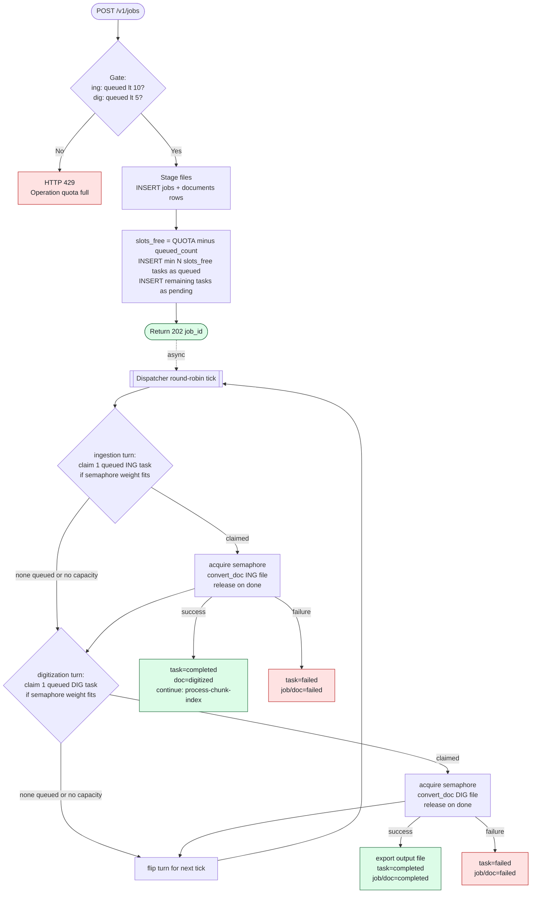
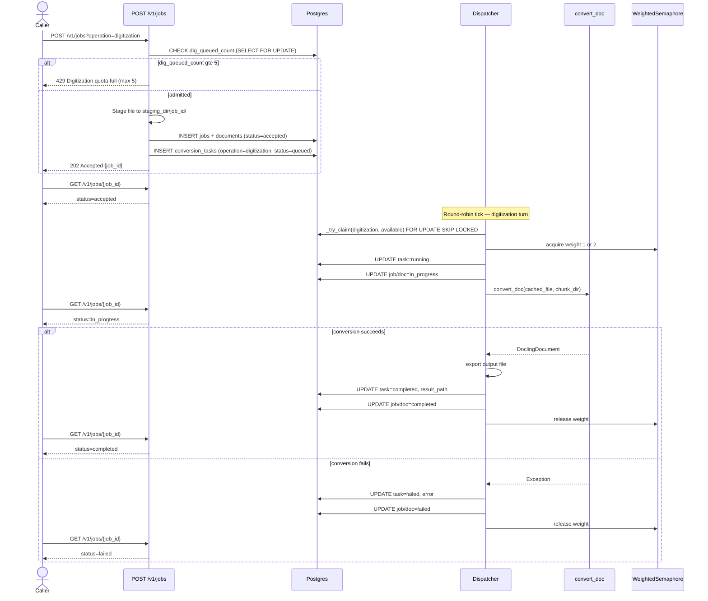
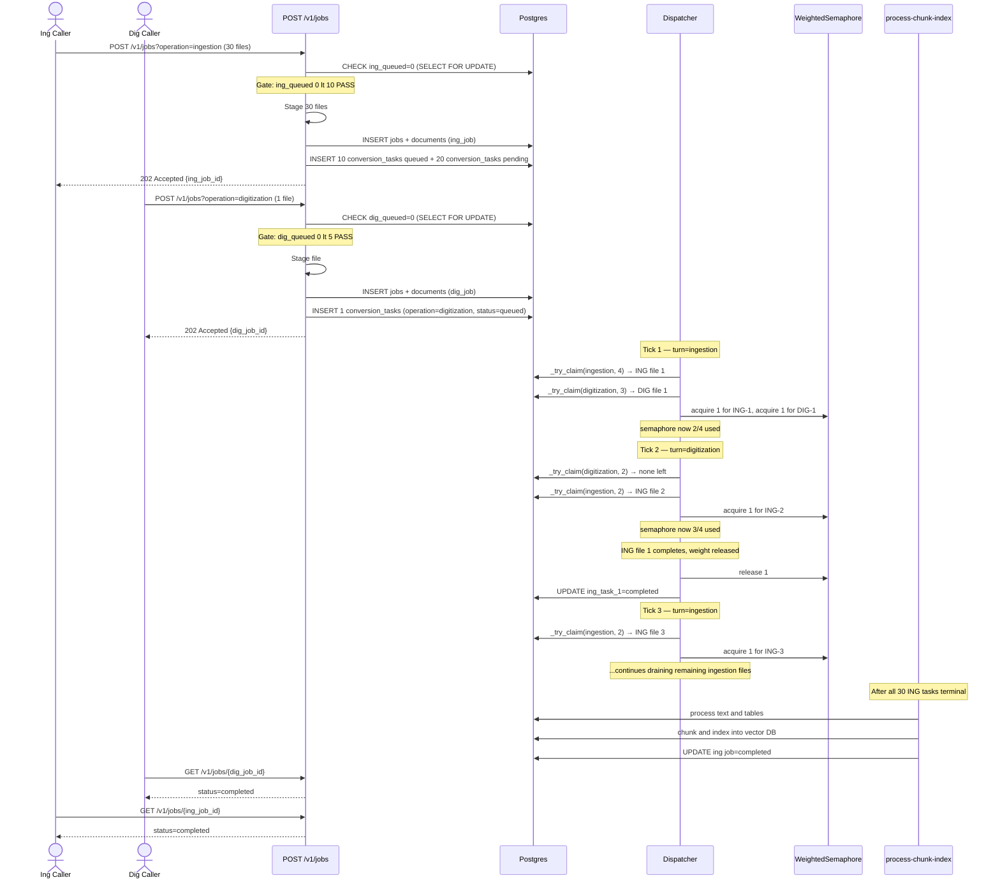
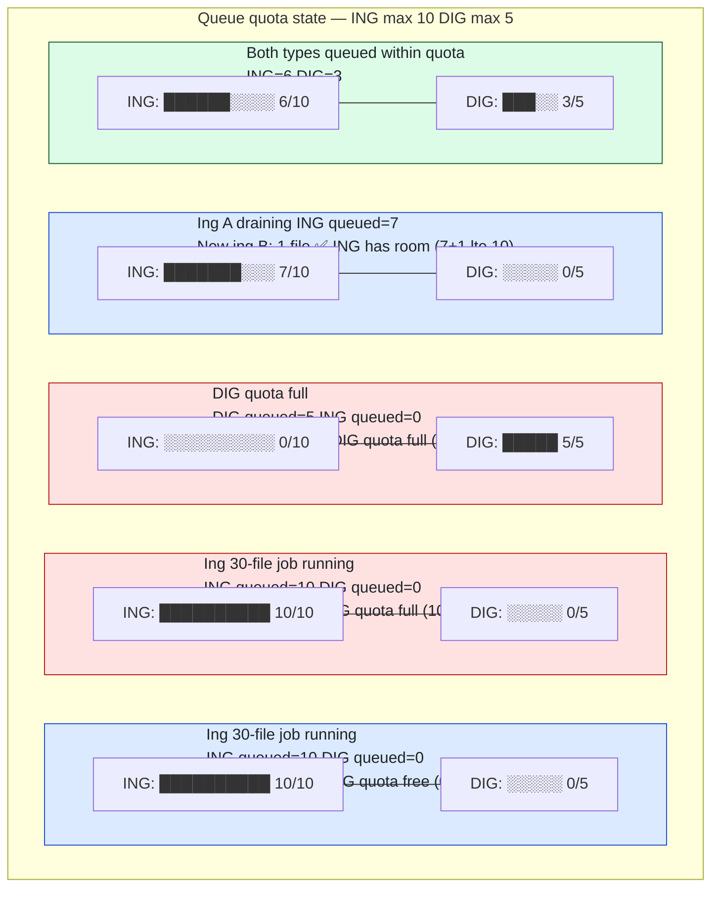
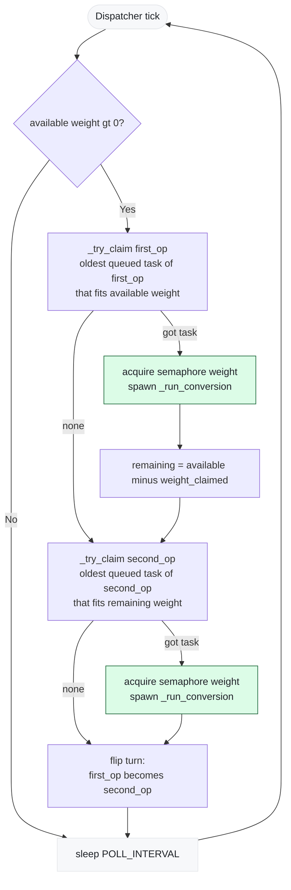
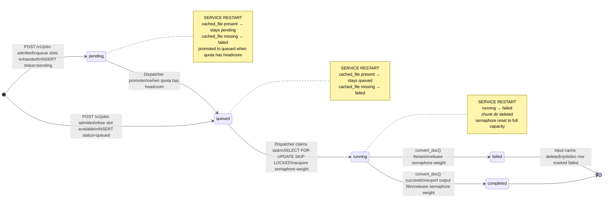

# Docling Conversion Queue — Design Proposal

## Executive Summary

This document proposes adding a shared, Postgres-backed conversion queue **inside the existing
`digitize` service** so that `convert_doc()` runs under a globally capped, weighted semaphore
that is durable across restarts.

**Motivation**

`convert_doc()` in `services/digitize/parsing/converter.py` is a CPU-heavy Docling operation
currently consumed directly by two pipelines:

- **Digitization** — `pipeline/digitize.py` → `convert_document_format()`
- **Ingestion** — `processing/orchestrator.py` → `convert_document()`

Three new consumers are planned:

- **Data Source Connectors** — sync remote data sources into the vector DB by running the
  ingestion pipeline. They have their own API endpoints, their own DB table, and their own
  concurrency limits, but they call the same `processing/orchestrator.py` → `convert_doc()`
  path that `POST /v1/jobs` (ingestion) uses today.
- **Extract & Tag service** — runs the full digitization pipeline (including Docling
  conversion) so it can attach a `doc_id` to a digitize document record. It therefore calls
  the same `pipeline/digitize.py` → `convert_doc()` path that `POST /v1/jobs` (digitization)
  uses today.
- **Translation service** — converts PDF and DOCX files to Markdown format via the digitize
  service. It calls `POST /v1/jobs?operation=digitization`, receives a `job_id`, and polls
  `GET /v1/jobs/{job_id}` for the resulting Markdown output.

Both new consumers reach `convert_doc()` through the **same existing pipeline functions** —
they do not bypass them. The problem is purely that neither consumer can share the conversion
capacity budget with each other or with the API-driven pipelines, because that budget is
currently enforced at the request-admission layer (`workers/concurrency.py`) rather than at
the conversion layer.

Rather than introducing a new microservice (which would add deployment, networking, and auth
complexity), this proposal extends the digitize service with a conversion sub-queue that any
internal pipeline — regardless of which entry point triggered it — can enqueue work onto.

---

## Current State

### Where `convert_doc` is called today

| Caller | File | Mechanism |
|---|---|---|
| Digitization pipeline | `pipeline/digitize.py:60` | `ProcessPoolExecutor(max_workers=1)` → `convert_document_format()` |
| Ingestion pipeline | `processing/orchestrator.py:532` | `ProcessPoolExecutor(max_workers=N)` → `convert_document()` |

### Current concurrency control

`workers/concurrency.py` exposes a `ConcurrencyManager` with two `asyncio.BoundedSemaphore`
instances — one per operation type — controlled at the **API layer** in
`api/v1/jobs.py`.  Limits are:

- Ingestion: `ingestion_concurrency_limit` (default **1**)
- Digitization: `digitization_concurrency_limit` (default **2**)

This is request-level gating, not file-level.  Once a request is admitted it can start as
many `ProcessPoolExecutor` workers as the batch size allows, and there is no cap shared across
the Digitization and Ingestion paths or accessible to future consumers.

### Problems with the current approach

1. **No shared capacity budget** — a large ingestion batch and a concurrent digitization
   request each spawn their own process pools; combined CPU load can exceed what the node can
   sustain. Data Source Connectors and Extract & Tag will add two more uncoordinated
   process pools on top.
2. **Entry-point-specific gating** — the `ConcurrencyManager` semaphores are only acquired
   inside `api/v1/jobs.py`. A Data Source Connector going directly into the ingestion
   pipeline, or Extract & Tag going directly into the digitize pipeline, bypasses them
   entirely.
3. **Not durable** — if the process crashes mid-conversion, in-flight work is silently
   dropped; the job recovery in `utils/recovery.py` marks the job failed but cannot re-run
   the conversion.
4. **No queue depth limit** — a flood of requests could queue an unbounded number of
   `ProcessPoolExecutor` jobs in memory.

---

## Proposed Design

### 1. New Postgres table — `conversion_tasks`

One table added to the existing schema (managed by `Base.metadata.create_all` on startup).

```sql
CREATE TABLE conversion_tasks (
    task_id         VARCHAR(255)  PRIMARY KEY,
    -- link back to the digitize job/doc that owns this task
    job_id          VARCHAR(255)  REFERENCES jobs(job_id) ON DELETE SET NULL,
    doc_id          VARCHAR(255),                  -- digitize document id; informational
    operation       VARCHAR(50)   NOT NULL         -- 'ingestion' | 'digitization'
                    CHECK (operation IN ('ingestion','digitization')),
    -- input
    cached_file     TEXT          NOT NULL,        -- absolute path written at enqueue time
    output_format   VARCHAR(10)   NOT NULL
                    CHECK (output_format IN ('json','md','txt')),
    page_count      INTEGER,                       -- filled in during enqueue
    is_large        BOOLEAN       NOT NULL DEFAULT FALSE,
    -- lifecycle
    status          VARCHAR(50)   NOT NULL
                    CHECK (status IN ('pending','queued','running','completed','failed')),
    result_path     TEXT,                          -- written on completion
    error           TEXT,
    queued_at       TIMESTAMPTZ   NOT NULL DEFAULT now(),
    started_at      TIMESTAMPTZ,
    completed_at    TIMESTAMPTZ,
    updated_at      TIMESTAMPTZ   NOT NULL DEFAULT now()
);

CREATE INDEX idx_ct_status_op_queued ON conversion_tasks (status, operation, queued_at);
```

`is_large` is derived from `page_count >= heavy_doc_page_threshold` at enqueue time and
stored so the dispatcher can make a semaphore-weight decision from a single DB read.

`operation` is stored directly so the dispatcher can query by operation type without
joining to the `jobs` table on every poll cycle.

#### Admission check

One validation gate is evaluated before any DB rows are written. If the gate fails the
request is rejected with HTTP 429; no `jobs`, `documents`, or `conversion_tasks` rows are
created.

The semaphore is an **execution-time** resource managed exclusively by the dispatcher. It
is never checked at admission time — a task admitted to the queue does not need a semaphore
slot until the dispatcher promotes it to `running`. Checking semaphore headroom at admission
would incorrectly reject new tasks when all workers are busy even though the queue still has
space.

**Gate — Per-operation queue quota**

Each operation type has its own independent quota on how many tasks may sit in `queued`
status at once. The check asks: *is there at least one free slot?* — not whether all N new
tasks fit.

| Operation | Queue quota | Rationale |
|---|---|---|
| `ingestion` | **10** queued slots | A job can have many files; 10 gives enough buffer for large batches |
| `digitization` | **5** queued slots | Each job is exactly 1 file; 5 concurrent waiting jobs is sufficient |

```python
# Inside a SELECT … FOR UPDATE transaction
ing_queued  = COUNT WHERE status='queued' AND operation='ingestion'
dig_queued  = COUNT WHERE status='queued' AND operation='digitization'

ING_QUOTA = 10   # settings.digitize.ingestion_queue_quota
DIG_QUOTA = 5    # settings.digitize.digitization_queue_quota

if operation == 'ingestion'    and ing_queued >= ING_QUOTA:
    raise HTTP 429  # ingestion queue quota full — no free slot
if operation == 'digitization' and dig_queued >= DIG_QUOTA:
    raise HTTP 429  # digitization queue quota full — no free slot
```

The quota guards against a completely saturated queue; it does **not** require that all N
new tasks fit. A 30-file ingestion is accepted if `ing_queued < ING_QUOTA` — at least one
slot is free. Tasks up to the quota are inserted as `queued`; any remainder are inserted as
`pending`. The dispatcher only picks `queued` tasks; it promotes `pending → queued` as
running tasks complete and quota headroom opens up.

The gate executes inside a single DB transaction (`SELECT … FOR UPDATE`) to prevent races.

---

### 2. Weighted semaphore — `workers/conversion_semaphore.py`

A new module alongside the existing `workers/concurrency.py`.

```
workers/
  concurrency.py           ← existing; unchanged
  conversion_semaphore.py  ← new
```

#### Weight rule

| File | Page threshold | Semaphore weight | Max concurrent at capacity 4 |
|---|---|---|---|
| Normal | ≤ 500 pages | 1 | 4 files |
| Large | > 500 pages | 2 | 2 files |
| 1 large + 2 normal | — | 2+1+1 = 4 | mixed |
| 2 large | — | 2+2 = 4 | mixed |

Total capacity is 4 units, matching the existing `doc_worker_size = 4` default.
Large-file capacity matches `heavy_doc_convert_worker_size = 2`.

```python
# workers/conversion_semaphore.py

import asyncio
from digitize.settings import settings


class WeightedSemaphore:
    """Capacity-based semaphore; each acquire consumes `weight` units."""

    def __init__(self, capacity: int) -> None:
        self._capacity = capacity
        self._available = capacity
        self._cond = asyncio.Condition()

    @property
    def available(self) -> int:
        return self._available

    async def acquire(self, weight: int) -> None:
        async with self._cond:
            await self._cond.wait_for(lambda: self._available >= weight)
            self._available -= weight

    async def release(self, weight: int) -> None:
        async with self._cond:
            self._available += weight
            self._cond.notify_all()


# Module-level singleton — capacity mirrors doc_worker_size so existing
# ProcessPoolExecutor pools and this semaphore agree on the budget.
conversion_semaphore = WeightedSemaphore(
    capacity=settings.digitize.doc_worker_size  # default 4
)
```

---

### 3. Entry point — `api/v1/jobs.py` (existing endpoint, extended)

`POST /v1/jobs` is the entry point for both operations. It validates the file, stages it,
creates the job/doc DB records, inserts `conversion_tasks` rows, and returns a `job_id`
immediately with `202 Accepted`. The only change from today is **what happens after the
job is accepted** — the endpoint returns immediately and the dispatcher drives execution.

#### Current flow (digitization)

```
POST /v1/jobs?operation=digitization
  → acquire semaphore slot immediately
  → stage file
  → background_tasks.add_task(_run_digitize, ...)   # starts conversion right now
  → return { "job_id": "..." }
```

#### Proposed flow (both operations)

Both operations go through **one** validation gate **before** any DB rows are written.
Only after the gate passes are the `jobs`, `documents`, and `conversion_tasks` rows created.

```
POST /v1/jobs?operation=digitization  (1 file)
  → [GATE] check dig_queued_count < DIG_QUOTA (5), else HTTP 429
  → stage file
  → INSERT jobs + documents rows
  → INSERT 1 conversion_tasks row (status=queued)
  → return { "job_id": "..." }

POST /v1/jobs?operation=ingestion  (N files)
  → [GATE] check ing_queued_count < ING_QUOTA (10), else HTTP 429
  → stage N files
  → INSERT jobs + documents rows
  → slots_available = ING_QUOTA - ing_queued_count          # free queue slots
  → INSERT min(N, slots_available) conversion_tasks rows (status=queued)
  → INSERT remaining conversion_tasks rows (status=pending) if N > slots_available
  → return { "job_id": "..." }
```

The gate only requires **at least one free slot** in the queue — the caller is not rejected
because N exceeds the remaining quota. Tasks that fit fill as `queued`; the rest are
`pending`. The dispatcher promotes `pending → queued` as running tasks complete and quota
headroom opens up. This lets a 30-file ingestion batch be accepted in one request without
atomically reserving all 30 slots.

The existing `has_active_jobs()` hard block at [`jobs.py:174`](services/digitize/api/v1/jobs.py:174)
and the `ConcurrencyManager` semaphores at lines 185–199 are both removed. The
`_run_ingest` and `_run_digitize` background tasks are removed — the dispatcher drives
all execution.

#### Admission decision table

`ING_QUOTA = 10`. `DIG_QUOTA = 5`. The gate passes if at least one free slot exists (`queued < QUOTA`). Admitted jobs with N > free slots get `min(N, free_slots)` tasks as `queued`, the rest as `pending`. The semaphore is irrelevant at admission — the dispatcher acquires it when promoting a task to `running`.

| Scenario | Ing queued | Dig queued | Decision |
|---|---|---|---|
| New ingestion job, quota has space | 3 | — | ✅ Accept (Gate: ing_queued 3 < 10) |
| New digitization job, quota has space | — | 2 | ✅ Accept (Gate: dig_queued 2 < 5) |
| New digitization while large ING batch is running and queued | — | 0 | ✅ Accept (Gate: dig_queued 0 < 5); ING queue state is irrelevant |
| New digitization job, DIG quota full | — | 5 | ❌ Reject (Gate: dig_queued 5 >= 5) |
| New ingestion job, ING quota full | 10 | — | ❌ Reject (Gate: ing_queued 10 >= 10) |
| All semaphore units busy, quota has space | 0 | 0 | ✅ Accept (Gate: quota free); tasks enter queue, dispatcher promotes when a slot frees |
| New ing B: 30 files, only 7 ING slots free | 3 | — | ✅ Accept (Gate: 3 < 10); 7 tasks → queued, 23 → pending |

Key: the two quotas are completely independent. A 30-file ingestion filling its 10-slot quota
has zero effect on the digitization quota. Up to 5 digitization tasks can queue concurrently
regardless of how many ingestion files are waiting.

#### `GET /v1/jobs/{job_id}` — unchanged

The response shape and status progression (`accepted` → `in_progress` → `completed`/`failed`)
are identical. The dispatcher updates the `jobs` and `documents` rows directly using the
`job_id` and `doc_id` stored in the `conversion_tasks` row, so the status surfaces through
the existing endpoint with no change to the caller.

---

### 4. Dispatcher — `workers/conversion_dispatcher.py`

A long-running `asyncio` task started in `app.py`'s `lifespan`.

#### Round-robin pick strategy

On each poll tick the dispatcher alternates between operation types — it claims one
ingestion task and one digitization task per iteration (subject to semaphore capacity),
then loops. This ensures that a large ingestion job with 30 queued files never starves a
waiting digitization task, because every other slot is reserved for the other type.

If only one operation type has queued tasks, the dispatcher claims tasks from that type
alone — the round-robin degrades gracefully to single-type FIFO when the other side is
empty.

##### Walk-throughs

`SEMAPHORE_CAPACITY = 4` · `ING_QUOTA = 10` · `DIG_QUOTA = 5`.
`N` = normal file (weight 1) · `L` = large file (weight 2).

---

**Scenario A — ING head is a large file blocked on capacity; DIG head is a normal file**

Both queues are full (`ING queued=10`, `DIG queued=5`). All 4 semaphore units are
occupied by running tasks. The ING queue head is `L` (weight 2); the DIG queue head is
`N` (weight 1). `turn=ingestion`.

The scenario plays out differently depending on whether a large or a normal running file
finishes first.

*Sub-case A1 — one of the two normal running files completes (releases 1 unit):*

```
semaphore: 0/4 → 1/4 free

Tick 1  turn=ingestion  available=1
  first=ingestion   first_head=L   first_needed=2
  _try_claim(ingestion,  1) → ING-L needs 2, does not fit → None   first_task=None
  budget_for_second = max(0, 1 − 2) = 0
  _try_claim(digitization, 0) → DIG-N needs 1, budget=0 → None   second_task=None
  nothing claimed → semaphore stays 1/4 free
  first_task is None → turn does NOT flip, _rr_turn stays ingestion
  sleep POLL_INTERVAL
```

The single free unit is **not** given to DIG-N. It is held in reserve for ING-L.
Both types wait for a second unit to free up.

*Sub-case A1 continues — the second normal running file completes (releases 1 more unit):*

```
semaphore: 1/4 → 2/4 free

Tick 2  turn=ingestion  available=2
  first=ingestion   first_head=L   first_needed=2
  _try_claim(ingestion,  2) → ING-L (weight 2, fits) → claimed   first_task=ING-L
  budget_for_second = max(0, 2 − 2) = 0
  _try_claim(digitization, 0) → None
  acquire(2) for ING-L → semaphore=0/4 free
  ING-L: queued → running
  first_task is ING-L → turn flips: _rr_turn = digitization
  _promote_pending(ingestion): ING queued 9 → +1 pending → queued=10
```

ING-L runs alone. DIG-N leads next tick and is guaranteed the first pick.

*Sub-case A2 — the large running file completes instead (releases 2 units):*

```
semaphore: 0/4 → 2/4 free

Tick 1  turn=ingestion  available=2
  first=ingestion   first_head=L   first_needed=2
  _try_claim(ingestion,  2) → ING-L (weight 2, fits) → claimed   first_task=ING-L
  budget_for_second = max(0, 2 − 2) = 0
  _try_claim(digitization, 0) → None
  acquire(2) for ING-L → semaphore=0/4 free
  ING-L: queued → running
  first_task is ING-L → turn flips: _rr_turn = digitization
  _promote_pending(ingestion): ING queued 9 → +1 pending → queued=10
```

2 units freed at once is enough for ING-L to run immediately. Same result as A1 but
in a single tick.

---

**Scenario B — Large running file completes; both queue heads are normal files**

Both queues are full (`ING queued=10`, `DIG queued=5`). Running tasks: `1L + 2N`
(total weight 4). `turn=digitization`. The large running file (weight 2) completes.

```
semaphore: 0/4 → 2/4 free

Tick N  turn=digitization  available=2
  first=digitization   first_head=N   first_needed=1
  _try_claim(digitization, 2) → DIG-N1 (weight 1, fits) → claimed   first_task=DIG-N1
  budget_for_second = max(0, 2 − 1) = 1
  _try_claim(ingestion,    1) → ING-N1 (weight 1, fits) → claimed   second_task=ING-N1
  acquire(1) for DIG-N1, acquire(1) for ING-N1 → semaphore=0/4 free
  DIG-N1: queued → running
  ING-N1: queued → running
  first_task is DIG-N1 → turn flips: _rr_turn = ingestion
  _promote_pending(digitization): DIG queued 4 → +1 pending → queued=5
  _promote_pending(ingestion):  ING queued 9 → +1 pending → queued=10
```

Both freed units are consumed in the same tick — one per type in current turn order
(DIG first, ING second). Neither type waits an extra tick. The `pending` backlog
immediately refills both vacated queue slots.

---

```python
# workers/conversion_dispatcher.py
from concurrent.futures import ProcessPoolExecutor

_rr_turn: str = "ingestion"  # module-level state; alternates each tick

# One shared process pool for all conversions.
# max_workers matches SEMAPHORE_CAPACITY so a process is always immediately
# available when the semaphore grants a slot — no queuing inside the pool.
_process_pool = ProcessPoolExecutor(max_workers=SEMAPHORE_CAPACITY)  # 4

async def dispatch_loop() -> None:
    """
    Poll the DB every POLL_INTERVAL seconds.
    Each tick claims at most one task per operation type in round-robin order,
    constrained by available semaphore capacity.

    Head-of-line blocking: if the oldest queued task for an operation type
    is large (weight=2) but only 1 unit is free, the entire operation type
    is skipped for this tick AND the unit is reserved — it is not handed to
    the second operation type.  This prevents a steady stream of normal files
    on the second type from consuming every freed unit one at a time, which
    would starve the large file indefinitely.

    The budget passed to the second type is:
        remaining = available - first_head_needed
    where first_head_needed is the weight the first type's head requires,
    regardless of whether that head was successfully claimed.  If first's head
    needs 2 units and only 1 is available, remaining = -1 → clamped to 0 →
    second gets nothing this tick.  Both types wait for a second unit to free.

    Turn advancement: _rr_turn only flips when the first type successfully
    claimed a task.  If first was blocked, it retains the lead next tick so
    it is not demoted to second while still waiting for capacity.

    create_task returns immediately; _run_conversion runs concurrently.
    The loop does NOT await conversions — it continues to its next sleep
    immediately.  WeightedSemaphore.available reflects in-flight weight,
    so the next tick naturally sees reduced capacity.
    """
    global _rr_turn
    while True:
        available = conversion_semaphore.available
        if available > 0:
            first, second = _rr_turn, _other(_rr_turn)
            claimed = []

            # Peek at first type's head to know how much capacity it needs,
            # whether or not we can claim it right now.
            first_head  = _peek_head(first)
            first_needed = (2 if first_head.is_large else 1) if first_head else 0

            first_task = _try_claim_if_fits(first, available)
            if first_task:
                claimed.append(first_task)

            # Reserve first_needed units for first's head even when it couldn't
            # run.  Only the surplus beyond that reservation is offered to second.
            # This prevents second from consuming the unit(s) that first is
            # waiting to accumulate for a large file.
            budget_for_second = max(0, available - first_needed)
            second_task = _try_claim_if_fits(second, budget_for_second)
            if second_task:
                claimed.append(second_task)

            for task in claimed:
                weight = 2 if task.is_large else 1
                await conversion_semaphore.acquire(weight)
                asyncio.create_task(_run_conversion(task, weight))

            # Only advance the turn when first was successfully claimed.
            # If first was blocked (e.g. its large head needed more capacity
            # than was available), keep first in the lead so it retains
            # priority next tick instead of being demoted to second.
            if first_task:
                _rr_turn = second
        # After each tick, promote pending → queued to backfill quota headroom
        _promote_pending("ingestion",    settings.digitize.ingestion_queue_quota)
        _promote_pending("digitization", settings.digitize.digitization_queue_quota)
        await asyncio.sleep(settings.digitize.conversion_poll_interval)

def _other(op: str) -> str:
    return "digitization" if op == "ingestion" else "ingestion"


async def _run_conversion(task: ConversionTask, weight: int) -> None:
    try:
        if not Path(task.cached_file).exists():
            db_manager.update_task_status(task.task_id, "failed",
                                          error="Cached input file missing")
            return

        db_manager.update_task_status(task.task_id, "running")

        out_dir   = Path(task.cached_file).parent
        chunk_dir = out_dir / "chunks"

        # convert_doc is CPU-bound Docling work that does not release the GIL.
        # asyncio.to_thread would run it on a thread and cause GIL contention
        # between concurrent conversions — they would not actually run in
        # parallel.  run_in_executor with a ProcessPoolExecutor spawns a child
        # process for each conversion, giving true CPU parallelism exactly as
        # the existing pipeline/digitize.py and processing/orchestrator.py do.
        # convert_doc must be a top-level importable function (picklable) —
        # it already satisfies this requirement.
        loop = asyncio.get_running_loop()
        doc: DoclingDocument = await loop.run_in_executor(
            _process_pool,
            convert_doc,
            task.cached_file,
            chunk_dir,
        )

        result_path = out_dir / f"output.{task.output_format}"
        _export(doc, result_path, task.output_format)   # json / md / txt

        db_manager.update_task_status(
            task.task_id, "completed", result_path=str(result_path)
        )
    except Exception as exc:
        db_manager.update_task_status(task.task_id, "failed", error=str(exc))
    finally:
        # Clean up cached input; result_path is kept until the user deletes or exports it
        _safe_remove(task.cached_file)
        await conversion_semaphore.release(weight)
```

#### Atomic DB claim — per operation type

`_try_claim_if_fits(operation, available)` enforces **head-of-line blocking**: it peeks at
the oldest queued task for the operation type and returns `None` immediately if that task's
weight exceeds `available`. It does **not** skip over it to claim a lighter task behind it.

The `available` budget passed in for the *second* operation type is already reduced by how
much the *first* type's head needs — even when the first type couldn't run. This ensures
the units a blocked large file is waiting to accumulate are never silently consumed by the
other type.

```python
def _try_claim_if_fits(operation: str, available: int) -> ConversionTask | None:
    # Step 1: peek at head-of-line (read-only, no lock yet)
    head = _peek_head(operation)
    if head is None:
        return None                            # nothing queued for this type

    needed = 2 if head.is_large else 1
    if needed > available:
        return None                            # head can't run yet — hold the line
                                               # do NOT claim anything behind it

    # Step 2: atomically claim the head task
    return _claim_head(operation)
```

`_peek_head` is a plain `SELECT` (no lock); `_claim_head` does the atomic
`SELECT … FOR UPDATE SKIP LOCKED` + `UPDATE status='running'`:

```sql
-- _peek_head('ingestion') — read-only, no lock
SELECT task_id, is_large
FROM   conversion_tasks
WHERE  status    = 'queued'
  AND  operation = :operation
ORDER BY queued_at
LIMIT  1;

-- _claim_head('ingestion') — atomic claim
UPDATE conversion_tasks
SET    status = 'running', started_at = now()
WHERE  task_id = (
    SELECT task_id
    FROM   conversion_tasks
    WHERE  status    = 'queued'
      AND  operation = :operation
    ORDER BY queued_at
    LIMIT  1
    FOR UPDATE SKIP LOCKED
)
RETURNING *;
```

Each call claims at most one task. The dispatcher calls it twice per tick — once for each
operation type — so at most two tasks are promoted to `running` per poll interval, capped
by the semaphore.

**Why head-of-line blocking is the right tradeoff**

A large file at the head of the queue holds back smaller files behind it until two semaphore
units are free simultaneously. The reserved-budget rule extends this to the second operation
type: the units a blocked large file is waiting for are withheld from the other type too,
not just from smaller files behind it in the same queue. This is intentional:

- Without reservation, a normal file on the second type would consume the single free unit,
  the large file would still be blocked, and the pattern would repeat every tick — indefinite
  starvation even though no same-type file jumped the queue.
- With reservation, the worst case is one poll interval of idle capacity (one unit sits
  unused while waiting for the second to free), which is bounded and predictable.
- Callers are already told at admission time whether their file is large — they accept the
  queuing contract when the request is accepted.

`_promote_pending(operation, quota)` runs after each tick inside a single transaction:

```sql
-- Promote as many pending tasks as will fit under the quota
UPDATE conversion_tasks
SET    status = 'queued', queued_at = now()
WHERE  task_id IN (
    SELECT task_id
    FROM   conversion_tasks
    WHERE  status    = 'pending'
      AND  operation = :operation
    ORDER BY queued_at          -- preserve original submission order
    LIMIT  GREATEST(0,
               :quota - (SELECT COUNT(*) FROM conversion_tasks
                         WHERE status = 'queued' AND operation = :operation))
);
```

This keeps the `queued` count for each operation type ≤ `QUOTA` while draining the
`pending` backlog in first-submitted-first-promoted order.

---

### 5. Lifespan integration — `app.py`

```python
@asynccontextmanager
async def lifespan(app: FastAPI):
    # ... existing startup (DB, language detector, zombie recovery) ...

    # Start conversion dispatcher
    from digitize.workers.conversion_dispatcher import dispatch_loop
    dispatcher_task = asyncio.create_task(dispatch_loop())
    logger.info("✅ Conversion dispatcher started")

    yield

    dispatcher_task.cancel()
    # ... existing shutdown ...
```

---

### 6. Restart & Recovery

Mirrors the existing `recover_zombie_jobs()` pattern in `utils/recovery.py`.

A new `recover_conversion_tasks()` function runs in the same startup block:

```python
def recover_conversion_tasks() -> None:
    """
    On startup:
      - running  → failed  (process died mid-conversion; chunk state unknown)
      - queued   → keep    (cached file verified; dispatcher will pick them up)
               → failed  (cached file missing; nothing to run)
    """
    # 1. running → failed
    running_tasks = db_manager.get_conversion_tasks(status="running")
    for task in running_tasks:
        _safe_rmtree(Path(task.cached_file).parent / "chunks")
        db_manager.update_task_status(
            task.task_id, "failed",
            error="Service restarted during conversion"
        )
        logger.warning(f"Recovery: task {task.task_id} running→failed")

    # 2. queued — verify cached file
    queued_tasks = db_manager.get_conversion_tasks(status="queued")
    for task in queued_tasks:
        if not Path(task.cached_file).exists():
            db_manager.update_task_status(
                task.task_id, "failed",
                error="Cached input file lost during restart"
            )
            logger.warning(f"Recovery: task {task.task_id} queued→failed (file lost)")
        else:
            logger.info(f"Recovery: task {task.task_id} re-queued (file intact)")
```

#### Why running tasks cannot be resumed

`convert_doc()` processes documents in 100-page chunks and merges them.
If the process crashes after writing some chunk JSON files, the merge step has not run
and the partial chunk state is unreliable.  The existing `finally: shutil.rmtree(chunk_cache_dir)`
pattern in `converter.py` cleans up on failure; recovery follows the same approach.
Re-running is safe because `convert_doc` is deterministic for the same input.

#### File retention policy

| Event | Input cache | Output file |
|---|---|---|
| Task completes | Deleted immediately | Kept permanently until the user deletes or exports it |
| Task fails | Deleted | N/A |
| Startup: `running` → `failed` | `chunks/` dir deleted; input deleted | N/A |
| Startup: `queued`, file present | Kept (job will run) | N/A |
| Startup: `queued`, file missing | N/A | N/A |

Output files are **not** auto-deleted. They persist until the user explicitly deletes or
exports the result. There is no background TTL reaper for completed output files.

---

### 7. Migrating existing pipelines to use the queue

The two existing callers insert directly into `conversion_tasks` via `db/manager.py` — no
HTTP round-trip. The dispatcher picks the tasks up and drives execution.

#### `pipeline/digitize.py`

The `conversion_tasks` row for the digitization job is already inserted by `POST /v1/jobs`
at admission time. The digitize pipeline no longer owns the conversion step — it simply
looks up the `conversion_tasks` row for its `job_id` and polls until the dispatcher marks
it terminal.

Current:
```python
with ProcessPoolExecutor(max_workers=1) as executor:
    future = executor.submit(convert_document_format, str(file_path), out_path, doc_id, output_format)
    output_file, conversion_time = future.result()
```

Proposed:
```python
# The conversion_tasks row was inserted by POST /v1/jobs — no enqueue here.
# Retrieve the task_id for this job and poll until the dispatcher completes it.
task = db_manager.get_conversion_task_by_job_id(job_id)
while task.status not in ("completed", "failed"):
    await asyncio.sleep(settings.digitize.conversion_poll_interval)
    task = db_manager.get_conversion_task_by_job_id(job_id)
if task.status == "failed":
    raise RuntimeError(task.error)
output_file, conversion_time = task.result_path, task.conversion_time
```

#### `processing/orchestrator.py`

The `conversion_tasks` rows for every file in the ingestion job are inserted by
`POST /v1/jobs` at admission time. `process_documents` reads them and
**reacts as each task reaches a terminal state**, driving the downstream stages
(process → chunk → index) for that file immediately.

The `ProcessPoolExecutor` used today for `convert_document()`, the light/heavy
`_run_batch` split, and the `conversion_futures` dict are all removed. The dispatcher
owns CPU parallelism; `process_documents` owns the in-process post-conversion pipeline.

The function becomes `async` so it can `await asyncio.sleep()` inside the poll loop.

```python
async def process_documents(
    input_paths, out_path, llm_model, llm_endpoint, emb_endpoint,
    max_tokens, job_id, doc_id_dict, indexing_callback=None
):
    """
    Drive the post-conversion pipeline (process → chunk → index) for every
    file in the ingestion job.

    conversion_tasks rows were already inserted by POST /v1/jobs at admission
    time.  This function polls their status and reacts as each one reaches a
    terminal state, feeding completed conversions into the downstream in-process
    pipeline immediately rather than waiting for all conversions to finish first.
    """
    status_mgr = get_status_manager(job_id)

    # Build task_id → path lookup from the rows already in conversion_tasks.
    # db_manager.get_conversion_tasks_by_job_id returns all rows for the job.
    tasks = db_manager.get_conversion_tasks_by_job_id(job_id)
    task_id_to_path = {t.task_id: p for t, p in
                       zip(tasks, input_paths)}  # aligned by insertion order

    pending_task_ids = set(task_id_to_path)
    process_futures  = {}
    chunk_futures    = {}
    indexing_futures = {}

    with ContextAwareThreadPoolExecutor(max_workers=WORKER_SIZE) as processor_executor, \
         ContextAwareThreadPoolExecutor(max_workers=WORKER_SIZE) as chunker_executor,   \
         ContextAwareThreadPoolExecutor(max_workers=WORKER_SIZE) as indexer_executor:

        while pending_task_ids or process_futures or chunk_futures or indexing_futures:

            # --- A. React to completed/failed conversion tasks ---
            for task_id in list(pending_task_ids):
                task = db_manager.get_conversion_task(task_id)
                path = task_id_to_path[task_id]
                doc_id = doc_id_dict.get(Path(path).name)

                if task.status == "completed":
                    pending_task_ids.discard(task_id)
                    status_mgr.update_doc_metadata(doc_id, {"status": DocStatus.DIGITIZED, ...})
                    status_mgr.update_job_progress(doc_id, DocStatus.DIGITIZED, JobStatus.IN_PROGRESS)
                    p_future = processor_executor.submit(
                        process_converted_document, task.result_path, path,
                        out_path, llm_model, llm_endpoint, emb_endpoint, max_tokens, doc_id=doc_id
                    )
                    process_futures[p_future] = path

                elif task.status == "failed":
                    pending_task_ids.discard(task_id)
                    status_mgr.update_doc_metadata(doc_id, {"status": DocStatus.FAILED},
                                                   error=task.error)
                    status_mgr.update_job_progress(doc_id, DocStatus.FAILED, JobStatus.IN_PROGRESS)

            # --- B. Drain completed process futures → submit chunking ---
            for fut in list(process_futures):
                if not fut.done():
                    continue
                path = process_futures.pop(fut)
                doc_id = doc_id_dict.get(Path(path).name)
                try:
                    txt_json, tab_json, pgs, tabs, timings, doc_lang = fut.result()
                    status_mgr.update_doc_metadata(doc_id, {"status": DocStatus.PROCESSED, ...})
                    c_future = chunker_executor.submit(
                        chunk_single_file, txt_json, tab_json, out_path,
                        emb_endpoint, max_tokens, doc_id=doc_id, language=doc_lang
                    )
                    chunk_futures[c_future] = path
                except Exception as e:
                    status_mgr.update_doc_metadata(doc_id, {"status": DocStatus.FAILED}, error=str(e))
                    status_mgr.update_job_progress(doc_id, DocStatus.FAILED, JobStatus.IN_PROGRESS)

            # --- C. Drain completed chunk futures → submit indexing ---
            for fut in list(chunk_futures):
                if not fut.done():
                    continue
                path = chunk_futures.pop(fut)
                doc_id = doc_id_dict.get(Path(path).name)
                try:
                    text_chunk_json, table_chunk_json, total_time = fut.result()
                    status_mgr.update_doc_metadata(doc_id, {"status": DocStatus.CHUNKED, ...})
                    if indexing_callback:
                        doc_chunks = merge_chunked_documents(text_chunk_json, table_chunk_json, path)
                        for chunk in doc_chunks:
                            chunk["doc_id"] = doc_id
                        index_future = indexer_executor.submit(indexing_callback, doc_id, doc_chunks, path)
                        indexing_futures[index_future] = doc_id
                except Exception as e:
                    status_mgr.update_doc_metadata(doc_id, {"status": DocStatus.FAILED}, error=str(e))
                    status_mgr.update_job_progress(doc_id, DocStatus.FAILED, JobStatus.IN_PROGRESS)

            # --- D. Drain completed indexing futures ---
            for fut in list(indexing_futures):
                if not fut.done():
                    continue
                doc_id = indexing_futures.pop(fut)
                try:
                    fut.result()
                except Exception as e:
                    logger.error(f"Indexing failed for {doc_id}: {e}", exc_info=True)

            await asyncio.sleep(settings.digitize.conversion_poll_interval)
```

**Key design properties:**

- **No `ProcessPoolExecutor` in orchestrator** — conversion CPU work is fully owned by the
  dispatcher. The orchestrator runs only in-process I/O-bound work (process, chunk, index).
- **No light/heavy split** — `_run_batch` is removed. The dispatcher's semaphore weights and
  round-robin already handle large vs normal files; the orchestrator sees only a flat set of
  `task_id`s to watch.
- **Reactive, not blocking** — as soon as a conversion completes, its downstream stages start
  immediately. Files that convert fast are not held back waiting for slower ones.
- **Single poll loop** — the `while` condition covers all four in-flight collections; the loop
  exits only when every stage for every file has reached a terminal state.
- **Status updates unchanged** — `DocStatus` transitions (`IN_PROGRESS → DIGITIZED → PROCESSED
  → CHUNKED`) and `status_mgr` calls are identical to today; only the trigger changes from
  `Future.result()` to `task.status == "completed"`.

#### Data Source Connectors

Data Source Connectors drive the **ingestion pipeline** — they sync remote data sources into
the vector DB via `processing/orchestrator.py`, the same path used by `POST /v1/jobs`
(ingestion). They have their own entry-point, their own API surface, and their own
concurrency limits, but the point where conversion is triggered is identical.

Under this proposal nothing changes for them structurally: their ingestion-pipeline call
lands in the same `processing/orchestrator.py` → `process_documents()` path that the
`POST /v1/jobs` ingestion flow uses. All conversions — regardless of which entry point
triggered ingestion — share the same `conversion_tasks` queue and `WeightedSemaphore`.

#### Extract & Tag

Extract & Tag needs to run the full digitization pipeline (`pipeline/digitize.py`) and must
reference a `doc_id` from an existing digitize document record. It therefore calls
`POST /v1/jobs?operation=digitization` exactly as any other caller does — it gets a `job_id`
back and polls `GET /v1/jobs/{job_id}` for the result. The `conversion_tasks` row inserted
by that job carries both `job_id` and `doc_id`, giving Extract & Tag the reference it needs.

---

### 8. New settings

Added to `DigitizeConfig` in `settings.py`:

| Field | Env var | Default | Purpose |
|---|---|---|---|
| `ingestion_queue_quota` | `DIGITIZE_INGESTION_QUEUE_QUOTA` | `10` | Max queued ingestion tasks (multi-file jobs) |
| `digitization_queue_quota` | `DIGITIZE_DIGITIZATION_QUEUE_QUOTA` | `5` | Max queued digitization tasks (1 file per job) |
| `conversion_poll_interval` | `DIGITIZE_CONVERSION_POLL_INTERVAL` | `2` | Dispatcher poll interval (s) |

`doc_worker_size` (default 4) continues to serve as the semaphore capacity.
`heavy_doc_page_threshold` (default 500) is reused as the large-file boundary.
The two quotas are independent — each operation type has its own quota field.

---

### 9. File change summary

| File | Change |
|---|---|
| `db/models.py` | Add `ConversionTask` ORM model with `operation` column |
| `db/manager.py` | Add `ConversionTask` CRUD + `_try_claim(operation, available)` + `get_queued_count_by_op()` |
| `settings.py` | Add `ingestion_queue_quota`, `digitization_queue_quota`, `conversion_poll_interval` to `DigitizeConfig` |
| `workers/conversion_semaphore.py` | **New** — `WeightedSemaphore` |
| `workers/conversion_dispatcher.py` | **New** — round-robin dispatcher loop + `_run_conversion` |
| `utils/recovery.py` | Add `recover_conversion_tasks()` |
| `api/v1/jobs.py` | Replace `ConcurrencyManager` semaphore + background task dispatch with per-op quota check + `conversion_tasks` INSERT per file. Remove `has_active_jobs()` call. |
| `app.py` | Start dispatcher task in `lifespan`; call `recover_conversion_tasks()` on startup |
| `pipeline/digitize.py` | Remove `ProcessPoolExecutor` wrapper; call `convert_doc()` directly (dispatcher holds semaphore) |
| `processing/orchestrator.py` | Remove `ProcessPoolExecutor` + light/heavy `_run_batch` split; make `process_documents` async; poll `conversion_tasks` rows (inserted by `POST /v1/jobs`) reactively — feed each completed conversion immediately into process → chunk → index |
| `parsing/converter.py` | No changes to `convert_doc()` itself |
| `workers/concurrency.py` | Remove entirely — superseded by `WeightedSemaphore` + per-op quotas |

---

### 10. Concurrency model after the change

```
POST /v1/jobs (any operation, N files)
  └─ per-op quota check: ing_queued < 10  OR  dig_queued < 5
       else → HTTP 429
  └─ INSERT N conversion_tasks rows (operation=X, status=queued or pending)
  └─ return { "job_id": "..." }

dispatcher loop (every POLL_INTERVAL seconds)
  turn = ingestion
  └─ _try_claim('ingestion',  available)  → claim oldest queued ingestion task if semaphore fits
  └─ _try_claim('digitization', remaining) → claim oldest queued digitization task if semaphore fits
  └─ each claimed task: acquire semaphore → convert_doc() → release → continue pipeline
  turn flips to digitization on next tick
```

**Key properties:**
- Admission checks queue quota only — the semaphore is never inspected at request time. Tasks are always accepted if the queue has space, even when all workers are busy.
- All `convert_doc()` calls share one `WeightedSemaphore` — total concurrency capped at 4 units.
- Independent quotas (ingestion: 10, digitization: 5) mean a large ingestion batch never fills the digitization queue; at most 5 digitization jobs can queue concurrently.
- Round-robin dispatch guarantees that if both types have queued tasks, they alternate slots — no starvation.
- When only one type has queued tasks the dispatcher claims from that type alone — no idle capacity wasted.
- `ConcurrencyManager`, `has_active_jobs()`, and the old global queue depth check are all fully retired.

---

### 11. Diagrams

#### 11a. Job admission flowchart



---

#### 11b. Full lifecycle — digitization (1 file)



---

#### 11c. Full lifecycle — ingestion (N files) with concurrent digitization



---

#### 11d. Per-operation quota scenarios (ING quota=10, DIG quota=5)



---

#### 11e. Round-robin dispatcher pick order



---

#### 11f. Conversion task state machine (including restart recovery)



---

### 12. Risks and mitigations

| Risk | Mitigation |
|---|---|
| Dispatcher claims the same task twice on concurrent invocations | `SELECT … FOR UPDATE SKIP LOCKED` is atomic; only one claim succeeds |
| Semaphore drifts if `_run_conversion` crashes before `release` | `finally: await semaphore.release(weight)` — release always runs |
| Race between admission check and INSERT (two jobs admitted simultaneously) | Both checks happen inside one `SELECT … FOR UPDATE` transaction; only one wins the race |
| Digitization task queues behind a large ingestion job's overflow | Queue is FIFO by `queued_at`; tasks from all jobs interleave naturally — a digitization task submitted after an ingestion job's overflow tasks will wait its fair turn |
| Two concurrent ingestion jobs interleaving chunks into the vector DB | Each doc has a unique `doc_id` keying its chunks; concurrent ingestion jobs write independent document sets with no overlap |
| `page_count` unavailable before enqueue (e.g. DOCX) | `get_document_page_count()` returns 0 for DOCX; treat 0 as `is_large=False` (weight 1) |

---

## Implementation Sequence

1. **ORM + migration** — add `ConversionTask` to `db/models.py`; `Base.metadata.create_all` creates the table on next startup.
2. **`WeightedSemaphore`** — implement and unit-test in isolation (`workers/conversion_semaphore.py`).
3. **`db/manager.py` CRUD** — `create_task`, `claim_queued_tasks`, `update_task_status`, `get_conversion_tasks`, `get_running_weight`, `get_queued_count`.
4. **Settings** — add `ingestion_queue_quota`, `digitization_queue_quota`, `conversion_poll_interval` to `DigitizeConfig`.
5. **Dispatcher** — implement `conversion_dispatcher.py`; write integration test using a stub `convert_doc`.
6. **Recovery** — `recover_conversion_tasks()` in `utils/recovery.py`; add call to `app.py` lifespan alongside existing `recover_zombie_jobs()`.
7. **Modify `api/v1/jobs.py`** — both paths: remove `ConcurrencyManager` semaphore acquire + background task dispatch; replace with per-op queue quota check + `conversion_tasks` INSERT per file. Remove `has_active_jobs()` call.
8. **Modify `pipeline/digitize.py`** — remove `ProcessPoolExecutor` wrapper; call `convert_doc()` directly (dispatcher already holds the semaphore slot).
9. **Modify `processing/orchestrator.py`** — remove `ProcessPoolExecutor` + `_run_batch`; make `process_documents` async; replace `conversion_futures` dict with a `task_id → path` poll loop that reacts to each `conversion_tasks` row reaching `completed` or `failed` and immediately submits the downstream process → chunk → index stages.
10. **Remove `ConcurrencyManager`** from `workers/concurrency.py` and `has_active_jobs()` from `utils/jobs.py` — both superseded.
11. **Start dispatcher in `app.py` lifespan**.
12. **Integration tests** — queue quota rejection, large-batch jobs draining through queue, concurrent ingestion jobs sharing capacity, admission while all workers busy (tasks queued, not rejected), crash recovery sweep.
