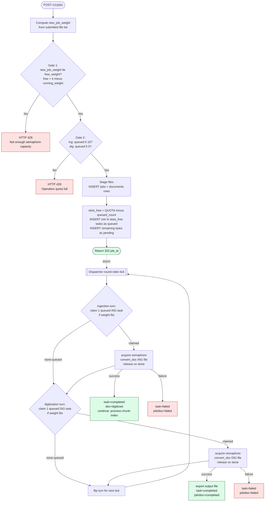
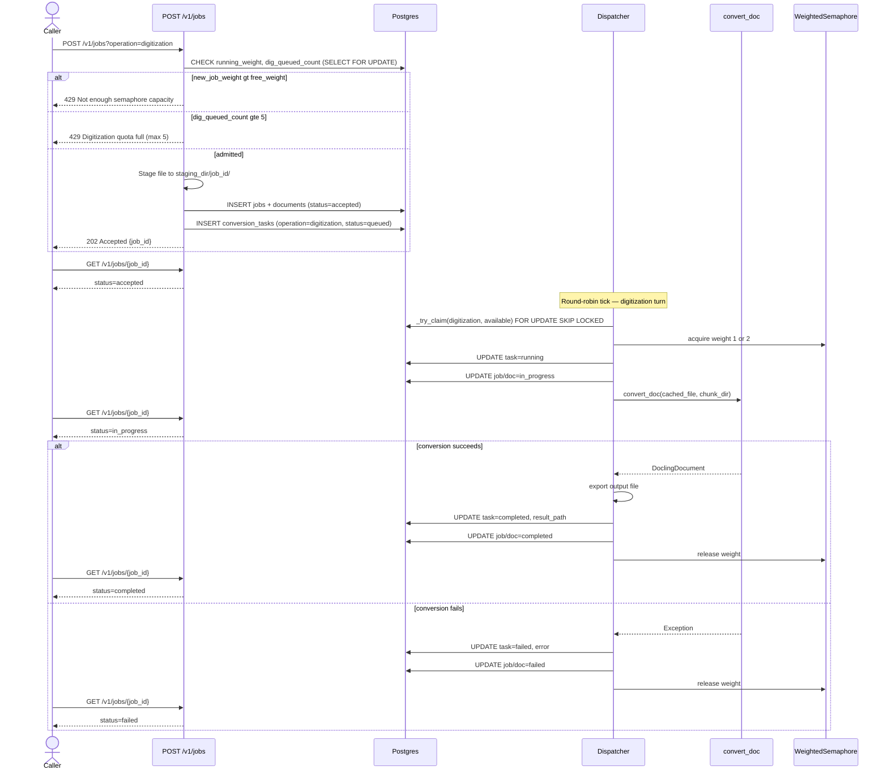
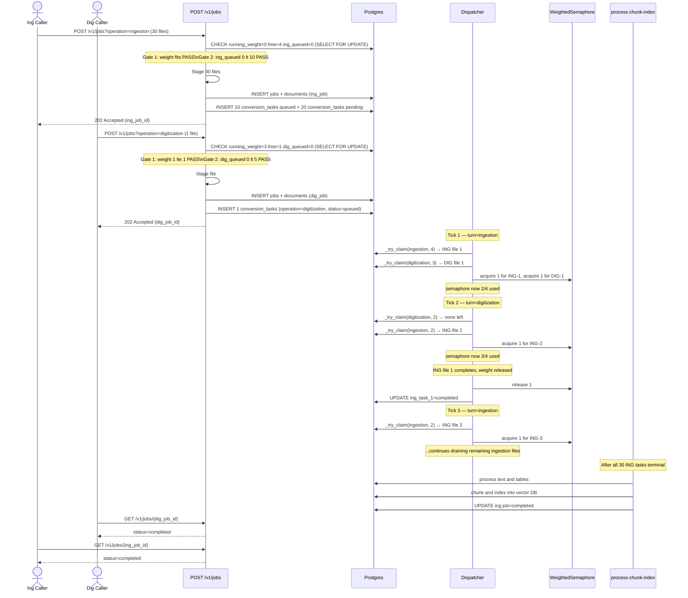
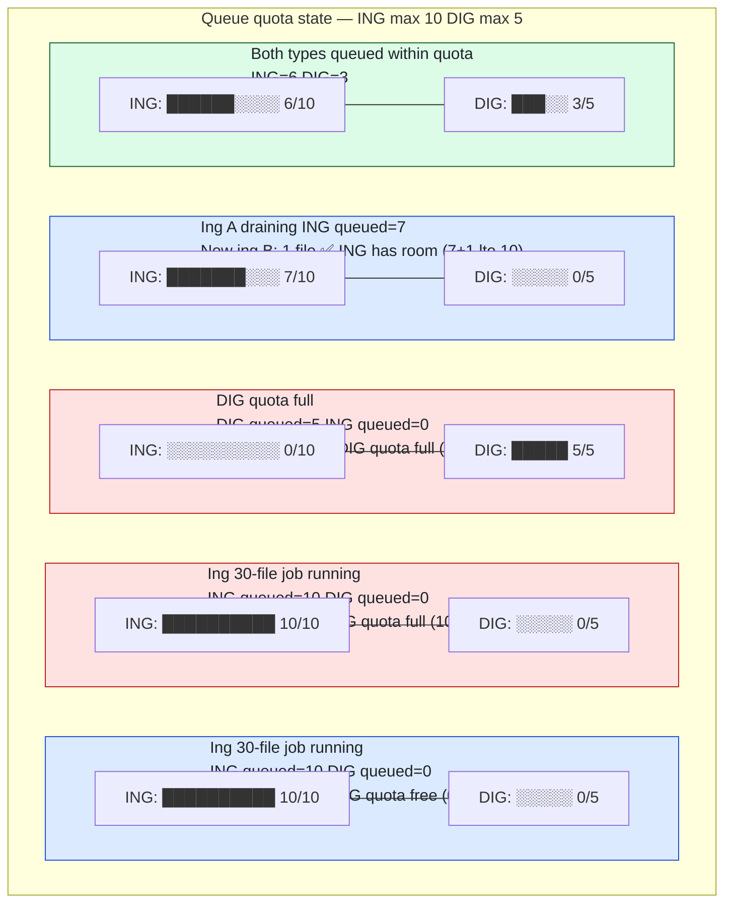
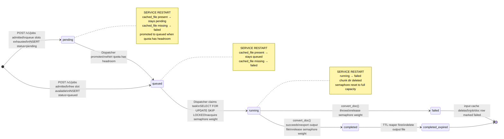

# Docling Conversion Queue — Design Proposal

## Executive Summary

This document proposes adding a shared, Postgres-backed conversion queue **inside the existing
`digitize` service** so that `convert_doc()` runs under a globally capped, weighted semaphore
that is durable across restarts.

**Motivation**

`convert_doc()` in `services/digitize/parsing/converter.py` is a CPU-heavy Docling operation
currently consumed directly by two pipelines:

- **Digitization** — `pipeline/digitize.py` → `convert_document_format()`
- **Ingestion** — `processing/orchestrator.py` → `convert_document()`

Two new consumers are planned:

- **Data Source Connectors** — sync remote data sources into the vector DB by running the
  ingestion pipeline. They have their own API endpoints, their own DB table, and their own
  concurrency limits, but they call the same `processing/orchestrator.py` → `convert_doc()`
  path that `POST /v1/jobs` (ingestion) uses today.
- **Extract & Tag service** — runs the full digitization pipeline (including Docling
  conversion) so it can attach a `doc_id` to a digitize document record. It therefore calls
  the same `pipeline/digitize.py` → `convert_doc()` path that `POST /v1/jobs` (digitization)
  uses today.

Both new consumers reach `convert_doc()` through the **same existing pipeline functions** —
they do not bypass them. The problem is purely that neither consumer can share the conversion
capacity budget with each other or with the API-driven pipelines, because that budget is
currently enforced at the request-admission layer (`workers/concurrency.py`) rather than at
the conversion layer.

Rather than introducing a new microservice (which would add deployment, networking, and auth
complexity), this proposal extends the digitize service with a conversion sub-queue that any
internal pipeline — regardless of which entry point triggered it — can enqueue work onto.

---

## Current State

### Where `convert_doc` is called today

| Caller | File | Mechanism |
|---|---|---|
| Digitization pipeline | `pipeline/digitize.py:60` | `ProcessPoolExecutor(max_workers=1)` → `convert_document_format()` |
| Ingestion pipeline | `processing/orchestrator.py:532` | `ProcessPoolExecutor(max_workers=N)` → `convert_document()` |

### Current concurrency control

`workers/concurrency.py` exposes a `ConcurrencyManager` with two `asyncio.BoundedSemaphore`
instances — one per operation type — controlled at the **API layer** in
`api/v1/jobs.py`.  Limits are:

- Ingestion: `ingestion_concurrency_limit` (default **1**)
- Digitization: `digitization_concurrency_limit` (default **2**)

This is request-level gating, not file-level.  Once a request is admitted it can start as
many `ProcessPoolExecutor` workers as the batch size allows, and there is no cap shared across
the Digitization and Ingestion paths or accessible to future consumers.

### Problems with the current approach

1. **No shared capacity budget** — a large ingestion batch and a concurrent digitization
   request each spawn their own process pools; combined CPU load can exceed what the node can
   sustain. Data Source Connectors and Extract & Tag will add two more uncoordinated
   process pools on top.
2. **Entry-point-specific gating** — the `ConcurrencyManager` semaphores are only acquired
   inside `api/v1/jobs.py`. A Data Source Connector going directly into the ingestion
   pipeline, or Extract & Tag going directly into the digitize pipeline, bypasses them
   entirely.
3. **Not durable** — if the process crashes mid-conversion, in-flight work is silently
   dropped; the job recovery in `utils/recovery.py` marks the job failed but cannot re-run
   the conversion.
4. **No queue depth limit** — a flood of requests could queue an unbounded number of
   `ProcessPoolExecutor` jobs in memory.

---

## Proposed Design

### 1. New Postgres table — `conversion_tasks`

One table added to the existing schema (managed by `Base.metadata.create_all` on startup).

```sql
CREATE TABLE conversion_tasks (
    task_id         VARCHAR(255)  PRIMARY KEY,
    -- link back to the digitize job/doc that owns this task
    job_id          VARCHAR(255)  REFERENCES jobs(job_id) ON DELETE SET NULL,
    doc_id          VARCHAR(255),                  -- digitize document id; informational
    operation       VARCHAR(50)   NOT NULL         -- 'ingestion' | 'digitization'
                    CHECK (operation IN ('ingestion','digitization')),
    -- input
    cached_file     TEXT          NOT NULL,        -- absolute path written at enqueue time
    output_format   VARCHAR(10)   NOT NULL
                    CHECK (output_format IN ('json','md','txt')),
    page_count      INTEGER,                       -- filled in during enqueue
    is_large        BOOLEAN       NOT NULL DEFAULT FALSE,
    -- lifecycle
    status          VARCHAR(50)   NOT NULL
                    CHECK (status IN ('pending','queued','running','completed','failed')),
    result_path     TEXT,                          -- written on completion
    error           TEXT,
    queued_at       TIMESTAMPTZ   NOT NULL DEFAULT now(),
    started_at      TIMESTAMPTZ,
    completed_at    TIMESTAMPTZ,
    updated_at      TIMESTAMPTZ   NOT NULL DEFAULT now()
);

CREATE INDEX idx_ct_status_op_queued ON conversion_tasks (status, operation, queued_at);
CREATE INDEX idx_ct_job_id           ON conversion_tasks (job_id);
CREATE INDEX idx_ct_doc_id           ON conversion_tasks (doc_id);
```

`is_large` is derived from `page_count >= heavy_doc_page_threshold` at enqueue time and
stored so the dispatcher can make a semaphore-weight decision from a single DB read.

`operation` is stored directly so the dispatcher can query by operation type without
joining to the `jobs` table on every poll cycle.

#### Admission check

Two validation gates are evaluated before any DB rows are written. If either gate fails
the request is rejected with HTTP 429; no `jobs`, `documents`, or `conversion_tasks` rows
are created.

**Gate 1 — Semaphore headroom**

```python
# Computed at admission time, inside a SELECT … FOR UPDATE transaction
running_weight = SUM(weight FOR task IN conversion_tasks WHERE status = 'running')
free_weight    = SEMAPHORE_CAPACITY - running_weight   # 4 - currently running weight
new_job_weight = SUM(2 if is_large(f) else 1 FOR f in submitted_files)

if new_job_weight > free_weight:
    raise HTTP 429  # no free semaphore capacity for this job right now
```

This uses *running* weight only. A 30-file ingestion whose total weight fits the current
free capacity is accepted; the dispatcher drains the tasks in round-robin order.

**Gate 2 — Per-operation queue quota (backstop)**

Each operation type has its own independent quota on how many tasks may sit in `queued`
status at once. The check asks: *is there at least one free slot?* — not whether all N new
tasks fit.

| Operation | Queue quota | Rationale |
|---|---|---|
| `ingestion` | **10** queued slots | A job can have many files; 10 gives enough buffer for large batches |
| `digitization` | **5** queued slots | Each job is exactly 1 file; 5 concurrent waiting jobs is sufficient |

```python
# After the semaphore headroom check passes:
ing_queued  = COUNT WHERE status='queued' AND operation='ingestion'
dig_queued  = COUNT WHERE status='queued' AND operation='digitization'

ING_QUOTA = 10   # settings.digitize.ingestion_queue_quota
DIG_QUOTA = 5    # settings.digitize.digitization_queue_quota

if operation == 'ingestion'    and ing_queued >= ING_QUOTA:
    raise HTTP 429  # ingestion queue quota full — no free slot
if operation == 'digitization' and dig_queued >= DIG_QUOTA:
    raise HTTP 429  # digitization queue quota full — no free slot
```

The quota guards against a completely saturated queue; it does **not** require that all N
new tasks fit. A 30-file ingestion is accepted if `ing_queued < ING_QUOTA` — at least one
slot is free. Tasks up to the quota are inserted as `queued`; any remainder are inserted as
`pending`. The dispatcher only picks `queued` tasks; it promotes `pending → queued` as
running tasks complete and quota headroom opens up.

Both gates execute inside a single DB transaction (`SELECT … FOR UPDATE`) to prevent races.

---

### 2. Weighted semaphore — `workers/conversion_semaphore.py`

A new module alongside the existing `workers/concurrency.py`.

```
workers/
  concurrency.py           ← existing; unchanged
  conversion_semaphore.py  ← new
```

#### Weight rule

| File | Page threshold | Semaphore weight | Max concurrent at capacity 4 |
|---|---|---|---|
| Normal | ≤ 500 pages | 1 | 4 files |
| Large | > 500 pages | 2 | 2 files |
| 1 large + 2 normal | — | 2+1+1 = 4 | mixed |
| 2 large | — | 2+2 = 4 | mixed |

Total capacity is 4 units, matching the existing `doc_worker_size = 4` default.
Large-file capacity matches `heavy_doc_convert_worker_size = 2`.

```python
# workers/conversion_semaphore.py

import asyncio
from digitize.settings import settings


class WeightedSemaphore:
    """Capacity-based semaphore; each acquire consumes `weight` units."""

    def __init__(self, capacity: int) -> None:
        self._capacity = capacity
        self._available = capacity
        self._cond = asyncio.Condition()

    @property
    def available(self) -> int:
        return self._available

    async def acquire(self, weight: int) -> None:
        async with self._cond:
            await self._cond.wait_for(lambda: self._available >= weight)
            self._available -= weight

    async def release(self, weight: int) -> None:
        async with self._cond:
            self._available += weight
            self._cond.notify_all()


# Module-level singleton — capacity mirrors doc_worker_size so existing
# ProcessPoolExecutor pools and this semaphore agree on the budget.
conversion_semaphore = WeightedSemaphore(
    capacity=settings.digitize.doc_worker_size  # default 4
)
```

---

### 3. Entry point — `api/v1/jobs.py` (existing endpoint, extended)

No new endpoint is introduced. `POST /v1/jobs` already provides the full caller contract:
it validates the file, stages it, creates the job/doc DB records, and returns a `job_id`
immediately with `202 Accepted`. Callers already poll `GET /v1/jobs/{job_id}` for status.
The only change is **what happens after the job is accepted**.

#### Current flow (digitization)

```
POST /v1/jobs?operation=digitization
  → acquire semaphore slot immediately
  → stage file
  → background_tasks.add_task(_run_digitize, ...)   # starts conversion right now
  → return { "job_id": "..." }
```

#### Proposed flow (both operations)

Both operations go through the same two validation gates **before** any DB rows are
written. Only after both gates pass are the `jobs`, `documents`, and `conversion_tasks`
rows created.

```
POST /v1/jobs?operation=digitization  (1 file)
  → [GATE 1] compute new_job_weight (1 or 2), check new_job_weight <= free_weight, else HTTP 429
  → [GATE 2] check dig_queued_count < DIG_QUOTA (5), else HTTP 429
  → stage file
  → INSERT jobs + documents rows
  → INSERT 1 conversion_tasks row (status=queued)
  → return { "job_id": "..." }

POST /v1/jobs?operation=ingestion  (N files)
  → [GATE 1] compute new_job_weight = SUM of per-file weights, check new_job_weight <= free_weight, else HTTP 429
  → [GATE 2] check ing_queued_count < ING_QUOTA (10), else HTTP 429
  → stage N files
  → INSERT jobs + documents rows
  → slots_available = ING_QUOTA - ing_queued_count          # free queue slots
  → INSERT min(N, slots_available) conversion_tasks rows (status=queued)
  → INSERT remaining conversion_tasks rows (status=pending) if N > slots_available
  → return { "job_id": "..." }
```

Gate 2 only requires **at least one free slot** in the queue — the caller is not rejected
because N exceeds the remaining quota. Tasks that fit fill as `queued`; the rest are
`pending`. The dispatcher promotes `pending → queued` as running tasks complete and quota
headroom opens up. This lets a 30-file ingestion batch be accepted in one request without
atomically reserving all 30 slots.

The existing `has_active_jobs()` hard block at [`jobs.py:174`](services/digitize/api/v1/jobs.py:174)
and the `ConcurrencyManager` semaphores at lines 185–199 are both removed. The
`_run_ingest` and `_run_digitize` background tasks are removed — the dispatcher drives
all execution.

#### Admission decision table

`free_weight = 4 − running_weight`. `ING_QUOTA = 10`. `DIG_QUOTA = 5`.
Gate 2 passes if at least one free slot exists (`queued < QUOTA`). Admitted jobs with N > free slots get `min(N, free_slots)` tasks as `queued`, the rest as `pending`.

| Scenario | Running weight | Free | New job weight | Ing queued | Dig queued | Decision |
|---|---|---|---|---|---|---|
| Ing A: 1 normal running. New dig: 1 normal | 1 | 3 | 1 | — | 0 | ✅ Accept (1 queued) |
| Ing A: 1 normal running. New ing: 1L+1N | 1 | 3 | 3 | 0 | — | ✅ Accept (2 queued) |
| Ing A: 1 large running. New ing: 2N | 2 | 2 | 2 | 0 | — | ✅ Accept (2 queued) |
| Ing A: 2 normal running. New ing: 1L+1N | 2 | 2 | 3 | 0 | — | ❌ Reject (Gate 1: weight 3 > free 2) |
| Ing A: 30 files (4 running, 6 queued). New dig: 1 normal | 4 | 0 | 1 | — | 0 | ❌ Reject (Gate 1: free=0) |
| Ing A: 30 files (3 running, 7 queued). New dig: 1 normal | 3 | 1 | 1 | — | 0 | ✅ Accept (Gate 2: dig_queued 0 < 5) |
| Ing A: 30 files (3 running, 7 queued). New dig: 6th waiting dig | 3 | 1 | 1 | — | 5 | ❌ Reject (Gate 2: dig_queued 5 >= 5) |
| Ing A: 30 files (3 running, 7 queued). New ing: 1 normal | 3 | 1 | 1 | 10 | — | ❌ Reject (Gate 2: ing_queued 10 >= 10) |
| Ing A: 30 files (3 running, 7 queued). New ing B: 1 normal | 3 | 1 | 1 | 7 | — | ✅ Accept (Gate 2: ing_queued 7 < 10) |
| Ing A: 5 files → 4 done, 1 running. New ing: 1 large | 1 | 3 | 2 | 0 | — | ✅ Accept (Gate 2: ing_queued 0 < 10) |
| All 4 semaphore units running. New job: any | 4 | 0 | any | — | — | ❌ Reject (Gate 1: free=0) |
| Ing A: 30 files. ing_queued=3. New ing B: 30 files | 2 | 2 | 30 | 3 | — | ✅ Accept (Gate 2: 3 < 10); 7 queued + 23 pending |

Key: the two quotas are completely independent. A 30-file ingestion filling its 10-slot quota
has zero effect on the digitization quota. Up to 5 digitization tasks can queue concurrently
regardless of how many ingestion files are waiting.

#### `GET /v1/jobs/{job_id}` — unchanged

The response shape and status progression (`accepted` → `in_progress` → `completed`/`failed`)
are identical. The dispatcher updates the `jobs` and `documents` rows directly using the
`job_id` and `doc_id` stored in the `conversion_tasks` row, so the status surfaces through
the existing endpoint with no change to the caller.

---

### 4. Dispatcher — `workers/conversion_dispatcher.py`

A long-running `asyncio` task started in `app.py`'s `lifespan`.

#### Round-robin pick strategy

On each poll tick the dispatcher alternates between operation types — it claims one
ingestion task and one digitization task per iteration (subject to semaphore capacity),
then loops. This ensures that a large ingestion job with 30 queued files never starves a
waiting digitization task, because every other slot is reserved for the other type.

If only one operation type has queued tasks, the dispatcher claims tasks from that type
alone — the round-robin degrades gracefully to single-type FIFO when the other side is
empty.

```python
# workers/conversion_dispatcher.py
from concurrent.futures import ProcessPoolExecutor

_rr_turn: str = "ingestion"  # module-level state; alternates each tick

# One shared process pool for all conversions.
# max_workers matches SEMAPHORE_CAPACITY so a process is always immediately
# available when the semaphore grants a slot — no queuing inside the pool.
_process_pool = ProcessPoolExecutor(max_workers=SEMAPHORE_CAPACITY)  # 4

async def dispatch_loop() -> None:
    """
    Poll the DB every POLL_INTERVAL seconds.
    Each tick claims at most one task per operation type in round-robin order,
    constrained by available semaphore capacity.

    Head-of-line blocking: if the oldest queued task for an operation type
    is large (weight=2) but only 1 unit is free, the entire operation type
    is skipped for this tick.  We do NOT skip over the large file to run a
    smaller one behind it — that would break FIFO ordering and let large
    files starve indefinitely.  The free slot is held until a second unit
    becomes available and the large task can finally be claimed.

    create_task returns immediately; _run_conversion runs concurrently.
    The loop does NOT await conversions — it continues to its next sleep
    immediately.  WeightedSemaphore.available reflects in-flight weight,
    so the next tick naturally sees reduced capacity.
    """
    global _rr_turn
    while True:
        available = conversion_semaphore.available
        if available > 0:
            # _try_claim_if_fits enforces head-of-line blocking: returns None
            # if the oldest queued task for this operation type needs more
            # capacity than is currently available — never skips over it.
            first, second = _rr_turn, _other(_rr_turn)
            claimed = []
            task = _try_claim_if_fits(first, available)
            if task:
                claimed.append(task)
                available -= 2 if task.is_large else 1
            task = _try_claim_if_fits(second, available)
            if task:
                claimed.append(task)
            for task in claimed:
                weight = 2 if task.is_large else 1
                await conversion_semaphore.acquire(weight)
                asyncio.create_task(_run_conversion(task, weight))
            # Advance turn for next tick
            _rr_turn = second
        # After each tick, promote pending → queued to backfill quota headroom
        _promote_pending("ingestion",    settings.digitize.ingestion_queue_quota)
        _promote_pending("digitization", settings.digitize.digitization_queue_quota)
        await asyncio.sleep(settings.digitize.conversion_poll_interval)

def _other(op: str) -> str:
    return "digitization" if op == "ingestion" else "ingestion"


async def _run_conversion(task: ConversionTask, weight: int) -> None:
    try:
        if not Path(task.cached_file).exists():
            db_manager.update_task_status(task.task_id, "failed",
                                          error="Cached input file missing")
            return

        db_manager.update_task_status(task.task_id, "running")

        out_dir   = Path(task.cached_file).parent
        chunk_dir = out_dir / "chunks"

        # convert_doc is CPU-bound Docling work that does not release the GIL.
        # asyncio.to_thread would run it on a thread and cause GIL contention
        # between concurrent conversions — they would not actually run in
        # parallel.  run_in_executor with a ProcessPoolExecutor spawns a child
        # process for each conversion, giving true CPU parallelism exactly as
        # the existing pipeline/digitize.py and processing/orchestrator.py do.
        # convert_doc must be a top-level importable function (picklable) —
        # it already satisfies this requirement.
        loop = asyncio.get_running_loop()
        doc: DoclingDocument = await loop.run_in_executor(
            _process_pool,
            convert_doc,
            task.cached_file,
            chunk_dir,
        )

        result_path = out_dir / f"output.{task.output_format}"
        _export(doc, result_path, task.output_format)   # json / md / txt

        db_manager.update_task_status(
            task.task_id, "completed", result_path=str(result_path)
        )
    except Exception as exc:
        db_manager.update_task_status(task.task_id, "failed", error=str(exc))
    finally:
        # Clean up cached input; keep result_path until TTL reaper runs
        _safe_remove(task.cached_file)
        await conversion_semaphore.release(weight)
```

#### Atomic DB claim — per operation type

`_try_claim_if_fits(operation, available)` enforces **head-of-line blocking**: it peeks at
the oldest queued task for the operation type and returns `None` immediately if that task's
weight exceeds the available capacity. It does **not** skip over it to claim a lighter task
behind it — doing so would let large files starve indefinitely as normal tasks continuously
consume the single free slot.

```python
def _try_claim_if_fits(operation: str, available: int) -> ConversionTask | None:
    # Step 1: peek at head-of-line (read-only, no lock yet)
    head = _peek_head(operation)
    if head is None:
        return None                            # nothing queued for this type

    needed = 2 if head.is_large else 1
    if needed > available:
        return None                            # head can't run yet — hold the line
                                               # do NOT claim anything behind it

    # Step 2: atomically claim the head task
    return _claim_head(operation)
```

`_peek_head` is a plain `SELECT` (no lock); `_claim_head` does the atomic
`SELECT … FOR UPDATE SKIP LOCKED` + `UPDATE status='running'`:

```sql
-- _peek_head('ingestion') — read-only, no lock
SELECT task_id, is_large
FROM   conversion_tasks
WHERE  status    = 'queued'
  AND  operation = :operation
ORDER BY queued_at
LIMIT  1;

-- _claim_head('ingestion') — atomic claim
UPDATE conversion_tasks
SET    status = 'running', started_at = now()
WHERE  task_id = (
    SELECT task_id
    FROM   conversion_tasks
    WHERE  status    = 'queued'
      AND  operation = :operation
    ORDER BY queued_at
    LIMIT  1
    FOR UPDATE SKIP LOCKED
)
RETURNING *;
```

Each call claims at most one task. The dispatcher calls it twice per tick — once for each
operation type — so at most two tasks are promoted to `running` per poll interval, capped
by the semaphore.

**Why head-of-line blocking is the right tradeoff**

A large file at the head of the queue holds back smaller files behind it until two semaphore
units are free simultaneously. This is intentional:

- Without it, a steady stream of normal files would consume every freed unit one at a time,
  and the large file would never accumulate the two units it needs — indefinite starvation.
- With it, the worst case is one poll interval of "wasted" capacity (one free unit sits idle
  while waiting for the second), which is bounded and predictable.
- Callers are already told at admission time whether their file is large — they accept the
  queuing contract when the request is accepted.

`_promote_pending(operation, quota)` runs after each tick inside a single transaction:

```sql
-- Promote as many pending tasks as will fit under the quota
UPDATE conversion_tasks
SET    status = 'queued', queued_at = now()
WHERE  task_id IN (
    SELECT task_id
    FROM   conversion_tasks
    WHERE  status    = 'pending'
      AND  operation = :operation
    ORDER BY queued_at          -- preserve original submission order
    LIMIT  GREATEST(0,
               :quota - (SELECT COUNT(*) FROM conversion_tasks
                         WHERE status = 'queued' AND operation = :operation))
);
```

This keeps the `queued` count for each operation type ≤ `QUOTA` while draining the
`pending` backlog in first-submitted-first-promoted order.

---

### 5. Lifespan integration — `app.py`

```python
@asynccontextmanager
async def lifespan(app: FastAPI):
    # ... existing startup (DB, language detector, zombie recovery) ...

    # Start conversion dispatcher
    from digitize.workers.conversion_dispatcher import dispatch_loop
    dispatcher_task = asyncio.create_task(dispatch_loop())
    logger.info("✅ Conversion dispatcher started")

    yield

    dispatcher_task.cancel()
    # ... existing shutdown ...
```

---

### 6. Restart & Recovery

Mirrors the existing `recover_zombie_jobs()` pattern in `utils/recovery.py`.

A new `recover_conversion_tasks()` function runs in the same startup block:

```python
def recover_conversion_tasks() -> None:
    """
    On startup:
      - running  → failed  (process died mid-conversion; chunk state unknown)
      - queued   → keep    (cached file verified; dispatcher will pick them up)
               → failed  (cached file missing; nothing to run)
    """
    # 1. running → failed
    running_tasks = db_manager.get_conversion_tasks(status="running")
    for task in running_tasks:
        _safe_rmtree(Path(task.cached_file).parent / "chunks")
        db_manager.update_task_status(
            task.task_id, "failed",
            error="Service restarted during conversion"
        )
        logger.warning(f"Recovery: task {task.task_id} running→failed")

    # 2. queued — verify cached file
    queued_tasks = db_manager.get_conversion_tasks(status="queued")
    for task in queued_tasks:
        if not Path(task.cached_file).exists():
            db_manager.update_task_status(
                task.task_id, "failed",
                error="Cached input file lost during restart"
            )
            logger.warning(f"Recovery: task {task.task_id} queued→failed (file lost)")
        else:
            logger.info(f"Recovery: task {task.task_id} re-queued (file intact)")
```

#### Why running tasks cannot be resumed

`convert_doc()` processes documents in 100-page chunks and merges them.
If the process crashes after writing some chunk JSON files, the merge step has not run
and the partial chunk state is unreliable.  The existing `finally: shutil.rmtree(chunk_cache_dir)`
pattern in `converter.py` cleans up on failure; recovery follows the same approach.
Re-running is safe because `convert_doc` is deterministic for the same input.

#### File retention policy

| Event | Input cache | Output file |
|---|---|---|
| Task completes | Deleted immediately after export | Kept until TTL (default 1 h) |
| Task fails | Deleted | N/A |
| Startup: `running` → `failed` | `chunks/` dir deleted; input deleted | N/A |
| Startup: `queued`, file present | Kept (job will run) | N/A |
| Startup: `queued`, file missing | N/A | N/A |

A background `asyncio.create_task` TTL reaper deletes `result_path` and sets
`result_path = NULL` for completed tasks older than `CONVERSION_RESULT_TTL_SECONDS`.

---

### 7. Migrating existing pipelines to use the queue

The two existing callers insert directly into `conversion_tasks` via `db/manager.py` — no
HTTP round-trip. The dispatcher picks the tasks up and drives execution.

#### `pipeline/digitize.py`

Current:
```python
with ProcessPoolExecutor(max_workers=1) as executor:
    future = executor.submit(convert_document_format, str(file_path), out_path, doc_id, output_format)
    output_file, conversion_time = future.result()
```

Proposed:
```python
task_id = enqueue_conversion(
    job_id=job_id, doc_id=doc_id,
    file_path=file_path, output_format=output_format,
)
output_file, conversion_time = await poll_until_complete(task_id)
```

`enqueue_conversion` and `poll_until_complete` are thin helpers in a new
`utils/conversion_client.py` module; they call the DB manager directly (no HTTP
round-trip for in-process callers).

#### `processing/orchestrator.py`

Currently submits `convert_document()` into a `ProcessPoolExecutor`.
Under this proposal it enqueues each file and polls, replacing the
`conversion_futures` dict with `task_id → path` tracking.
The rest of the pipeline (process → chunk → index) is unchanged.

#### Data Source Connectors

Data Source Connectors drive the **ingestion pipeline** — they sync remote data sources into
the vector DB via `processing/orchestrator.py`, the same path used by `POST /v1/jobs`
(ingestion). They have their own entry-point, their own API surface, and their own
concurrency limits, but the point where `convert_document()` is called is identical.

Under this proposal nothing changes for them structurally: their ingestion-pipeline call
lands in the same `processing/orchestrator.py` → `enqueue_conversion()` path that the
`POST /v1/jobs` ingestion flow uses. All conversions — regardless of which entry point
triggered ingestion — share the same `conversion_tasks` queue and `WeightedSemaphore`.

#### Extract & Tag

Extract & Tag needs to run the full digitization pipeline (`pipeline/digitize.py`) and must
reference a `doc_id` from an existing digitize document record. It therefore calls
`POST /v1/jobs?operation=digitization` exactly as any other caller does — it gets a `job_id`
back and polls `GET /v1/jobs/{job_id}` for the result. The `conversion_tasks` row inserted
by that job carries both `job_id` and `doc_id`, giving Extract & Tag the reference it needs.

No special treatment required. Extract & Tag is just another caller of the same endpoint.

---

### 8. New settings

Added to `DigitizeConfig` in `settings.py`:

| Field | Env var | Default | Purpose |
|---|---|---|---|
| `ingestion_queue_quota` | `DIGITIZE_INGESTION_QUEUE_QUOTA` | `10` | Max queued ingestion tasks (multi-file jobs) |
| `digitization_queue_quota` | `DIGITIZE_DIGITIZATION_QUEUE_QUOTA` | `5` | Max queued digitization tasks (1 file per job) |
| `conversion_poll_interval` | `DIGITIZE_CONVERSION_POLL_INTERVAL` | `2` | Dispatcher poll interval (s) |
| `conversion_result_ttl` | `DIGITIZE_CONVERSION_RESULT_TTL` | `3600` | Output file TTL (s) |

`doc_worker_size` (default 4) continues to serve as the semaphore capacity.
`heavy_doc_page_threshold` (default 500) is reused as the large-file boundary.
The two quotas are independent; `conversion_queue_max` is removed.

---

### 9. File change summary

| File | Change |
|---|---|
| `db/models.py` | Add `ConversionTask` ORM model with `operation` column |
| `db/manager.py` | Add `ConversionTask` CRUD + `_try_claim(operation, available)` + `get_running_weight()` + `get_queued_count_by_op()` |
| `settings.py` | Add `conversion_queue_max`, `conversion_poll_interval`, `conversion_result_ttl` to `DigitizeConfig` |
| `workers/conversion_semaphore.py` | **New** — `WeightedSemaphore` |
| `workers/conversion_dispatcher.py` | **New** — round-robin dispatcher loop + `_run_conversion` |
| `utils/recovery.py` | Add `recover_conversion_tasks()` |
| `api/v1/jobs.py` | Replace `ConcurrencyManager` semaphore + background task dispatch with semaphore headroom check + per-op quota check + `conversion_tasks` INSERT per file. Remove `has_active_jobs()` call. |
| `app.py` | Start dispatcher task in `lifespan`; call `recover_conversion_tasks()` on startup |
| `pipeline/digitize.py` | Remove `ProcessPoolExecutor` wrapper; call `convert_doc()` directly (dispatcher holds semaphore) |
| `processing/orchestrator.py` | Replace `converter_executor.submit(convert_document, …)` with queue enqueue calls |
| `parsing/converter.py` | No changes to `convert_doc()` itself |
| `workers/concurrency.py` | Remove entirely — superseded by `WeightedSemaphore` + per-op quotas |

---

### 10. Concurrency model after the change

```
POST /v1/jobs (any operation, N files)
  └─ semaphore headroom check: new_job_weight <= (4 - running_weight)
       else → HTTP 429
  └─ per-op quota check: ing_queued + N <= 10  OR  dig_queued + 1 <= 5
       else → HTTP 429
  └─ INSERT N conversion_tasks rows (operation=X, status=queued)
  └─ return { "job_id": "..." }

dispatcher loop (every POLL_INTERVAL seconds)
  turn = ingestion
  └─ _try_claim('ingestion',  available)  → claim oldest queued ingestion task if fits
  └─ _try_claim('digitization', remaining) → claim oldest queued digitization task if fits
  └─ each claimed task: acquire semaphore → convert_doc() → release → continue pipeline
  turn flips to digitization on next tick
```

**Key properties:**
- All `convert_doc()` calls share one `WeightedSemaphore` — total concurrency capped at 4 units.
- Independent quotas (ingestion: 10, digitization: 5) mean a large ingestion batch never fills the digitization queue; at most 5 digitization jobs can queue concurrently.
- Round-robin dispatch guarantees that if both types have queued tasks, they alternate slots — no starvation.
- When only one type has queued tasks the dispatcher claims from that type alone — no idle capacity wasted.
- `ConcurrencyManager`, `has_active_jobs()`, and the old global queue depth check are all fully retired.

---

### 11. Diagrams

#### 11a. Job admission flowchart



---

#### 11b. Full lifecycle — digitization (1 file)



---

#### 11c. Full lifecycle — ingestion (N files) with concurrent digitization



---

#### 11d. Per-operation quota scenarios (ING quota=10, DIG quota=5)



---

#### 11e. Round-robin dispatcher pick order


---

#### 11f. Conversion task state machine (including restart recovery)



---

### 12. Risks and mitigations

| Risk | Mitigation |
|---|---|
| Dispatcher claims the same task twice on concurrent invocations | `SELECT … FOR UPDATE SKIP LOCKED` is atomic; only one claim succeeds |
| Semaphore drifts if `_run_conversion` crashes before `release` | `finally: await semaphore.release(weight)` — release always runs |
| Race between admission check and INSERT (two jobs admitted simultaneously) | Both checks happen inside one `SELECT … FOR UPDATE` transaction; only one wins the race |
| Cache volume fills with large PDFs | Emit a warning log when cache dir free space < threshold; TTL reaper prevents unbounded growth |
| Caller polls forever on stuck task | Dispatcher sets a per-task wall-clock timeout (e.g. 30 min); marks timed-out tasks `failed` |
| Digitization task queues behind a large ingestion job's overflow | Queue is FIFO by `queued_at`; tasks from all jobs interleave naturally — a digitization task submitted after an ingestion job's overflow tasks will wait its fair turn |
| Two concurrent ingestion jobs interleaving chunks into the vector DB | Each doc has a unique `doc_id` keying its chunks; concurrent ingestion jobs write independent document sets with no overlap |
| `page_count` unavailable before enqueue (e.g. DOCX) | `get_document_page_count()` returns 0 for DOCX; treat 0 as `is_large=False` (weight 1) |

---

## Implementation Sequence

1. **ORM + migration** — add `ConversionTask` to `db/models.py`; `Base.metadata.create_all` creates the table on next startup.
2. **`WeightedSemaphore`** — implement and unit-test in isolation (`workers/conversion_semaphore.py`).
3. **`db/manager.py` CRUD** — `create_task`, `claim_queued_tasks`, `update_task_status`, `get_conversion_tasks`, `get_running_weight`, `get_queued_count`.
4. **Settings** — add `conversion_queue_max`, `conversion_poll_interval`, `conversion_result_ttl` to `DigitizeConfig`.
5. **Dispatcher** — implement `conversion_dispatcher.py`; write integration test using a stub `convert_doc`.
6. **Recovery** — `recover_conversion_tasks()` in `utils/recovery.py`; add call to `app.py` lifespan alongside existing `recover_zombie_jobs()`.
7. **TTL reaper** — background `asyncio.create_task` loop; delete completed output files older than `conversion_result_ttl`.
8. **Modify `api/v1/jobs.py`** — both paths: remove `ConcurrencyManager` semaphore acquire + background task dispatch; replace with two-layer admission check (semaphore headroom + queue overflow) + `conversion_tasks` INSERT per file. Remove `has_active_jobs()` call.
9. **Modify `pipeline/digitize.py`** — remove `ProcessPoolExecutor` wrapper; call `convert_doc()` directly (dispatcher already holds the semaphore slot).
10. **Modify `processing/orchestrator.py`** — replace `converter_executor.submit(convert_document, …)` with enqueue calls; add logic to await all `conversion_tasks` for the job before continuing to process → chunk → index.
11. **Remove `ConcurrencyManager`** from `workers/concurrency.py` and `has_active_jobs()` from `utils/jobs.py` — both superseded.
12. **Start dispatcher in `app.py` lifespan**.
13. **Integration tests** — semaphore headroom rejection, queue overflow rejection, large-batch jobs draining through queue, concurrent ingestion jobs sharing capacity, crash recovery sweep.
