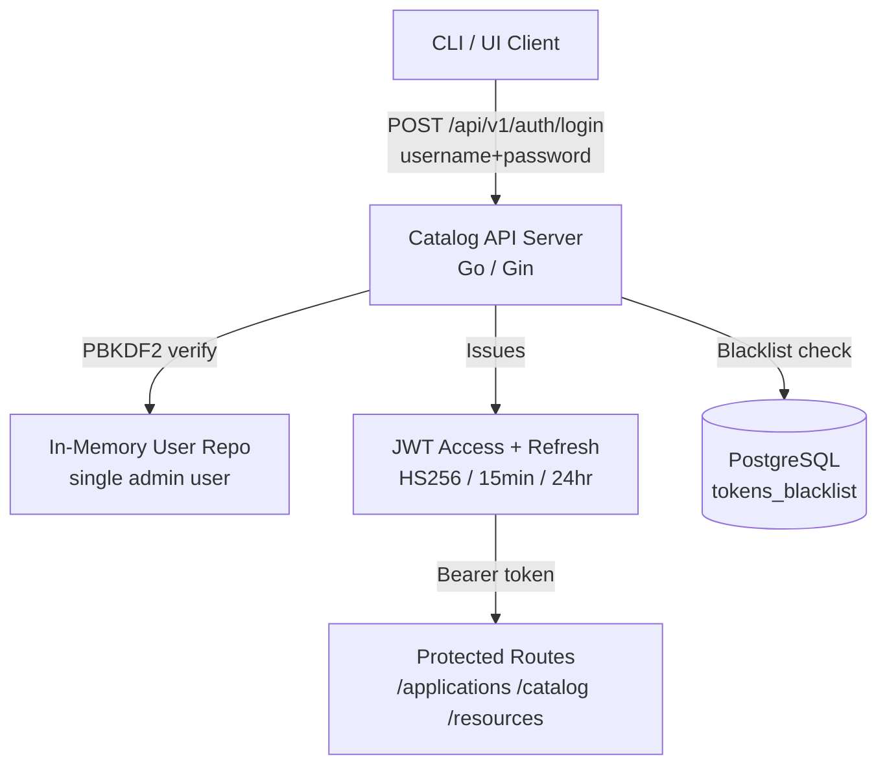
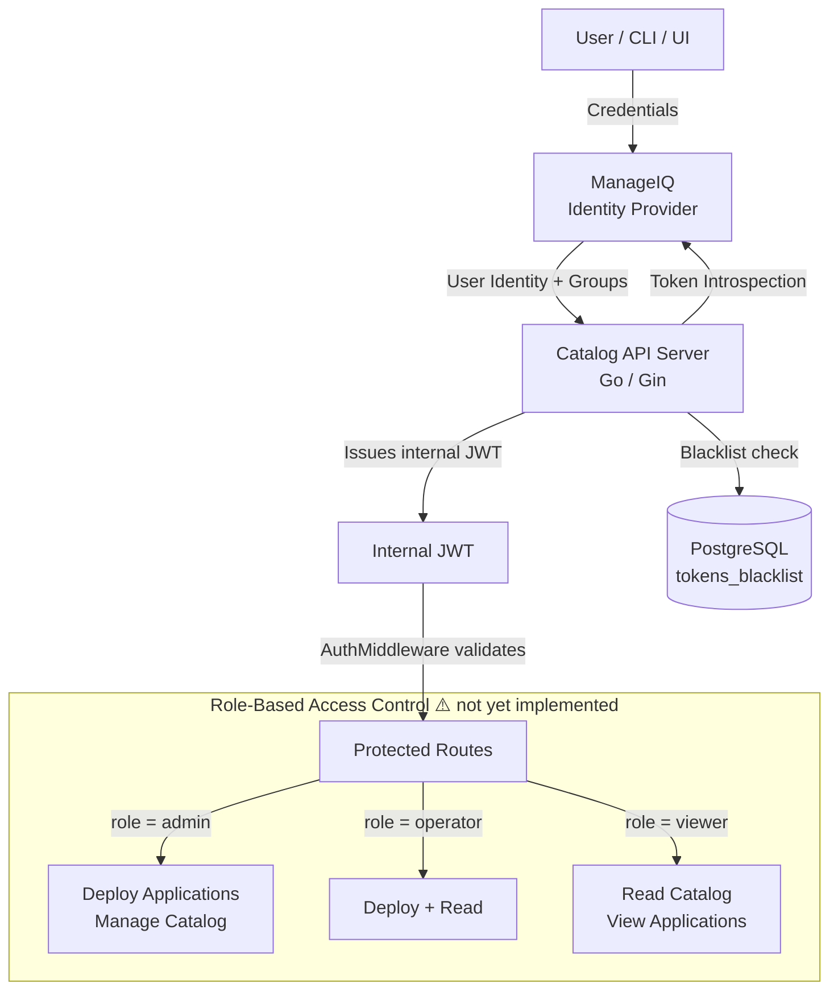
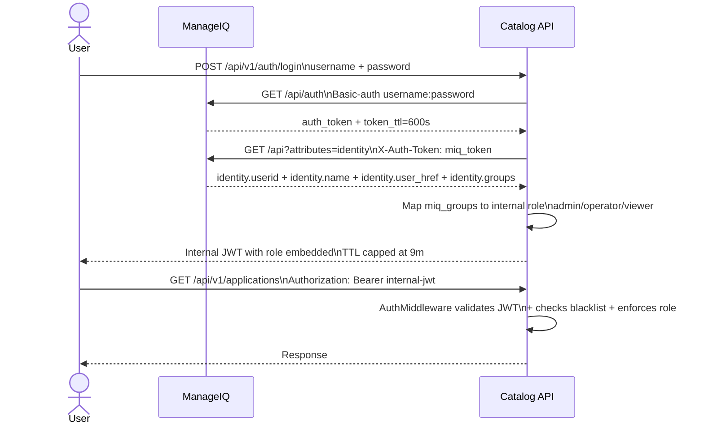
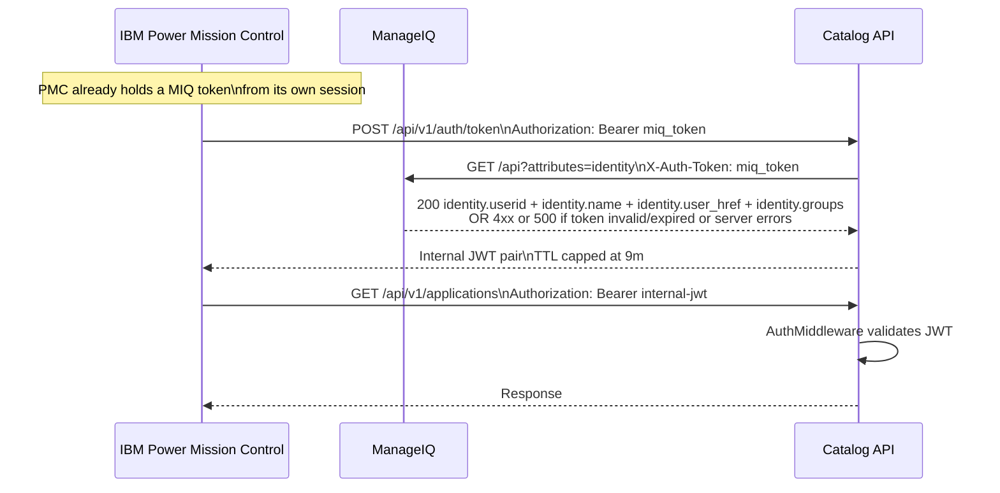
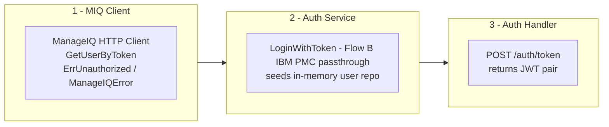
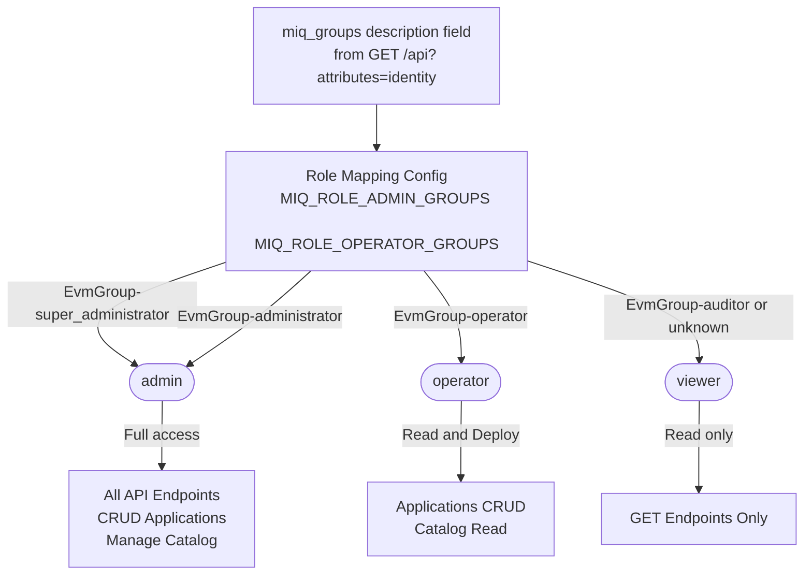

# ManageIQ AuthN/AuthZ Integration Plan

## Top-Level Overview

**Goal:** Extend the Catalog API Server to support ManageIQ as an Identity Provider (IdP) alongside
the existing local admin authentication. ManageIQ integration is opt-in: when `--manageiq-url` is
not configured the server falls back to local admin credentials. Two authentication flows are
planned; **only Flow B is currently implemented**:

- **Flow A — Interactive login (⚠️ Not yet implemented):** A user supplies username + password; the Catalog API authenticates against ManageIQ, fetches their groups, and issues an internal JWT.
- **Flow B — ManageIQ token passthrough (✅ Implemented):** An external product such as **IBM Power Mission Control** already holds a ManageIQ token from its own session and sends it directly to the Catalog API. The Catalog API validates the token against ManageIQ, resolves the identity and groups, and issues an internal JWT. IBM Power Mission Control does nothing beyond forwarding the token. 

**Scope:**

- Go Catalog API Server (`ai-services/internal/pkg/catalog/`)
- A new ManageIQ HTTP client package
- Extended JWT claims with no roles or group membership
- New `POST /api/v1/auth/token` endpoint for the token passthrough flow (Flow B)

**Non-Goals:**

- Python AI services (chatbot, digitize, similarity) — out of scope for this phase
- Replacing the token blacklist mechanism (it stays PostgreSQL-backed)
- OIDC discovery / full OAuth2 PKCE flow (covered in a follow-on if needed)
- ManageIQ token generation or management — that is IBM Power Mission Control's responsibility

**Integration Strategy (Phase 1):** Two-call Token Introspection
Both flows converge on the same two MIQ API calls for identity resolution (validated against
`https://9.20.202.144:8443`, API v4.4.0-pre):

1. `GET /api/auth` — (Flow A only) validates credentials and returns a bearer token + `token_ttl`
2. `GET /api?attributes=identity` with `X-Auth-Token: miq_token` — fetches caller identity and group membership; numeric user ID extracted from `identity.user_href`

Note: `GET /api/auth?requester_type=ui` only echoes a refreshed token; it does **not** return user identity or groups on this version.

---

## Architecture Diagrams

### Current State — Local Admin Authentication

---

### Target State — ManageIQ as Identity Provider

---

### Integration Flow A — Interactive Login ⚠️ Not yet implemented

---

### Integration Flow B — IBM Power Mission Control Token Passthrough

IBM Power Mission Control already holds a ManageIQ token from its own session. It forwards
that token as-is to the Catalog API. The Catalog API validates it against ManageIQ, resolves
the identity and groups, and issues an internal JWT. IBM PMC does nothing beyond sending the token.

---

### Architectural Layers Affected

---

### RBAC Role Hierarchy ⚠️ Not yet implemented

---
