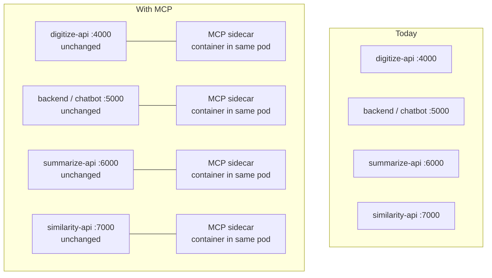
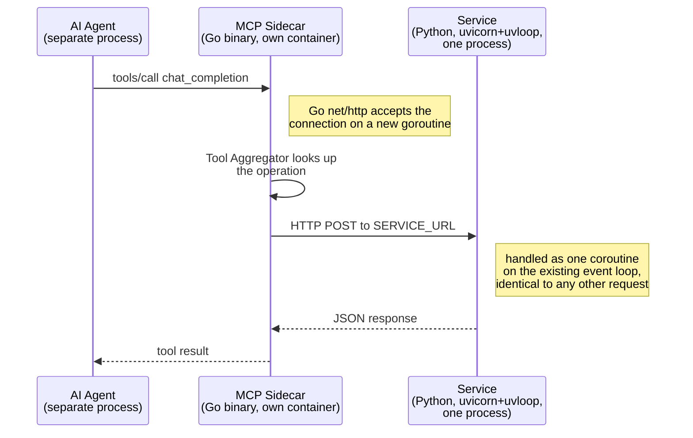
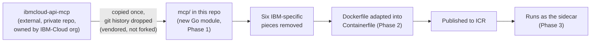
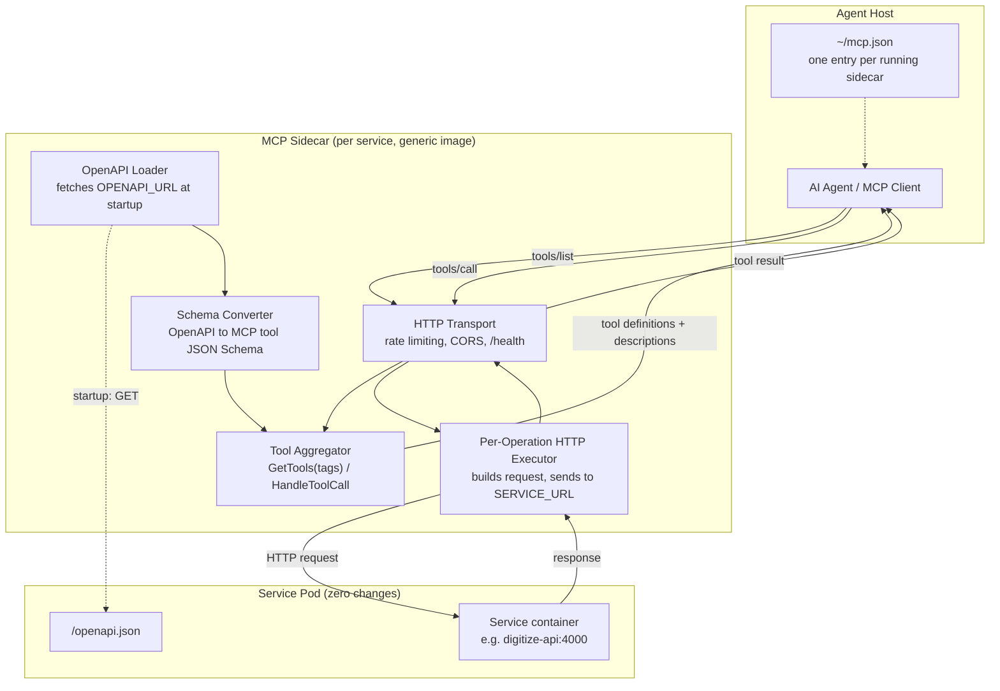
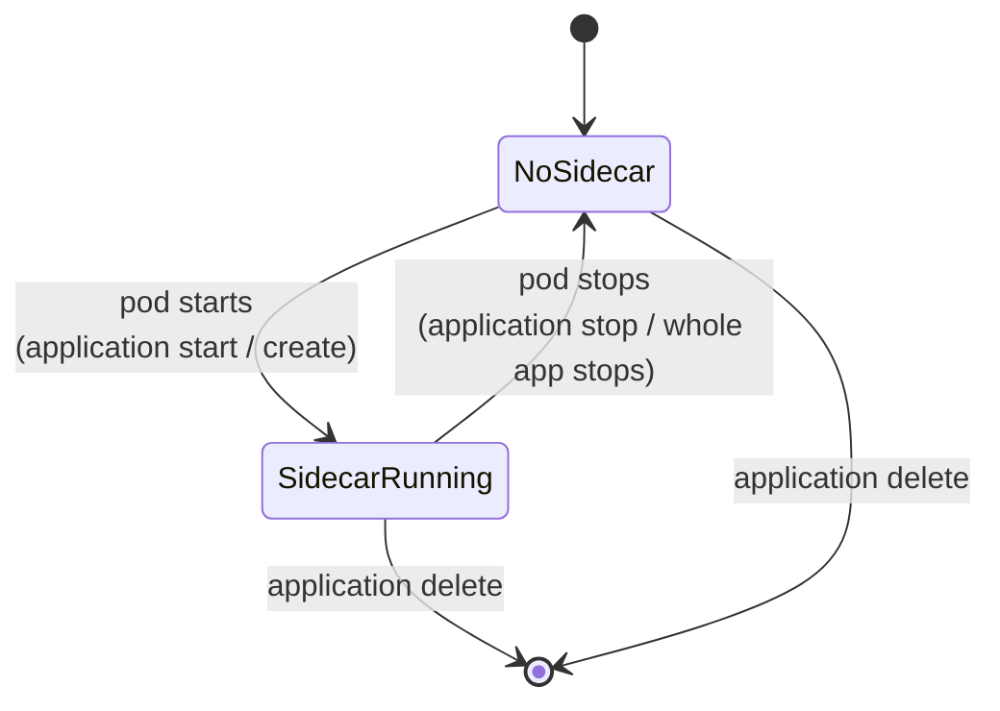
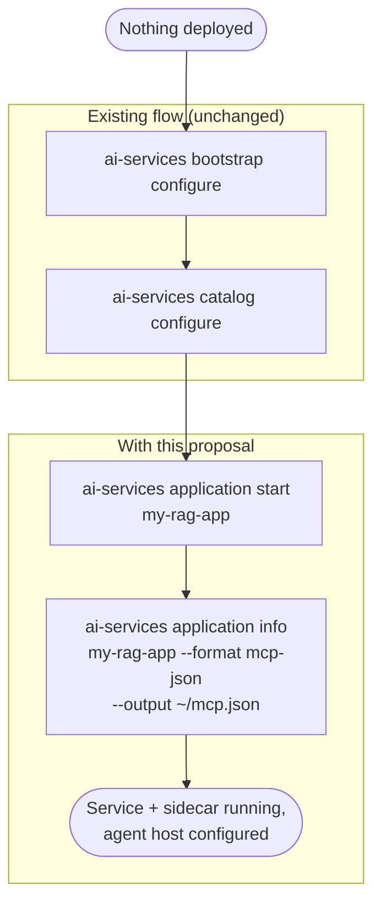

# Proposal: MCP Sidecar for AI Services

## Problem Statement

Customers integrating with AI Services must interact directly with each service's REST API, learning
endpoint paths, constructing request schemas, and handling auth independently per service. There is
no standardised way for an AI agent or ISV application to discover capabilities and call them
without detailed knowledge of the underlying HTTP layer.

All four microservices already expose a well-documented `/openapi.json` with rich descriptions
written for Swagger UI. This proposal surfaces that existing documentation as callable MCP tools
with no changes to any service.

## How This Works, At a Glance

What this actually adds to the system, and what it leaves alone. Four running services, one new
kind of process next to each.

### The topology change

Nothing about the four services changes. What's added is one companion process per service,
deployed automatically alongside every service.



**Key point:** every existing service box above is untouched code, still running exactly the same
way. Only new boxes are added, nothing existing is modified.

### What actually changes for an existing service

Three touch points, zero code changes. A service is never edited to support MCP:

1. **A new neighbor process.** The sidecar calls the service's existing REST API exactly like any
   other client already does today, curl, the UI, another service. No special code path is added
   to receive it.
2. **Docstrings go live.** The `summary=`/`description=` text already written for Swagger UI
   becomes the actual text an agent's LLM reads to pick a tool. Decoration becomes load-bearing.
3. **New labels and CLI rows.** The service's pod gains a sidecar tagged with the same `AppName`
   label, and shows up as one more row when `application ps` reports MCP status.

**Not touched:** the service's request handlers, its dependencies, its own threading/concurrency
model, none of it changes. If the sidecar disappeared tomorrow, the service wouldn't notice.

### One tool call, at the process and thread level

Checked against the real Containerfiles, not assumed. All four services run
`uvicorn app:app --loop uvloop --http httptools`, one Python process each, no `--workers` flag
set. That means each service is a single OS process running one asyncio event loop, concurrency
comes from coroutines inside that one loop, not from separate OS threads. The sidecar is a
separate Go binary, Go's HTTP server model is different: lightweight goroutines scheduled across
OS threads by the Go runtime, not Python's single-loop model.



**What this means:** the sidecar is a genuinely separate OS process (its own container), never
embedded in the service. A tool call is, from the service's point of view, indistinguishable from
any other REST request it already handles today, same event loop, same code, same thread model.
The only new concurrency to reason about lives entirely inside the sidecar's own process.


### In one paragraph

This proposal adds a small, stateless Go process next to each service that turns its
already-documented REST API into tools an AI agent can call. It's a new neighbor, not a
modification: the service's code, threads, and event loop stay completely untouched. What actually
changes is what sits around the service (a companion container and a label) and the fact that its
API descriptions now do real work instead of just decorating a Swagger page.

## Proposed Solution

A single generic MCP sidecar container image, deployed once per service, configured entirely by
environment variables. At startup it fetches the service's `/openapi.json`, registers one MCP tool
per API operation, and listens for agent connections. The agent calls tools; the sidecar forwards
requests to the real service. **Most of the core logic needs no new code.** This is a targeted
adaptation of the existing `ibmcloud-api-mcp` repository, not a from-scratch build. Any new logic
required (see Async Operations below) stays generic inside `mcp/` — no service-specific code lives
there.

**Tool selection boundary.** The sidecar never decides which tool to call. It only receives an
already-decided `tools/call` request from the connected agent and executes it. All reasoning
about *which* tool fits a user's request happens client-side, inside the agent's own LLM, using
nothing but the tool names and descriptions we expose. This is worth stating explicitly: a reader
unfamiliar with agentic tool-use will otherwise reasonably ask whether this component is making
autonomous decisions about customer data. It is not.

The sidecar is fully integrated into the existing `ai-services` CLI. When a customer deploys a
service, the MCP sidecar is deployed automatically alongside it. No additional flags or commands
are required to get MCP running.

### What "plug and play" means here

The `ibmcloud-api-mcp` repository ([IBM-Cloud/ibmcloud-api-mcp](https://github.com/IBM/project-ai-services/pull/1209)) is a complete, tested Go MCP server that parses any
OpenAPI spec and generates tools dynamically. Every file referenced under Implementation Details
below lives in that external repository today, not in `ai-services`. Phase 1 vendors it into a new
`mcp/` directory in this repo as its own Go module, a one-time copy with the git history dropped,
not an ongoing GitHub fork relationship, the tables further down describe what changes after that
copy, the original repository is untouched. The only work is removing six IBM
Cloud-specific pieces that do not apply to this project (IBM hostname validation, IBM Cloud region
logic, IAM JWT auth). The OpenAPI loader, schema converter, tool aggregator, HTTP transport, rate
limiting, CORS, and graceful shutdown are all kept verbatim.

### Where the Code Lives

This has come up repeatedly in review, so it gets its own diagram instead of a paragraph:



**Kept unchanged:**

| Component | What it does |
|---|---|
| OpenAPI loader | Fetches + parses any `/openapi.json` |
| Schema converter | OpenAPI → MCP tool JSON Schema |
| Tool aggregator | `GetTools(tags)` + `HandleToolCall` |
| Per-operation HTTP executor | Builds request, fires to `SERVICE_URL` |
| Tag-based tool filtering | Exposes only tagged operations to the agent |
| HTTP transport, rate limiting, CORS, `/health` | Runtime server infrastructure |
| `--config` flag | Emits MCP client config JSON |

**Removed (IBM Cloud-specific):**

| Component | Reason for removal |
|---|---|
| IBM hostname validation (`*.cloud.ibm.com`) | Enforces IBM Cloud URLs; irrelevant for on-prem Power services |
| IBM prefix injection on service names | Namespacing for IBM Cloud multi-service aggregation; not applicable |
| Region server extraction + region parameter | IBM Cloud multi-region routing; not applicable |
| IAM JWT token validation | IBM Cloud IAM-specific; replaced with Bearer token passthrough |
| `ibmcloud` CLI + 1Password auth strategies | IBM-specific auth mechanisms |
| IBM Cloud Go SDK dependency | Pulled in by IAM auth; not needed after auth swap |
| Stdio transport | Not suitable for containerised sidecar deployment (see Transport Mode below) |

## Architecture

### Low-Level Design

**Component view.** What's actually inside the sidecar and how a tool call moves through it:



### Per-Service Configuration

The same image runs for every service. Each instance is configured by two required environment
variables and an optional tag filter that hides internal endpoints (health, metrics) from the agent.

| Service (as used in this proposal) | Actual chart component | `OPENAPI_URL` | `SERVICE_URL` | Recommended `TAGS` |
|---|---|---|---|---|
| digitize | `digitize-api` | `http://digitize-api:4000/openapi.json` | `http://digitize-api:4000` | `ingestion,jobs` |
| chatbot | `backend` | `http://backend:5000/openapi.json` | `http://backend:5000` | `chat,retrieval` |
| summarize | `summarize-api` | `http://summarize-api:6000/openapi.json` | `http://summarize-api:6000` | `summarization,jobs` |
| similarity | `similarity-api` | `http://similarity-api:7000/openapi.json` | `http://similarity-api:7000` | `similarity` |

Customers deploy sidecars only for the services they run. Two services = two sidecar containers.

These values are not dynamically resolved at deploy time. They're hardcoded directly into the
sidecar's own Deployment template as literal strings, matching how the chart already wires
cross-service URLs today (`backend-deployment.yaml` hardcodes
`CHATBOT_SIMILARITY_SERVICE_URL: "http://similarity-api:7000"` the same way). Nothing new is
introduced here, the sidecar just follows the existing convention.

### Transport Mode

The sidecar runs in **HTTP transport mode only** (`--http` flag). Stdio transport — the default in
the upstream binary — requires the MCP client to fork the process directly, which is not viable for
a containerised sidecar. HTTP transport is the only mode that makes sense here: the sidecar binds
to a port, the CLI resolves that port when generating `~/mcp.json`, and the agent connects over the
network. The stdio code path is removed entirely rather than left as an unused option.

### MCP Sidecar Exposure via Caddy

External agents reach the sidecar through Caddy. When `application start` deploys sidecars
automatically, the CLI must also automatically register each sidecar route with Caddy's Admin API
using the same pattern already used for service routes.

Each sidecar gets one route: `<service>-mcp.<app-domain>` routes to the sidecar's port inside the
pod (4001 for digitize, 5001 for chatbot, 6001 for summarize, 7001 for similarity). Caddy
terminates TLS; the sidecar receives plaintext HTTP.

On `application stop` and `application delete`, sidecar routes are removed from Caddy
automatically, keeping it in sync with the running infrastructure.

### Tool Name Prefixing

Tool names are prefixed based on the startup configuration of each sidecar instance. Because each
sidecar is started independently with its own `OPENAPI_URL` and `SERVICE_URL`, the prefix is
derived from those properties at startup — not hardcoded per service. This means tool names are
stable and scoped to their originating service, regardless of whether an MCP host namespaces
servers automatically. This also eliminates the tool name collision risk identified under Open
Questions (for example, both `digitize` and `summarize` might independently generate a `list_jobs`
operation ID from their OpenAPI specs; prefixing produces `digitize_list_jobs` and
`summarize_list_jobs` instead).

### Async Operations — digitize & summarize

`summarize` can return a result two ways: right away, or as a "submit now, check back later" job.
`digitize` only has the check-back-later kind. OCR and chunking take real time.

**Solution:** keep it as two tools with prescriptive descriptions. The
`submit` tool description explicitly instructs the agent: *"Call `<prefix>_get_job` with the
returned `job_id` until the status field is `complete`."* This is cheaper to build, keeps the
sidecar stateless, and avoids long-held open HTTP connections. It depends on the agent following
the instruction, but a well-written description is sufficient in practice. No blocking wrapper
logic is needed; this is not a place where new code beyond what `ibmcloud-api-mcp` already handles
is required.

### Tool Schema Stability Across Restarts

Every time the sidecar restarts, it re-reads that service's API docs from scratch and rebuilds its
tools from whatever it finds *right now*. If someone changes those docs later (renames a field,
restructures a request), the tool just quietly changes shape the next time the sidecar happens to
restart. No warning, nothing to check beforehand. An ISV's agent built around the old shape could
break with no notice.

Not something we need to fully solve for v1, but at minimum, we should log when a tool's shape
changed between restarts, so it's visible instead of a silent surprise.

### Keeping the Generated Config in Sync

Generating `~/mcp.json` (via `application info <name> --format mcp-json`, see CLI Integration
below) is a manual, on-demand step today. This bites in both directions:

- **Adding a service:** since the sidecar is a container in the pod manifest, it starts when the
  pod starts — no extra step. But the agent host's `~/mcp.json` still only lists whatever was there
  before. The new capability is invisible to the agent until someone re-runs `info` and hands the
  updated file over.
- **Removing a service:** the mirror problem. See Sidecar Lifecycle on Delete below.

**Recommendation:** have `application info --format mcp-json` auto-run as part of the start/stop
flow in a future release, rather than leaving regeneration as a separate manual step.

### Lifecycle at a Glance

Because the sidecar is a container in the same pod spec as the service, its lifecycle is tied
directly to the pod's lifecycle — no separate command controls it. This diagram covers only whether
the sidecar exists, not the service's own running/stopped/deleted state:



Read this as: the sidecar exists whenever the service pod is running, and stops whenever the pod
stops. There is nothing to toggle independently in v1.

### Sidecar Lifecycle on Delete

**Decision: the sidecar is a second container inside the service's existing pod**, per Ryan's
review suggestion, rather than a separate pod. This is simpler to reason about and matches the
literal meaning of "sidecar." It also makes cascade delete trivial: the sidecar was never a
separate resource to begin with, so there's nothing extra to tag or track.

`application delete <name>` already performs a cascade delete: it lists every pod carrying that
application's `AppName` namespace label and force-deletes them all. Since the sidecar is a
container inside that same pod, it's already carrying that label automatically, there's no
separate resource that could be missed, no tagging step to verify in Phase 3. Deleting the
service pod deletes the sidecar with it, by construction.

**The tradeoff this accepts, worth being explicit about:** toggling the sidecar off without
stopping the service works cleanly on **podman**, Podman allows stopping one container inside a
pod without touching the others. On **OpenShift**, it does not: removing a container from a
running pod means editing that pod's spec, which triggers a rolling restart of the whole
Deployment, the service briefly restarts along with the sidecar. This was the reason an earlier
draft of this proposal argued for a separate pod. Going with Ryan's simpler design means accepting
that toggling later on OpenShift causes a brief service restart, not a zero-disruption toggle.
That's a reasonable price for a simpler, more conventional design, and worth saying out loud rather
than leaving implicit.

**Whether the sidecar is "always running" genuinely differs by runtime:**

- **On Podman:** no. The sidecar container can be independently started and stopped inside the pod
  without touching the service container.
- **On OpenShift:** yes, effectively, once deployed. Standard Kubernetes has no "pause just one
  container, keep the pod alive" primitive, every container in a Pod's spec runs for that Pod
  instance's entire lifetime. Once a pod is created with the sidecar container in its spec, that
  sidecar runs continuously alongside the service until the whole pod is replaced. It cannot be
  paused in place.

### Sidecar Lifecycle on Stop/Start (temporary, not delete)

`application stop <name>` is reversible: the service pod stops but isn't deleted. Since the sidecar
is a container inside that pod, it stops with it — no separate action needed and no scenario where
leaving it running independently is useful. When the pod restarts, the sidecar restarts with it.

**How current state is actually surfaced:** the running pod is the state — if the pod is up, the
sidecar is up. Nothing is persisted separately, and no catalog database column is introduced for
this.

## CLI Integration

No existing CLI commands are modified in v1. The sidecar is deployed automatically through manifest
changes alone (see Manifest Changes below). The `application info` command gains a new format flag
for generating the agent-facing config file.

### `application info` — extended to cover MCP

`application info <name>` already resolves the running pods for a named application and prints
per-service connection details from a templated `info.md` (see
`internal/pkg/application/podman/info.go`). Rather than building a second command that duplicates
that same resolution logic, MCP endpoint info becomes part of that existing output, plus a format
flag for the machine-readable case:

```bash
# Human-readable info, now includes MCP endpoints when a sidecar is running
ai-services application info my-rag-app --runtime podman

# Machine-readable: emit the MCP client config directly
ai-services application info my-rag-app --format mcp-json --output ~/mcp.json
```

`--format mcp-json` reads which sidecars are currently running for the named application, resolves
each endpoint, and writes a single JSON file the customer can hand directly to their agent host.
This removes the need for any manual configuration, and reuses `info`'s existing pod-resolution
code path instead of a parallel one.

### OpenShift: a different attach point

Podman is the primary target for v1 (see Delivery Phases), but the automatic attach point above
doesn't carry over to OpenShift as-is, worth stating directly rather than implying one mechanism
covers both runtimes.

On OpenShift, `application start`/`application stop` are no-ops today, they log and return without
doing anything. `application create` is what actually deploys and waits for a running app, via
`helm install`/`upgrade`. So on this runtime, the sidecar is added to the service's own pod spec
as a second container automatically, enabled by default via `{{- if .Values.mcp.enabled }}` set to
true before the install/upgrade call.

Kubernetes can't add or remove a container from a running pod in place, so toggling later would
trigger a rolling restart of that pod. Podman doesn't have this limitation — containers can be
added to or removed from a running pod without touching the others. This difference only matters
for the future granular control work (see Future Work).

This is a proposed direction, not verified against the real chart: whether a conditional container
in the pod spec cleanly appears and disappears across upgrades without disturbing the rest of the
release needs a Phase 3 spike before it's trusted.

### How this fits the bootstrap flow

A customer setting up from scratch follows the same sequence they already know. The name used in
each command (`my-rag-app` below) is whatever name the customer chose when creating the application,
not the template name.



`application start` now always brings the sidecar up. One existing command gains a new format
option (`application info --format mcp-json`) for generating the agent config. No new top-level
command, no new flag on `start`.

**Example Output:**

```
$ ai-services application start my-rag-app --runtime podman
Starting application 'my-rag-app'...
  chatbot      started
  digitize     started
  summarize    started
  similarity   started

MCP sidecars:
  chatbot      attached  → http://my-rag-app-chatbot:5001
  digitize     attached  → http://my-rag-app-digitize:4001
  summarize    attached  → http://my-rag-app-summarize:6001
  similarity   attached  → http://my-rag-app-similarity:7001

Application 'my-rag-app' is running.
Run 'ai-services application info my-rag-app --format mcp-json --output ~/mcp.json' to generate an agent config.

$ ai-services application info my-rag-app --format mcp-json --output ~/mcp.json
Resolved 4 running sidecar(s) for application 'my-rag-app'.
Wrote MCP client config to ~/mcp.json
```

That last command writes exactly what the agent host reads:

```json
{
  "mcpServers": {
    "my-rag-app-chatbot":    { "url": "http://my-rag-app-chatbot:5001/mcp" },
    "my-rag-app-digitize":   { "url": "http://my-rag-app-digitize:4001/mcp" },
    "my-rag-app-summarize":  { "url": "http://my-rag-app-summarize:6001/mcp" },
    "my-rag-app-similarity": { "url": "http://my-rag-app-similarity:7001/mcp" }
  }
}
```

And `application ps` (see "How current state is actually surfaced" above) is where a customer checks
this later without re-running any of the above:

```
$ ai-services application ps my-rag-app --runtime podman
APPLICATION   POD          STATUS    MCP ENDPOINT
my-rag-app    chatbot      Running   http://my-rag-app-chatbot:5001
my-rag-app    digitize     Running   http://my-rag-app-digitize:4001
my-rag-app    summarize    Running   http://my-rag-app-summarize:6001
my-rag-app    similarity   Running   http://my-rag-app-similarity:7001
```

No new top-level command is added. MCP lives under `application`, which is already where
customers manage running services.

## Implementation Details

*(Every file in the three tables below refers to the vendored `ibmcloud-api-mcp` codebase, see
"What plug and play means here" above for the repository link and where it's copied to, `mcp/` in
this repo. None of these are new files being written from scratch.)*

### Components Reused (verbatim, no changes)

| File | What it does |
|---|---|
| `internal/openapi/loader.go` | Fetches + parses any `/openapi.json` |
| `internal/openapi/convert.go` | Converts OpenAPI schemas → MCP tool JSON Schema |
| `internal/tool/aggregator.go` | Tool registry + call routing |
| `internal/tool/provider.go` | Per-operation HTTP executor → `SERVICE_URL` |
| `internal/server/http.go` | HTTP transport, rate limiting, CORS, `/health` |
| `internal/config/config.go` | Emits MCP client config JSON |

### Files Modified (removing IBM Cloud-specific logic)

| File | Change |
|---|---|
| `cmd/ibmcloud-api-mcp/main.go` | Remove IBM hostname validation; rename binary |
| `internal/openapi/interface.go` | Remove IBM name-prefixing + region-server logic |
| `internal/tool/provider.go` | Remove the `region` input parameter it adds to every tool |
| `internal/server/http.go` | Swap IAM JWT validation for Bearer token passthrough; remove stdio entry point |
| `internal/authenticator/` | Remove `cli.go`, `op.go`; keep `env.go`, `passthrough.go`, `api_key.go` |
| `go.mod` | Rename module; drop `github.com/IBM/go-sdk-core/v5` |

### New Files

| File | Purpose |
|---|---|
| `Containerfile` | Renamed + adapted from the upstream `Dockerfile` (which already exists and works, amd64/Alpine), retargeted to UBI9 base and `ppc64le` for Power/Spyre, IBM-specific `IAM_ENDPOINT` env default dropped |
| `.golangci.yml` | Same linters as `ai-services/.golangci.yml` |
| `Makefile` | Adapted upstream Makefile, `ppc64le` cross-compile target |

### Manifest Changes

The sidecar is introduced entirely through changes to the existing pod template files in
`ai-services/assets/`. No new pod is created — the sidecar container is added to the existing
service pod spec alongside the service container. This is the only change required to deploy it.

For each service pod template (e.g. `chat-bot.yaml.tmpl`, `digitize.yaml.tmpl`,
`summarize-api.yaml.tmpl`, `similarity-api.yaml.tmpl`), a new container entry is added:

```yaml
- name: mcp-sidecar
  image: "{{ .Values.mcp.image }}"
  env:
    - name: OPENAPI_URL
      value: "http://localhost:<service-port>/openapi.json"
    - name: SERVICE_URL
      value: "http://localhost:<service-port>"
    - name: TAGS
      value: "<recommended-tags-for-service>"
    - name: PORT
      value: "{{ .Values.mcp.port }}"
  ports:
    - containerPort: {{ .Values.mcp.port }}
      protocol: TCP
  livenessProbe:
    httpGet:
      path: /health
      port: {{ .Values.mcp.port }}
    initialDelaySeconds: 10
    periodSeconds: 30
    timeoutSeconds: 5
    failureThreshold: 3
  resources:
    requests:
      memory: "128Mi"
    limits:
      memory: "128Mi"
```

The `values.yaml` for each application template gains:

```yaml
mcp:
  image: "<icr-registry>/ai-services-mcp:latest"
  port: <sidecar-port>  # 4001 / 5001 / 6001 / 7001 per service
```

The pod-level `ai-services.io/ports` annotation is updated to include the sidecar port so the CLI
and Caddy can resolve it. No other changes to the application templates are required.


### Note on OpenAPI Description Quality

The sidecar uses the `summary=` and `description=` fields already written for Swagger UI as MCP
tool descriptions. These are in good shape across all four services today, digitize included.
There is no linting rule that enforces their presence on new endpoints.

This is worth treating as higher priority than "nice to have someday." The failure mode isn't
abstract: someone adds a new endpoint under deadline pressure, skips `summary=`/`description=`
(nothing today stops them), and the generated tool ships with an empty or auto-derived description.
An ISV's agent either never discovers the new capability exists, or picks it for the wrong request
and produces a bad result. Because nothing fails in CI, engineering has no signal this happened
until a customer notices. Given the fix is a single lint rule addition (`ruff D103/D400/D401` in
`services/common/pyproject.toml`), it's included in Phase 1 below rather than deferred to Future
Work.

### Delivery Phases

The implementation splits into three independent stages. A separate execution plan will cover
task-level detail; the phases here describe scope boundaries. **The hard engineering work is in
Phase 1, not saved for last.** Phase 2 is packaging what already works; Phase 3 is wiring a
proven thing into the existing CLI and deployment templates.

**Phase 1 — Local validation.** Vendor `ibmcloud-api-mcp` into `mcp/` as a new Go module (a
one-time copy, git history dropped, not a GitHub fork) and apply the six targeted removals. Run
the binary locally against a running chatbot service using HTTP transport and connect an MCP
client to confirm tools appear and calls work. No container, no CLI integration, no ICR push. This
phase proves the core concept before any infrastructure work begins. In parallel, add the
`ruff D103/D400/D401` docstring lint rule to `services/common/pyproject.toml`. This is low effort,
and it protects the description quality this whole proposal depends on before any service is
exposed to a real ISV. This phase should also produce a decision on the Async Operations question
above, validated directly against `summarize`.

**Phase 2 — Container and local deployment.** The upstream repo already has a working Dockerfile,
adapt it rather than writing one from scratch: rename to `Containerfile` (this project's
convention), retarget the build to UBI9 and `ppc64le`, drop the `IAM_ENDPOINT` default. Adapt the
existing `Makefile`, add `.golangci.yml`, and verify `go test ./...` passes. Build and run the
container locally with Podman alongside existing service containers. Publish to ICR only after the
container is verified locally, not before.

**Phase 3 — Manifest integration and CLI.** Add the sidecar container to each service's pod
template in `ai-services/assets/`. Add `--format mcp-json`/`--output` flags on `application info`
to the `ai-services` CLI. Wire the Caddy route registration for sidecar ports. All four services,
including digitize, ship together once the Async Operations decision is resolved in Phase 1.

## Verification Plan

1. **Unit tests:** `go test ./...` passes after module rename and IBM code removal.
2. **Tool generation:** parsing chatbot's `/openapi.json` produces one tool per operation, each
   with a non-empty description.
3. **Tag filtering:** `--tag chat,retrieval` excludes `get_health` and `get_v1_models`.
4. **End-to-end call:** agent calls `chat_completion` → sidecar forwards to chatbot → real response.
5. **Container:** `podman build` succeeds; container starts and `/health` returns `{"status":"ok"}`.
6. **Manifest — sidecar runs:** after applying updated pod templates, the sidecar container starts
   alongside the service and `/health` returns `{"status":"ok"}` on its port.
7. **CLI — config output:** `application info my-rag-app --format mcp-json` emits valid MCP client JSON.
8. **Regression:** all existing service tests pass; existing pod templates are unaffected until
   the sidecar container entry is added.

## Future Work

- **Granular MCP control:** an `--mcp` flag on `application start` and dedicated
  `application mcp start/stop` subcommands for customers who want to enable or disable MCP
  per-service independently of the application lifecycle. This includes per-service result
  reporting, `--pod` targeting for individual sidecars, and partial failure handling. Not required
  for v1 since the automatic approach covers the common case, but a natural next step for teams
  that need finer control.
- **Thin proxy gateway:** for ISVs requiring a single MCP endpoint, a lightweight aggregator
  merges `tools/list` from all per-service sidecars and routes calls. Not required for v1 since
  most MCP hosts support multiple servers natively.
- **Per-tool-call observability:** structured logging per `tools/call` (tool name, argument
  summary, duration, success/failure), distinct from generic HTTP access logs. Without this,
  diagnosing "the agent said it couldn't find X" means manually correlating raw request logs with
  no notion of which tool or which customer's agent was involved.
- **Schema change detection:** diff the regenerated tool schema against the previous run at
  startup and log/alert when it changes, so the drift described under Tool Schema Stability above
  is visible rather than silent.
- **OpenShift support:** Phase 3 covers Podman; OpenShift deployment template wiring follows the
  same pattern used by all other application deployments in `ai-services/assets/`.

## Open Questions

- **1. Description quality in practice:** should we find a way to enforce rich descriptions for our services now and future services? i.e linting

- **2. Aggregation shape:** `ibmcloud-api-mcp` fronts many IBM Cloud APIs behind one server; this
  proposal instead runs one generic sidecar per service. Any operational downsides to the
  per-service approach already encountered that the team should know about going in?

- **3. Sidecar exposure boundary:** agents aren't co-located with the services, so the sidecar has
  to be reachable over the network. The open part isn't *whether* it's reachable, it's *who's
  allowed to reach it*:

  ```mermaid
  flowchart LR
      Agent["AI Agent<br/>(external)"] -- "1. HTTPS, TLS terminated<br/>at the Route" --> Route["OpenShift Route<br/>(same pattern already used by<br/>backend-route.yaml, digitize-api-route.yaml, etc.)"]
      Route -- "2. ??? no auth check<br/>exists here yet" --> Sidecar["MCP Sidecar"]
      Sidecar -- "3. Bearer passthrough<br/>(already designed)" --> Service["Existing Service"]
  ```

  **What's already checked:** none of the four services authenticate inbound callers today.
  `chatbot`'s `Authorization` header only passes through to vLLM, it doesn't gate `chatbot` itself;
  `digitize`/`summarize`/`similarity` have no inbound auth code at all. The one real auth system in
  this codebase, the catalog apiserver's JWT middleware, protects a different actor (customers
  managing deployments) and isn't reusable here.


- **4. Startup ordering:** if `application start` brings the service and its sidecar up at the
  same time, should the sidecar retry with backoff when the service isn't ready yet to serve its
  OpenAPI spec, rather than failing outright on first boot?
