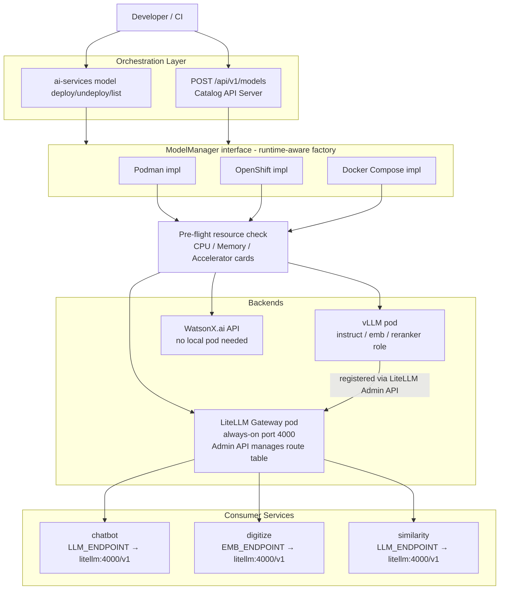
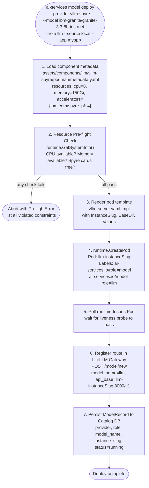
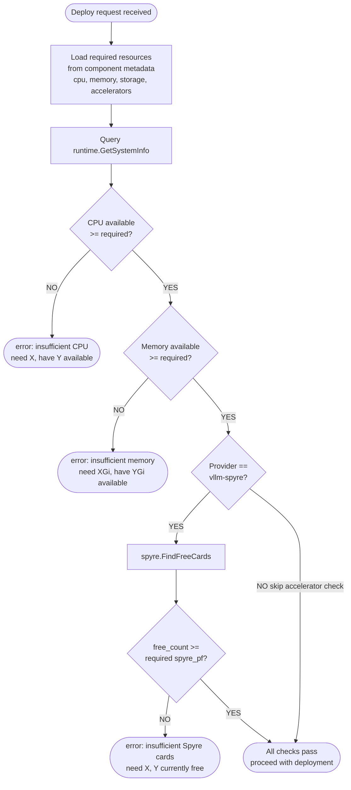
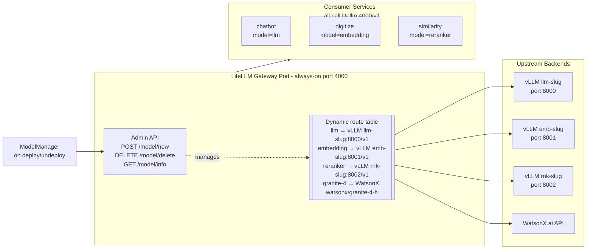
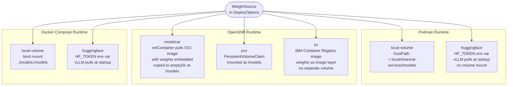
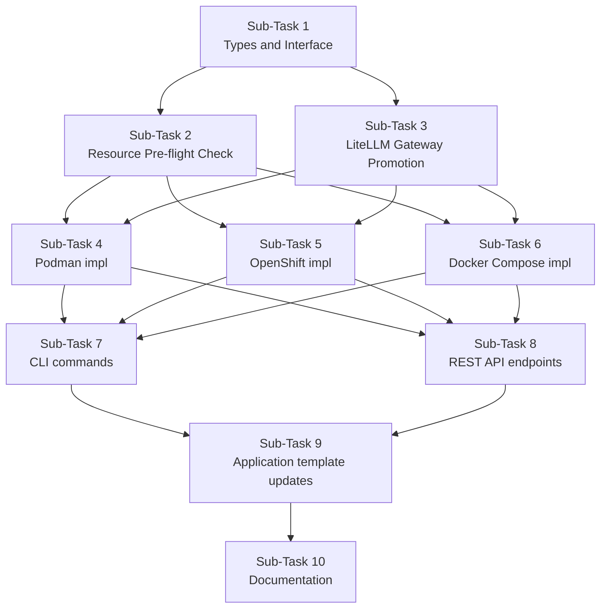

# Model Management Service — Implementation Plan

## Overview

### Goal
Replace the current static, hard-wired model deployment (models bundled inside the application pod at creation time) with a **dynamic Model Management Service** that can deploy, undeploy, and list model inference backends on demand, regardless of runtime. All consumer services talk exclusively through a **LiteLLM Gateway** — they never reach vLLM, WatsonX, or any other backend directly.

### Scope
- A new `model-manager` internal package with a runtime-aware `ModelManager` interface.
- A **resource pre-flight check** that queries available system resources (CPU, memory, accelerator cards) before any deployment to fail-fast with a clear error when capacity is insufficient.
- New `ai-services model deploy / undeploy / list / status` CLI commands.
- New `/api/v1/models` REST endpoints added to the existing Catalog API Server (Gin).
- LiteLLM Gateway promoted from a static WatsonX-only component to the **universal model gateway** — reconfigured dynamically via its Admin API when models are added or removed.
- Runtime-specific model weight source strategies:
  - **Podman**: local host volume (`~/.local/share/ai-services/models`), Hugging Face pull-at-start.
  - **OpenShift**: modelcar init-container, PersistentVolumeClaim, IBM Container Registry (ICR) image.
  - **Docker Compose**: bind-mount volume, Hugging Face pull-at-start.
- No changes to existing consumer services (`chatbot`, `digitize`, `similarity`, `summarize`) — they continue to read `LLM_ENDPOINT`, `EMB_ENDPOINT`, `RERANKER_ENDPOINT` from environment variables, but those will now always point to the LiteLLM Gateway.

### Non-Goals
- UI/dashboard for model management.
- Multi-tenant model isolation.
- GPU auto-scaling / auto-provisioning.
- Changes to Python service code.

---

## Architecture Overview

### Component Interaction



### Model Deployment Flow (per runtime)



### Resource Gating Decision Tree



### LiteLLM as Universal Gateway



### Weight Source Strategies by Runtime



---

## Sub-Tasks

---

### Sub-Task 1 — Define the `ModelManager` Interface and Core Types

**Intent**
Establish the Go types and interface contract that all subsequent sub-tasks depend on. Mirrors the existing pattern of `application.Application` interface and `application/types/types.go`.

**Expected Outcomes**
- New package `ai-services/internal/pkg/model_manager/` with:
  - `interface.go` — `ModelManager` interface with `Deploy`, `Undeploy`, `List`, `Status` methods.
  - `types/types.go` — all request/response structs.
- `ModelStatus` string enum: `deploying`, `running`, `stopping`, `stopped`, `error`.
- `ModelRole` string enum: `llm`, `embedding`, `reranker` — maps to `component_type` in `assets/components`.
- `BackendProvider` string enum: `vllm-cpu`, `vllm-spyre`, `watsonx`, `openai-compatible`.
- `WeightSource` as a tagged struct (one of: `LocalVolume{Path}`, `HuggingFace{ModelID, Token}`, `ModelCar{Image}`, `PVC{ClaimName}`, `ICR{Image}`).
- `ResourceRequirements` struct with `CPU int`, `MemoryBytes int64`, `StorageBytes int64`, `Accelerators map[string]int` — re-uses the shape of the existing `catalog/types.Resources`.
- `DeployOptions` includes the `ResourceRequirements` field loaded from the component `metadata.yaml` before the call reaches any runtime impl.
- `ModelRecord` — persisted state: `InstanceSlug`, `AppName`, `Provider`, `Role`, `ModelName`, `Status`, `Endpoint`.

**Todo List**
1. Create `ai-services/internal/pkg/model_manager/types/types.go` with all types listed above.
2. Create `ai-services/internal/pkg/model_manager/interface.go` with the `ModelManager` interface.
3. Create `ai-services/internal/pkg/model_manager/factory.go` with `New(runtimeType, runtime) ModelManager` factory (implementations registered in Sub-Tasks 2, 3, 5).
4. Create `ai-services/internal/pkg/model_manager/metadata.go` with `LoadRequiredResources(componentType, providerID, runtimeType) (ResourceRequirements, error)` — reads from the existing `assets/components/<type>/<provider>/<runtime>/metadata.yaml`.

**Relevant Context**
- Pattern: [`ai-services/internal/pkg/application/interface.go`](ai-services/internal/pkg/application/interface.go) and [`ai-services/internal/pkg/application/types/types.go`](ai-services/internal/pkg/application/types/types.go).
- Existing `Resources` struct: [`ai-services/internal/pkg/catalog/types/types.go:98`](ai-services/internal/pkg/catalog/types/types.go:98).
- Existing runtime metadata with accelerator declarations: `ai-services/assets/components/llm/vllm-spyre/podman/metadata.yaml`.

**Status** — `[ ] pending`

---

### Sub-Task 2 — Resource Pre-flight Check Package

**Intent**
Before any pod is created, validate that the host or cluster has sufficient CPU, memory, and — critically for vLLM on Power — enough **free Spyre accelerator cards**. This fails fast with actionable error messages rather than letting a pod hang at `Pending` or crash immediately. This is a shared package used by all three runtime implementations.

The check works in two layers:
1. **Soft check** via `runtime.GetSystemInfo()` — reports total and available system resources (already used by the `/resources` API endpoint). Used for CPU and memory.
2. **Hard check** via `spyre.FindFreeCards(ctx)` — enumerates `/dev/vfio` to count Spyre cards not currently locked by a process. Used for accelerator gating on Podman. On OpenShift, accelerator availability is surfaced through the Kubernetes resource quota / node allocatable API.

**Expected Outcomes**
- New package `ai-services/internal/pkg/model_manager/preflight/preflight.go`.
- `Check(ctx, runtime, required ResourceRequirements) error` function.
  - Calls `runtime.GetSystemInfo()` to get available CPU and memory.
  - If `required.Accelerators` contains `"ibm.com/spyre_pf"` and runtime is Podman: calls `spyre.FindFreeCards(ctx)`, compares count.
  - If runtime is OpenShift: delegates accelerator check to node allocatable query (new method on OpenShift runtime, or via existing `GetSystemInfo` which can be extended).
  - Returns a structured `PreflightError` listing every failed constraint, not just the first.
- `PreflightError` struct: `[]ConstraintViolation{Resource, Required, Available, Unit}` — human-readable in CLI output and serializable for REST API.
- `ResourceRequirements` loaded from component `metadata.yaml` (via `model_manager.LoadRequiredResources` from Sub-Task 1).

**Example error output:**
```
Model deployment pre-flight check failed:
  ✗ Memory: need 150Gi, 42Gi available
  ✗ Accelerators (ibm.com/spyre_pf): need 4, 1 free
  ✓ CPU: need 8, 12 available
```

**Todo List**
1. Create `ai-services/internal/pkg/model_manager/preflight/preflight.go` with `Check` function.
2. Implement CPU and memory check against `SystemInfo.Memory.AvailableBytes` and `SystemInfo.CPU.Available`.
3. Implement Spyre card check: call `spyre.FindFreeCards(ctx)`, compare against `required.Accelerators["ibm.com/spyre_pf"]`.
4. Implement OpenShift node allocatable check (extend `GetSystemInfo` or add new method on OpenShift runtime).
5. Define `PreflightError` and `ConstraintViolation` types in `types/types.go`.
6. Write table-driven unit tests for all constraint combinations (pass, partial fail, total fail).

**Relevant Context**
- Spyre detection: [`ai-services/internal/pkg/accelerator/spyre/spyre.go`](ai-services/internal/pkg/accelerator/spyre/spyre.go) — `FindFreeCards(ctx)` and `ListCards(ctx)`.
- System info model: [`ai-services/internal/pkg/models/systeminfo.go`](ai-services/internal/pkg/models/systeminfo.go) — `CPUInfo`, `MemoryInfo`, `AcceleratorInfo`.
- Existing resource usage: [`ai-services/internal/pkg/catalog/apiserver/handlers/resources.go`](ai-services/internal/pkg/catalog/apiserver/handlers/resources.go) — how `GetSystemInfo` is already called.
- Accelerator declarations in component metadata: `ai-services/assets/components/llm/vllm-spyre/podman/metadata.yaml` (`ibm.com/spyre_pf: 4`), `ai-services/assets/components/reranker/vllm-spyre/podman/metadata.yaml` (`ibm.com/spyre_pf: 1`).
- Runtime interface: [`ai-services/internal/pkg/runtime/interface.go`](ai-services/internal/pkg/runtime/interface.go) — `GetSystemInfo()`.

**Status** — `[ ] pending`

---

### Sub-Task 3 — LiteLLM Gateway Promotion & Dynamic Route Management

**Intent**
Promotes LiteLLM from a static WatsonX-only component to the **universal model gateway** for all providers. Adds a Go client that wraps the LiteLLM Admin API so any runtime implementation can register and deregister model routes at deploy/undeploy time.

**Expected Outcomes**
- New package `ai-services/internal/pkg/model_manager/litellm/client.go` with `AddRoute`, `RemoveRoute`, `ListRoutes` wrapping LiteLLM Admin API (`POST /model/new`, `DELETE /model/delete`, `GET /model/info`).
- `RouteConfig` struct captures provider-specific fields: for vLLM — `api_base`, optional `api_key`; for WatsonX — `watsonx_project_id`, `watsonx_url`, `api_key`; for OpenAI-compatible — `api_base`.
- Updated `images/litellm/config/config.yaml` starts with an **empty `model_list`** — all routes are added dynamically at runtime. The `LITELLM_MASTER_KEY` env var gates Admin API access.
- New standalone `litellm-server` pod template: `ai-services/assets/components/llm-gateway/litellm/podman/templates/litellm-server.yaml.tmpl` (and OpenShift Deployment equivalent) — always deployed as phase-1 infra alongside postgres/opensearch, not co-located with any vLLM container.
- Consumer services receive a single endpoint: `http://<app>--litellm:4000/v1`.
- Model name routing convention: the `model_name` alias registered in LiteLLM matches the `ModelRole` value (`llm`, `embedding`, `reranker`) so consumers call `model="llm"` — not a specific model ID. Multiple providers can be listed under the same alias for fallback.

**Todo List**
1. Create `ai-services/internal/pkg/model_manager/litellm/client.go`.
2. Implement `AddRoute(ctx, gatewayURL, masterKey string, cfg RouteConfig) error`.
3. Implement `RemoveRoute(ctx, gatewayURL, masterKey, modelName string) error`.
4. Implement `ListRoutes(ctx, gatewayURL, masterKey string) ([]RouteInfo, error)`.
5. Modify `images/litellm/config/config.yaml` to start empty; enable `general_settings.master_key` via env.
6. Create `litellm-server.yaml.tmpl` pod template under `ai-services/assets/components/llm-gateway/litellm/podman/templates/`.
7. Create corresponding `metadata.yaml` and `values.yaml` for the new `llm-gateway/litellm` component.
8. Update `rag`, `rag-cpu`, `rag-dev` `metadata.yaml` to include `litellm-server` in phase-1 execution.

**Relevant Context**
- Current LiteLLM config: [`images/litellm/config/config.yaml`](images/litellm/config/config.yaml).
- Current WatsonX pod template: [`ai-services/assets/components/llm/watsonx/podman/templates/watsonx-server.yaml.tmpl`](ai-services/assets/components/llm/watsonx/podman/templates/watsonx-server.yaml.tmpl) — retains its role but its port-8000 endpoint is now only registered into LiteLLM, not consumed directly.
- Application metadata to update: [`ai-services/assets/applications/rag/podman/metadata.yaml`](ai-services/assets/applications/rag/podman/metadata.yaml).
- LiteLLM Admin API docs: `POST /model/new`, `DELETE /model/delete`, `GET /model/info` (available on the OSS LiteLLM proxy).

**Status** — `[ ] pending`

---

### Sub-Task 4 — Podman `ModelManager` Implementation

**Intent**
Implement `ModelManager` for the Podman runtime — the primary target (IBM Power / Spyre systems). Reuses existing component templates and the new pre-flight and LiteLLM client packages.

**Expected Outcomes**
- `ai-services/internal/pkg/model_manager/podman/manager.go` implementing `ModelManager`.
- `Deploy`:
  1. Loads `ResourceRequirements` from component metadata.
  2. Calls `preflight.Check()` — aborts with `PreflightError` if capacity insufficient.
  3. Renders pod template from `assets/components/<type>/<provider>/podman/templates/`.
  4. Calls `runtime.CreatePod()`.
  5. Polls `runtime.InspectPod()` until liveness probe passes or timeout.
  6. Registers route in LiteLLM via `litellm.AddRoute()`.
  7. Persists `ModelRecord` to Catalog DB.
- `Undeploy`: removes LiteLLM route → stops pod → deletes pod → updates DB record.
- `List`: queries DB + augments with live pod status from `runtime.InspectPod()`.
- `Status`: combines DB record with live pod state, returns `ModelInfo`.
- Weight source handling: `LocalVolume` → `hostPath` volume mount (existing pattern); `HuggingFace` → `HF_TOKEN` env var, no volume mount.
- Supports all three providers: `vllm-cpu`, `vllm-spyre`, `watsonx`.

**Todo List**
1. Create `ai-services/internal/pkg/model_manager/podman/manager.go`.
2. Implement `Deploy` with pre-flight, template render, pod create, liveness poll, LiteLLM register.
3. Implement `Undeploy`, `List`, `Status`.
4. Add `ai-services.io/role=model`, `ai-services.io/model-name`, `ai-services.io/model-role` labels to all rendered pod templates (both vllm-cpu, vllm-spyre, watsonx component templates).
5. Write unit tests for template rendering and option validation.

**Relevant Context**
- Template rendering pattern: `ai-services/internal/pkg/cli/templates/`.
- Component pod templates: `ai-services/assets/components/llm/vllm-cpu/podman/templates/vllm-server.yaml.tmpl`, `ai-services/assets/components/llm/vllm-spyre/podman/templates/vllm-server.yaml.tmpl`, `ai-services/assets/components/llm/watsonx/podman/templates/watsonx-server.yaml.tmpl`.
- Spyre resources.requests in template: `podman.io/device=/dev/vfio: 4` (already present; must be templated to accept the accelerator count from metadata).
- Runtime interface: [`ai-services/internal/pkg/runtime/interface.go`](ai-services/internal/pkg/runtime/interface.go).

**Status** — `[ ] pending`

---

### Sub-Task 5 — OpenShift `ModelManager` Implementation

**Intent**
Implement `ModelManager` for the OpenShift runtime. Weight sources differ from Podman: modelcar init-container (OCI image containing weights), PVC (persistent volume), or ICR image. The pre-flight check queries Kubernetes node allocatable resources instead of local VFIO devices.

**Expected Outcomes**
- `ai-services/internal/pkg/model_manager/openshift/manager.go` implementing `ModelManager`.
- New OpenShift templates under `ai-services/assets/components/llm/<provider>/openshift/templates/` for `vllm-cpu`, `vllm-spyre`, `watsonx`.
- Three weight source strategies:
  - `ModelCar` — init container copies weights from OCI image into a shared emptyDir at `/models`.
  - `PVC` — mounts an existing `PersistentVolumeClaim` at `/models`.
  - `ICR` — model weights baked into image layers, no separate volume needed.
- Pre-flight check uses OpenShift node allocatable (`kubectl get nodes -o json`) for CPU, memory, and GPU/accelerator resource counts.
- After Deployment is ready, registers with LiteLLM (same client as Sub-Task 3).

**Todo List**
1. Create `ai-services/internal/pkg/model_manager/openshift/manager.go`.
2. Author OpenShift Deployment + Service YAML templates for `vllm-cpu`, `vllm-spyre`, `watsonx` providers.
3. Implement weight source handling for `ModelCar`, `PVC`, `ICR`.
4. Extend `GetSystemInfo` on the OpenShift runtime to return node-level accelerator allocatable counts (for pre-flight use).
5. Implement `Deploy`, `Undeploy`, `List`, `Status`.
6. Register/deregister routes in LiteLLM on deploy/undeploy.

**Relevant Context**
- Existing OpenShift application package: `ai-services/internal/pkg/application/openshift/`.
- Helm package: `ai-services/internal/pkg/helm/`.
- Runtime interface: `ListRoutes`, `DeletePVCs`, `InspectPod` already present.

**Status** — `[ ] pending`

---

### Sub-Task 6 — Docker Compose `ModelManager` Implementation

**Intent**
Implement `ModelManager` for local Docker Compose development so developers can spin up models without writing YAML. Appends service entries to a managed `docker-compose.models.yml` override file and delegates to `docker compose` CLI.

**Expected Outcomes**
- `ai-services/internal/pkg/model_manager/compose/manager.go` implementing `ModelManager`.
- `Deploy`: appends new service to `docker-compose.models.yml` override, runs `docker compose up -d --no-deps <service>`, then calls `litellm.AddRoute()`.
- `Undeploy`: calls `docker compose rm -sf <service>`, removes LiteLLM route, cleans override file.
- `List` / `Status`: parses `docker compose ps --format json`, filters by label.
- Pre-flight check: memory only (CPU is usually not a bottleneck on dev machines; no Spyre cards on Docker Compose).
- `docker-compose.yml` gains a `litellm` service (if not already present) on port 4000.

**Todo List**
1. Create `ai-services/internal/pkg/model_manager/compose/manager.go`.
2. Implement `Deploy` (local volume and HuggingFace weight sources).
3. Implement `Undeploy`, `List`, `Status`.
4. Add `litellm` service definition to `docker-compose.yml`.
5. Write integration smoke test.

**Relevant Context**
- [`docker-compose.yml`](docker-compose.yml) — existing network `ai-services-network`, port convention.
- LiteLLM client: Sub-Task 3.

**Status** — `[ ] pending`

---

### Sub-Task 7 — CLI Commands: `ai-services model deploy / undeploy / list / status`

**Intent**
Add a new top-level `model` command group to the CLI for operating on live model deployments at runtime. These commands complement (not replace) the existing `application model download` which manages template-level asset downloads.

**Expected Outcomes**
- New command group at `ai-services/cmd/ai-services/cmd/model/` with subcommands `deploy`, `undeploy`, `list`, `status`.
- `deploy` flags:
  - `--provider` (vllm-cpu | vllm-spyre | watsonx | openai-compatible)
  - `--model` (Hugging Face model ID or WatsonX model ID)
  - `--role` (llm | embedding | reranker)
  - `--source` (local | hf | modelcar | pvc | icr)
  - `--source-path` / `--hf-token` / `--source-image` / `--pvc-name` (mutually exclusive, validated by flag)
  - `--app` (target application name, used to resolve LiteLLM gateway URL)
  - `--resource-check` / `--skip-resource-check` (default: check enabled)
- `undeploy`: `--model`, `--role`, `--app`.
- `list`: `--app`, `--output` (table | json).
- `status`: `--model`, `--app`.
- Pre-flight failure renders the human-readable `PreflightError` table before aborting.

**Todo List**
1. Create `ai-services/cmd/ai-services/cmd/model/` with `model.go`, `deploy.go`, `undeploy.go`, `list.go`, `status.go`.
2. Register `ModelCmd` in `ai-services/cmd/ai-services/cmd/root.go`.
3. Implement `deploy.go`: parse flags → load resource requirements → run pre-flight → build `DeployOptions` → call `ModelManager.Deploy()`.
4. Implement `undeploy.go`, `list.go`, `status.go`.
5. Add table output for `list` using the existing spinner/logger pattern.
6. Add `--skip-resource-check` flag to allow bypassing pre-flight (power users / CI).

**Relevant Context**
- Command structure to mirror: [`ai-services/cmd/ai-services/cmd/application/`](ai-services/cmd/ai-services/cmd/application/).
- Root command: [`ai-services/cmd/ai-services/cmd/root.go`](ai-services/cmd/ai-services/cmd/root.go).
- Runtime factory: `vars.RuntimeFactory` used throughout.

**Status** — `[ ] pending`

---

### Sub-Task 8 — REST API: `/api/v1/models` Endpoints in Catalog API Server

**Intent**
Expose model management over HTTP via the existing Catalog API Server (Gin). Follows the same handler / service / repository layering already present, enabling the UI and external tooling to manage models without the CLI.

**Expected Outcomes**
- New Gin handler: `ai-services/internal/pkg/catalog/apiserver/handlers/model_handler.go`.
- Routes added to `router.go`:
  - `GET    /api/v1/models` — list deployed model instances.
  - `POST   /api/v1/models` — deploy a model (body: `DeployModelRequest`).
  - `DELETE /api/v1/models/:id` — undeploy a model instance.
  - `GET    /api/v1/models/:id` — status of a specific model instance.
  - `GET    /api/v1/models/:id/resources` — resource usage for a deployed model (CPU, memory, accelerators consumed).
- `DeployModelRequest` includes: `provider`, `model`, `role`, `source`, `sourceConfig`, `appName`, `skipResourceCheck`.
- `DeployModelResponse` includes: `id`, `instanceSlug`, `status`, `endpoint`, `resourcesRequested`, `resourcesAvailable` (pre-flight snapshot).
- All responses include `resourcesRequested` so UI can display what the model needs.
- Pre-flight errors returned as `HTTP 422 Unprocessable Entity` with the structured `PreflightError` JSON body.
- Swagger annotations on all handlers.

**Todo List**
1. Create `ai-services/internal/pkg/catalog/apiserver/models/model.go` — `DeployModelRequest`, `DeployModelResponse`, `ModelStatusResponse`.
2. Create `ai-services/internal/pkg/catalog/apiserver/handlers/model_handler.go`.
3. Register routes in [`ai-services/internal/pkg/catalog/apiserver/router.go`](ai-services/internal/pkg/catalog/apiserver/router.go).
4. Wire `ModelManager` into `apiserver.go` at startup via `vars.RuntimeFactory`.
5. Add Swagger annotations and regenerate docs.
6. Write handler-level tests.

**Relevant Context**
- Handler pattern: [`ai-services/internal/pkg/catalog/apiserver/handlers/application_handler.go`](ai-services/internal/pkg/catalog/apiserver/handlers/application_handler.go).
- Router: [`ai-services/internal/pkg/catalog/apiserver/router.go`](ai-services/internal/pkg/catalog/apiserver/router.go) — add under the authenticated `catalog` group.
- Resource handler for reference: [`ai-services/internal/pkg/catalog/apiserver/handlers/resources.go`](ai-services/internal/pkg/catalog/apiserver/handlers/resources.go).

**Status** — `[ ] pending`

---

### Sub-Task 9 — Update Application Templates to Route Through LiteLLM Gateway

**Intent**
Update all existing application templates (`rag`, `rag-cpu`, `rag-dev`) so deployed consumer services receive a single LiteLLM gateway endpoint. Models become independently deployable and swappable without redeploying the application.

**Expected Outcomes**
- `metadata.yaml` for `rag`, `rag-cpu`, `rag-dev` includes `litellm-server.yaml.tmpl` in phase-1 (alongside postgres/opensearch).
- All service pod templates updated: `LLM_ENDPOINT`, `EMB_ENDPOINT`, `RERANKER_ENDPOINT` → `http://{{ .AppName }}--litellm:4000/v1`.
- Model-specific env vars (`LLM_MODEL`, `EMB_MODEL`, `RERANKER_MODEL`) removed from service templates — routing is now by role alias inside LiteLLM.
- `application create` gains `--skip-model-deploy` flag: skips vLLM pod creation for when models are pre-deployed or will be managed separately via `ai-services model deploy`.
- Existing `vllm-server.yaml.tmpl` inside application templates is retained for backward compatibility but deprecated — a warning is printed if used without `--legacy`.
- `values.yaml` for each application variant updated to remove direct model endpoint URLs.

**Todo List**
1. Add `litellm-server.yaml.tmpl` to phase-1 in `rag/podman/metadata.yaml`, `rag-cpu/podman/metadata.yaml`, `rag-dev/podman/metadata.yaml`.
2. Update `chat-bot.yaml.tmpl`, `digitize.yaml.tmpl`, `similarity-api.yaml.tmpl`, `summarize-api.yaml.tmpl` across all three app variants to use `http://{{ .AppName }}--litellm:4000/v1`.
3. Add `--skip-model-deploy` flag to `application create` (mirrors existing `--skip-model-download`).
4. Conditionally skip `vllm-server.yaml.tmpl` execution when `--skip-model-deploy` is set.
5. Update `values.yaml` defaults.
6. Verify all three variants boot end-to-end.

**Relevant Context**
- Templates: all files at `ai-services/assets/applications/*/podman/templates/*.yaml.tmpl`.
- Metadata: `ai-services/assets/applications/*/podman/metadata.yaml`.
- Flag pattern: `--skip-model-download` in [`ai-services/cmd/ai-services/cmd/application/create.go`](ai-services/cmd/ai-services/cmd/application/create.go:51).

**Status** — `[ ] pending`

---

### Sub-Task 10 — Documentation & Developer Guide

**Intent**
Document the new model management workflow end-to-end for developers and operators.

**Expected Outcomes**
- `docs/model-management.md` covering: architecture overview, deploying a vLLM model (CPU and Spyre), deploying a WatsonX model, using the CLI, REST API reference, weight source options per runtime, resource requirements per provider, troubleshooting pre-flight failures.
- `docs/LOCAL-DEVELOPMENT.md` updated: Docker Compose LiteLLM gateway setup, model deploy via compose.
- `README-DEV.md` updated: `ai-services model deploy` quickstart examples.
- `.env.example` updated: add `LITELLM_MASTER_KEY`, `LITELLM_ENDPOINT`; document removal of direct vLLM port env vars.

**Todo List**
1. Write `docs/model-management.md`.
2. Update `docs/LOCAL-DEVELOPMENT.md`.
3. Update `README-DEV.md`.
4. Update `.env.example`.

**Relevant Context**
- [`docs/LOCAL-DEVELOPMENT.md`](docs/LOCAL-DEVELOPMENT.md), [`README-DEV.md`](README-DEV.md), [`.env.example`](.env.example).

**Status** — `[ ] pending`

---

## Dependency Order



Sub-Tasks 4, 5, and 6 can be developed in parallel once Sub-Tasks 1–3 are done.
Sub-Tasks 7 and 8 can be developed in parallel once at least Sub-Task 4 (Podman) is done.
