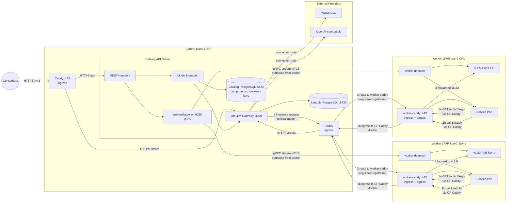
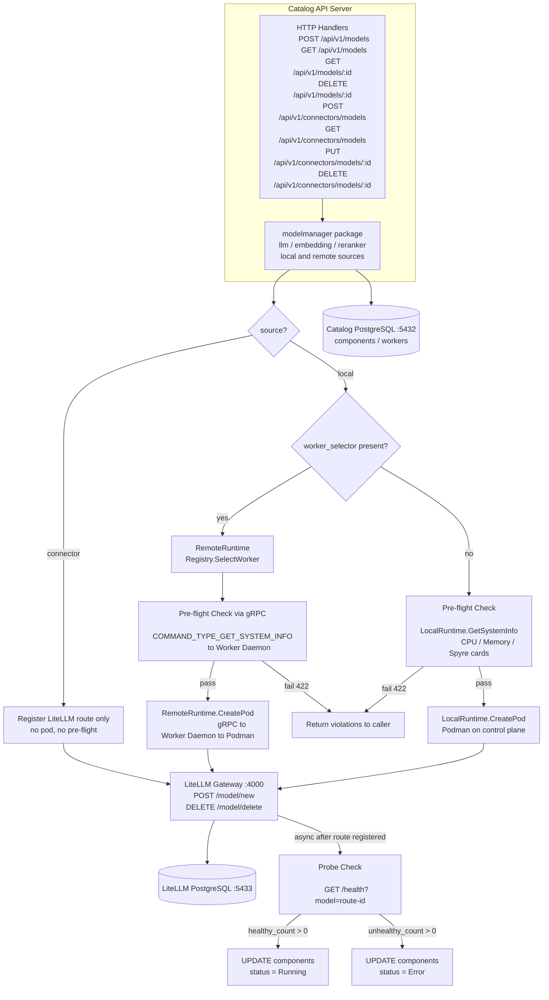
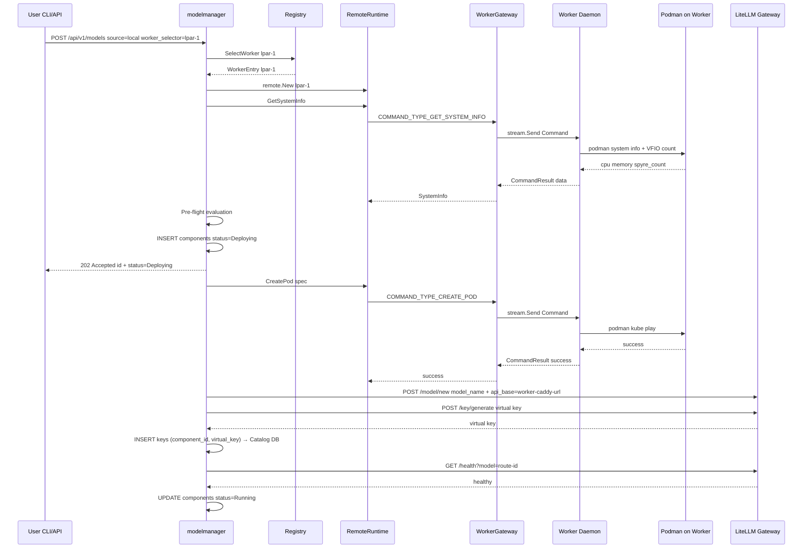

# Model Management — High-Level Architecture and Design

**Version:** 2.0  
**Date:** July 2026  
**Supersedes:** `docs/proposals/catalog/model-management-proposal.md` (v1.0)

> **What changed from v1.0:** The introduction of the Remote Worker system allows `modelmanager` to target a Worker LPAR over a persistent gRPC stream instead of only the control-plane Podman socket. All architecture diagrams below reflect this new tier.

---

## Table of Contents

1. [System Topology](#system-topology)
2. [Deploy / Lifecycle Request Flow](#deploy--lifecycle-request-flow)
3. [Remote Worker — Model Deployment Sequence](#remote-worker--model-deployment-sequence)
4. [UX Designs — UI Requirements](#ux-designs--ui-requirements)
   - [4.1 Models List View](#41-models-list-view)
   - [4.2 Deploy Model — Worker and Backend Selection](#42-deploy-model--worker-and-backend-selection)
   - [4.3 Resource Check Before Deploy](#43-resource-check-before-deploy)

---

## System Topology



### How it works

**Control plane**
- LiteLLM Gateway and the Catalog API Server run on the control-plane LPAR.
- A single Caddy instance on the control plane handles both **ingress** (external consumers → API / LiteLLM) and **egress** (outbound to worker Caddys).

**Inference request path (numbered in diagram)**
1. A consumer or Service Pod sends an inference request to the control-plane Caddy.
2. LiteLLM receives the request and resolves the target worker's `api_base` URL.
3. The request leaves the control plane via the egress Caddy, which has the worker registered as an upstream, over **mTLS**.
4. The worker's Caddy (ingress) receives the request and forwards it to the local vLLM Pod.

**Service Pod call-home path**
- Before making an inference call, the Service Pod first fetches its LiteLLM virtual key from the Catalog API (`GET /api/v1/keys`) via its worker Caddy → control-plane Caddy → Catalog API. The virtual key is stored in the Catalog PostgreSQL `keys` table and was generated by Model Manager at deploy time via `POST /key/generate` on LiteLLM.
- With the key in hand, the Service Pod calls LiteLLM directly: worker Caddy (egress) → control-plane egress Caddy → LiteLLM. The same mTLS tunnel is reused for both legs.

**Worker management plane**
- Each worker daemon establishes a persistent **outbound** gRPC stream (mTLS) to the WorkerGateway on the control plane. Model Manager sends deployment commands down this stream — no inbound firewall holes are needed on the worker LPAR.

---

## Deploy / Lifecycle Request Flow



---

## Remote Worker — Model Deployment Sequence



---

## UX Designs — UI Requirements

### 4.1 Models List View

Display all deployed models (both `local` and `remote` sources) in a flat table. Each row gives the operator an at-a-glance status of every model in the system.

```
┌─────────────────────────────────────────────────────────────────────────────────────────────┐
│  Models                                                              [ + Deploy Model ]      │
├──────────────────────┬────────────┬──────────┬──────────┬───────────┬──────────┬────────────┤
│  Name                │  Type      │  Backend │  Source  │  Worker   │  Status  │  Actions   │
├──────────────────────┼────────────┼──────────┼──────────┼───────────┼──────────┼────────────┤
│  granite-3.3-8b      │  llm       │  vllm    │  local   │  lpar-1   │  ● Running│  [ Delete ]│
│  granite-embedding   │  embedding │  vllm    │  local   │  lpar-2   │  ● Running│  [ Delete ]│
│  granite-watsonx     │  llm       │  watsonx │  remote  │  —        │  ● Running│  [ Delete ]│
│  granite-openai      │  llm       │  openai  │  remote  │  —        │  ⟳ Syncing│  [ Delete ]│
│  reranker-v1         │  reranker  │  vllm    │  local   │  lpar-1   │  ✕ Error  │  [ Delete ]│
└──────────────────────┴────────────┴──────────┴──────────┴───────────┴──────────┴────────────┘

Status legend:  ● Running   ⟳ Deploying / Syncing   ✕ Error
```

**API backing this view:** `GET /api/v1/models` and `GET /api/v1/connectors/models`

---

### 4.2 Deploy Model — Worker and Backend Selection

A modal / side panel opened by the **[ + Deploy Model ]** button. The user picks the model type, inference backend, and the target worker. The form adapts based on source (`local` vs `remote`).

```
┌──────────────────────────────────────────────────────────────┐
│  Deploy a Model                                         [ × ] │
├──────────────────────────────────────────────────────────────┤
│                                                              │
│  Model Name        [ granite-3.3-8b-instruct             ]  │
│                                                              │
│  Type              ( ● ) llm   ( ) embedding   ( ) reranker  │
│                                                              │
│  Source            ( ● ) Local Pod   ( ) Remote Connector    │
│                                                              │
│  ── Local Pod options ─────────────────────────────────      │
│                                                              │
│  Inference Backend  [ vllm-spyre             ▾ ]            │
│                       vllm-spyre                             │
│                       vllm-cpu                               │
│                                                              │
│  Target Worker      [ lpar-1  (Spyre, Ready)  ▾ ]           │
│                       lpar-1  Spyre   ● Ready                │
│                       lpar-2  CPU     ● Ready                │
│                       lpar-3  CPU     ○ Disconnected         │
│                                                              │
│  HuggingFace Model  [ ibm-granite/granite-3.3-8b-instruct ]  │
│                                                              │
│  ── Remote Connector options (hidden when local) ──────      │
│                                                              │
│  Provider           [ watsonx                ▾ ]            │
│  Endpoint URL       [ https://...                        ]   │
│  API Key            [ ••••••••••••••••••                 ]   │
│                                                              │
│  [ Check Resources ]                  [ Cancel ] [ Deploy ]  │
└──────────────────────────────────────────────────────────────┘
```

**Notes:**
- **Inference Backend** dropdown is populated from available `metadata.yaml` assets on the server (`GET /api/v1/model-catalog`).
- **Target Worker** dropdown lists all workers with `status = ready` from `GET /api/v1/workers`. Shows runtime type (Spyre / CPU) and live status alongside each entry. Disconnected workers are shown but disabled.
- **[ Check Resources ]** triggers the resource check panel (see §4.3) before the user commits to deploy.
- Remote Connector fields are shown/hidden based on the **Source** toggle.

---

### 4.3 Resource Check Before Deploy

Triggered by **[ Check Resources ]** in the deploy form. Calls the pre-flight API for the selected worker and backend, then displays a per-resource breakdown before the user confirms deployment.

```
┌──────────────────────────────────────────────────────────────┐
│  Resource Check — lpar-1  (vllm-spyre)             [ × ]    │
├──────────────────────────────────────────────────────────────┤
│  Model:   ibm-granite/granite-3.3-8b-instruct                │
│  Worker:  lpar-1  (Spyre, Ready)                             │
├──────────────┬────────────┬────────────┬─────────────────────┤
│  Resource    │  Required  │  Available │  Status             │
├──────────────┼────────────┼────────────┼─────────────────────┤
│  CPU         │  8 cores   │  24 cores  │  ✓ Sufficient       │
│  Memory      │  32 GiB    │  64 GiB    │  ✓ Sufficient       │
│  Storage     │  50 GiB    │  120 GiB   │  ✓ Sufficient       │
│  Spyre Cards │  1         │  2         │  ✓ Sufficient       │
├──────────────┴────────────┴────────────┴─────────────────────┤
│  ✓ All resource constraints satisfied.                       │
│                                                              │
│                             [ Back ]  [ Confirm Deploy ]     │
└──────────────────────────────────────────────────────────────┘
```

**Failure state** (insufficient resources):

```
┌──────────────────────────────────────────────────────────────┐
│  Resource Check — lpar-2  (vllm-spyre)             [ × ]    │
├──────────────┬────────────┬────────────┬─────────────────────┤
│  Resource    │  Required  │  Available │  Status             │
├──────────────┼────────────┼────────────┼─────────────────────┤
│  CPU         │  8 cores   │  24 cores  │  ✓ Sufficient       │
│  Memory      │  32 GiB    │  18 GiB    │  ✕ Insufficient     │
│  Storage     │  50 GiB    │  120 GiB   │  ✓ Sufficient       │
│  Spyre Cards │  1         │  0         │  ✕ Insufficient     │
├──────────────┴────────────┴────────────┴─────────────────────┤
│  ✕ 2 constraint(s) not satisfied. Choose a different worker. │
│                                                              │
│                                        [ Back ]              │
└──────────────────────────────────────────────────────────────┘
```

**API backing this view:** Pre-flight check via `POST /api/v1/models/preflight` (or inline when `GET /api/v1/workers/:id/resources` is called for the selected worker). Returns all violations in a single response — never just the first.

---

## Open Questions

- Should worker selection be automatic instead of the user picking a target worker?
- Should users be able to configure deployment profiles (e.g. number of Spyre cards to allocate, `max-model-len` etc and make the params flexible)?
