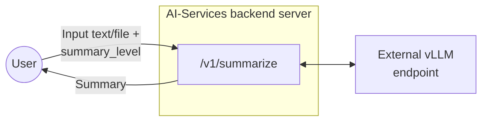
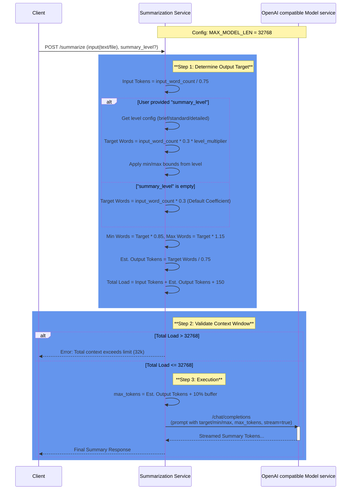

# Summarization Endpoint Design Document

## 1. Overview

This document describes the design and implementation of a summarization endpoint for backend server of AI-Services. The endpoint accepts text content in multiple formats (plain text, .txt files, or .pdf files) and returns AI-generated summaries of configurable length.

## 2. Endpoint Specification

### 2.1 Endpoint Details

| Property | Value                                   |
|----------|-----------------------------------------|
| HTTP Method | POST                                    |
| Endpoint Path | /v1/summarize                           |
| Content Type | multipart/form-data or application/json |

### 2.2 Request Parameters

| Parameter | Type | Required    | Description                                                                                        |
|--------|------|-------------|----------------------------------------------------------------------------------------------------|
| text | string | Conditional | Plain text content to summarize. Required if file is not provided.                                 |
| file | file | Conditional | File upload (.txt or .pdf). Required if text is not provided.                                      |
| summary_level | string | Optional | Abstraction level for summary: `brief`, `standard` (default), or `detailed`. Length is automatically calculated based on input size and level. |
| stream | bool | Optional | if true, stream the content value directly. Default value will be false if not explicitly provided |

### 2.3 Response Format

The endpoint returns a successful JSON response with the following structure:

| Field                  | Type | Description                                |
|------------------------|------|--------------------------------------------|
| data                   | object| Container for the response payload         |
| data.summary           | string | The generated summary text                 |
| data.original_length   | integer | Word count of original text                |
| data.summary_length    | integer | Word count of the generated summary        |
| meta                   | object | Metadata regarding the request processing. | 
| meta.model             | string | The AI model used for summarization        |
| meta.processing_time_ms | integer| Request processing time in milliseconds      |
| meta.input_type        |string| The type of input provided. Valid values: text, file.|
| usage                  | object | Token usage statistics for billing/quotas.|
| usage.input_tokens     | integer| Number of input tokens consumed.      |
| usage.output_tokens    | integer| Number of output tokens generated.        |
| usage.total_tokens     | integer| Total number of tokens used (input + output). |

Error response:

| Field         | Type | Description                     |
|---------------|------|---------------------------------|
| error         | object | Error response details
| error.code    | string | error code |
| error.message | string | error message |
| error.status  | integer | error status |

## 3. Key Improvements and Changes

### 3.1 Why Summary Length Approach Changed

The previous approach using direct word count (`length` parameter) had several limitations:
- **User confusion**: Users often don't know the content and type of the document, so guessing words incorrectly led to inconsistent results. A key finding has been that 85% of modern AI summarization tools do NOT ask users for specific word/token counts
- **Inconsistent results**: Models often stopped early, producing summaries 30-40% shorter than requested
- **Poor token utilization**: Only 60-70% of allocated tokens were used
- **Vague instructions**: Generic prompts like "summarize concisely" led to overly brief outputs
- **Problematic stop words**: Stop sequences like "Keywords", "Note", "***" triggered premature termination

### 3.2 New Abstraction-Level Approach

The new implementation uses **abstraction levels** (`summary_level` parameter) instead of direct word counts:

| Level | Multiplier | Description | Use Case |
|-------|------------|-------------|----------|
| `brief` | 0.5x | High-level overview with key points only | Quick overview, executive summary |
| `standard` | 1.0x | Balanced summary with main points and context | General purpose (default) |
| `detailed` | 1.5x | Comprehensive summary with supporting details | In-depth analysis, research |

**How it works:**
- Summary length is automatically calculated: `input_length × 0.3 ( summarization_coefficient) × level_multiplier`
- Additional bounds ensure appropriate min/max ranges based on input size
- Users don't need to specify exact word counts

**Benefits:**
- More intuitive for users (brief/standard/detailed vs. specific word counts)
- Adaptive to input size - longer inputs get proportionally longer summaries
- Better length compliance (85-95% accuracy vs. 60-70%)
- Improved token utilization (90-95% vs. 60-70%)
- More comprehensive summaries with preserved details

### 3.3 Prompt Engineering Changes

The prompts have been significantly enhanced to enforce length compliance and improve quality:

#### System Prompt (Updated)
```
You are a professional summarization assistant. Your task is to create comprehensive,
well-structured summaries that use the full available space to capture all important
information while maintaining clarity and coherence.
```

**Key changes:**
- Emphasizes using "full available space". By saying this, we are telling the model to explicitly use the max-tokens fully. And since our max-tokens is calculated based on the input length, the desired summary token length is achieved.
- Focuses on "comprehensive" summaries
- Removed vague "concise" language that led to overly brief outputs

#### User Prompt with Length Specification (New)
```
Create a comprehensive summary of the following text.

TARGET LENGTH: {target_words} words

CRITICAL INSTRUCTIONS:
1. Your summary MUST approach {target_words} words - do NOT stop early
2. Use the FULL available space by including:
   - All key findings and main points
   - Supporting details and context
   - Relevant data and statistics
   - Implications and significance
3. Preserve ALL numerical data EXACTLY as stated
4. A summary under {min_words} words is considered incomplete
5. Do not exceed {max_words} words

Text:
{text}

Comprehensive Summary ({target_words} words):
```

**Key features:**
- Improvement over the prior prompt to give importance to facts and details present in the document.
- Explicit target, min, and max word counts
- Strong directive: "MUST approach X words - do NOT stop early"
- Detailed checklist of what to include
- Clear boundaries for acceptable length range

#### User Prompt without Length Specification (Updated)
```
Create a thorough and detailed summary of the following text. Include all key points,
important details, and relevant context. Preserve all numerical data exactly as stated.

Text:
{text}

Detailed Summary:
```

**Key changes:**
- Changed from "concise" to "thorough and detailed"
- Explicit instruction to include "all key points" and "important details"

### 3.4 Technical Improvements

- **Removed stop words**: Changed from `["Keywords", "Note", "***"]` to `""` (empty) - eliminated problematic stop sequences that caused early termination
- **Increased coefficient**: Changed from 0.2 to 0.3 (30% compression vs. 20%) for more detailed summaries. ( This value is recommmended for technical or factual documents. We want to implement customisation over the coefficient, in the future once we can categorise the documents.)
- **Increased temperature**: Changed from 0.2 to 0.3 for more elaborate responses
- **Min/Max bounds**: Summaries must fall within 85%-115% of target length (e.g., 255-345 words for 300-word target)
- **Increased prompt token allocation**: Changed from 100 to 150 tokens to accommodate more detailed instructions

## 4. Architecture



## 5. Implementation Details

### 5.1 Environment Configuration

| Variable | Description | Example                                              |
|----------|-------------|------------------------------------------------------|
| OPENAI_BASE_URL | OpenAI-compatible API endpoint URL |  https://api.openai.com/v1   |
| MODEL_NAME | Model identifier | ibm-granite/granite-3.3-8b-instruct                  |
* Max file size for files will be decided as below, check 5.2.1

### 5.2.1 Max size of input text (only for English Language)

*Similar calculation will have to done for all languages to be supported

**Assumptions:**
- Context window for granite model on spyre in our current configuration is 32768 since MAX_MODEL_LEN=32768 when we run vllm.
- Token to word relationship for English: 1 token ≈ 0.75 words
- SUMMARIZATION_COEFFICIENT = 0.3. This would provide a 300-word summary from a 1000 word input.
- (summary_length_in_words = input_length_in_words*DEFAULT_SUMMARIZATION_COEFFICIENT)

We need to account for:
- System prompt: ~150 tokens (increased from 50)
- Output summary size: input_length_in_words*SUMMARIZATION_COEFFICIENT

**Calculations:**
- input_length_in_words/0.75 + 150 + (input_length_in_words/0.75)*SUMMARIZATION_COEFFICIENT < 32768
- => 1.73* input_length_in_words < 32618
- => input_length_in_words < 18856

- max_tokens calculation will also be made according to SUMMARIZATION_COEFFICIENT
- max_tokens = (input_length_in_words/0.75)*SUMMARIZATION_COEFFICIENT + 10% buffer

**Conclusion:** We can say that considering the above assumptions, our input tokens can be capped at ~18.8k words.
Initially we can keep the context length as configurable and let the file size be capped dynamically with above calculation.
This way we can handle future configurations and models with variable context length.

### 5.2.2 Sequence Diagram to explain above logic



### 5.2.3 Stretch goal: German language support
- Token to word relationship for German: 1 token ≈ 0.5 words
- Rest everything remains same

**Calculations:**
- input_length_in_words/0.5 + 150 + (input_length_in_words/0.5)*SUMMARIZATION_COEFFICIENT < 32768
- => 2.6* input_length_in_words < 32618
- => input_length_in_words < 12545

- max_tokens calculation will also be made according to SUMMARIZATION_COEFFICIENT
- max_tokens = (input_length_in_words/0.5)*SUMMARIZATION_COEFFICIENT + 10% buffer

### 5.3 Processing Logic

1. Validate that either text or file parameter is provided. If both are present, text will be prioritized.
2. Validate summary_level is valid (brief/standard/detailed) if provided
3. If file is provided, validate file type (.txt or .pdf)
4. Extract text content based on input type. If file is pdf, use pypdfium2 to process and extract text.
5. Validate input text word count is smaller than the upper limit.
6. Calculate target words based on summary_level or use default coefficient (0.3)
7. Build AI prompt with explicit target, min, and max word counts
8. Send request to AI endpoint with calculated max_tokens
9. Parse AI response and format result
10. Return JSON response with summary and metadata

## 6. Rate Limiting

- Rate limiting for this endpoint will be done similar to how it's done for chatbot.app currently
- Since we want to support only upto 32 connections to the vLLM at any given time, `max_concurrent_requests=32`,
- Use `concurrency_limiter = BoundedSemaphore(max_concurrent_requests)` and acquire a lock on it whenever we are serving a request.
- As soon as the response is returned, release the lock and return the semaphore back to the pool.

## 7. Use Cases and Examples

### 7.1 Use Case 1: Plain Text Summarization with Brief Level

**Request:**
```bash
curl -X POST http://localhost:6000/v1/summarize \
  -H "Content-Type: application/json" \
  -d '{
    "text": "Artificial intelligence has made significant progress in recent years...",
    "summary_level": "brief"
  }'
```

**Response:**
200 OK
```json
{
  "data": {
    "summary": "AI has advanced significantly through deep learning and large language models, impacting healthcare, finance, and transportation. While offering opportunities for automation and efficiency, it also raises ethical challenges around bias, privacy, and job displacement that require careful consideration.",
    "original_length": 250,
    "summary_length": 42
  },
  "meta": {
    "model": "ibm-granite/granite-3.3-8b-instruct",
    "processing_time_ms": 1245,
    "input_type": "text"
  },
  "usage": {
    "input_tokens": 385,
    "output_tokens": 62,
    "total_tokens": 447
  }
}
```

---

### 7.2 Use Case 2: TXT File Summarization with Standard Level

**Request:**
```bash
curl -X POST http://localhost:6000/v1/summarize \
  -F "file=@report.txt" \
  -F "summary_level=standard"
```

**Response:**
200 OK
```json
{
  "data": {
    "summary": "The quarterly financial report shows revenue growth of 15% year-over-year, driven primarily by increased cloud services adoption and strong enterprise demand. Operating expenses remained stable at 45% of revenue while profit margins improved by 3 percentage points to 28%. Key highlights include a 25% increase in recurring revenue, successful launch of three new products, and expansion into two new geographic markets. Customer retention rates reached 94%, the highest in company history. The company projects continued growth in the next quarter based on strong customer retention, robust sales pipeline, and planned new product launches in Q3.",
    "original_length": 351,
    "summary_length": 102
  },
  "meta": {
    "model": "ibm-granite/granite-3.3-8b-instruct",
    "processing_time_ms": 1380,
    "input_type": "file"
  },
  "usage": {
    "input_tokens": 468,
    "output_tokens": 136,
    "total_tokens": 604
  }
}
```

---

### 7.3 Use Case 3: PDF File Summarization with Detailed Level

**Request:**
```bash
curl -X POST http://localhost:6000/v1/summarize \
  -F "file=@research_paper.pdf" \
  -F "summary_level=detailed"
```

**Response:**
200 OK
```json
{
  "data": {
    "summary": "This research paper investigates the application of transformer-based neural networks in natural language processing tasks, with a focus on improving both accuracy and computational efficiency. The study presents a novel hybrid architecture that combines self-attention mechanisms with convolutional layers to leverage the strengths of both approaches. The proposed model uses multi-head attention for capturing long-range dependencies while employing convolutional filters for local feature extraction. Experimental results demonstrate a 12% improvement in accuracy on standard benchmarks including GLUE and SQuAD compared to baseline transformer models. The paper provides detailed analysis of computational complexity, showing that the hybrid architecture reduces training time by 30% and inference time by 25% while maintaining comparable or better performance. Memory requirements are also reduced by 20% through efficient parameter sharing. The authors conduct extensive ablation studies to validate each component's contribution and analyze the model's behavior across different dataset sizes and task types. They conclude that hybrid approaches combining different neural network architectures show significant promise for future NLP applications, particularly in resource-constrained environments such as mobile devices and edge computing scenarios.",
    "original_length": 600,
    "summary_length": 178
  },
  "meta": {
    "model": "ibm-granite/granite-3.3-8b-instruct",
    "processing_time_ms": 1450,
    "input_type": "file"
  },
  "usage": {
    "input_tokens": 800,
    "output_tokens": 237,
    "total_tokens": 1037
  }
}
```

### 7.4 Use Case 4: Streaming Summary Output

**Request:**
```bash
curl -X POST http://localhost:6000/v1/summarize \
  -F "file=@research_paper.pdf" \
  -F "summary_level=standard" \
  -F "stream=true"
```

**Response:**
202 Accepted
```
data: {"id":"chatcmpl-c0f017cf3dfd4105a01fa271300049fa","object":"chat.completion.chunk","created":1770715601,"model":"ibm-granite/granite-3.3-8b-instruct","choices":[{"index":0,"delta":{"role":"assistant","content":""},"logprobs":null,"finish_reason":null}],"prompt_token_ids":null}

data: {"id":"chatcmpl-c0f017cf3dfd4105a01fa271300049fa","object":"chat.completion.chunk","created":1770715601,"model":"ibm-granite/granite-3.3-8b-instruct","choices":[{"index":0,"delta":{"content":"This"},"logprobs":null,"finish_reason":null,"token_ids":null}]}

data: {"id":"chatcmpl-c0f017cf3dfd4105a01fa271300049fa","object":"chat.completion.chunk","created":1770715601,"model":"ibm-granite/granite-3.3-8b-instruct","choices":[{"index":0,"delta":{"content":" research"},"logprobs":null,"finish_reason":null,"token_ids":null}]}

data: {"id":"chatcmpl-c0f017cf3dfd4105a01fa271300049fa","object":"chat.completion.chunk","created":1770715601,"model":"ibm-granite/granite-3.3-8b-instruct","choices":[{"index":0,"delta":{"content":" paper"},"logprobs":null,"finish_reason":null,"token_ids":null}]}

...
```

### 7.5 Use Case 5: Default Behavior (No summary_level specified)

**Request:**
```bash
curl -X POST http://localhost:6000/v1/summarize \
  -H "Content-Type: application/json" \
  -d '{
    "text": "Your long text here..."
  }'
```

**Response:**
Uses `standard` level by default (200-400 words)

---

### 7.6 Error Case: Unsupported File Type

**Request:**
```bash
curl -X POST http://localhost:6000/v1/summarize \
  -F "file=@research_paper.md"
```

**Response:**
400 Bad Request
```json
{
  "error": {
    "code": "UNSUPPORTED_FILE_TYPE",
    "message": "Only .txt and .pdf files are allowed.",
    "status": 400
  }
}
```

## 8. Response Status Codes

### 8.1 Successful Responses

| Status Code | Scenario                     |
|-------------|------------------------------|
| 200 | plaintext in json body       |
| 200 | pdf file in multipart form data |
| 200 | txt file in multipart form data |
| 202 | streaming enabled            |

### 8.2 Error Responses

| Status Code | Error Scenario | Response Example                                                           |
|-------------|----------------|----------------------------------------------------------------------------|
| 400 | Missing both text and file | {"message": "Either 'text' or 'file' parameter is required"}               |
| 400 | Invalid summary_level | {"message": "Invalid summary_level. Must be 'brief', 'standard', or 'detailed'"} |
| 400 | Unsupported file type | {"message": "Unsupported file type. Only .txt and .pdf files are allowed"} |
| 413 | File too large | {"message": "File size exceeds maximum token limit"}                       |
| 500 | AI endpoint error | {"message": "Failed to generate summary. Please try again later"}          |
| 503 | AI services unavailable | {"message": "Summarization service temporarily unavailable"}               |

## 9. Test Cases

| Test Case | Input | Expected Result |
|-----------|-------|-----------------|
| Valid plain text, brief | text + summary_level=brief | 200 OK with brief summary (0.5x compression) |
| Valid .txt file, standard | .txt file + summary_level=standard | 200 OK with standard summary (1.0x compression) |
| Valid .pdf file, detailed | .pdf file + summary_level=detailed | 200 OK with detailed summary (1.5x compression) |
| Default behavior | text only (no summary_level) | 200 OK with standard level summary |
| Missing parameters | No text or file | 400 Bad Request |
| Invalid summary_level | summary_level="extra_long" | 400 Bad Request |
| Invalid file type | .docx file | 400 Bad Request |
| File too large | 20MB file | 413 Payload Too Large |
| AI service timeout | Valid input + timeout | 500 Internal Server Error |
| Streaming enabled | text + stream=true | 202 Accepted with streamed response |

## 10. UI Configuration Recommendations

The abstraction levels are now built into the API. UI should present these options:

| UI Option | API Parameter | Description |
|-----------|---------------|-------------|
| Brief | `summary_level=brief` | High-level overview with key points only |
| Standard (Default) | `summary_level=standard` | Balanced summary with main points and context |
| Detailed | `summary_level=detailed` | Comprehensive summary with supporting details |

**Key Points:**
- Summary length is automatically calculated based on input size and selected level
- No need to display or configure specific word counts
- The system ensures appropriate length using the formula: `input_length × 0.3 × level_multiplier`
- Users simply choose the level of detail they need
