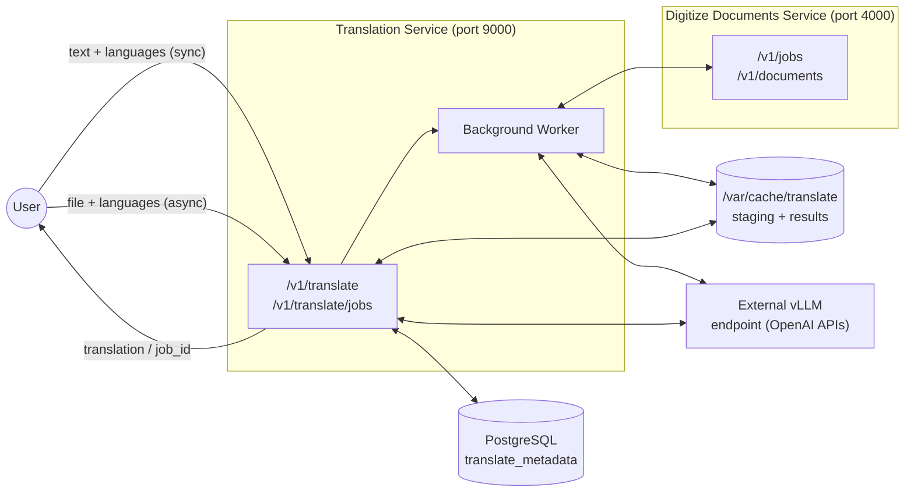
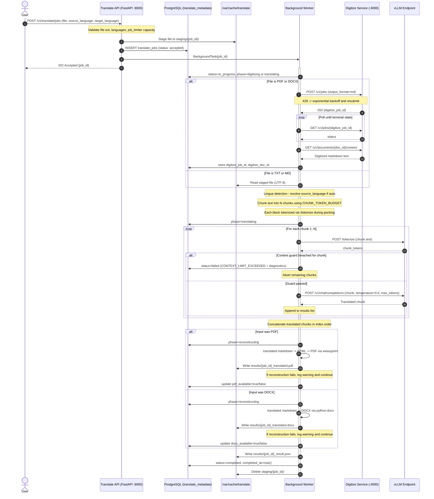

# Translation Service — Implementation Proposal

## 1. Overview

This document proposes the design and implementation of the **Translation** microservice for the AI-Services platform. The service converts text and documents between languages, enabling multilingual operations, and global user experiences.

At its core, the service accepts text or a document and a target language, and returns the fully translated content. The source language is **optional** — when omitted (or explicitly set to `"auto"`), the LLM detects the language automatically. For plain text, the call is synchronous and returns immediately. For files — including `.txt`, `.md`, `.pdf`, and `.docx` — the service operates asynchronously: the file is staged, PDF and DOCX inputs are forwarded to the existing **Digitize Documents** service to produce a clean markdown representation, and the resulting text is passed to the LLM for translation. The translated output for document inputs is returned as a markdown string, preserving all headings, lists, and tables from the original.

**Two design choices have been made for document inputs and are described in detail in Sections 2 and 3:**
- **Translation strategy:** Chunk-wise translation — the digitized markdown is split into paragraph-boundary chunks and each chunk is translated in a separate LLM call.
- **Output format:** Translated markdown plus a reconstructed output document — PDF for `.pdf` inputs, DOCX for `.docx` inputs — so that users receive a usable, shareable document, not just raw markdown.

The service is a first-class member of the AI-Services platform and follows the same architectural patterns established by the digitize and summarize services:

- FastAPI application running as a Python service in a Podman container (ppc64le / RHEL).
- Semaphore-based concurrency limiting: a 4-slot job admission semaphore for async jobs, and a shared 32-slot semaphore in front of the vLLM inference endpoint.
- PostgreSQL (`translate_metadata` database) for durable job metadata, initialized by an idempotent init container.
- `/var/cache/translate`-backed staging and result files on a persistent volume.
- Boot-time recovery scan that marks interrupted jobs as failed and cleans up orphaned staging directories.

Two execution paths are provided:

| Path                    | Endpoint                   | Use case                                                                                                                                         |
|:------------------------|:---------------------------|:-------------------------------------------------------------------------------------------------------------------------------------------------|
| **Synchronous**         | `POST /v1/translate`       | Plain text submitted inline. Blocking call, immediate translated text result. Stateless — no job record created.                                 |
| **Asynchronous (jobs)** | `POST /v1/translate/jobs`  | File uploads (`.txt`, `.md`, `.pdf`, `.docx`). PDF and DOCX files are digitized via the Digitize Documents REST API before translation. Returns a `job_id` for polling. |

### 1.1 Concept-to-Design Mapping

| Concept diagram element                                           | Design realization                                                                                                                                                        |
|:------------------------------------------------------------------|:--------------------------------------------------------------------------------------------------------------------------------------------------------------------------|
| Input: text to be translated                                      | Sync `text` field; async worker reads staged file (txt/md) or fetches digitized markdown from the digitize service (pdf/docx)                                             |
| Input: source language (e.g., "German")                          | `source_language` parameter — optional; defaults to `"auto"`. When `"auto"`, the service runs `detect_language()` from `common/lang_utils.py` (lingua) before the LLM call to resolve the actual language; falls back to LLM auto-detect if confidence is below threshold. When provided explicitly, validated against a fixed allowlist. |
| Input: target language (e.g., "English")                         | `target_language` parameter — validated against a fixed allowlist; `"auto"` is not permitted                                                                              |
| Config: Version (e.g., 1.0.0)                                    | Not managed by the service — API versioned via `/v1/` path prefix                                                                                                         |
| Config: LLM (granite-3.3-8b-instruct, mistral-small-3.1-24b, …) | `MODEL_NAME` env var (service default)                                                                                                                                    |
| Config (optional): custom model weights                          | `OPENAI_BASE_URL` env var pointing to the desired vLLM deployment                                                                                                        |
| Output: text translated to the provided output language          | `data.translation` in the response — a translated string; for document inputs, a translated markdown string preserving all headings, lists, and tables                   |
| Output: pointers to digitized input documents                    | `data.digitize_doc_id` for async pdf/docx jobs — a durable pointer to the cached `.md` file in the digitize service                                                      |
| External dependency: inferencing endpoint                        | Existing vLLM endpoint (`OPENAI_BASE_URL`), shared semaphore (`MAX_CONCURRENT_REQUESTS=32`)                                                                               |
| Supported document formats: TXT, PDF/DOCX via digitize           | `.txt`, `.md` files handled natively; `.pdf` and `.docx` delegated to the Digitize Documents service via HTTP                                                             |
| Supported contents: texts and tables                             | Markdown tables from the digitize service are preserved structurally; the LLM prompt explicitly instructs cell/header translation while keeping `\| pipe \|` syntax intact |
| Translation strategy for documents                               | Chunk-wise — markdown split on paragraph boundaries, each chunk translated in a separate LLM call, results concatenated (Section 2)                                       |
| Output format for pdf/docx inputs                                | Translated markdown string + reconstructed output document: PDF (via `weasyprint`) for `.pdf` inputs, DOCX (via `python-docx`) for `.docx` inputs (Section 3)            |
| SLAs: throughput / latency                                       | Governed by concurrency limits and the context-window guard applied per chunk (Section 8); to be quantified during performance testing                                    |

---

## 2. Design Decision — Chunk-Wise Translation

**Decision: the async document translation path uses chunk-wise translation.** The digitized markdown is split into manageable chunks on paragraph boundaries, each chunk is translated in an independent LLM call, and the results are concatenated into the final translated document.

> **Note:** This decision is based on the reasoning below and represents the primary implementation approach. It will be validated through experimentation with real documents during development. If results show that single-pass translation is reliably sufficient for the document sizes encountered in practice, the strategy can be revisited without API changes.

### 2.1 Why Not Translate the Entire Document in One LLM Call

Sending the full digitized markdown in a single call is the simpler implementation, but it carries a set of compounding risks that make it unsuitable as the primary strategy for documents:

**1. Context window limits make it fragile by design.**
`granite-3.3-8b-instruct` has a 32k token context window. Translation is approximately a 1:1 operation — a 15k-token German document requires roughly 15k tokens of output, leaving only 2k tokens after subtracting prompt overhead. A 20-page contract can easily exceed 20k–25k input tokens alone. Single-pass translation therefore rejects a significant fraction of real-world documents outright, which is not an acceptable user experience.

**2. LLM quality degrades with prompt length.**
LLMs are well-documented to lose fidelity on very long prompts. At high token counts, models may drop paragraphs, repeat earlier sections, reorder content, or begin to fabricate. Translation demands high faithfulness — every sentence in the input must appear, correctly translated, in the output. The risk of silent content omission is especially high, because there is no way for the service to verify completeness without a second LLM call.

**3. A single failure loses the entire translation.**
If the LLM call times out, runs out of memory, or produces low-quality output for a long document, the job must be restarted from the beginning. There is no natural checkpoint. For a 30-page document that takes 60+ seconds, this is a costly and frustrating failure mode.

**4. Error recovery is expensive and all-or-nothing.**
Because the entire document is treated as one atomic unit, any error — network timeout, vLLM OOM, context limit exceeded mid-generation — requires a full retry. There is no way to salvage the portion that was correctly translated.

**5. Token cost scales poorly.**
A 25k-token input document at a 1:1 translation ratio consumes ~50k tokens per job in a single call. Chunk-wise translation consumes the same total tokens but distributes them across smaller, independently completable calls, enabling finer retry granularity and more predictable per-call latency.

### 2.2 Why Chunk-Wise Translation is the Right Choice

- **No context ceiling.** Documents of any length can be translated — the chunker sizes each piece to fit within the available window with room for both prompt overhead and the translated output.
- **Contained failure surface.** If one chunk fails, only that chunk is retried. Completed chunks are preserved, making partial recovery straightforward.
- **Predictable quality per chunk.** Each LLM call operates on a small, focused segment. The model's attention is not diluted across 30 pages — it processes at most a few paragraphs at a time, which is where LLM translation quality is highest.
- **Natural parallelism.** Chunks can be scheduled concurrently (up to the shared LLM semaphore), reducing total wall-clock time for long documents.

### 2.3 Chunking Strategy

#### Unit of measurement — tokens, not words

The chunker measures chunk size in **tokens**, not words. Translation output length tracks input token count closely (approximately 1:1), so the chunk budget must be expressed in the same unit the LLM context window uses. Word count — used by the summarize service's chunker — is an approximation that works for summarization (output is shorter than input, so over-estimating is safe). For translation the margin is much tighter: a chunk that is 10% too large in token terms may push the combined prompt over the context window.

Token counts are obtained via `tokenize_with_llm(block_text, llm_endpoint)` from `common/llm_utils.py`, which calls `POST {OPENAI_BASE_URL}/tokenize`. This is the same call used by the context-window guard — no new dependency is introduced. The token count of each block is measured **once** when the block is first considered for packing and cached for the remainder of the packing loop.

#### Algorithm

**Step 1 — Split on paragraph boundaries.**
The full markdown string is split on double-newline (`\n\n`) into a list of blocks. Each block is one of: a heading line, a prose paragraph, a GFM table (the full `| pipe |` block including separator row), or a list block. Blocks are the atomic units passed to the packing loop.

**Step 2 — Greedy packing.**
Maintain a running chunk (a list of blocks) and a running token count. For each block in order:

```
block_tokens = tokenize_with_llm(block_text)   # one /tokenize call per block

if running_tokens + block_tokens <= CHUNK_TOKEN_BUDGET:
    append block to current chunk
    running_tokens += block_tokens
else:
    close current chunk → emit as chunk[i]
    start new chunk with this block
    running_tokens = block_tokens
```

When the loop ends, the remaining open chunk is emitted as the final chunk.

**Step 3 — Sentence-level fallback for oversized blocks.**
If a single block's token count exceeds `CHUNK_TOKEN_BUDGET` on its own (e.g., a very long paragraph with no sub-structure), it cannot be placed as a unit. It is split at sentence boundaries (`.`, `!`, `?` followed by whitespace) and the resulting sentences are packed greedily using the same token-counting logic above.

#### Parameters

| Parameter | What it controls | How it's used |
|:---|:---|:---|
| `CHUNK_TOKEN_BUDGET` | Max input tokens per chunk | Packing decision threshold in steps 2 and 3 |
| `OPENAI_BASE_URL` (shared) | `/tokenize` endpoint | Token count per block; one call per block, result cached |

> The initial value of `CHUNK_TOKEN_BUDGET` will be determined empirically during development by testing with real German/English documents and observing translation quality and latency. A reasonable starting point is half of `MAX_MODEL_LEN` minus `PROMPT_OVERHEAD_TOKENS`, which reserves the other half for the translated output. See §13 for the env var.

### 2.4 Concatenation and Coherence

After all chunk translations are returned, they are concatenated in the original chunk order. No additional LLM call is made for coherence stitching:

- **Order preservation.** Chunks are created and tracked with an index; results are concatenated in index order regardless of the order in which concurrent LLM calls complete.
- **Markdown structure preserved.** Because chunks are formed on paragraph boundaries, each chunk starts and ends at a clean markdown boundary. Concatenating the results produces valid, well-structured markdown.

### 2.5 Handling Tables at Chunk Boundaries

Markdown tables from the digitize service are emitted as contiguous `| pipe |` blocks. Tables must be treated as **atomic units** — a table is never split across two chunks:

- During greedy packing, if a table block would overflow the current chunk budget, the current chunk is closed first, and the table starts a new chunk on its own.
- If a table is larger than the entire chunk budget on its own, it occupies a chunk by itself and the budget is allowed to be exceeded for that chunk only — the alternative (splitting a table mid-row) would produce malformed markdown and an untranslatable fragment.

### 2.6 Chunk Join Strategy and Boundary Preservation

How chunk translations are joined back together depends on **what kind of content was split** at the chunk boundary. There are two distinct cases, and they require different join logic.

#### Case 1 — Block boundary (the common case)

When the chunk boundary falls between two whole blocks (a heading, a paragraph, a table, a list block), the blocks are separated by `\n\n` in the original. The join is simply:

```python
translated_markdown = "\n\n".join(chunk_translations)
```

The `\n\n` re-inserts the paragraph separator that existed between the blocks in the original. No information is lost and no discontinuity is visible.

**Example:**

Input document (two blocks, boundary between them):
```markdown
## Einleitung

Deutschland unterzeichnete das Abkommen im Jahr 2024.

| Quartal | Umsatz |
|---|---|
| Q1 | 1,2 Mio. € |
```

Chunk 1 (heading + paragraph packed together):
```markdown
## Einleitung

Deutschland unterzeichnete das Abkommen im Jahr 2024.
```
Chunk 2 (table alone — overflowed the budget):
```markdown
| Quartal | Umsatz |
|---|---|
| Q1 | 1,2 Mio. € |
```

After translation and `"\n\n".join(...)`:
```markdown
## Introduction

Germany signed the agreement in 2024.

| Quarter | Revenue |
|---|---|
| Q1 | €1.2M |
```
✅ Identical structure to the original. No separator artifacts.

---

#### Case 2 — Sentence fallback boundary (a single oversized paragraph split mid-block)

When a single prose paragraph exceeds `CHUNK_TOKEN_BUDGET` on its own, it is split into sentence sub-groups across two or more chunks. These sub-groups **belong to the same paragraph** in the original — they must be rejoined with a single space (` `), not a `\n\n`, otherwise the output introduces a false paragraph break in the middle of a continuous passage.

To enable the correct join, each chunk produced by the sentence fallback is tagged with a **join type** metadata field alongside the text:

| `join_after` value | Meaning | Join character |
|:---|:---|:---|
| `"paragraph"` (default) | Boundary between two whole blocks | `"\n\n"` |
| `"sentence"` | Boundary within a split paragraph | `" "` (single space) |

The final assembly iterates over `(chunk_translation, join_after)` pairs and uses the correct separator between each adjacent pair:

```python
result_parts = []
for i, (translation, join_after) in enumerate(zip(chunk_translations, chunk_metadata)):
    result_parts.append(translation)
    if i < len(chunk_translations) - 1:
        separator = " " if chunk_metadata[i]["join_after"] == "sentence" else "\n\n"
        result_parts.append(separator)
translated_markdown = "".join(result_parts)
```

**Example:**

Input: one oversized paragraph (too large for `CHUNK_TOKEN_BUDGET`):
```markdown
The contract was signed on January 1st. All parties agreed to the terms. The agreement covers all territories. Payment is due quarterly. Disputes shall be resolved by arbitration.
```

After sentence splitting into two chunks:

Chunk A (`join_after="sentence"`):
```
The contract was signed on January 1st. All parties agreed to the terms. The agreement covers all territories.
```
Chunk B (`join_after="paragraph"`):
```
Payment is due quarterly. Disputes shall be resolved by arbitration.
```

After translation:
- Chunk A → `"Der Vertrag wurde am 1. Januar unterzeichnet. Alle Parteien stimmten den Bedingungen zu. Das Abkommen gilt für alle Gebiete."`
- Chunk B → `"Die Zahlung ist vierteljährlich fällig. Streitigkeiten werden durch Schiedsverfahren beigelegt."`

Joined with `" "` (because chunk A's `join_after == "sentence"`):
```markdown
Der Vertrag wurde am 1. Januar unterzeichnet. Alle Parteien stimmten den Bedingungen zu. Das Abkommen gilt für alle Gebiete. Die Zahlung ist vierteljährlich fällig. Streitigkeiten werden durch Schiedsverfahren beigelegt.
```
✅ One continuous paragraph — the original paragraph structure is preserved exactly.

Compare to the broken output without join-type metadata (naive `"\n\n".join`):
```markdown
Der Vertrag wurde am 1. Januar unterzeichnet. Alle Parteien stimmten den Bedingungen zu. Das Abkommen gilt für alle Gebiete.

Die Zahlung ist vierteljährlich fällig. Streitigkeiten werden durch Schiedsverfahren beigelegt.
```
❌ False paragraph break inserted mid-passage — incorrect structure in both the markdown result and the reconstructed PDF/DOCX.

---

#### What this means for the chunk data structure

Each chunk produced by the chunker carries two fields:

```python
@dataclass
class TranslationChunk:
    index: int          # position in the original sequence; used to sort results after gather
    text: str           # the block or sentence group to translate
    join_after: str     # "paragraph" | "sentence" — how to join this chunk's result to the next
```

The `index` field ensures correct ordering after `asyncio.gather` regardless of completion order. The `join_after` field drives the assembly step. Both are set by the chunker and are read-only for the rest of the pipeline.

---

## 3. Design Decision — PDF and DOCX Reconstruction from Translated Markdown

**Decision: when the input is a `.pdf` or `.docx` file, the service returns both the translated markdown string and a reconstructed output document alongside it.** `.pdf` inputs produce a reconstructed PDF; `.docx` inputs produce a reconstructed DOCX. Returning only markdown is not sufficient for a production document translation service. Users need a deliverable they can actually use.

### 3.1 Why Reconstruction is Essential

When a user uploads a contract, report, or invoice in German and asks for it in English, they expect to receive a document back — not a markdown file. The cases where markdown-only output is acceptable are narrow:

- A developer integrating the API into their own pipeline.
- A downstream service that will render or re-format the content itself.

For the majority of real-world use cases, markdown is an intermediate representation that the user cannot use directly:

- **Non-technical users cannot open or read `.md` files.** A translated contract delivered as raw markdown is useless to a lawyer, procurement officer, or business user.
- **PDF is the universal document interchange format.** Contracts, invoices, regulatory filings, and reports are circulated as PDFs. Returning a translated PDF closes the loop — users can print, sign, share, or archive the output.
- **DOCX is the expected format for editable documents.** When the input is a `.docx`, the user needs an editable output — a Word document they can revise, reformat, and share. A reconstructed DOCX preserves editability; a PDF does not.
- **The quality bar is "usable", not "identical".** Users understand that a translated document will not have the exact same fonts, images, or pixel layout as the original. What they need is: all translated text present, correct structure (headings, paragraphs, tables), and a usable file. This is achievable.

### 3.2 Reconstruction Strategy

Two reconstruction pipelines run depending on input type:

**PDF inputs — markdown → HTML → PDF via `weasyprint`:**

```
translated_markdown  (string, output of chunk concatenation)
        │
        ▼
   markdown → HTML          (Python's stdlib `markdown` module)
        │   Apply a minimal CSS stylesheet: sensible font, page margins,
        │   table borders, heading sizes, code blocks
        ▼
   HTML → PDF               (via weasyprint — pure Python, no binary dependency)
        │
        ▼
  /var/cache/translate/results/{job_id}_translated.pdf
```

**DOCX inputs — markdown → DOCX via `python-docx`:**

```
translated_markdown  (string, output of chunk concatenation)
        │
        ▼
   Parse markdown blocks      (headings, paragraphs, tables, lists, bold/italic)
        │
        ▼
   Build DOCX document        (via python-docx — add_heading, add_paragraph,
        │                      add_table; apply basic styles for headings and body)
        ▼
  /var/cache/translate/results/{job_id}_translated.docx
```

**Why `weasyprint` for PDF:**
- Pure Python, installable via `pip` on ppc64le / RHEL — no binary compilation or system packages beyond fonts.
- Renders HTML+CSS to PDF with correct heading hierarchy, paragraph flow, and table borders.
- A single `requirements.txt` entry; no extra container layer complexity.

**Why `python-docx` for DOCX:**
- The standard Python library for creating and modifying `.docx` files; pure Python, available on ppc64le / RHEL via `pip`.
- Produces a structurally clean DOCX with headings at the correct level, paragraph text, and tables — fully editable in Word or LibreOffice.
- Output fidelity is "usable" — original fonts, images, and column widths from the source DOCX are not preserved, but all translated text and structure are present.

**Note on existing packages:** `pdfplumber` and `pypdfium2` are already used in this project for **reading and parsing** PDFs — they are not suitable for writing output documents. `weasyprint` and `python-docx` fill the write path for PDF and DOCX respectively.

### 3.3 Reconstruction is Non-Blocking

Reconstruction runs as a post-translation step inside the background worker. It does **not** block the job's `completed` status:

- If reconstruction succeeds → the relevant availability flag is set (`pdf_available = true` or `docx_available = true`) and the file is stored.
- If reconstruction fails (exception, OOM, font issue, malformed markdown) → the flag is set to `false`, failure logged and recorded in `job_metadata.reconstruction.error`, job still marked `completed`. The translated markdown is always present and is the authoritative output.

This means reconstruction failures are **non-fatal** — they degrade the output gracefully without losing the translation.

### 3.4 Expected Limitations

These limitations are known and accepted for v1. They do not prevent the output from being useful:

| Limitation | Applies to | Impact | Acceptable? |
|:---|:---|:---|:---|
| Original fonts not preserved | PDF + DOCX | PDF uses generic serif/sans-serif; DOCX uses Normal/Heading styles | ✅ Yes — content is correct |
| Images, watermarks, logos not included | PDF + DOCX | Visual branding absent | ✅ Yes — text content is complete |
| Precise column widths not reproduced | PDF + DOCX | Tables may be slightly wider/narrower | ✅ Yes — table data is correct |
| Complex multi-column layouts rendered as single-column | PDF | Some reports use two-column format | ⚠️ Acceptable for v1; noted for improvement |
| Page breaks may differ from original | PDF | Page numbers will not match | ✅ Yes — expected for translated content |
| Right-to-left languages need CSS / DOCX style addition | PDF + DOCX | Arabic, Hebrew output may render LTR | ⚠️ Not in v1 language scope; handled when RTL languages are added |
| Inline markdown not fully parsed (e.g., nested lists) | DOCX | Complex nested lists rendered as flat paragraphs | ⚠️ Acceptable for v1 |

### 3.5 Output Behaviour

- For **`.txt` / `.md`** inputs: no reconstruction is attempted. `pdf_available` and `docx_available` are both `null` in the result.
- For **`.pdf`** inputs: PDF reconstruction is attempted. `docx_available` is `null`.
- For **`.docx`** inputs: DOCX reconstruction is attempted. `pdf_available` is `null`.
- In all cases, the `translation` markdown string is always present and is the primary output.

---

## 4. Non-Goals

- **Horizontal scaling:** Like the digitize and summarize services, this service is architected for single-replica deployment. Multi-replica deployments introduce contention on the vLLM inference engine and are out of scope.
- **UI:** No user interface is included in this document. The service is API-only.
- **Multi-file jobs:** Each async job processes exactly one file. Clients submit one job per file.
- **Multi-language batch translation:** Each job targets a single `target_language`. Clients submit one job per target language.
- **Pixel-perfect PDF reconstruction:** The PDF reconstruction design (Section 3) targets usable best-effort output, not layout-identical reproduction of the original PDF. Preserving original fonts, images, watermarks, or precise column widths is out of scope.
- **Document conversion / OCR:** The service does not implement PDF or DOCX parsing. All non-plaintext formats are delegated to the Digitize Documents service over its REST API.
- **Sync auditing:** Synchronous translation requests are stateless — no job record is created and no result is persisted. Auditability of sync calls is a Future Enhancement.
- **Embedding model:** No embedding model is used in this service. Translation is a direct LLM inference task — there is no semantic search, retrieval, or vector storage involved. An embedding model would only be relevant for translation quality checking (e.g., measuring semantic similarity between source and translated text), which is out of scope for v1.

---

## 5. Architecture



**Key interactions:**

- The **sync path** never touches the digitize service or the jobs table. It validates languages, tokenizes, guards the context window, calls vLLM at `temperature=0.0`, and returns the translated text immediately.
- The **async worker** orchestrates: stage file → (pdf/docx only) digitize via REST → fetch `.md` content → context-window guard → translate → persist result → update DB.
- Both paths share the global vLLM connection semaphore (Section 10).
- The service is exposed externally on **port 9000** (configurable), avoiding collision with digitize (4000) and the AI-Services backend server.
- **Standalone mode (no Digitize service):** The translation service is designed to run independently of the Digitize service. When the Digitize service is not deployed, the sync path (`POST /v1/translate`) remains fully functional. The async job path (`POST /v1/translate/jobs`) is available for `.txt` and `.md` file uploads, which do not require digitization. Jobs submitted with `.pdf` or `.docx` files will fail at the digitize step with a clear error (`DIGITIZE_UNAVAILABLE`) — no other functionality is affected. The presence or absence of the Digitize service is detected at job execution time, not at startup.

---

## 6. Endpoints

| Method     | Endpoint                                     | Description                                                                        |
|:-----------|:---------------------------------------------|:-----------------------------------------------------------------------------------|
| **POST**   | `/v1/translate`                              | Synchronous translation of inline plain text. Immediate result.                    |
| **POST**   | `/v1/translate/jobs`                         | Submit a file (`.txt`/`.md`/`.pdf`/`.docx`) for async translation. Returns `job_id`. |
| **GET**    | `/v1/translate/jobs`                         | List translation jobs with pagination and status filter.                            |
| **GET**    | `/v1/translate/jobs/{job_id}`                | Get detailed status and metadata of a specific job.                                |
| **GET**    | `/v1/translate/jobs/{job_id}/result`         | Retrieve the translation result (JSON) as a sub-resource of the job.              |
| **GET**    | `/v1/translate/jobs/{job_id}/result/pdf`     | Download the reconstructed PDF. Only available when `pdf_available == true`.      |
| **GET**    | `/v1/translate/jobs/{job_id}/result/docx`    | Download the reconstructed DOCX. Only available when `docx_available == true`.    |
| **GET**    | `/health`                                    | Service health check.                                                              |

---

## 7. API Specification

### 7.1 POST /v1/translate — Synchronous Translation

**Content-Type:** `application/json`

**Request body:**

| Field             | Type   | Required | Description                                                                                                                    |
|:------------------|:-------|:---------|:-------------------------------------------------------------------------------------------------------------------------------|
| `text`            | string | Yes      | Plain text to translate. Must be non-empty.                                                                                    |
| `source_language` | string | No       | Source language name (e.g., `"German"`). Omit or pass `"auto"` to let the LLM detect the language automatically. Default: `"auto"`. |
| `target_language` | string | Yes      | Target language name (e.g., `"English"`). Must not be `"auto"`.                                                                |

Supported language values for `source_language` and `target_language` (case-insensitive): `English`, `German`. `source_language` additionally accepts `"auto"` (or may be omitted entirely).

> **Scope note:** `French` and `Italian` are planned additions pending testing within the current release scope.

**Processing logic:**

1. Validate `text` is non-empty (else `400`).
2. If `source_language` is omitted, default it to `"auto"`. If provided, validate against the allowlist (including `"auto"`); `"auto"` is never valid for `target_language` (else `400 INVALID_LANGUAGE`).
3. Validate `target_language` is present and in the allowlist (else `400`).
4. Check the global vLLM semaphore; if all slots are occupied, return `429`.
4. Tokenize the input via the vLLM `/tokenize` API — exact count.
5. Apply the **hard context-window guard** (Section 8). If it fails, return `413` with token diagnostics.
7. Build the translation prompt (Section 11): system prompt + user prompt (auto-detect variant if `source_language == "auto"`).
8. Call vLLM `/v1/chat/completions` with `temperature=0.0`.
9. Return the translation with metadata and token usage.

**Response codes:**

| Status | Description | Details |
|:---|:---|:---|
| 200 OK | Success | Translation completed. |
| 400 Bad Request | Invalid request | Missing/empty `text` or missing `target_language`. |
| 400 Bad Request | Invalid language | `source_language` or `target_language` not in the supported allowlist, or `target_language == "auto"`. |
| 413 Payload Too Large | Context limit | Input + prompt overhead exceeds `MAX_MODEL_LEN`. Includes token diagnostics. |
| 429 Too Many Requests | Rate limit | vLLM semaphore at capacity. |
| 500 Internal Server Error | Server error | Unexpected failure. |
| 503 Service Unavailable | AI service down | vLLM endpoint unreachable. |

**Sample request:**

```bash
# With explicit source language
curl -X POST http://localhost:9000/v1/translate \
  -H "Content-Type: application/json" \
  -d '{
    "text": "Der Vertrag tritt am 1. Januar 2025 in Kraft.",
    "source_language": "German",
    "target_language": "English"
  }'

# Without source language — auto-detection (default)
curl -X POST http://localhost:9000/v1/translate \
  -H "Content-Type: application/json" \
  -d '{
    "text": "Der Vertrag tritt am 1. Januar 2025 in Kraft.",
    "target_language": "English"
  }'
```

**Sample response (200):**

```json
{
    "data": {
        "translation": "The contract comes into force on 1 January 2025.",
        "source_language": "German",
        "target_language": "English",
        "original_word_count": 9,
        "translated_word_count": 10
    },
    "meta": {
        "model": "ibm-granite/granite-3.3-8b-instruct",
        "processing_time_ms": 620,
        "input_type": "text"
    },
    "usage": {
        "input_tokens": 38,
        "output_tokens": 15,
        "total_tokens": 53
    }
}
```

**Sample error (400) — unsupported language:**

```json
{
    "error": {
        "code": "INVALID_LANGUAGE",
        "message": "'Klingon' is not a supported language. Supported: English, German. Use 'auto' for source_language to auto-detect.",
        "status": 400
    }
}
```

**Sample error (400) — auto as target:**

```json
{
    "error": {
        "code": "INVALID_LANGUAGE",
        "message": "'auto' is not valid for target_language. Please specify an explicit target language.",
        "status": 400
    }
}
```

**Sample error (413) with token diagnostics:**

```json
{
    "error": {
        "code": "CONTEXT_LIMIT_EXCEEDED",
        "message": "Input does not fit in the model context window. Reduce input size.",
        "status": 413,
        "details": {
            "max_model_len": 32768,
            "input_tokens": 32500,
            "prompt_overhead_tokens": 150,
            "min_output_buffer_tokens": 50,
            "total_required_tokens": 32700,
            "excess_tokens": 132
        }
    }
}
```

---

### 7.2 POST /v1/translate/jobs — Create Async Translation Job

**Content-Type:** `multipart/form-data`

**Form parameters:**

| Parameter         | Type   | Required | Description                                                                                                                         |
|:------------------|:-------|:---------|:------------------------------------------------------------------------------------------------------------------------------------|
| `file`            | file   | Yes      | Exactly one `.txt`, `.md`, `.pdf`, or `.docx` file.                                                                                 |
| `source_language` | string | No       | Source language name. Omit or pass `"auto"` to let the LLM detect the language automatically. Default: `"auto"`.                   |
| `target_language` | string | Yes      | Target language name. Must not be `"auto"`.                                                                                         |
| `job_name`        | string | No       | Optional human-readable label for the job.                                                                                          |

**Validation rules:**

- Exactly one file per request.
- Extension must be `.txt`, `.md`, `.pdf`, or `.docx`.
- If `source_language` is omitted, it defaults to `"auto"`. If provided, it must be in the allowlist or `"auto"`.
- `target_language` is required and must be in the allowlist; `"auto"` is not permitted.
- No word/page limit enforced at submission — the context-window guard runs after text extraction, when the true token count is known.

**Processing flow (request thread):**

1. Validate file and parameters.
2. Check `job_limiter`; if all slots are occupied, return `429`.
3. Generate `job_id` (UUID).
4. Stage the file to `/var/cache/translate/staging/{job_id}/`.
5. Insert a row into `translate_jobs` with `status='accepted'`.
6. Launch background processing via FastAPI `BackgroundTasks`.
7. Return `202 Accepted` with `{ "job_id": "..." }`.

**Background worker:**

1. Acquire `job_limiter`; update row → `status='in_progress'`, `metadata.phase='digitizing'` (pdf/docx) or `'translating'` (txt/md).
2. **PDF/DOCX path:** submit to digitize — `POST http://digitize-url/v1/jobs` with `output_format=md`. Store `digitize_job_id`. Poll `GET /v1/jobs/{digitize_job_id}` every `DIGITIZE_POLL_INTERVAL_SECS` (default 3) until `completed`/`failed` or `DIGITIZE_JOB_TIMEOUT_SECS` (default 300). Fetch text via `GET /v1/documents/{doc_id}/content`; store `digitize_doc_id`.
   **TXT/MD path:** read the staged file directly (UTF-8 decode).
3. **Run lingua detection** on the full text (up to 500 chars sampled) to resolve `source_language` if `"auto"` (§10.2).
4. **Chunk the text** (§2.3): split on paragraph boundaries, greedily pack blocks up to `CHUNK_TOKEN_BUDGET` tokens per chunk, apply sentence-level fallback for oversized blocks, treat tables as atomic units. Each block's token count is obtained via `/tokenize` during packing.
5. `metadata.phase='translating'`: for each chunk in order:
   a. Run the hard context-window guard on the chunk (§8). On breach → `status='failed'`, `error='CONTEXT_LIMIT_EXCEEDED'`, diagnostics in `metadata`.
   b. Build prompt with resolved `source_language` and `target_language`.
   c. Acquire `concurrency_limiter`; call vLLM at `temperature=0.0`; release `concurrency_limiter`.
   d. Append translated chunk to results list.
6. Concatenate translated chunks in index order (§2.4) → final translated markdown string.
7. Write `/var/cache/translate/results/{job_id}_result.json`.
8. Update row → `status='completed'`, `completed_at=now()` (or `status='failed'` + `error`).
9. Delete `/var/cache/translate/staging/{job_id}/`; release `job_limiter`.

> **Digitize lifecycle note:** the digitized document remains in the digitize service's cache after translation, keyed by `digitize_doc_id`. Users manage its lifecycle through the digitize service's own `DELETE /v1/documents/{id}`. The translate service does not delete upstream artifacts.

**Response codes:**

| Status | Description |
|:---|:---|
| 202 Accepted | Job created. |
| 400 Bad Request | Missing file, missing `target_language`, invalid language value, or `target_language == "auto"`. |
| 415 Unsupported Media Type | Not a valid `.txt`, `.md`, `.pdf`, or `.docx`. |
| 429 Too Many Requests | Job concurrency at capacity. |
| 500 Internal Server Error | Unexpected failure. |

**Sample request:**

```bash
# With explicit source language
curl -X POST http://localhost:9000/v1/translate/jobs \
  -F "file=@bericht_q3.pdf" \
  -F "source_language=German" \
  -F "target_language=English" \
  -F "job_name=Q3 Quarterly Report"

# Without source language — auto-detection (default)
curl -X POST http://localhost:9000/v1/translate/jobs \
  -F "file=@bericht_q3.pdf" \
  -F "target_language=English" \
  -F "job_name=Q3 Quarterly Report"
```

**Sample response (202):**

```json
{
    "job_id": "a1b2c3d4-e5f6-7890-abcd-ef1234567890"
}
```

---

### 7.3 GET /v1/translate/jobs — List Jobs

**Query parameters:**

| Parameter | Type   | Required | Description |
|:----------|:-------|:---------|:---|
| `limit`   | int    | No       | Records per page (1–100). Default: `20`. |
| `offset`  | int    | No       | Records to skip. Default: `0`. |
| `status`  | string | No       | Filter: `accepted`, `in_progress`, `completed`, `failed`. |

| Status | Description |
|:---|:---|
| 200 OK | Paginated job list. |
| 400 Bad Request | Invalid query parameter values. |
| 500 Internal Server Error | Database failure. |

**Sample response (200):**

```json
{
    "pagination": {"total": 8, "limit": 20, "offset": 0},
    "data": [
        {
            "job_id": "a1b2c3d4-e5f6-7890-abcd-ef1234567890",
            "job_name": "Q3 Quarterly Report",
            "status": "completed",
            "source_language": "german",
            "target_language": "english",
            "input_type": "pdf",
            "document_name": "bericht_q3.pdf",
            "submitted_at": "2025-10-15T09:00:00Z",
            "completed_at": "2025-10-15T09:00:42Z"
        }
    ]
}
```

---

### 7.4 GET /v1/translate/jobs/{job_id} — Job Details

| Status | Description |
|:---|:---|
| 200 OK | Full job status and metadata. |
| 404 Not Found | No job with this ID. |
| 500 Internal Server Error | Database failure. |

**Sample response (200, in progress — PDF job being digitized):**

```json
{
    "job_id": "a1b2c3d4-e5f6-7890-abcd-ef1234567890",
    "job_name": "Q3 Quarterly Report",
    "status": "in_progress",
    "source_language": "german",
    "target_language": "english",
    "input_type": "pdf",
    "document_name": "bericht_q3.pdf",
    "document_word_count": null,
    "digitize_job_id": "bb11cc22-dd33-ee44-ff55-001122334455",
    "digitize_doc_id": null,
    "submitted_at": "2025-10-15T09:00:00Z",
    "completed_at": null,
    "error": null,
    "job_metadata": {
        "phase": "digitizing"
    }
}
```

**Sample response (200, completed):**

```json
{
    "job_id": "a1b2c3d4-e5f6-7890-abcd-ef1234567890",
    "job_name": "Q3 Quarterly Report",
    "status": "completed",
    "source_language": "german",
    "target_language": "english",
    "input_type": "pdf",
    "document_name": "bericht_q3.pdf",
    "document_word_count": 1820,
    "digitize_job_id": "bb11cc22-dd33-ee44-ff55-001122334455",
    "digitize_doc_id": "dd33ee44-ff55-0011-2233-445566778899",
    "submitted_at": "2025-10-15T09:00:00Z",
    "completed_at": "2025-10-15T09:00:42Z",
    "error": null,
    "job_metadata": {
        "phase": "completed",
        "input_tokens": 2430,
        "output_tokens": 2190,
        "model": "ibm-granite/granite-3.3-8b-instruct",
        "processing_time_ms": 8200,
        "timing_in_secs": {
            "digitizing": 28.4,
            "translating": 8.2
        }
    }
}
```

---

### 7.5 GET /v1/translate/jobs/{job_id}/result — Get Translation Result

Only available when `status == "completed"`. Returns `409` if still running, `410` if the job failed.

| Status | Description |
|:---|:---|
| 200 OK | Translation result. |
| 404 Not Found | No job with this ID. |
| 409 Conflict | Job is still `accepted` or `in_progress`. |
| 410 Gone | Job has `status='failed'`. Error details are on the job resource. |
| 500 Internal Server Error | Failure reading result file. |

**Sample response (200 — PDF job, with successful PDF reconstruction):**

```json
{
    "job_id": "a1b2c3d4-e5f6-7890-abcd-ef1234567890",
    "data": {
        "translation": "# Q3 2024 Report\n\n## Executive Summary\n\nThe company achieved record revenue...\n\n| Quarter | Revenue | Growth |\n|---|---|---|\n| Q1 | €1.2M | +12% |\n| Q2 | €1.5M | +25% |",
        "source_language": "german",
        "target_language": "english",
        "original_word_count": 1820,
        "translated_word_count": 1793,
        "input_type": "pdf",
        "document_name": "bericht_q3.pdf",
        "digitize_doc_id": "dd33ee44-ff55-0011-2233-445566778899",
        "pdf_available": true,
        "pdf_download_url": "/v1/translate/jobs/a1b2c3d4-e5f6-7890-abcd-ef1234567890/result/pdf",
        "docx_available": null,
        "docx_download_url": null
    },
    "meta": {
        "model": "ibm-granite/granite-3.3-8b-instruct",
        "processing_time_ms": 8200,
        "timing_in_secs": {
            "digitizing": 28.4,
            "chunking": 0.2,
            "translating": 8.2,
            "reconstruction": 1.3
        }
    },
    "usage": {
        "input_tokens": 2430,
        "output_tokens": 2190,
        "total_tokens": 4620
    }
}
```

**Sample response (200 — DOCX job, with successful DOCX reconstruction):**

```json
{
    "job_id": "b2c3d4e5-f6a7-8901-bcde-f12345678901",
    "data": {
        "translation": "# Service Agreement\n\nThis agreement is entered into...",
        "source_language": "german",
        "target_language": "english",
        "original_word_count": 950,
        "translated_word_count": 931,
        "input_type": "docx",
        "document_name": "vertrag.docx",
        "digitize_doc_id": "ee44ff55-0011-2233-4455-667788990011",
        "pdf_available": null,
        "pdf_download_url": null,
        "docx_available": true,
        "docx_download_url": "/v1/translate/jobs/b2c3d4e5-f6a7-8901-bcde-f12345678901/result/docx"
    },
    "meta": {
        "model": "ibm-granite/granite-3.3-8b-instruct",
        "processing_time_ms": 5100,
        "timing_in_secs": {
            "digitizing": 12.1,
            "chunking": 0.1,
            "translating": 4.8,
            "reconstruction": 0.4
        }
    },
    "usage": {
        "input_tokens": 1210,
        "output_tokens": 1187,
        "total_tokens": 2397
    }
}
```

**Sample response (200 — PDF job, reconstruction failed gracefully):**

```json
{
    "job_id": "a1b2c3d4-e5f6-7890-abcd-ef1234567890",
    "data": {
        "translation": "# Q3 2024 Report\n\n...",
        "source_language": "german",
        "target_language": "english",
        "original_word_count": 1820,
        "translated_word_count": 1793,
        "input_type": "pdf",
        "document_name": "bericht_q3.pdf",
        "digitize_doc_id": "dd33ee44-ff55-0011-2233-445566778899",
        "pdf_available": false,
        "pdf_download_url": null,
        "docx_available": null,
        "docx_download_url": null
    },
    "meta": {
        "model": "ibm-granite/granite-3.3-8b-instruct",
        "processing_time_ms": 8200,
        "timing_in_secs": {
            "digitizing": 28.4,
            "chunking": 0.2,
            "translating": 8.2
        }
    },
    "usage": {
        "input_tokens": 2430,
        "output_tokens": 2190,
        "total_tokens": 4620
    }
}
```

**Sample response (409 — job still running):**

```json
{
    "error": {
        "code": "JOB_NOT_COMPLETE",
        "message": "Job is still in_progress. Poll GET /v1/translate/jobs/{job_id} for status.",
        "status": 409
    }
}
```

**Sample response (410 — job failed):**

```json
{
    "error": {
        "code": "JOB_FAILED",
        "message": "Job failed: CONTEXT_LIMIT_EXCEEDED — input (33100 tokens) exceeds context window.",
        "status": 410
    }
}
```

---

### 7.6 GET /v1/translate/jobs/{job_id}/result/pdf — Download Reconstructed PDF

Only available when `pdf_available == true` on the job result. Returns the reconstructed PDF as a binary file download.

| Status | Description |
|:---|:---|
| 200 OK | PDF file returned as `application/pdf`. |
| 404 Not Found | No job with this ID, or job is not yet complete. |
| 409 Conflict | Job is still `accepted` or `in_progress`. |
| 410 Gone | Job failed, or `pdf_available == false` (reconstruction was skipped or errored). |

**Response headers (200):**

```
Content-Type: application/pdf
Content-Disposition: attachment; filename="translated_bericht_q3.pdf"
```

The response body is the raw PDF bytes. The filename in `Content-Disposition` is derived from the original uploaded filename prefixed with `translated_`.

**Sample request:**

```bash
curl -O -J http://localhost:9000/v1/translate/jobs/a1b2c3d4-e5f6-7890-abcd-ef1234567890/result/pdf
```

---

### 7.7 GET /v1/translate/jobs/{job_id}/result/docx — Download Reconstructed DOCX

Only available when `docx_available == true` on the job result. Returns the reconstructed DOCX as a binary file download.

| Status | Description |
|:---|:---|
| 200 OK | DOCX file returned as `application/vnd.openxmlformats-officedocument.wordprocessingml.document`. |
| 404 Not Found | No job with this ID, or job is not yet complete. |
| 409 Conflict | Job is still `accepted` or `in_progress`. |
| 410 Gone | Job failed, or `docx_available == false` (reconstruction was skipped or errored). |

**Response headers (200):**

```
Content-Type: application/vnd.openxmlformats-officedocument.wordprocessingml.document
Content-Disposition: attachment; filename="translated_vertrag.docx"
```

The response body is the raw DOCX bytes. The filename in `Content-Disposition` is derived from the original uploaded filename prefixed with `translated_`.

**Sample request:**

```bash
curl -O -J http://localhost:9000/v1/translate/jobs/b2c3d4e5-f6a7-8901-bcde-f12345678901/result/docx
```

---

### 7.8 GET /health — Health Check

| Status | Description |
|:---|:---|
| 200 OK | Service is healthy. |

```json
{"status": "ok"}
```

---

## 8. Hard Context-Window Guard

The context-window guard enforces that the full prompt fits within `MAX_MODEL_LEN`. Unlike summarization (output shorter than input), translation output is approximately equal in length to the input — this makes the output budget a first-class concern.

The guard applies differently on each path:

- **Sync path:** the guard runs once on the full input text before the LLM call. The input is not chunked — if it exceeds the limit, the request fails immediately with `413 CONTEXT_LIMIT_EXCEEDED`.
- **Async chunk-wise path (Section 2):** the chunker uses `CHUNK_TOKEN_BUDGET` to size chunks well below `MAX_MODEL_LEN` (§2.3). The guard then runs per chunk as a safety check before each LLM call. Because the chunker already enforces the budget, a guard breach on the async path indicates a misconfigured `CHUNK_TOKEN_BUDGET` (e.g., set larger than `MAX_MODEL_LEN - PROMPT_OVERHEAD_TOKENS`) and is treated as a hard error that fails the job.

### 8.1 Sync Path — Budget Calculation

The sync path tokenizes the full input and checks it against the available window in one step:

```
input_tokens      = /tokenize(text_to_translate)       # one call per request
prompt_overhead   = PROMPT_OVERHEAD_TOKENS              # ~150 tokens; system + user template without text
min_output_buffer = MIN_OUTPUT_TOKENS                   # 50 tokens; safety floor ensuring the model can respond

max_allowed_input = MAX_MODEL_LEN - prompt_overhead - min_output_buffer

require: input_tokens <= max_allowed_input              # else 413 CONTEXT_LIMIT_EXCEEDED

# Output token budget (after guard passes):
available_output  = MAX_MODEL_LEN - input_tokens - prompt_overhead
buffer            = max(20, int(available_output * 0.10))   # 10% breathing room
effective_max_tokens = available_output - buffer
max_tokens (LLM call) = effective_max_tokens
```

**Output reservation rationale:** Translation output length tracks input length closely — a 2,000-token German document typically produces a ~2,000-token English document. Rather than reserving a fixed fraction of the window for output, the guard dynamically allocates nearly all remaining space to the output after accounting for the (stable) prompt overhead. The 10% buffer prevents the LLM from being cut off mid-sentence.

**Example with `granite-3.3-8b-instruct` (MAX_MODEL_LEN = 32,768):**

```
Input:            2,430 tokens  (German legal document)
Prompt overhead:    150 tokens
Min output buffer:   50 tokens
max_allowed_input: 32,568 tokens  ✅ fits

available_output:  30,188 tokens
buffer:             3,019 tokens  (10% of available)
effective_max_tokens: 27,169 tokens
```

**Caching:** `prompt_overhead` is stable (the template without the text never changes) and is stored as a constant in settings. At request time, only the input text is tokenized — one `/tokenize` call per translation.

### 8.2 Async Path — Chunk Budget and Per-Chunk Guard

On the async path, `CHUNK_TOKEN_BUDGET` is the primary sizing control. The chunker (§2.3) ensures each chunk's token count stays at or below this value during packing — `/tokenize` is called per block during the greedy packing loop, so the budget is enforced before any LLM call is made.

The per-chunk context-window guard then verifies:

```
chunk_tokens      = token count of the packed chunk    # already known from packing
prompt_overhead   = PROMPT_OVERHEAD_TOKENS

require: chunk_tokens + prompt_overhead <= MAX_MODEL_LEN - MIN_OUTPUT_TOKENS
         # else: fail job with CONTEXT_LIMIT_EXCEEDED + diagnostics

# Output token budget for this chunk's LLM call:
available_output  = MAX_MODEL_LEN - chunk_tokens - prompt_overhead
buffer            = max(20, int(available_output * 0.10))
max_tokens (LLM call) = available_output - buffer
```

`CHUNK_TOKEN_BUDGET` must satisfy: `CHUNK_TOKEN_BUDGET ≤ MAX_MODEL_LEN - PROMPT_OVERHEAD_TOKENS - MIN_OUTPUT_TOKENS`. Setting it close to that ceiling leaves almost no room for the output — a reasonable starting point is well below half of `MAX_MODEL_LEN` to give the LLM ample output space per chunk.

### 8.3 Diagnostics

Every `413` (sync) and every `CONTEXT_LIMIT_EXCEEDED` job failure (async) includes the full budget breakdown. For async jobs, the same diagnostics are persisted into the job's `job_metadata` JSONB column so they are accessible via `GET /v1/translate/jobs/{job_id}` without log access.

```json
{
    "max_model_len": 32768,
    "input_tokens": 32500,
    "prompt_overhead_tokens": 150,
    "min_output_buffer_tokens": 50,
    "total_required_tokens": 32700,
    "excess_tokens": 132
}
```

---

## 9. Concurrency Limiting

### 9.1 Shared vLLM Semaphore

A single `asyncio.BoundedSemaphore` limits total concurrent vLLM connections, matching the summarize service pattern:

```python
concurrency_limiter = asyncio.BoundedSemaphore(settings.common.llm.max_batch_size)  # default: 32
```

- Sync translations acquire one slot for the duration of the LLM call.
- Each async worker acquires one slot when it reaches the LLM call.
- If the semaphore is at capacity when a request arrives, the API returns `429` immediately rather than queuing.

### 9.2 Async Job Admission Semaphore

A second, smaller semaphore caps how many translation **jobs** run concurrently:

```python
job_limiter = asyncio.BoundedSemaphore(settings.translate.max_concurrent_jobs)  # default: 4
```

| Semaphore            | Scope        | Limit         | Purpose                                                                                               |
|:---------------------|:-------------|:--------------|:------------------------------------------------------------------------------------------------------|
| `job_limiter`        | Async jobs   | 4 (configurable) | Caps background workers; bounds staging disk usage and digitize-service load.                      |
| `concurrency_limiter`| Global       | 32            | Caps total concurrent vLLM connections across sync + async paths.                                    |

The semaphores are nested: a worker holds a `job_limiter` slot for the whole job lifetime, and briefly acquires `concurrency_limiter` per chunk LLM call, releasing it as soon as each response returns. Because the worker holds no vLLM slot while digitizing, polling, or running the chunker, async jobs consume the vLLM budget only during active inference — the sync path stays responsive even at full job concurrency.

### 9.3 LLM Call Strategy

**Each chunk is translated in an independent `POST /v1/chat/completions` call.** All chunks for a given job are dispatched concurrently using `asyncio.gather`, each independently acquiring a slot on `concurrency_limiter`.

#### Call structure (per chunk)

The translation service defines its own `query_vllm_translate` function in `services/translate/llm_utils.py`. It is a thin async wrapper around `httpx.AsyncClient` — the same client already used for digitize service calls — posting directly to `POST {OPENAI_BASE_URL}/v1/chat/completions`:

```python
async def query_vllm_translate(
    client: httpx.AsyncClient,
    llm_endpoint: str,
    messages: list[dict],
    model: str,
    max_tokens: int,
    temperature: float = 0.0,
) -> tuple[str, int, int]:
    """
    Send one translation call to the vLLM endpoint.
    Returns (translated_text, input_tokens, output_tokens).
    """
    payload = {
        "messages": messages,
        "model": model,
        "max_tokens": max_tokens,
        "temperature": temperature,
    }
    response = await client.post(
        f"{llm_endpoint}/v1/chat/completions",
        json=payload,
        headers={"Content-Type": "application/json"},
    )
    response.raise_for_status()
    data = response.json()
    content = data["choices"][0]["message"]["content"].strip()
    input_tokens  = data.get("usage", {}).get("prompt_tokens", 0)
    output_tokens = data.get("usage", {}).get("completion_tokens", 0)
    return content, input_tokens, output_tokens
```

Each per-chunk call passes the two-message array built from the prompt templates (§10.1):

```python
messages = [
    {"role": "system", "content": system_prompt},
    {"role": "user",   "content": user_prompt.format(
        source_language=resolved_source_language,
        target_language=target_language,
        text=chunk.text,                          # chunk.text from TranslationChunk (§2.6)
    )},
]
translation, in_tok, out_tok = await query_vllm_translate(
    client=http_client,
    llm_endpoint=llm_endpoint,
    messages=messages,
    model=model_name,
    max_tokens=chunk_max_tokens,    # computed per-chunk by the context-window guard (§8.2)
    temperature=0.0,
)
```

`query_vllm_translate` is fully async — it does not block the event loop and does not require `asyncio.to_thread`.

#### Per-chunk task and failure handling

Each chunk is a `TranslationChunk` dataclass (§2.6) carrying `index`, `text`, and `join_after`. Each is executed as an `asyncio.Task`. A `chunk_semaphore` (`asyncio.BoundedSemaphore(CHUNK_PARALLELISM)`) limits how many chunks of a single job run simultaneously, nested inside `concurrency_limiter`:

```python
async def translate_chunk(chunk: TranslationChunk) -> tuple[TranslationChunk, str, int, int]:
    async with chunk_semaphore:          # per-job parallelism cap
        async with concurrency_limiter:  # global vLLM cap
            translation, in_tok, out_tok = await query_vllm_translate(
                client=http_client,
                llm_endpoint=llm_endpoint,
                messages=build_messages(chunk.text, resolved_source_language, target_language),
                model=model_name,
                max_tokens=compute_max_tokens(chunk),   # §8.2
                temperature=0.0,
            )
    return chunk, translation, in_tok, out_tok

tasks = [asyncio.create_task(translate_chunk(chunk)) for chunk in chunks]
try:
    results = await asyncio.gather(*tasks)
except Exception:
    for t in tasks:
        if not t.done():
            t.cancel()
    await asyncio.gather(*tasks, return_exceptions=True)
    raise
```

If any chunk fails (HTTP error, timeout, context guard breach), all sibling tasks are cancelled immediately and the job is marked `failed`. No partial results are written.

#### Result assembly

`asyncio.gather` returns results in the same order as the task list (input chunk order), so no sort is needed. Assembly uses the `join_after` field from each `TranslationChunk` to choose the correct separator between adjacent translated chunks — `"\n\n"` at block boundaries and `" "` at sentence-fallback boundaries (§2.6):

```python
# results: list of (chunk, translation, in_tok, out_tok) in chunk index order
parts = []
for i, (chunk, translation, in_tok, out_tok) in enumerate(results):
    parts.append(translation)
    if i < len(results) - 1:
        parts.append(" " if chunk.join_after == "sentence" else "\n\n")

translated_markdown = "".join(parts)
```

This is the value stored in `result.json` as `data.translation` and passed to the reconstruction step (§3).

### 9.4 Digitize Service Backpressure

The digitize service applies its own semaphore and may return `429` when saturated. The translate worker handles this:

- Exponential backoff on `429`: 5s, 10s, 20s (capped), up to `DIGITIZE_JOB_TIMEOUT_SECS` (default 300).
- If the timeout is exhausted, the job fails with `DIGITIZE_TIMEOUT`.
- Digitize `5xx` responses fail the job immediately with `DIGITIZE_FAILED` carrying the error payload.

---

## 10. Prompt Design

### 10.1 Prompt Structure

**System prompt:**

```
You are a professional translator. Your task is to translate the provided text accurately and faithfully.

Rules:
- Translate ALL content including headings, paragraphs, bullet points, and table cell content
- Preserve ALL markdown formatting: headings (#, ##), bold (**), italic (*), bullet lists (-, *), numbered lists
- Preserve ALL markdown tables: keep the | pipe | structure and separator lines (|---|---|) exactly as-is; translate only the cell and header text
- Do NOT add any explanation, commentary, preamble, or notes
- Do NOT omit any part of the input
- Do NOT translate code blocks, URLs, proper nouns that are universally known, or technical identifiers
- Output ONLY the translated text, nothing else
```

**User prompt (explicit source language — used when `source_language` is known, either provided by the caller or resolved via lingua detection):**

```
Translate the following text from {source_language} to {target_language}.

Text:
{text}

Translation:
```

**User prompt (LLM auto-detect fallback — used only when lingua confidence falls below threshold):**

```
Detect the language of the following text and translate it to {target_language}.

Text:
{text}

Translation:
```

### 10.2 Language Detection Strategy

Before constructing the prompt, the service resolves `source_language` using the following two-step strategy on **both the sync and async paths**:

1. **Run `detect_language(text)` from `common/lang_utils.py`** (lingua library, offline, deterministic). If the returned confidence meets the configured threshold (`LANGUAGE_DETECTION_MIN_CONFIDENCE`, default `0.5`), the detected ISO code is mapped to a language name (e.g., `"DE"` → `"German"`) and the explicit-source prompt template is used.
2. **Fall back to LLM auto-detect** (the second prompt template above) if lingua's confidence is below threshold or the detected language is outside the supported set.

The resolved `source_language` is stored in the job result (async) or response body (sync) so the caller always knows what language was detected, rather than receiving `"auto"` as the recorded value.

> **Note on sync path reliability:** On the sync path, input text may be very short (a single sentence or phrase). Lingua's detection accuracy decreases with shorter inputs — confidence threshold acts as a safety net here, and LLM auto-detect is the more likely fallback for short texts.

**Supported lingua languages (v1):** English (`EN`), German (`DE`), Italian (`IT`), French (`FR`) — matching `LanguageCodes` in `common/lang_utils.py`. The detector is initialized at startup via `setup_language_detector([Language.ENGLISH, Language.GERMAN, Language.ITALIAN, Language.FRENCH])`.

### 10.3 Notes on Prompt Design

- `temperature = 0.0` — translation is deterministic; unlike summarization (0.3), there is no benefit to variance in translation.
- No target word count is given — translation output length is determined by the content, not a compression goal.
- The "Output ONLY the translated text" instruction is critical — without it, LLMs prepend preambles like "Here is the translation:".
- One prompt template is stored in settings (`translate_user_prompt`) for the explicit-source case; a second (`translate_user_prompt_auto`) is the LLM auto-detect fallback. Both are individually overridable via environment variables.
- Tables from `.md` input (produced by the digitize service's `table.export_to_markdown()`) are GFM-standard `| col | col |` format, which LLMs understand natively. The prompt preserves table syntax automatically.

### 10.4 Prompt Token Overhead

The system prompt above is approximately 90 tokens. The user prompt template (excluding the text) adds ~15 tokens. `PROMPT_OVERHEAD_TOKENS` defaults to `150` — a generous buffer that covers both templates with room to spare, avoiding the need to tokenize the template on every call.

---

## 11. Async Workflow Sequence Diagram



---

## 12. Storage Layout

### 12.1 Overview

Durable metadata lives in **PostgreSQL** — the service gets its own database, `translate_metadata`, on the shared PostgreSQL instance, following the per-service isolation convention established by the digitize service.

File-based storage is retained only for:

- **Staging** (`/var/cache/translate/staging/{job_id}/`): holds the uploaded file while the worker processes it. Deleted after the job completes or fails.
- **Result files** (`/var/cache/translate/results/{job_id}_result.json`): full translation output, timing, and usage. Kept on disk as a read-once payload rather than a database column.

```
/var/cache/translate/
├── staging/
│   └── {job_id}/
│       └── bericht_q3.pdf
└── results/
    ├── {job_id}_result.json
    ├── {job_id}_translated.pdf       ← reconstructed PDF (pdf input only; present when pdf_available=true)
    └── {job_id}_translated.docx      ← reconstructed DOCX (docx input only; present when docx_available=true)
```

Sync requests (`POST /v1/translate`) are **stateless** — nothing is persisted. If auditability of sync translations becomes a requirement, it is a Future Enhancement.

### 12.2 Database Tables

#### 12.2.1 `translate_jobs` Table

```python
class TranslateJob(Base):
    """SQLAlchemy model for translate_jobs table."""
    __tablename__ = 'translate_jobs'

    job_id   = Column(String(255), primary_key=True)
    job_name = Column(String(500), nullable=True)

    # Translation parameters (normalised to lowercase at write time)
    source_language = Column(String(100), nullable=False)   # e.g. "german", "auto" (default when not supplied by user)
    target_language = Column(String(100), nullable=False)   # e.g. "english"

    # Input document info
    input_type          = Column(String(20), nullable=False)    # "text" | "txt" | "md" | "pdf" | "docx"
    document_name       = Column(String(500), nullable=True)    # original filename; NULL for sync text
    document_word_count = Column(Integer, nullable=True)        # populated during processing

    # Digitize service pointers (pdf/docx path only)
    digitize_job_id = Column(String(255), nullable=True)
    digitize_doc_id = Column(String(255), nullable=True)

    # Document reconstruction flags (each applies only to its input type; NULL = not applicable)
    pdf_available  = Column(Boolean, nullable=True)   # True=reconstructed, False=attempted+failed, NULL=not applicable
    docx_available = Column(Boolean, nullable=True)   # True=reconstructed, False=attempted+failed, NULL=not applicable

    # Job lifecycle
    status       = Column(String(50), nullable=False)
    submitted_at = Column(DateTime(timezone=True), nullable=False)
    completed_at = Column(DateTime(timezone=True), nullable=True)
    error        = Column(Text, nullable=True)

    # Phase, token diagnostics, timings, pdf reconstruction status
    job_metadata = Column(JSONB, nullable=True)

    updated_at = Column(DateTime(timezone=True),
                        server_default=func.now(),
                        onupdate=func.now())

    __table_args__ = (
        CheckConstraint(
            "status IN ('accepted','in_progress','completed','failed')",
            name='chk_translate_job_status'
        ),
        CheckConstraint(
            "input_type IN ('text','txt','md','pdf','docx')",
            name='chk_translate_input_type'
        ),
        Index('idx_translate_jobs_submitted_at_status', 'submitted_at', 'status'),
    )
```

#### 12.2.2 `job_metadata` JSONB Shape

Populated progressively as the job advances through phases:

```json
{
    "phase": "digitizing | chunking | translating | reconstructing | completed | failed",
    "input_tokens": 2430,
    "output_tokens": 2190,
    "model": "ibm-granite/granite-3.3-8b-instruct",
    "processing_time_ms": 8200,
    "timing_in_secs": {
        "digitizing": 28.4,
        "chunking": 0.3,
        "translating": 8.2,
        "reconstruction": 1.3
    },
    "chunking": {
        "chunk_count": 7,
        "chunk_token_budget": 4096
    },
    "reconstruction": {
        "type": "pdf",
        "attempted": true,
        "succeeded": true,
        "error": null
    },
    "token_diagnostics": {
        "max_model_len": 32768,
        "input_tokens": 32500,
        "prompt_overhead_tokens": 150,
        "min_output_buffer_tokens": 50,
        "total_required_tokens": 32700,
        "excess_tokens": 132
    }
}
```

- `chunking` is populated on all async jobs after the chunking step completes. `chunk_count` is the number of chunks the document was split into; `chunk_token_budget` is the configured value at the time of the job, useful for debugging and reproducing results without checking service config. `timing_in_secs.chunking` records the wall time spent running lingua detection and the greedy packing loop.
- `reconstruction` is populated for `.pdf` and `.docx` input jobs only. `type` is `"pdf"` or `"docx"` indicating which pipeline ran. `succeeded: false` with a non-null `error` means reconstruction was attempted but failed — the job still completes successfully with the relevant flag set to `false`.
- `token_diagnostics` is populated only when `CONTEXT_LIMIT_EXCEEDED`.

#### 12.2.3 Index Strategy

| Index | Columns | Purpose |
|:---|:---|:---|
| PK | `translate_jobs.job_id` | Job detail / result lookups. |
| `idx_translate_jobs_submitted_at_status` | `submitted_at DESC, status` | Job listing with status filter; boot-time zombie scan. |

### 12.3 Schema Creation via Init Container

Identical pattern to the digitize and summarize services: an init container (`translate-db-init`) runs before the main `translate-api` container, executing an idempotent `init_schema.sql` against the shared PostgreSQL instance.

**Script: `services/translate/db/scripts/init_schema.sql`**

```sql
-- Translation service — idempotent schema initialization

CREATE TABLE IF NOT EXISTS translate_jobs (
    job_id              VARCHAR(255) PRIMARY KEY,
    job_name            VARCHAR(500),
    source_language     VARCHAR(100) NOT NULL DEFAULT 'auto',
    target_language     VARCHAR(100) NOT NULL,
    input_type          VARCHAR(20) NOT NULL,
    document_name       VARCHAR(500),
    document_word_count INTEGER,
    digitize_job_id     VARCHAR(255),
    digitize_doc_id     VARCHAR(255),
    pdf_available       BOOLEAN,
    docx_available      BOOLEAN,
    status              VARCHAR(50) NOT NULL,
    submitted_at        TIMESTAMP WITH TIME ZONE NOT NULL,
    completed_at        TIMESTAMP WITH TIME ZONE,
    error               TEXT,
    job_metadata        JSONB,
    updated_at          TIMESTAMP WITH TIME ZONE NOT NULL DEFAULT CURRENT_TIMESTAMP,
    CONSTRAINT chk_translate_job_status
        CHECK (status IN ('accepted','in_progress','completed','failed')),
    CONSTRAINT chk_translate_input_type
        CHECK (input_type IN ('text','txt','md','pdf','docx'))
);

CREATE INDEX IF NOT EXISTS idx_translate_jobs_submitted_at_status
    ON translate_jobs(submitted_at DESC, status);

CREATE OR REPLACE FUNCTION update_translate_jobs_updated_at_column()
RETURNS TRIGGER AS $$
BEGIN
    NEW.updated_at = CURRENT_TIMESTAMP;
    RETURN NEW;
END;
$$ language 'plpgsql';

```

### 12.4 Lifecycle of Storage Artifacts

| Artifact | Created at | Updated during | Deleted at |
|:---|:---|:---|:---|
| `translate_jobs` row | `POST /v1/translate/jobs` (status `accepted`) | Worker updates status/phase/metadata/timestamps | Not exposed via API currently — Future Enhancement |
| Staging file | `POST /v1/translate/jobs` | — | Worker deletes after job completes or fails |
| Result JSON file | Worker writes on success | — | Not exposed via API currently — Future Enhancement |
| Reconstructed PDF file | Worker writes after translation (pdf/docx only) | — | Co-deleted with result JSON — Future Enhancement |
| Digitized doc (digitize service) | Worker-triggered digitization | — | Owned by digitize service; user-managed via its `DELETE /v1/documents/{id}` |

---

## 13. Configuration

| Variable | Description | Default |
|:---|:---|:---|
| `OPENAI_BASE_URL` | OpenAI-compatible vLLM endpoint | — |
| `MODEL_NAME` | Default translation model | `ibm-granite/granite-3.3-8b-instruct` |
| `MAX_MODEL_LEN` | Model context window (tokens) | `32768` |
| `PROMPT_OVERHEAD_TOKENS` | System + user template token overhead | `150` |
| `MIN_OUTPUT_TOKENS` | Minimum output buffer for context guard | `50` |
| `CHUNK_TOKEN_BUDGET` | Maximum input tokens per translation chunk (async path). Controls greedy packing in §2.3 — a new chunk is opened when the running block token count would exceed this value. Set below `MAX_MODEL_LEN - PROMPT_OVERHEAD_TOKENS` to leave room for the translated output. | TBD — set during development via experimentation |
| `TRANSLATION_TEMPERATURE` | LLM temperature for all translation calls | `0.0` |
| `MAX_CONCURRENT_REQUESTS` | Global vLLM semaphore | `32` |
| `MAX_CONCURRENT_JOBS` | Async job admission semaphore | `4` |
| `CHUNK_PARALLELISM` | Max number of chunks translated concurrently within a single job (§9.3). Each concurrent chunk holds one `concurrency_limiter` slot. Set to a fraction of `MAX_CONCURRENT_REQUESTS` so a single large job cannot monopolise the vLLM semaphore. | `4` |
| `SUPPORTED_LANGUAGES` | Comma-separated allowlist of active language names | `english,german` (initial v1 scope; `french,italian` pending test coverage) |
| `DIGITIZE_BASE_URL` | Digitize service endpoint | `http://digitize:4000` |
| `DIGITIZE_POLL_INTERVAL_SECS` | Poll interval for digitize job status | `3` |
| `DIGITIZE_JOB_TIMEOUT_SECS` | Max wait for a digitize job before failing | `300` |
| `POSTGRES_HOST/PORT/DB/USER/PASSWORD` | Postgres connection (`translate_metadata`) | — |
| `DB_POOL_SIZE` / `DB_MAX_OVERFLOW` | SQLAlchemy connection pool | `5` / `5` |

---

## 14. Recovery Strategy

Adapted from the digitize and summarize pattern for PostgreSQL:

1. **Boot-up scan:** on FastAPI startup, query `translate_jobs` for rows with `status IN ('accepted', 'in_progress')`.
2. **Identify zombies:** any such row is a zombie — no worker can be handling it after a restart.
3. **Mark as failed:** update to `status='failed'`, `error='System restarted during processing'`, `completed_at=now()`. Transactional, so the scan and update are atomic with respect to newly submitted jobs.
4. **Cleanup:** delete corresponding `/var/cache/translate/staging/{job_id}/` directories.
5. **Upstream orphans:** if a zombie job had submitted a digitization that is still running in the digitize service, that digitize job completes (or fails) independently and its output remains in the digitize cache. The stored `digitize_job_id` lets the user locate and optionally clean it via the digitize API.

---

## 15. Test Cases

| Test Case | Input | Expected Result |
|:---|:---|:---|
| Sync translate, valid | German text → English | 200 with `data.translation` |
| Sync translate, source omitted (default auto) | No `source_language` field, text in any language | 200, LLM detects and translates |
| Sync translate, explicit `"auto"` | `source_language: "auto"`, text | 200, identical behaviour to omitted |
| Sync translate, explicit source language | `source_language: "German"`, text | 200, LLM told source language explicitly |
| Sync translate, unsupported language | `source_language: "Klingon"` | 400 `INVALID_LANGUAGE` with supported list |
| Sync translate, auto as target | `target_language: "auto"` | 400 `INVALID_LANGUAGE` |
| Sync translate, empty text | `text: ""` | 400 `INVALID_REQUEST` |
| Sync translate, over context limit | Text exceeding guard | 413 `CONTEXT_LIMIT_EXCEEDED` with token diagnostics |
| vLLM semaphore exhausted | 32 slots busy | 429 `RATE_LIMIT_EXCEEDED` |
| Async TXT job | `.txt` + languages | 202; completes without digitize call |
| Async MD job | `.md` + languages | 202; read as plain text, no digitize call |
| Async PDF job | `.pdf` + languages | 202; digitize invoked; `digitize_doc_id` in result |
| Async DOCX job | `.docx` + languages | 202; digitize invoked; `digitize_doc_id` in result |
| Invalid file type | `.xlsx` upload | 415 `UNSUPPORTED_FILE_TYPE` |
| Job semaphore exhausted | 4 jobs already running | 429 `RATE_LIMIT_EXCEEDED` |
| Async over-limit PDF | Digitized text exceeds context | Job `failed`, `CONTEXT_LIMIT_EXCEEDED`, diagnostics in `job_metadata` |
| Job progress phases | Poll during PDF job | `phase` transitions `digitizing` → `chunking` → `translating` → `reconstructing` → `completed` |
| Get result, in progress | Active `job_id` | 409 `JOB_NOT_COMPLETE` |
| Get result, completed | Completed `job_id` | 200 with translation + timings + usage |
| Get result, failed | Failed `job_id` | 410 `JOB_FAILED` with error message |
| Get result, not found | Unknown `job_id` | 404 `RESOURCE_NOT_FOUND` |
| Job listing by status | `?status=completed` | 200, only matching jobs returned |
| Job listing, pagination | `?limit=5&offset=10` | 200, correct page slice |
| Digitize service saturated | Digitize returns 429 repeatedly | Worker backs off; fails `DIGITIZE_TIMEOUT` past budget |
| Digitize job fails | Corrupt PDF | Translate job `failed` with `DIGITIZE_FAILED` + error payload |
| Recovery after crash | Kill container mid-translation | On restart, zombie marked `failed`, staging cleaned |
| Markdown table preservation | PDF with tables | Translated `.md` output contains translated `\| pipe \|` tables |
| PDF reconstruction — success | PDF input, `weasyprint` available | `pdf_available=true`, `pdf_download_url` non-null in result |
| PDF reconstruction — graceful failure | PDF input, `weasyprint` raises exception | `pdf_available=false`, job still `completed`, `job_metadata.reconstruction.succeeded=false` |
| PDF reconstruction — not attempted | `.txt` / `.md` input | `pdf_available=null`, no PDF file written |
| PDF reconstruction timing | PDF input | `timing_in_secs.reconstruction` present in result `meta` |
| DOCX reconstruction — success | DOCX input, `python-docx` available | `docx_available=true`, `docx_download_url` non-null in result |
| DOCX reconstruction — graceful failure | DOCX input, `python-docx` raises exception | `docx_available=false`, job still `completed`, `job_metadata.reconstruction.succeeded=false` |

---

## 16. File Structure

```
services/translate/
├── Containerfile
├── Makefile
├── README.md
├── app.py                          # FastAPI app, lifespan, sync endpoint, job runner
├── models.py                       # Pydantic models & enums (JobStatus, InputType, …)
├── settings.py                     # TranslationConfig + DatabaseConfig + Settings
├── translate_utils.py              # Context guard, prompt builders, validate_languages, TranslateException
├── job_utils.py                    # File staging, result I/O, zombie recovery, directory management
├── db_operations.py                # create_job_with_db() helper
├── api/
│   └── v1/
│       └── jobs.py                 # GET /jobs, GET /jobs/{id}, GET /jobs/{id}/result
├── db/
│   ├── __init__.py
│   ├── connection.py               # SQLAlchemy engine + session + check_db_connection
│   ├── manager.py                  # TranslateJobRepository (CRUD)
│   ├── models.py                   # TranslateJob ORM model
│   └── scripts/
│       ├── init_db.py
│       └── init_schema.sql
└── tests/
    ├── conftest.py
    └── unit/
        ├── test_app_endpoints.py
        ├── test_job_endpoints.py
        ├── test_translate_utils.py
        └── test_recovery_scan.py
```

---

## 17. Future Enhancements

1. **Improved PDF fidelity:** if `weasyprint` reconstruction fidelity proves insufficient for specific document types (e.g., heavy multi-column layouts), the markdown → HTML step can be tuned with a richer CSS stylesheet without replacing the library. The pipeline step is isolated — stylesheet improvements do not require API or schema changes.
2. **Improved PDF fidelity for multi-column layouts:** if `weasyprint` reconstruction fidelity proves insufficient for heavy multi-column documents, the markdown → HTML step can be tuned with a richer CSS stylesheet without replacing the library.
3. **Sync request auditing:** optional persistence of sync translation requests and results for compliance or caching use cases.
4. **Language auto-detection result surfacing:** when `source_language == "auto"`, parse the detected language from the LLM response and return it in `data.detected_source_language` for observability.
5. **Model override per request:** allow callers to specify `model` in the request body, validated against a `SUPPORTED_MODELS` allowlist, enabling per-request selection of a higher-quality model for critical translations.
6. **Glossary / term pinning:** allow users to supply a `glossary` of term pairs (`{"Vertrag": "contract"}`) alongside the request, injected into the prompt to enforce domain-specific translations.
7. **Confidence / quality scoring:** a secondary lightweight LLM pass that scores the translation quality and surfaces a `quality_score` alongside the result.
