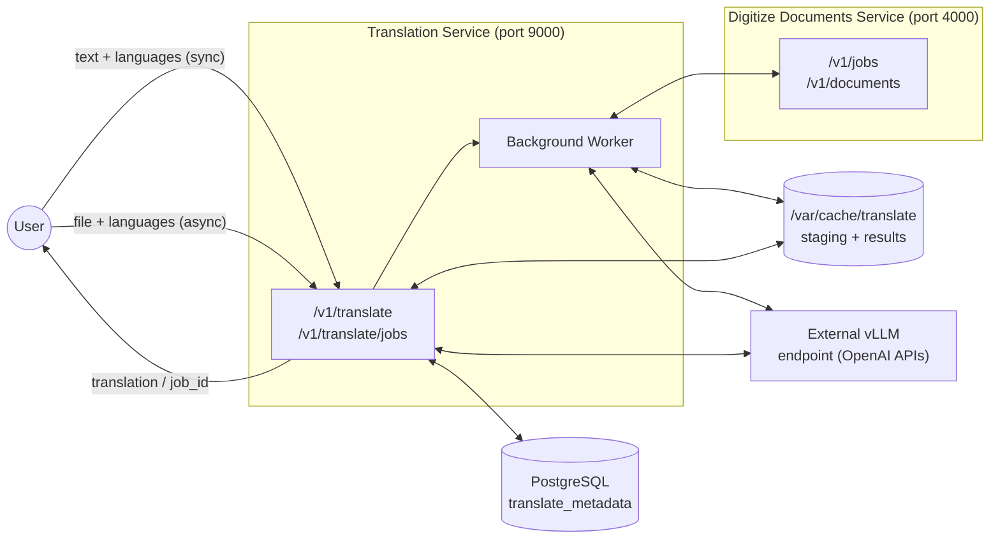
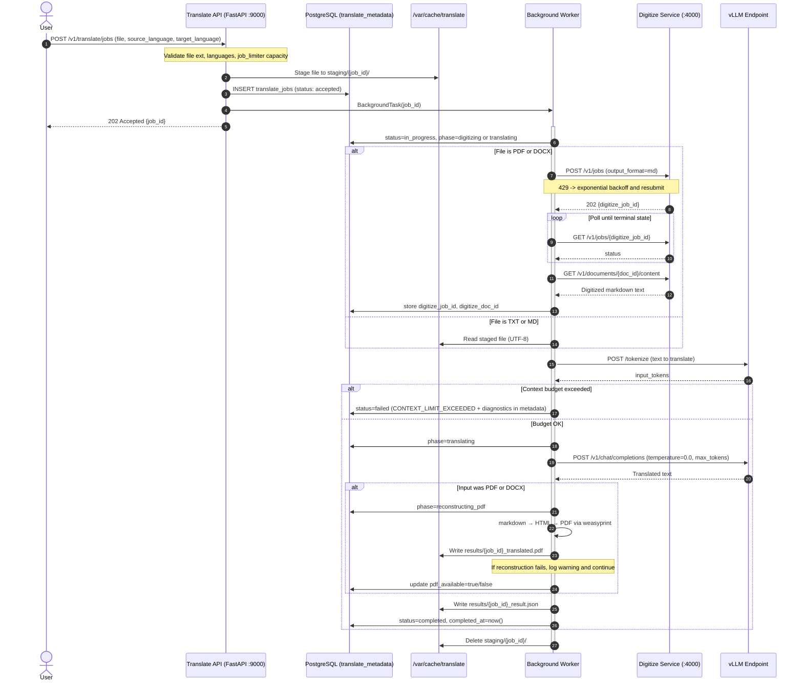

# Translation Service — Implementation Proposal

## 1. Overview

This document proposes the design and implementation of the **Translation** microservice for the AI-Services platform. The service converts text and documents between languages, enabling multilingual operations, and global user experiences.

At its core, the service accepts text or a document and a target language, and returns the fully translated content. The source language is **optional** — when omitted (or explicitly set to `"auto"`), the LLM detects the language automatically. For plain text, the call is synchronous and returns immediately. For files — including `.txt`, `.md`, `.pdf`, and `.docx` — the service operates asynchronously: the file is staged, PDF and DOCX inputs are forwarded to the existing **Digitize Documents** service to produce a clean markdown representation, and the resulting text is passed to the LLM for translation. The translated output for document inputs is returned as a markdown string, preserving all headings, lists, and tables from the original.

**Two design choices have been made for document inputs and are described in detail in Sections 2 and 3:**
- **Translation strategy:** Chunk-wise translation — the digitized markdown is split into paragraph-boundary chunks and each chunk is translated in a separate LLM call.
- **Output format:** Translated markdown plus a reconstructed PDF/DOCX — so that users receive a usable, shareable document, not just raw markdown.

The service is a first-class member of the AI-Services platform and follows the same architectural patterns established by the digitize and summarize services:

- FastAPI application running as a Python service in a Podman container (ppc64le / RHEL).
- Semaphore-based concurrency limiting: a 4-slot job admission semaphore for async jobs, and a shared 32-slot semaphore in front of the vLLM inference endpoint.
- PostgreSQL (`translate_metadata` database) for durable job metadata, initialized by an idempotent init container.
- `/var/cache/translate`-backed staging and result files on a persistent volume.
- Boot-time recovery scan that marks interrupted jobs as failed and cleans up orphaned staging directories.

Two execution paths are provided:

| Path                    | Endpoint                   | Use case                                                                                                                                         |
|:------------------------|:---------------------------|:-------------------------------------------------------------------------------------------------------------------------------------------------|
| **Synchronous**         | `POST /v1/translate`       | Plain text submitted inline. Blocking call, immediate translated text result. Stateless — no job record created.                                 |
| **Asynchronous (jobs)** | `POST /v1/translate/jobs`  | File uploads (`.txt`, `.md`, `.pdf`, `.docx`). PDF and DOCX files are digitized via the Digitize Documents REST API before translation. Returns a `job_id` for polling. |

### 1.1 Concept-to-Design Mapping

| Concept diagram element                                           | Design realization                                                                                                                                                        |
|:------------------------------------------------------------------|:--------------------------------------------------------------------------------------------------------------------------------------------------------------------------|
| Input: text to be translated                                      | Sync `text` field; async worker reads staged file (txt/md) or fetches digitized markdown from the digitize service (pdf/docx)                                             |
| Input: source language (e.g., "German")                          | `source_language` parameter — optional; defaults to `"auto"` (LLM-side language detection); when provided, validated against a fixed allowlist                           |
| Input: target language (e.g., "English")                         | `target_language` parameter — validated against a fixed allowlist; `"auto"` is not permitted                                                                              |
| Config: Version (e.g., 1.0.0)                                    | Not managed by the service — API versioned via `/v1/` path prefix                                                                                                         |
| Config: LLM (granite-3.3-8b-instruct, mistral-small-3.1-24b, …) | `MODEL_NAME` env var (service default)                                                                                                                                    |
| Config (optional): custom model weights                          | `OPENAI_BASE_URL` env var pointing to the desired vLLM deployment                                                                                                        |
| Output: text translated to the provided output language          | `data.translation` in the response — a translated string; for document inputs, a translated markdown string preserving all headings, lists, and tables                   |
| Output: pointers to digitized input documents                    | `data.digitize_doc_id` for async pdf/docx jobs — a durable pointer to the cached `.md` file in the digitize service                                                      |
| External dependency: inferencing endpoint                        | Existing vLLM endpoint (`OPENAI_BASE_URL`), shared semaphore (`MAX_CONCURRENT_REQUESTS=32`)                                                                               |
| Supported document formats: TXT, PDF/DOCX via digitize           | `.txt`, `.md` files handled natively; `.pdf` and `.docx` delegated to the Digitize Documents service via HTTP                                                             |
| Supported contents: texts and tables                             | Markdown tables from the digitize service are preserved structurally; the LLM prompt explicitly instructs cell/header translation while keeping `\| pipe \|` syntax intact |
| Translation strategy for documents                               | Chunk-wise — markdown split on paragraph boundaries, each chunk translated in a separate LLM call, results concatenated (Section 2)                                       |
| Output format for pdf/docx inputs                                | Translated markdown string + reconstructed PDF returned in the same result (Section 3)                                                                                    |
| SLAs: throughput / latency                                       | Governed by concurrency limits and the context-window guard applied per chunk (Section 8); to be quantified during performance testing                                    |

---

## 2. Design Decision — Chunk-Wise Translation

**Decision: the async document translation path uses chunk-wise translation.** The digitized markdown is split into manageable chunks on paragraph boundaries, each chunk is translated in an independent LLM call, and the results are concatenated into the final translated document.

> **Note:** This decision is based on the reasoning below and represents the primary implementation approach. It will be validated through experimentation with real documents during development. If results show that single-pass translation is reliably sufficient for the document sizes encountered in practice, the strategy can be revisited without API changes.

### 2.1 Why Not Translate the Entire Document in One LLM Call

Sending the full digitized markdown in a single call is the simpler implementation, but it carries a set of compounding risks that make it unsuitable as the primary strategy for documents:

**1. Context window limits make it fragile by design.**
`granite-3.3-8b-instruct` has a 32k token context window. Translation is approximately a 1:1 operation — a 15k-token German document requires roughly 15k tokens of output, leaving only 2k tokens after subtracting prompt overhead. A 20-page contract can easily exceed 20k–25k input tokens alone. Single-pass translation therefore rejects a significant fraction of real-world documents outright, which is not an acceptable user experience.

**2. LLM quality degrades with prompt length.**
LLMs are well-documented to lose fidelity on very long prompts. At high token counts, models may drop paragraphs, repeat earlier sections, reorder content, or begin to fabricate. Translation demands high faithfulness — every sentence in the input must appear, correctly translated, in the output. The risk of silent content omission is especially high, because there is no way for the service to verify completeness without a second LLM call.

**3. A single failure loses the entire translation.**
If the LLM call times out, runs out of memory, or produces low-quality output for a long document, the job must be restarted from the beginning. There is no natural checkpoint. For a 30-page document that takes 60+ seconds, this is a costly and frustrating failure mode.

**4. Error recovery is expensive and all-or-nothing.**
Because the entire document is treated as one atomic unit, any error — network timeout, vLLM OOM, context limit exceeded mid-generation — requires a full retry. There is no way to salvage the portion that was correctly translated.

**5. Token cost scales poorly.**
A 25k-token input document at a 1:1 translation ratio consumes ~50k tokens per job in a single call. Chunk-wise translation consumes the same total tokens but distributes them across smaller, independently completable calls, enabling finer retry granularity and more predictable per-call latency.

### 2.2 Why Chunk-Wise Translation is the Right Choice

- **No context ceiling.** Documents of any length can be translated — the chunker sizes each piece to fit within the available window with room for both prompt overhead and the translated output.
- **Contained failure surface.** If one chunk fails, only that chunk is retried. Completed chunks are preserved, making partial recovery straightforward.
- **Predictable quality per chunk.** Each LLM call operates on a small, focused segment. The model's attention is not diluted across 30 pages — it processes at most a few paragraphs at a time, which is where LLM translation quality is highest.
- **Natural parallelism.** Chunks can be scheduled concurrently (up to the shared LLM semaphore), reducing total wall-clock time for long documents.

### 2.3 Chunking Strategy

Chunks are formed by a greedy paragraph-boundary algorithm:

1. **Split on paragraph boundaries.** The digitized markdown is split on double-newline (`\n\n`) boundaries first. Each resulting block is a candidate unit (heading, paragraph, table, list block).
2. **Greedy packing.** Starting from an empty chunk, blocks are appended one at a time. When appending the next block would exceed the configured chunk token budget, the current chunk is closed and a new one is started.
3. **Sentence-level fallback.** If a single block is larger than the entire chunk budget (e.g., an unusually long paragraph), it is split further at sentence boundaries (`. `, `! `, `? `) to produce sub-blocks that fit.

> **Implementation note:** The exact chunk token budget will be determined empirically during development, informed by testing with real documents and observing LLM translation quality and latency. This value should be configurable via an environment variable so it can be tuned without code changes.

### 2.4 Concatenation and Coherence

After all chunk translations are returned, they are concatenated in the original chunk order. No additional LLM call is made for coherence stitching:

- **Order preservation.** Chunks are created and tracked with an index; results are concatenated in index order regardless of the order in which concurrent LLM calls complete.
- **Markdown structure preserved.** Because chunks are formed on paragraph boundaries, each chunk starts and ends at a clean markdown boundary. Concatenating the results produces valid, well-structured markdown.

### 2.5 Handling Tables at Chunk Boundaries

Markdown tables from the digitize service are emitted as contiguous `| pipe |` blocks. Tables must be treated as **atomic units** — a table is never split across two chunks:

- During greedy packing, if a table block would overflow the current chunk budget, the current chunk is closed first, and the table starts a new chunk on its own.
- If a table is larger than the entire chunk budget on its own, it occupies a chunk by itself and the budget is allowed to be exceeded for that chunk only — the alternative (splitting a table mid-row) would produce malformed markdown and an untranslatable fragment.

---

## 3. Design Decision — PDF and DOCX Reconstruction from Translated Markdown

**Decision: when the input is a `.pdf` or `.docx` file, the service returns both the translated markdown string and a reconstructed PDF alongside it.** Returning only markdown is not sufficient for a production document translation service. Users need a deliverable they can actually use.

### 3.1 Why PDF Reconstruction is Essential

When a user uploads a contract, report, or invoice in German and asks for it in English, they expect to receive a document back — not a markdown file. The cases where markdown-only output is acceptable are narrow:

- A developer integrating the API into their own pipeline.
- A downstream service that will render or re-format the content itself.

For the majority of real-world use cases, markdown is an intermediate representation that the user cannot use directly:

- **Non-technical users cannot open or read `.md` files.** A translated contract delivered as raw markdown is useless to a lawyer, procurement officer, or business user.
- **PDF is the universal document interchange format.** Contracts, invoices, regulatory filings, and reports are circulated as PDFs. Returning a translated PDF closes the loop — users can print, sign, share, or archive the output.
- **DOCX is expected for editable documents.** When the input is a `.docx`, the user likely needs an editable output. A reconstructed PDF at minimum provides a readable result; DOCX reconstruction is noted in Future Enhancements.
- **The quality bar is "usable", not "identical".** Users understand that a translated document will not have the exact same fonts, images, or pixel layout as the original. What they need is: all translated text present, correct structure (headings, paragraphs, tables), and a printable/shareable file. This is achievable.

### 3.2 Reconstruction Strategy

The reconstruction follows a two-step pipeline: **markdown → HTML → PDF**, using `weasyprint` — a pure-Python library with no binary dependency beyond system fonts, available on ppc64le / RHEL via `pip`.

```
translated_markdown  (string, output of chunk concatenation)
        │
        ▼
   markdown → HTML          (Python's stdlib `markdown` module, or weasyprint's
        │                    built-in markdown support if available)
        │   Apply a minimal CSS stylesheet: sensible font, page margins,
        │   table borders, heading sizes, code blocks
        ▼
   HTML → PDF               (via weasyprint — pure Python, no binary dependency)
        │
        ▼
  /var/cache/translate/results/{job_id}_translated.pdf
```

**Why `weasyprint`:**
- Pure Python, installable via `pip` on ppc64le / RHEL — no binary compilation or system packages beyond fonts.
- Renders HTML+CSS to PDF with correct heading hierarchy, paragraph flow, and table borders.
- A single `requirements.txt` entry; no extra container layer complexity.

**Note on existing packages:** `pdfplumber` and `pypdfium2` are already used in this project (`services/digitize/parsing/pdf.py`, `services/summarize/summ_utils.py`) for **reading and parsing** PDFs — they are not suitable for writing a PDF from translated markdown content. `weasyprint` fills the write path. No other new library is introduced.

### 3.3 Reconstruction is Non-Blocking

Reconstruction runs as a post-translation step inside the background worker. It does **not** block the job's `completed` status:

- If reconstruction succeeds → `pdf_available = true`, PDF stored, returned as `data.reconstructed_pdf_b64` in the result.
- If reconstruction fails (exception, OOM, font issue) → `pdf_available = false`, failure logged and recorded in `job_metadata.pdf_reconstruction.error`, job still marked `completed`. The translated markdown is always present and is the authoritative output.

This means reconstruction failures are **non-fatal** — they degrade the output gracefully without losing the translation.

### 3.4 Expected Limitations

These limitations are known and accepted for v1. They do not prevent the output from being useful:

| Limitation | Impact | Acceptable? |
|:---|:---|:---|
| Original fonts not preserved | PDF uses generic serif/sans-serif | ✅ Yes — content is correct |
| Images, watermarks, logos not included | Visual branding absent | ✅ Yes — text content is complete |
| Precise column widths not reproduced | Tables may be slightly wider/narrower | ✅ Yes — table data is correct |
| Complex multi-column layouts rendered as single-column | Some reports use two-column format | ⚠️ Acceptable for v1; noted for improvement |
| Page breaks may differ from original | Page numbers will not match | ✅ Yes — expected for translated content |
| Right-to-left languages need CSS addition | Arabic, Hebrew output may render LTR | ⚠️ Not in v1 language scope; handled when RTL languages are added |
| DOCX input → PDF output (not DOCX output) | Editable DOCX not reconstructed | ⚠️ Noted in Future Enhancements |

### 3.5 Output Behaviour

- For **`.txt` / `.md`** inputs: no reconstruction is attempted — there is no original document format to reconstruct to. `pdf_available` is `null` in the result.
- For **`.pdf` / `.docx`** inputs: reconstruction is always attempted after translation. The result always contains `translation` (the markdown string) and additionally `pdf_available` (boolean) and `reconstructed_pdf_b64` (base64-encoded PDF bytes when `true`, `null` when `false`).

---

## 4. Non-Goals

- **Horizontal scaling:** Like the digitize and summarize services, this service is architected for single-replica deployment. Multi-replica deployments introduce contention on the vLLM inference engine and are out of scope.
- **UI:** No user interface is included in this document. The service is API-only.
- **Multi-file jobs:** Each async job processes exactly one file. Clients submit one job per file.
- **Multi-language batch translation:** Each job targets a single `target_language`. Clients submit one job per target language.
- **Pixel-perfect PDF reconstruction:** The PDF reconstruction design (Section 3) targets usable best-effort output, not layout-identical reproduction of the original PDF. Preserving original fonts, images, watermarks, or precise column widths is out of scope.
- **Document conversion / OCR:** The service does not implement PDF or DOCX parsing. All non-plaintext formats are delegated to the Digitize Documents service over its REST API.
- **Sync auditing:** Synchronous translation requests are stateless — no job record is created and no result is persisted. Auditability of sync calls is a Future Enhancement.

---

## 5. Architecture



**Key interactions:**

- The **sync path** never touches the digitize service or the jobs table. It validates languages, tokenizes, guards the context window, calls vLLM at `temperature=0.0`, and returns the translated text immediately.
- The **async worker** orchestrates: stage file → (pdf/docx only) digitize via REST → fetch `.md` content → context-window guard → translate → persist result → update DB.
- Both paths share the global vLLM connection semaphore (Section 10).
- The service is exposed externally on **port 9000** (configurable), avoiding collision with digitize (4000) and the AI-Services backend server.

---

## 6. Endpoints

| Method     | Endpoint                                | Description                                                                        |
|:-----------|:----------------------------------------|:-----------------------------------------------------------------------------------|
| **POST**   | `/v1/translate`                         | Synchronous translation of inline plain text. Immediate result.                    |
| **POST**   | `/v1/translate/jobs`                    | Submit a file (`.txt`/`.md`/`.pdf`/`.docx`) for async translation. Returns `job_id`. |
| **GET**    | `/v1/translate/jobs`                    | List translation jobs with pagination and status filter.                            |
| **GET**    | `/v1/translate/jobs/{job_id}`           | Get detailed status and metadata of a specific job.                                |
| **GET**    | `/v1/translate/jobs/{job_id}/result`    | Retrieve the translation result as a sub-resource of the job.                      |
| **GET**    | `/health`                               | Service health check.                                                              |

---

## 7. API Specification

### 7.1 POST /v1/translate — Synchronous Translation

**Content-Type:** `application/json`

**Request body:**

| Field             | Type   | Required | Description                                                                                                                    |
|:------------------|:-------|:---------|:-------------------------------------------------------------------------------------------------------------------------------|
| `text`            | string | Yes      | Plain text to translate. Must be non-empty.                                                                                    |
| `source_language` | string | No       | Source language name (e.g., `"German"`). Omit or pass `"auto"` to let the LLM detect the language automatically. Default: `"auto"`. |
| `target_language` | string | Yes      | Target language name (e.g., `"English"`). Must not be `"auto"`.                                                                |

Supported language values for `source_language` and `target_language` (case-insensitive): `English`, `German`. `source_language` additionally accepts `"auto"` (or may be omitted entirely).

> **Scope note:** `French` and `Italian` are planned additions pending testing within the current release scope.

**Processing logic:**

1. Validate `text` is non-empty (else `400`).
2. If `source_language` is omitted, default it to `"auto"`. If provided, validate against the allowlist (including `"auto"`); `"auto"` is never valid for `target_language` (else `400 INVALID_LANGUAGE`).
3. Validate `target_language` is present and in the allowlist (else `400`).
4. Check the global vLLM semaphore; if all slots are occupied, return `429`.
4. Tokenize the input via the vLLM `/tokenize` API — exact count.
5. Apply the **hard context-window guard** (Section 8). If it fails, return `413` with token diagnostics.
7. Build the translation prompt (Section 11): system prompt + user prompt (auto-detect variant if `source_language == "auto"`).
8. Call vLLM `/v1/chat/completions` with `temperature=0.0`.
9. Return the translation with metadata and token usage.

**Response codes:**

| Status | Description | Details |
|:---|:---|:---|
| 200 OK | Success | Translation completed. |
| 400 Bad Request | Invalid request | Missing/empty `text` or missing `target_language`. |
| 400 Bad Request | Invalid language | `source_language` or `target_language` not in the supported allowlist, or `target_language == "auto"`. |
| 413 Payload Too Large | Context limit | Input + prompt overhead exceeds `MAX_MODEL_LEN`. Includes token diagnostics. |
| 429 Too Many Requests | Rate limit | vLLM semaphore at capacity. |
| 500 Internal Server Error | Server error | Unexpected failure. |
| 503 Service Unavailable | AI service down | vLLM endpoint unreachable. |

**Sample request:**

```bash
# With explicit source language
curl -X POST http://localhost:9000/v1/translate \
  -H "Content-Type: application/json" \
  -d '{
    "text": "Der Vertrag tritt am 1. Januar 2025 in Kraft.",
    "source_language": "German",
    "target_language": "English"
  }'

# Without source language — auto-detection (default)
curl -X POST http://localhost:9000/v1/translate \
  -H "Content-Type: application/json" \
  -d '{
    "text": "Der Vertrag tritt am 1. Januar 2025 in Kraft.",
    "target_language": "English"
  }'
```

**Sample response (200):**

```json
{
    "data": {
        "translation": "The contract comes into force on 1 January 2025.",
        "source_language": "German",
        "target_language": "English",
        "original_word_count": 9,
        "translated_word_count": 10
    },
    "meta": {
        "model": "ibm-granite/granite-3.3-8b-instruct",
        "processing_time_ms": 620,
        "input_type": "text"
    },
    "usage": {
        "input_tokens": 38,
        "output_tokens": 15,
        "total_tokens": 53
    }
}
```

**Sample error (400) — unsupported language:**

```json
{
    "error": {
        "code": "INVALID_LANGUAGE",
        "message": "'Klingon' is not a supported language. Supported: English, German. Use 'auto' for source_language to auto-detect.",
        "status": 400
    }
}
```

**Sample error (400) — auto as target:**

```json
{
    "error": {
        "code": "INVALID_LANGUAGE",
        "message": "'auto' is not valid for target_language. Please specify an explicit target language.",
        "status": 400
    }
}
```

**Sample error (413) with token diagnostics:**

```json
{
    "error": {
        "code": "CONTEXT_LIMIT_EXCEEDED",
        "message": "Input does not fit in the model context window. Reduce input size.",
        "status": 413,
        "details": {
            "max_model_len": 32768,
            "input_tokens": 32500,
            "prompt_overhead_tokens": 150,
            "min_output_buffer_tokens": 50,
            "total_required_tokens": 32700,
            "excess_tokens": 132
        }
    }
}
```

---

### 7.2 POST /v1/translate/jobs — Create Async Translation Job

**Content-Type:** `multipart/form-data`

**Form parameters:**

| Parameter         | Type   | Required | Description                                                                                                                         |
|:------------------|:-------|:---------|:------------------------------------------------------------------------------------------------------------------------------------|
| `file`            | file   | Yes      | Exactly one `.txt`, `.md`, `.pdf`, or `.docx` file.                                                                                 |
| `source_language` | string | No       | Source language name. Omit or pass `"auto"` to let the LLM detect the language automatically. Default: `"auto"`.                   |
| `target_language` | string | Yes      | Target language name. Must not be `"auto"`.                                                                                         |
| `job_name`        | string | No       | Optional human-readable label for the job.                                                                                          |

**Validation rules:**

- Exactly one file per request.
- Extension must be `.txt`, `.md`, `.pdf`, or `.docx`.
- If `source_language` is omitted, it defaults to `"auto"`. If provided, it must be in the allowlist or `"auto"`.
- `target_language` is required and must be in the allowlist; `"auto"` is not permitted.
- No word/page limit enforced at submission — the context-window guard runs after text extraction, when the true token count is known.

**Processing flow (request thread):**

1. Validate file and parameters.
2. Check `job_limiter`; if all slots are occupied, return `429`.
3. Generate `job_id` (UUID).
4. Stage the file to `/var/cache/translate/staging/{job_id}/`.
5. Insert a row into `translate_jobs` with `status='accepted'`.
6. Launch background processing via FastAPI `BackgroundTasks`.
7. Return `202 Accepted` with `{ "job_id": "..." }`.

**Background worker:**

1. Acquire `job_limiter`; update row → `status='in_progress'`, `metadata.phase='digitizing'` (pdf/docx) or `'translating'` (txt/md).
2. **PDF/DOCX path:** submit to digitize — `POST http://digitize-url/v1/jobs` with `output_format=md`. Store `digitize_job_id`. Poll `GET /v1/jobs/{digitize_job_id}` every `DIGITIZE_POLL_INTERVAL_SECS` (default 3) until `completed`/`failed` or `DIGITIZE_JOB_TIMEOUT_SECS` (default 300). Fetch text via `GET /v1/documents/{doc_id}/content`; store `digitize_doc_id`.
   **TXT/MD path:** read the staged file directly (UTF-8 decode).
3. Tokenize via `/tokenize`; run the hard context-window guard. On breach → `status='failed'`, `error='CONTEXT_LIMIT_EXCEEDED'`, diagnostics in `metadata`.
4. `metadata.phase='translating'`: build prompt, acquire `concurrency_limiter`, call vLLM at `temperature=0.0`.
5. Write `/var/cache/translate/results/{job_id}_result.json`.
6. Update row → `status='completed'`, `completed_at=now()` (or `status='failed'` + `error`).
7. Delete `/var/cache/translate/staging/{job_id}/`; release `job_limiter`.

> **Digitize lifecycle note:** the digitized document remains in the digitize service's cache after translation, keyed by `digitize_doc_id`. Users manage its lifecycle through the digitize service's own `DELETE /v1/documents/{id}`. The translate service does not delete upstream artifacts.

**Response codes:**

| Status | Description |
|:---|:---|
| 202 Accepted | Job created. |
| 400 Bad Request | Missing file, missing `target_language`, invalid language value, or `target_language == "auto"`. |
| 415 Unsupported Media Type | Not a valid `.txt`, `.md`, `.pdf`, or `.docx`. |
| 429 Too Many Requests | Job concurrency at capacity. |
| 500 Internal Server Error | Unexpected failure. |

**Sample request:**

```bash
# With explicit source language
curl -X POST http://localhost:9000/v1/translate/jobs \
  -F "file=@bericht_q3.pdf" \
  -F "source_language=German" \
  -F "target_language=English" \
  -F "job_name=Q3 Quarterly Report"

# Without source language — auto-detection (default)
curl -X POST http://localhost:9000/v1/translate/jobs \
  -F "file=@bericht_q3.pdf" \
  -F "target_language=English" \
  -F "job_name=Q3 Quarterly Report"
```

**Sample response (202):**

```json
{
    "job_id": "a1b2c3d4-e5f6-7890-abcd-ef1234567890"
}
```

---

### 7.3 GET /v1/translate/jobs — List Jobs

**Query parameters:**

| Parameter | Type   | Required | Description |
|:----------|:-------|:---------|:---|
| `limit`   | int    | No       | Records per page (1–100). Default: `20`. |
| `offset`  | int    | No       | Records to skip. Default: `0`. |
| `status`  | string | No       | Filter: `accepted`, `in_progress`, `completed`, `failed`. |

| Status | Description |
|:---|:---|
| 200 OK | Paginated job list. |
| 400 Bad Request | Invalid query parameter values. |
| 500 Internal Server Error | Database failure. |

**Sample response (200):**

```json
{
    "pagination": {"total": 8, "limit": 20, "offset": 0},
    "data": [
        {
            "job_id": "a1b2c3d4-e5f6-7890-abcd-ef1234567890",
            "job_name": "Q3 Quarterly Report",
            "status": "completed",
            "source_language": "german",
            "target_language": "english",
            "input_type": "pdf",
            "document_name": "bericht_q3.pdf",
            "submitted_at": "2025-10-15T09:00:00Z",
            "completed_at": "2025-10-15T09:00:42Z"
        }
    ]
}
```

---

### 7.4 GET /v1/translate/jobs/{job_id} — Job Details

| Status | Description |
|:---|:---|
| 200 OK | Full job status and metadata. |
| 404 Not Found | No job with this ID. |
| 500 Internal Server Error | Database failure. |

**Sample response (200, in progress — PDF job being digitized):**

```json
{
    "job_id": "a1b2c3d4-e5f6-7890-abcd-ef1234567890",
    "job_name": "Q3 Quarterly Report",
    "status": "in_progress",
    "source_language": "german",
    "target_language": "english",
    "input_type": "pdf",
    "document_name": "bericht_q3.pdf",
    "document_word_count": null,
    "digitize_job_id": "bb11cc22-dd33-ee44-ff55-001122334455",
    "digitize_doc_id": null,
    "submitted_at": "2025-10-15T09:00:00Z",
    "completed_at": null,
    "error": null,
    "job_metadata": {
        "phase": "digitizing"
    }
}
```

**Sample response (200, completed):**

```json
{
    "job_id": "a1b2c3d4-e5f6-7890-abcd-ef1234567890",
    "job_name": "Q3 Quarterly Report",
    "status": "completed",
    "source_language": "german",
    "target_language": "english",
    "input_type": "pdf",
    "document_name": "bericht_q3.pdf",
    "document_word_count": 1820,
    "digitize_job_id": "bb11cc22-dd33-ee44-ff55-001122334455",
    "digitize_doc_id": "dd33ee44-ff55-0011-2233-445566778899",
    "submitted_at": "2025-10-15T09:00:00Z",
    "completed_at": "2025-10-15T09:00:42Z",
    "error": null,
    "job_metadata": {
        "phase": "completed",
        "input_tokens": 2430,
        "output_tokens": 2190,
        "model": "ibm-granite/granite-3.3-8b-instruct",
        "processing_time_ms": 8200,
        "timing_in_secs": {
            "digitizing": 28.4,
            "translating": 8.2
        }
    }
}
```

---

### 7.5 GET /v1/translate/jobs/{job_id}/result — Get Translation Result

Only available when `status == "completed"`. Returns `409` if still running, `410` if the job failed.

| Status | Description |
|:---|:---|
| 200 OK | Translation result. |
| 404 Not Found | No job with this ID. |
| 409 Conflict | Job is still `accepted` or `in_progress`. |
| 410 Gone | Job has `status='failed'`. Error details are on the job resource. |
| 500 Internal Server Error | Failure reading result file. |

**Sample response (200 — PDF job, with successful PDF reconstruction):**

```json
{
    "job_id": "a1b2c3d4-e5f6-7890-abcd-ef1234567890",
    "data": {
        "translation": "# Q3 2024 Report\n\n## Executive Summary\n\nThe company achieved record revenue...\n\n| Quarter | Revenue | Growth |\n|---|---|---|\n| Q1 | €1.2M | +12% |\n| Q2 | €1.5M | +25% |",
        "source_language": "german",
        "target_language": "english",
        "original_word_count": 1820,
        "translated_word_count": 1793,
        "input_type": "pdf",
        "document_name": "bericht_q3.pdf",
        "digitize_doc_id": "dd33ee44-ff55-0011-2233-445566778899",
        "pdf_available": true,
        "reconstructed_pdf_b64": "<base64-encoded PDF bytes>"
    },
    "meta": {
        "model": "ibm-granite/granite-3.3-8b-instruct",
        "processing_time_ms": 8200,
        "timing_in_secs": {
            "digitizing": 28.4,
            "translating": 8.2,
            "pdf_reconstruction": 1.3
        }
    },
    "usage": {
        "input_tokens": 2430,
        "output_tokens": 2190,
        "total_tokens": 4620
    }
}
```

**Sample response (200 — PDF job, reconstruction failed gracefully):**

```json
{
    "job_id": "a1b2c3d4-e5f6-7890-abcd-ef1234567890",
    "data": {
        "translation": "# Q3 2024 Report\n\n...",
        "source_language": "german",
        "target_language": "english",
        "original_word_count": 1820,
        "translated_word_count": 1793,
        "input_type": "pdf",
        "document_name": "bericht_q3.pdf",
        "digitize_doc_id": "dd33ee44-ff55-0011-2233-445566778899",
        "pdf_available": false,
        "reconstructed_pdf_b64": null
    },
    "meta": {
        "model": "ibm-granite/granite-3.3-8b-instruct",
        "processing_time_ms": 8200,
        "timing_in_secs": {
            "digitizing": 28.4,
            "translating": 8.2
        }
    },
    "usage": {
        "input_tokens": 2430,
        "output_tokens": 2190,
        "total_tokens": 4620
    }
}
```

**Sample response (409 — job still running):**

```json
{
    "error": {
        "code": "JOB_NOT_COMPLETE",
        "message": "Job is still in_progress. Poll GET /v1/translate/jobs/{job_id} for status.",
        "status": 409
    }
}
```

**Sample response (410 — job failed):**

```json
{
    "error": {
        "code": "JOB_FAILED",
        "message": "Job failed: CONTEXT_LIMIT_EXCEEDED — input (33100 tokens) exceeds context window.",
        "status": 410
    }
}
```

---

### 7.6 GET /health — Health Check

| Status | Description |
|:---|:---|
| 200 OK | Service is healthy. |

```json
{"status": "ok"}
```

---

## 8. Hard Context-Window Guard

The context-window guard enforces that the full prompt fits within `MAX_MODEL_LEN`. Unlike summarization (output shorter than input), translation output is approximately equal in length to the input — this makes the output budget a first-class concern.

The guard applies in both translation strategies:
- **Sync path:** the guard runs once on the input text. Inputs that breach the limit fail with `413 CONTEXT_LIMIT_EXCEEDED`.
- **Chunk-wise async path (Section 2):** the guard runs per chunk before each LLM call. Since chunks are sized by the chunker to fit within the window, a breach here indicates a misconfigured chunker and is treated as a hard error that fails the job.

The guard is enforced identically on the sync path and inside the async worker.

### 8.1 Budget Calculation

```
input_tokens      = /tokenize(text_to_translate)       # exact, one call per request
prompt_overhead   = PROMPT_OVERHEAD_TOKENS              # ~150 tokens; system + user template without text
min_output_buffer = MIN_OUTPUT_TOKENS                   # 50 tokens; safety floor ensuring the model can respond

max_allowed_input = MAX_MODEL_LEN - prompt_overhead - min_output_buffer

require: input_tokens <= max_allowed_input              # else 413 CONTEXT_LIMIT_EXCEEDED

# Output token budget (after guard passes):
available_output  = MAX_MODEL_LEN - input_tokens - prompt_overhead
buffer            = max(20, int(available_output * 0.10))   # 10% breathing room
effective_max_tokens = available_output - buffer
max_tokens (LLM call) = effective_max_tokens
```

**Output reservation rationale:** Translation output length tracks input length closely — a 2,000-token German document typically produces a ~2,000-token English document. Rather than reserving a fixed fraction of the window for output, the guard dynamically allocates nearly all remaining space to the output after accounting for the (stable) prompt overhead. The 10% buffer prevents the LLM from being cut off mid-sentence.

**Example with `granite-3.3-8b-instruct` (MAX_MODEL_LEN = 32,768):**

```
Input:            2,430 tokens  (German legal document)
Prompt overhead:    150 tokens
Min output buffer:   50 tokens
max_allowed_input: 32,568 tokens  ✅ fits

available_output:  30,188 tokens
buffer:             3,019 tokens  (10% of available)
effective_max_tokens: 27,169 tokens
```

**Caching:** `prompt_overhead` is stable (the template without the text never changes) and is stored as a constant in settings. At request time, only the input text is tokenized — one `/tokenize` call per translation.

### 8.2 Diagnostics

Every `413` (sync) and every `CONTEXT_LIMIT_EXCEEDED` job failure (async) includes the full budget breakdown. For async jobs, the same diagnostics are persisted into the job's `job_metadata` JSONB column so they are accessible via `GET /v1/translate/jobs/{job_id}` without log access.

```json
{
    "max_model_len": 32768,
    "input_tokens": 32500,
    "prompt_overhead_tokens": 150,
    "min_output_buffer_tokens": 50,
    "total_required_tokens": 32700,
    "excess_tokens": 132
}
```

---

## 9. Concurrency Limiting

### 9.1 Shared vLLM Semaphore

A single `asyncio.BoundedSemaphore` limits total concurrent vLLM connections, matching the summarize service pattern:

```python
concurrency_limiter = asyncio.BoundedSemaphore(settings.common.llm.max_batch_size)  # default: 32
```

- Sync translations acquire one slot for the duration of the LLM call.
- Each async worker acquires one slot when it reaches the LLM call.
- If the semaphore is at capacity when a request arrives, the API returns `429` immediately rather than queuing.

### 9.2 Async Job Admission Semaphore

A second, smaller semaphore caps how many translation **jobs** run concurrently:

```python
job_limiter = asyncio.BoundedSemaphore(settings.translate.max_concurrent_jobs)  # default: 4
```

| Semaphore            | Scope        | Limit         | Purpose                                                                                               |
|:---------------------|:-------------|:--------------|:------------------------------------------------------------------------------------------------------|
| `job_limiter`        | Async jobs   | 4 (configurable) | Caps background workers; bounds staging disk usage and digitize-service load.                      |
| `concurrency_limiter`| Global       | 32            | Caps total concurrent vLLM connections across sync + async paths.                                    |

The semaphores are nested: a worker holds a `job_limiter` slot for the whole job lifetime, and briefly acquires `concurrency_limiter` for the LLM call. Because each translation job makes exactly one LLM call and holds no vLLM slot while digitizing or polling, async jobs consume very little of the vLLM budget — the sync path stays responsive even at full job concurrency.

### 9.3 Digitize Service Backpressure

The digitize service applies its own semaphore and may return `429` when saturated. The translate worker handles this:

- Exponential backoff on `429`: 5s, 10s, 20s (capped), up to `DIGITIZE_JOB_TIMEOUT_SECS` (default 300).
- If the timeout is exhausted, the job fails with `DIGITIZE_TIMEOUT`.
- Digitize `5xx` responses fail the job immediately with `DIGITIZE_FAILED` carrying the error payload.

---

## 10. Prompt Design

### 10.1 Prompt Structure

**System prompt:**

```
You are a professional translator. Your task is to translate the provided text accurately and faithfully.

Rules:
- Translate ALL content including headings, paragraphs, bullet points, and table cell content
- Preserve ALL markdown formatting: headings (#, ##), bold (**), italic (*), bullet lists (-, *), numbered lists
- Preserve ALL markdown tables: keep the | pipe | structure and separator lines (|---|---|) exactly as-is; translate only the cell and header text
- Do NOT add any explanation, commentary, preamble, or notes
- Do NOT omit any part of the input
- Do NOT translate code blocks, URLs, proper nouns that are universally known, or technical identifiers
- Output ONLY the translated text, nothing else
```

**User prompt (explicit source language):**

```
Translate the following text from {source_language} to {target_language}.

Text:
{text}

Translation:
```

**User prompt (auto-detect variant — used when `source_language == "auto"`):**

```
Detect the language of the following text and translate it to {target_language}.

Text:
{text}

Translation:
```

### 10.2 Notes on Prompt Design

- `temperature = 0.0` — translation is deterministic; unlike summarization (0.3), there is no benefit to variance in translation.
- No target word count is given — translation output length is determined by the content, not a compression goal.
- The "Output ONLY the translated text" instruction is critical — without it, LLMs prepend preambles like "Here is the translation:".
- Two templates are stored in settings (`translate_user_prompt` and `translate_user_prompt_auto`) and are individually overridable via environment variables.
- Tables from `.md` input (produced by the digitize service's `table.export_to_markdown()`) are GFM-standard `| col | col |` format, which LLMs understand natively. The prompt preserves table syntax automatically.

### 10.3 Prompt Token Overhead

The system prompt above is approximately 90 tokens. The user prompt template (excluding the text) adds ~15 tokens. `PROMPT_OVERHEAD_TOKENS` defaults to `150` — a generous buffer that covers both templates with room to spare, avoiding the need to tokenize the template on every call.

---

## 11. Async Workflow Sequence Diagram



---

## 12. Storage Layout

### 12.1 Overview

Durable metadata lives in **PostgreSQL** — the service gets its own database, `translate_metadata`, on the shared PostgreSQL instance, following the per-service isolation convention established by the digitize service.

File-based storage is retained only for:

- **Staging** (`/var/cache/translate/staging/{job_id}/`): holds the uploaded file while the worker processes it. Deleted after the job completes or fails.
- **Result files** (`/var/cache/translate/results/{job_id}_result.json`): full translation output, timing, and usage. Kept on disk as a read-once payload rather than a database column.

```
/var/cache/translate/
├── staging/
│   └── {job_id}/
│       └── bericht_q3.pdf
└── results/
    ├── {job_id}_result.json
    └── {job_id}_translated.pdf       ← reconstructed PDF (pdf/docx input only; present when pdf_available=true)
```

Sync requests (`POST /v1/translate`) are **stateless** — nothing is persisted. If auditability of sync translations becomes a requirement, it is a Future Enhancement.

### 12.2 Database Tables

#### 12.2.1 `translate_jobs` Table

```python
class TranslateJob(Base):
    """SQLAlchemy model for translate_jobs table."""
    __tablename__ = 'translate_jobs'

    job_id   = Column(String(255), primary_key=True)
    job_name = Column(String(500), nullable=True)

    # Translation parameters (normalised to lowercase at write time)
    source_language = Column(String(100), nullable=False)   # e.g. "german", "auto" (default when not supplied by user)
    target_language = Column(String(100), nullable=False)   # e.g. "english"

    # Input document info
    input_type          = Column(String(20), nullable=False)    # "text" | "txt" | "md" | "pdf" | "docx"
    document_name       = Column(String(500), nullable=True)    # original filename; NULL for sync text
    document_word_count = Column(Integer, nullable=True)        # populated during processing

    # Digitize service pointers (pdf/docx path only)
    digitize_job_id = Column(String(255), nullable=True)
    digitize_doc_id = Column(String(255), nullable=True)

    # PDF reconstruction (pdf/docx path only; NULL for txt/md/text)
    pdf_available = Column(Boolean, nullable=True)   # True=reconstructed, False=attempted+failed, NULL=not applicable

    # Job lifecycle
    status       = Column(String(50), nullable=False)
    submitted_at = Column(DateTime(timezone=True), nullable=False)
    completed_at = Column(DateTime(timezone=True), nullable=True)
    error        = Column(Text, nullable=True)

    # Phase, token diagnostics, timings, pdf reconstruction status
    job_metadata = Column(JSONB, nullable=True)

    updated_at = Column(DateTime(timezone=True),
                        server_default=func.now(),
                        onupdate=func.now())

    __table_args__ = (
        CheckConstraint(
            "status IN ('accepted','in_progress','completed','failed')",
            name='chk_translate_job_status'
        ),
        CheckConstraint(
            "input_type IN ('text','txt','md','pdf','docx')",
            name='chk_translate_input_type'
        ),
        Index('idx_translate_jobs_submitted_at_status', 'submitted_at', 'status'),
    )
```

#### 12.2.2 `job_metadata` JSONB Shape

Populated progressively as the job advances through phases:

```json
{
    "phase": "digitizing | translating | reconstructing_pdf | completed | failed",
    "input_tokens": 2430,
    "output_tokens": 2190,
    "model": "ibm-granite/granite-3.3-8b-instruct",
    "processing_time_ms": 8200,
    "timing_in_secs": {
        "digitizing": 28.4,
        "translating": 8.2,
        "pdf_reconstruction": 1.3
    },
    "pdf_reconstruction": {
        "attempted": true,
        "succeeded": true,
        "error": null
    },
    "token_diagnostics": {
        "max_model_len": 32768,
        "input_tokens": 32500,
        "prompt_overhead_tokens": 150,
        "min_output_buffer_tokens": 50,
        "total_required_tokens": 32700,
        "excess_tokens": 132
    }
}
```

`token_diagnostics` is populated only when `CONTEXT_LIMIT_EXCEEDED`. `pdf_reconstruction` is populated only for `.pdf`/`.docx` input jobs; `succeeded: false` with a non-null `error` means reconstruction was attempted but failed — the job still completes successfully with `pdf_available=false`.

#### 12.2.3 Index Strategy

| Index | Columns | Purpose |
|:---|:---|:---|
| PK | `translate_jobs.job_id` | Job detail / result lookups. |
| `idx_translate_jobs_submitted_at_status` | `submitted_at DESC, status` | Job listing with status filter; boot-time zombie scan. |

### 12.3 Schema Creation via Init Container

Identical pattern to the digitize and summarize services: an init container (`translate-db-init`) runs before the main `translate-api` container, executing an idempotent `init_schema.sql` against the shared PostgreSQL instance.

**Script: `services/translate/db/scripts/init_schema.sql`**

```sql
-- Translation service — idempotent schema initialization

CREATE TABLE IF NOT EXISTS translate_jobs (
    job_id              VARCHAR(255) PRIMARY KEY,
    job_name            VARCHAR(500),
    source_language     VARCHAR(100) NOT NULL DEFAULT 'auto',
    target_language     VARCHAR(100) NOT NULL,
    input_type          VARCHAR(20) NOT NULL,
    document_name       VARCHAR(500),
    document_word_count INTEGER,
    digitize_job_id     VARCHAR(255),
    digitize_doc_id     VARCHAR(255),
    pdf_available       BOOLEAN,
    status              VARCHAR(50) NOT NULL,
    submitted_at        TIMESTAMP WITH TIME ZONE NOT NULL,
    completed_at        TIMESTAMP WITH TIME ZONE,
    error               TEXT,
    job_metadata        JSONB,
    updated_at          TIMESTAMP WITH TIME ZONE NOT NULL DEFAULT CURRENT_TIMESTAMP,
    CONSTRAINT chk_translate_job_status
        CHECK (status IN ('accepted','in_progress','completed','failed')),
    CONSTRAINT chk_translate_input_type
        CHECK (input_type IN ('text','txt','md','pdf','docx'))
);

CREATE INDEX IF NOT EXISTS idx_translate_jobs_submitted_at_status
    ON translate_jobs(submitted_at DESC, status);

CREATE OR REPLACE FUNCTION update_translate_jobs_updated_at_column()
RETURNS TRIGGER AS $$
BEGIN
    NEW.updated_at = CURRENT_TIMESTAMP;
    RETURN NEW;
END;
$$ language 'plpgsql';

```

### 12.4 Lifecycle of Storage Artifacts

| Artifact | Created at | Updated during | Deleted at |
|:---|:---|:---|:---|
| `translate_jobs` row | `POST /v1/translate/jobs` (status `accepted`) | Worker updates status/phase/metadata/timestamps | Not exposed via API currently — Future Enhancement |
| Staging file | `POST /v1/translate/jobs` | — | Worker deletes after job completes or fails |
| Result JSON file | Worker writes on success | — | Not exposed via API currently — Future Enhancement |
| Reconstructed PDF file | Worker writes after translation (pdf/docx only) | — | Co-deleted with result JSON — Future Enhancement |
| Digitized doc (digitize service) | Worker-triggered digitization | — | Owned by digitize service; user-managed via its `DELETE /v1/documents/{id}` |

---

## 13. Configuration

| Variable | Description | Default |
|:---|:---|:---|
| `OPENAI_BASE_URL` | OpenAI-compatible vLLM endpoint | — |
| `MODEL_NAME` | Default translation model | `ibm-granite/granite-3.3-8b-instruct` |
| `MAX_MODEL_LEN` | Model context window (tokens) | `32768` |
| `PROMPT_OVERHEAD_TOKENS` | System + user template token overhead | `150` |
| `MIN_OUTPUT_TOKENS` | Minimum output buffer for context guard | `50` |
| `TRANSLATION_TEMPERATURE` | LLM temperature for all translation calls | `0.0` |
| `MAX_CONCURRENT_REQUESTS` | Global vLLM semaphore | `32` |
| `MAX_CONCURRENT_JOBS` | Async job admission semaphore | `4` |
| `SUPPORTED_LANGUAGES` | Comma-separated allowlist of active language names | `english,german` (initial v1 scope; `french,italian` pending test coverage) |
| `DIGITIZE_BASE_URL` | Digitize service endpoint | `http://digitize:4000` |
| `DIGITIZE_POLL_INTERVAL_SECS` | Poll interval for digitize job status | `3` |
| `DIGITIZE_JOB_TIMEOUT_SECS` | Max wait for a digitize job before failing | `300` |
| `POSTGRES_HOST/PORT/DB/USER/PASSWORD` | Postgres connection (`translate_metadata`) | — |
| `DB_POOL_SIZE` / `DB_MAX_OVERFLOW` | SQLAlchemy connection pool | `5` / `5` |

---

## 14. Recovery Strategy

Adapted from the digitize and summarize pattern for PostgreSQL:

1. **Boot-up scan:** on FastAPI startup, query `translate_jobs` for rows with `status IN ('accepted', 'in_progress')`.
2. **Identify zombies:** any such row is a zombie — no worker can be handling it after a restart.
3. **Mark as failed:** update to `status='failed'`, `error='System restarted during processing'`, `completed_at=now()`. Transactional, so the scan and update are atomic with respect to newly submitted jobs.
4. **Cleanup:** delete corresponding `/var/cache/translate/staging/{job_id}/` directories.
5. **Upstream orphans:** if a zombie job had submitted a digitization that is still running in the digitize service, that digitize job completes (or fails) independently and its output remains in the digitize cache. The stored `digitize_job_id` lets the user locate and optionally clean it via the digitize API.

---

## 15. Test Cases

| Test Case | Input | Expected Result |
|:---|:---|:---|
| Sync translate, valid | German text → English | 200 with `data.translation` |
| Sync translate, source omitted (default auto) | No `source_language` field, text in any language | 200, LLM detects and translates |
| Sync translate, explicit `"auto"` | `source_language: "auto"`, text | 200, identical behaviour to omitted |
| Sync translate, explicit source language | `source_language: "German"`, text | 200, LLM told source language explicitly |
| Sync translate, unsupported language | `source_language: "Klingon"` | 400 `INVALID_LANGUAGE` with supported list |
| Sync translate, auto as target | `target_language: "auto"` | 400 `INVALID_LANGUAGE` |
| Sync translate, empty text | `text: ""` | 400 `INVALID_REQUEST` |
| Sync translate, over context limit | Text exceeding guard | 413 `CONTEXT_LIMIT_EXCEEDED` with token diagnostics |
| vLLM semaphore exhausted | 32 slots busy | 429 `RATE_LIMIT_EXCEEDED` |
| Async TXT job | `.txt` + languages | 202; completes without digitize call |
| Async MD job | `.md` + languages | 202; read as plain text, no digitize call |
| Async PDF job | `.pdf` + languages | 202; digitize invoked; `digitize_doc_id` in result |
| Async DOCX job | `.docx` + languages | 202; digitize invoked; `digitize_doc_id` in result |
| Invalid file type | `.xlsx` upload | 415 `UNSUPPORTED_FILE_TYPE` |
| Job semaphore exhausted | 4 jobs already running | 429 `RATE_LIMIT_EXCEEDED` |
| Async over-limit PDF | Digitized text exceeds context | Job `failed`, `CONTEXT_LIMIT_EXCEEDED`, diagnostics in `job_metadata` |
| Job progress phases | Poll during PDF job | `phase` transitions `digitizing` → `translating` → `completed` |
| Get result, in progress | Active `job_id` | 409 `JOB_NOT_COMPLETE` |
| Get result, completed | Completed `job_id` | 200 with translation + timings + usage |
| Get result, failed | Failed `job_id` | 410 `JOB_FAILED` with error message |
| Get result, not found | Unknown `job_id` | 404 `RESOURCE_NOT_FOUND` |
| Job listing by status | `?status=completed` | 200, only matching jobs returned |
| Job listing, pagination | `?limit=5&offset=10` | 200, correct page slice |
| Digitize service saturated | Digitize returns 429 repeatedly | Worker backs off; fails `DIGITIZE_TIMEOUT` past budget |
| Digitize job fails | Corrupt PDF | Translate job `failed` with `DIGITIZE_FAILED` + error payload |
| Recovery after crash | Kill container mid-translation | On restart, zombie marked `failed`, staging cleaned |
| Markdown table preservation | PDF with tables | Translated `.md` output contains translated `\| pipe \|` tables |
| PDF reconstruction — success | PDF input, `weasyprint` available | `pdf_available=true`, `reconstructed_pdf_b64` non-null in result |
| PDF reconstruction — graceful failure | PDF input, `weasyprint` raises exception | `pdf_available=false`, job still `completed`, `job_metadata.pdf_reconstruction.succeeded=false` |
| PDF reconstruction — not attempted | `.txt` / `.md` input | `pdf_available=null`, no PDF file written |
| PDF reconstruction timing | PDF input | `timing_in_secs.pdf_reconstruction` present in result `meta` |

---

## 16. File Structure

```
services/translate/
├── Containerfile
├── Makefile
├── README.md
├── app.py                          # FastAPI app, lifespan, sync endpoint, job runner
├── models.py                       # Pydantic models & enums (JobStatus, InputType, …)
├── settings.py                     # TranslationConfig + DatabaseConfig + Settings
├── translate_utils.py              # Context guard, prompt builders, validate_languages, TranslateException
├── job_utils.py                    # File staging, result I/O, zombie recovery, directory management
├── db_operations.py                # create_job_with_db() helper
├── api/
│   └── v1/
│       └── jobs.py                 # GET /jobs, GET /jobs/{id}, GET /jobs/{id}/result
├── db/
│   ├── __init__.py
│   ├── connection.py               # SQLAlchemy engine + session + check_db_connection
│   ├── manager.py                  # TranslateJobRepository (CRUD)
│   ├── models.py                   # TranslateJob ORM model
│   └── scripts/
│       ├── init_db.py
│       └── init_schema.sql
└── tests/
    ├── conftest.py
    └── unit/
        ├── test_app_endpoints.py
        ├── test_job_endpoints.py
        ├── test_translate_utils.py
        └── test_recovery_scan.py
```

---

## 17. Future Enhancements

1. **Improved PDF fidelity:** if `weasyprint` reconstruction fidelity proves insufficient for specific document types (e.g., heavy multi-column layouts), the markdown → HTML step can be tuned with a richer CSS stylesheet without replacing the library. The pipeline step is isolated — stylesheet improvements do not require API or schema changes.
2. **DOCX output reconstruction:** when the input is `.docx`, reconstruct a translated `.docx` (not just PDF) using `python-docx`. This preserves editability for users who need to make revisions to the translated document.
3. **Sync request auditing:** optional persistence of sync translation requests and results for compliance or caching use cases.
4. **Language auto-detection result surfacing:** when `source_language == "auto"`, parse the detected language from the LLM response and return it in `data.detected_source_language` for observability.
5. **Model override per request:** allow callers to specify `model` in the request body, validated against a `SUPPORTED_MODELS` allowlist, enabling per-request selection of a higher-quality model for critical translations.
6. **Glossary / term pinning:** allow users to supply a `glossary` of term pairs (`{"Vertrag": "contract"}`) alongside the request, injected into the prompt to enforce domain-specific translations.
7. **Confidence / quality scoring:** a secondary lightweight LLM pass that scores the translation quality and surfaces a `quality_score` alongside the result.
