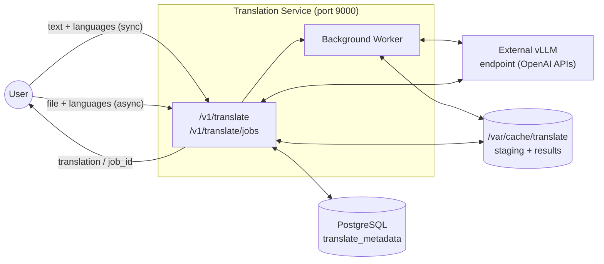

# Translation Service — Implementation Proposal

## 1. Overview

This document proposes the design and implementation of the **Translation** microservice for the AI-Services platform. The service converts text and plain-text documents between languages, enabling multilingual operations and global user experiences.

At its core, the service accepts text or a plain-text file and a target language, and returns the fully translated content. The source language is **optional** — when omitted (or explicitly set to `"auto"`), the service first attempts language detection via the `lingua` library; if confidence is insufficient, the LLM detects it automatically. For plain text submitted inline, the call is synchronous and returns immediately. For `.txt` and `.md` files, the service operates asynchronously: the file is staged, read as UTF-8, and the text is passed to the LLM for translation. The translated output is returned as a string, preserving all headings, lists, and tables present in the original markdown.

**One key design choice has been made for document inputs and is described in detail in Section 2:**
- **Translation strategy:** Chunk-wise translation — the markdown is split into paragraph-boundary chunks and each chunk is translated in an independent LLM call, then reassembled using boundary-aware join logic.

> **Scope note:** PDF and DOCX file inputs, the Digitize Documents service integration, and document reconstruction (PDF/DOCX output) are **not in scope for v1**. They are documented as future enhancements in §17.

The service is a first-class member of the AI-Services platform and follows the same architectural patterns established by the summarize service:

- FastAPI application running as a Python service in a Podman container (ppc64le / RHEL).
- Semaphore-based concurrency limiting: an 8-slot job admission semaphore for async jobs, a 4-slot per-job chunk-parallelism cap, and a shared 32-slot semaphore in front of the vLLM inference endpoint.
- PostgreSQL (`translate_metadata` database) for durable job metadata, initialized by an idempotent init container.
- `/var/cache/translate`-backed staging and result files on a persistent volume.
- Boot-time recovery scan that marks interrupted jobs as failed and cleans up orphaned staging directories.

Two execution paths are provided:

| Path                    | Endpoint                   | Use case                                                                                                                                   |
|:------------------------|:---------------------------|:-------------------------------------------------------------------------------------------------------------------------------------------|
| **Synchronous**         | `POST /v1/translate`       | Plain text submitted inline. Blocking call, immediate translated text result. Stateless — no job record created.                           |
| **Asynchronous (jobs)** | `POST /v1/translate/jobs`  | File uploads (`.txt` or `.md`). File is staged, read as UTF-8, chunked and translated. Returns a `job_id` for polling.                    |

### 1.1 Concept-to-Design Mapping

| Concept diagram element                                           | Design realization                                                                                                                                                        |
|:------------------------------------------------------------------|:--------------------------------------------------------------------------------------------------------------------------------------------------------------------------|
| Input: text to be translated                                      | Sync `text` field; async worker reads staged `.txt` / `.md` file as UTF-8                                                                                                |
| Input: source language (e.g., "German")                          | `source_language` parameter — optional; defaults to `"auto"`. When `"auto"`, the service runs `detect_language()` from `common/lang_utils.py` (lingua) before the LLM call to resolve the actual language; falls back to LLM auto-detect if confidence is below threshold. When provided explicitly, validated against a fixed allowlist. |
| Input: target language (e.g., "English")                         | `target_language` parameter — validated against a fixed allowlist; `"auto"` is not permitted                                                                              |
| Config: Version (e.g., 1.0.0)                                    | Not managed by the service — API versioned via `/v1/` path prefix                                                                                                         |
| Config: LLM (granite-3.3-8b-instruct, mistral-small-3.1-24b, …) | `MODEL_NAME` env var (service default)                                                                                                                                    |
| Config (optional): custom model weights                          | `OPENAI_BASE_URL` env var pointing to the desired vLLM deployment                                                                                                        |
| Output: text translated to the provided output language          | `data.translation` in the response — translated string; for `.md` file inputs, markdown structure (headings, lists, tables) is preserved                                 |
| External dependency: inferencing endpoint                        | Existing vLLM endpoint (`OPENAI_BASE_URL`), shared semaphore (`MAX_CONCURRENT_REQUESTS=32`)                                                                               |
| Supported input formats                                          | Sync: plain text inline. Async: `.txt` and `.md` files (UTF-8)                                                                                                           |
| Supported contents: texts and tables                             | GFM markdown tables in `.md` files are preserved structurally; the LLM prompt explicitly instructs cell/header translation while keeping `\| pipe \|` syntax intact       |
| Translation strategy for async jobs                              | Chunk-wise — markdown split on paragraph boundaries, each chunk translated in an independent LLM call, results reassembled with `join_after`-aware logic (Section 2)     |
| SLAs: throughput / latency                                       | Governed by concurrency limits and the context-window guard applied per chunk (Section 8); to be quantified during performance testing                                    |

---

## 2. Design Decision — Chunk-Wise Translation

**Decision: the async document translation path uses chunk-wise translation.** The digitized markdown is split into manageable chunks on paragraph boundaries, each chunk is translated in an independent LLM call, and the results are concatenated into the final translated document.

> **Note:** This decision is based on the reasoning below and represents the primary implementation approach. It will be validated through experimentation with real documents during development. If results show that single-pass translation is reliably sufficient for the document sizes encountered in practice, the strategy can be revisited without API changes.

### 2.1 Why Not Translate the Entire Document in One LLM Call

Sending the full digitized markdown in a single call is the simpler implementation, but it carries a set of compounding risks that make it unsuitable as the primary strategy for documents:

**1. Context window limits make it fragile by design.**
`granite-3.3-8b-instruct` has a 32k token context window. Translation is approximately a 1:1 operation — a 15k-token German document requires roughly 15k tokens of output, leaving only 2k tokens after subtracting prompt overhead. A 20-page contract can easily exceed 20k–25k input tokens alone. Single-pass translation therefore rejects a significant fraction of real-world documents outright, which is not an acceptable user experience.

**2. LLM quality degrades with prompt length.**
LLMs are well-documented to lose fidelity on very long prompts. At high token counts, models may drop paragraphs, repeat earlier sections, reorder content, or begin to fabricate. Translation demands high faithfulness — every sentence in the input must appear, correctly translated, in the output. The risk of silent content omission is especially high, because there is no way for the service to verify completeness without a second LLM call.

**3. A single failure loses the entire translation.**
If the LLM call times out, runs out of memory, or produces low-quality output for a long document, the job must be restarted from the beginning. There is no natural checkpoint. For a 30-page document that takes 60+ seconds, this is a costly and frustrating failure mode.

**4. Error recovery is expensive and all-or-nothing.**
Because the entire document is treated as one atomic unit, any error — network timeout, vLLM OOM, context limit exceeded mid-generation — requires a full retry. There is no way to salvage the portion that was correctly translated.

**5. Token cost scales poorly.**
A 25k-token input document at a 1:1 translation ratio consumes ~50k tokens per job in a single call. Chunk-wise translation consumes the same total tokens but distributes them across smaller, independently completable calls, enabling finer retry granularity and more predictable per-call latency.

### 2.2 Why Chunk-Wise Translation is the Right Choice

- **No context ceiling.** Documents of any length can be translated — the chunker sizes each piece to fit within the available window with room for both prompt overhead and the translated output.
- **Contained failure surface.** If one chunk fails, only that chunk is retried. Completed chunks are preserved, making partial recovery straightforward.
- **Predictable quality per chunk.** Each LLM call operates on a small, focused segment. The model's attention is not diluted across 30 pages — it processes at most a few paragraphs at a time, which is where LLM translation quality is highest.
- **Natural parallelism.** Chunks can be scheduled concurrently (up to the shared LLM semaphore), reducing total wall-clock time for long documents.

### 2.3 Chunking Strategy

#### Unit of measurement — tokens, not words

The chunker measures chunk size in **tokens**, not words. Translation output length tracks input token count closely (approximately 1:1), so the chunk budget must be expressed in the same unit the LLM context window uses. Word count — used by the summarize service's chunker — is an approximation that works for summarization (output is shorter than input, so over-estimating is safe). For translation the margin is much tighter: a chunk that is 10% too large in token terms may push the combined prompt over the context window.

Token counts are obtained via `tokenize_with_llm(block_text, llm_endpoint)` from `common/llm_utils.py`, which calls `POST {OPENAI_BASE_URL}/tokenize`. This is the same call used by the context-window guard — no new dependency is introduced. The token count of each block is measured **once** when the block is first considered for packing and cached for the remainder of the packing loop.

#### Algorithm

**Step 1 — Split on paragraph boundaries.**
The full markdown string is split on double-newline (`\n\n`) into a list of blocks. Each block is one of: a heading line, a prose paragraph, a GFM table (the full `| pipe |` block including separator row), or a list block. Blocks are the atomic units passed to the packing loop.

**Step 2 — Greedy packing.**
Maintain a running chunk (a list of blocks) and a running token count. For each block in order:

```
block_tokens = tokenize_with_llm(block_text)   # one /tokenize call per block

if running_tokens + block_tokens <= CHUNK_TOKEN_BUDGET:
    append block to current chunk
    running_tokens += block_tokens
else:
    close current chunk → emit as chunk[i]
    start new chunk with this block
    running_tokens = block_tokens
```

When the loop ends, the remaining open chunk is emitted as the final chunk.

**Step 3 — Sentence-level fallback for oversized blocks.**
If a single block's token count exceeds `CHUNK_TOKEN_BUDGET` on its own (e.g., a very long paragraph with no sub-structure), it cannot be placed as a unit. It is split into sentences using `SentenceSplitter(language=splitter_lang)` from the `sentence-splitter` library (already a project dependency). The resulting sentences are packed greedily using the same token-counting logic above.

`splitter_lang` is the lowercase ISO code for the resolved source language (`"de"` or `"en"`), derived via `to_sentence_splitter_lang(resolved_source_language_code)` from `common/lang_utils.py`. When `source_language` could not be resolved before chunking (lingua fell below threshold), `splitter_lang` defaults to `"en"`.

> **Why `SentenceSplitter` instead of a regex:** German documents frequently contain abbreviations (`z. B.`, `Nr.`, `Abs.`, `d. h.`, `ca.`) that end with a period but are not sentence boundaries — a regex split would break these into malformed sub-chunks. `SentenceSplitter` handles this via language-specific abbreviation dictionaries and is already used by the digitize and summarize services. No new dependency is introduced.

#### Parameters

| Parameter | What it controls | How it's used |
|:---|:---|:---|
| `CHUNK_TOKEN_BUDGET` | Max input tokens per chunk | Packing decision threshold in steps 2 and 3 |
| `OPENAI_BASE_URL` (shared) | `/tokenize` endpoint | Token count per block; one call per block, result cached |
| `splitter_lang` | Language code for sentence splitter | Passed to `SentenceSplitter(language=splitter_lang)` in step 3; derived from resolved source language |

> **`CHUNK_TOKEN_BUDGET` default: 40% of `MAX_MODEL_LEN`.**
> Setting the budget to 40% of the context window (≈ 13,107 tokens for `granite-3.3-8b-instruct` at 32,768) leaves 60% — minus prompt overhead — for the translated output. This headroom is deliberate: English→German output is typically 20–30% longer than the input in token terms, so a 50% budget risks overrunning the output half of the window. 40% ensures the output reservation (≈ 19,500 tokens after prompt overhead) comfortably absorbs the worst-case expansion. The value is configurable via the `CHUNK_TOKEN_BUDGET` env var and should be validated empirically against real documents during development. See §13 for the env var.

### 2.4 Concatenation and Coherence

After all chunk translations are returned, they are concatenated in the original chunk order. No additional LLM call is made for coherence stitching:

- **Order preservation.** Chunks are created and tracked with an index; results are concatenated in index order regardless of the order in which concurrent LLM calls complete.
- **Markdown structure preserved.** Because chunks are formed on paragraph boundaries, each chunk starts and ends at a clean markdown boundary. Concatenating the results produces valid, well-structured markdown.

### 2.5 Handling Tables at Chunk Boundaries

GFM markdown tables in `.md` files are emitted as contiguous `| pipe |` blocks. Tables must be treated as **atomic units** — a table is never split across two chunks:

- During greedy packing, if a table block would overflow the current chunk budget, the current chunk is closed first, and the table starts a new chunk on its own.
- If a table is larger than the entire chunk budget on its own, it occupies a chunk by itself and the budget is allowed to be exceeded for that chunk only — the alternative (splitting a table mid-row) would produce malformed markdown and an untranslatable fragment.

### 2.6 Chunk Join Strategy and Boundary Preservation

How chunk translations are joined back together depends on **what kind of content was split** at the chunk boundary. There are two distinct cases, and they require different join logic.

#### Case 1 — Block boundary (the common case)

When the chunk boundary falls between two whole blocks (a heading, a paragraph, a table, a list block), the blocks are separated by `\n\n` in the original. The join is simply:

```python
translated_markdown = "\n\n".join(chunk_translations)
```

The `\n\n` re-inserts the paragraph separator that existed between the blocks in the original. No information is lost and no discontinuity is visible.

**Example:**

Input document (two blocks, boundary between them):
```markdown
## Einleitung

Deutschland unterzeichnete das Abkommen im Jahr 2024.

| Quartal | Umsatz |
|---|---|
| Q1 | 1,2 Mio. € |
```

Chunk 1 (heading + paragraph packed together):
```markdown
## Einleitung

Deutschland unterzeichnete das Abkommen im Jahr 2024.
```
Chunk 2 (table alone — overflowed the budget):
```markdown
| Quartal | Umsatz |
|---|---|
| Q1 | 1,2 Mio. € |
```

After translation and `"\n\n".join(...)`:
```markdown
## Introduction

Germany signed the agreement in 2024.

| Quarter | Revenue |
|---|---|
| Q1 | €1.2M |
```
✅ Identical structure to the original. No separator artifacts.

---

#### Case 2 — Sentence fallback boundary (a single oversized paragraph split mid-block)

When a single prose paragraph exceeds `CHUNK_TOKEN_BUDGET` on its own, it is split into sentence sub-groups across two or more chunks. These sub-groups **belong to the same paragraph** in the original — they must be rejoined with a single space (` `), not a `\n\n`, otherwise the output introduces a false paragraph break in the middle of a continuous passage.

To enable the correct join, each chunk produced by the sentence fallback is tagged with a **join type** metadata field alongside the text:

| `join_after` value | Meaning | Join character |
|:---|:---|:---|
| `"paragraph"` (default) | Boundary between two whole blocks | `"\n\n"` |
| `"sentence"` | Boundary within a split paragraph | `" "` (single space) |

The final assembly iterates over `(chunk_translation, join_after)` pairs and uses the correct separator between each adjacent pair:

```python
result_parts = []
for i, (translation, join_after) in enumerate(zip(chunk_translations, chunk_metadata)):
    result_parts.append(translation)
    if i < len(chunk_translations) - 1:
        separator = " " if chunk_metadata[i]["join_after"] == "sentence" else "\n\n"
        result_parts.append(separator)
translated_markdown = "".join(result_parts)
```

**Example:**

Input: one oversized paragraph (too large for `CHUNK_TOKEN_BUDGET`):
```markdown
The contract was signed on January 1st. All parties agreed to the terms. The agreement covers all territories. Payment is due quarterly. Disputes shall be resolved by arbitration.
```

After sentence splitting into two chunks:

Chunk A (`join_after="sentence"`):
```
The contract was signed on January 1st. All parties agreed to the terms. The agreement covers all territories.
```
Chunk B (`join_after="paragraph"`):
```
Payment is due quarterly. Disputes shall be resolved by arbitration.
```

After translation:
- Chunk A → `"Der Vertrag wurde am 1. Januar unterzeichnet. Alle Parteien stimmten den Bedingungen zu. Das Abkommen gilt für alle Gebiete."`
- Chunk B → `"Die Zahlung ist vierteljährlich fällig. Streitigkeiten werden durch Schiedsverfahren beigelegt."`

Joined with `" "` (because chunk A's `join_after == "sentence"`):
```markdown
Der Vertrag wurde am 1. Januar unterzeichnet. Alle Parteien stimmten den Bedingungen zu. Das Abkommen gilt für alle Gebiete. Die Zahlung ist vierteljährlich fällig. Streitigkeiten werden durch Schiedsverfahren beigelegt.
```
✅ One continuous paragraph — the original paragraph structure is preserved exactly.

Compare to the broken output without join-type metadata (naive `"\n\n".join`):
```markdown
Der Vertrag wurde am 1. Januar unterzeichnet. Alle Parteien stimmten den Bedingungen zu. Das Abkommen gilt für alle Gebiete.

Die Zahlung ist vierteljährlich fällig. Streitigkeiten werden durch Schiedsverfahren beigelegt.
```
❌ False paragraph break inserted mid-passage — incorrect structure in the markdown result.

---

#### What this means for the chunk data structure

Each chunk produced by the chunker carries two fields:

```python
@dataclass
class TranslationChunk:
    index: int          # position in the original sequence; used to sort results after gather
    text: str           # the block or sentence group to translate
    join_after: str     # "paragraph" | "sentence" — how to join this chunk's result to the next
```

The `index` field ensures correct ordering after `asyncio.gather` regardless of completion order. The `join_after` field drives the assembly step. Both are set by the chunker and are read-only for the rest of the pipeline.

---

## 3. (Reserved for Future Scope)

PDF and DOCX input support, Digitize Documents service integration, and output document reconstruction (PDF via `weasyprint`, DOCX via `python-docx`) are not in scope for v1. See §17 Future Enhancements for the full design.

---

## 4. Non-Goals

- **Horizontal scaling:** This service is architected for single-replica deployment. Multi-replica deployments introduce contention on the vLLM inference engine and are out of scope.
- **UI:** No user interface is included in this document. The service is API-only.
- **Multi-file jobs:** Each async job processes exactly one file. Clients submit one job per file.
- **Multi-language batch translation:** Each job targets a single `target_language`. Clients submit one job per target language.
- **PDF and DOCX input:** Binary document formats are not accepted in v1. Only plain-text `.txt` and `.md` files are accepted for async jobs. PDF and DOCX support is deferred to a future release (§17).
- **Document reconstruction output:** The service returns a translated text/markdown string only. Reconstructed PDF or DOCX output files are not produced in v1 (§17).
- **Sync auditing:** Synchronous translation requests are stateless — no job record is created and no result is persisted. Auditability of sync calls is a Future Enhancement.
- **Embedding model:** No embedding model is used in this service. Translation is a direct LLM inference task — there is no semantic search, retrieval, or vector storage involved. An embedding model would only be relevant for translation quality checking (e.g., measuring semantic similarity between source and translated text), which is out of scope for v1.

---

## 5. Architecture



**Key interactions:**

- The **sync path** is stateless — it validates languages, runs the context-window guard, calls vLLM at `temperature=0.0`, and returns the translated text immediately. No DB write, no staging.
- The **async worker** orchestrates: stage file → read UTF-8 text → lingua detection → chunk → context-window guard → translate (concurrent `asyncio.gather`) → `join_after`-aware assembly → write result → update DB.
- Both paths share the global vLLM connection semaphore (§9).
- The service is exposed externally on **port 9000** (configurable).
- The service has **no external service dependencies** beyond the vLLM endpoint and PostgreSQL.

---

## 6. Endpoints

| Method     | Endpoint                                              | Description                                                                        |
|:-----------|:------------------------------------------------------|:-----------------------------------------------------------------------------------|
| **POST**   | `/v1/translate`                                       | Synchronous translation of inline plain text. Immediate result.                    |
| **POST**   | `/v1/translate/jobs`                                  | Submit a `.txt` or `.md` file for async translation. Returns `job_id`.             |
| **GET**    | `/v1/translate/jobs`                                  | List translation jobs with pagination and status filter.                            |
| **GET**    | `/v1/translate/jobs/{job_id}`                         | Get detailed status and metadata of a specific job.                                |
| **GET**    | `/v1/translate/jobs/{job_id}/result`                  | Retrieve the full translation result as JSON (translation string + metadata + usage). |
| **GET**    | `/v1/translate/jobs/{job_id}/result/download`         | Download the translated content as a `.txt` or `.md` file (matches input extension). |
| **GET**    | `/health`                                             | Service health check.                                                              |

---

## 7. API Specification

### 7.1 POST /v1/translate — Synchronous Translation

**Content-Type:** `application/json`

**Request body:**

| Field             | Type   | Required | Description                                                                                                                    |
|:------------------|:-------|:---------|:-------------------------------------------------------------------------------------------------------------------------------|
| `text`            | string | Yes      | Plain text to translate. Must be non-empty.                                                                                    |
| `source_language` | string | No       | Source language name (e.g., `"German"`). Omit or pass `"auto"` to let the LLM detect the language automatically. Default: `"auto"`. |
| `target_language` | string | Yes      | Target language name (e.g., `"English"`). Must not be `"auto"`.                                                                |

Supported language values for `source_language` and `target_language` (case-insensitive): `English`, `German`. `source_language` additionally accepts `"auto"` (or may be omitted entirely).

**Processing logic:**

1. Validate `text` is non-empty (else `400`).
2. If `source_language` is omitted, default it to `"auto"`. If provided, validate against the allowlist (including `"auto"`); `"auto"` is never valid for `target_language` (else `400 INVALID_LANGUAGE`).
3. Validate `target_language` is present and in the allowlist (else `400`).
4. If `source_language != "auto"` and `source_language.lower() == target_language.lower()`, return `400 SAME_LANGUAGE` — source and target must differ. Skip this check when `source_language == "auto"` since the resolved language is not yet known.
5. Check the global vLLM semaphore; if all slots are occupied, return `429`.
6. Tokenize the input via the vLLM `/tokenize` API — exact count.
7. Apply the **hard context-window guard** (Section 8). If it fails, return `413` with token diagnostics.
8. Build the translation prompt (Section 11): system prompt + user prompt (auto-detect variant if `source_language == "auto"`).
9. Call vLLM `/v1/chat/completions` with `temperature=0.0`.
10. Return the translation with metadata and token usage.

**Response codes:**

| Status | Description | Details |
|:---|:---|:---|
| 200 OK | Success | Translation completed. |
| 400 Bad Request | Invalid request | Missing/empty `text` or missing `target_language`. |
| 400 Bad Request | Invalid language | `source_language` or `target_language` not in the supported allowlist, or `target_language == "auto"`. |
| 413 Payload Too Large | Context limit | Input + prompt overhead exceeds `MAX_MODEL_LEN`. Includes token diagnostics. |
| 429 Too Many Requests | Rate limit | vLLM semaphore at capacity. |
| 500 Internal Server Error | Server error | Unexpected failure. |
| 503 Service Unavailable | AI service down | vLLM endpoint unreachable. |

**Sample request:**

```bash
# With explicit source language
curl -X POST http://localhost:9000/v1/translate \
  -H "Content-Type: application/json" \
  -d '{
    "text": "Der Vertrag tritt am 1. Januar 2025 in Kraft.",
    "source_language": "German",
    "target_language": "English"
  }'

# Without source language — auto-detection (default)
curl -X POST http://localhost:9000/v1/translate \
  -H "Content-Type: application/json" \
  -d '{
    "text": "Der Vertrag tritt am 1. Januar 2025 in Kraft.",
    "target_language": "English"
  }'
```

**Sample response (200):**

```json
{
    "data": {
        "translation": "The contract comes into force on 1 January 2025.",
        "source_language": "German",
        "target_language": "English",
        "original_word_count": 9,
        "translated_word_count": 10
    },
    "meta": {
        "model": "ibm-granite/granite-3.3-8b-instruct",
        "processing_time_ms": 620,
        "input_type": "text"
    },
    "usage": {
        "input_tokens": 38,
        "output_tokens": 15,
        "total_tokens": 53
    }
}
```

**Sample error (400) — unsupported language:**

```json
{
    "error": {
        "code": "INVALID_LANGUAGE",
        "message": "'Klingon' is not a supported language. Supported: English, German. Use 'auto' for source_language to auto-detect.",
        "status": 400
    }
}
```

**Sample error (400) — auto as target:**

```json
{
    "error": {
        "code": "INVALID_LANGUAGE",
        "message": "'auto' is not valid for target_language. Please specify an explicit target language.",
        "status": 400
    }
}
```

**Sample error (413) with token diagnostics:**

```json
{
    "error": {
        "code": "CONTEXT_LIMIT_EXCEEDED",
        "message": "Input does not fit in the model context window. Reduce input size.",
        "status": 413,
        "details": {
            "max_model_len": 32768,
            "input_tokens": 32500,
            "prompt_overhead_tokens": 150,
            "min_output_buffer_tokens": 50,
            "total_required_tokens": 32700,
            "excess_tokens": 132
        }
    }
}
```

---

### 7.2 POST /v1/translate/jobs — Create Async Translation Job

**Content-Type:** `multipart/form-data`

**Form parameters:**

| Parameter         | Type   | Required | Description                                                                                                                         |
|:------------------|:-------|:---------|:------------------------------------------------------------------------------------------------------------------------------------|
| `file`            | file   | Yes      | Exactly one `.txt` or `.md` file (UTF-8 encoded).                                                                                   |
| `source_language` | string | No       | Source language name. Omit or pass `"auto"` to let the service detect the language automatically. Default: `"auto"`.               |
| `target_language` | string | Yes      | Target language name. Must not be `"auto"`.                                                                                         |
| `job_name`        | string | No       | Optional human-readable label for the job.                                                                                          |

**Validation rules:**

- Exactly one file per request.
- Extension must be `.txt` or `.md`. Other file types (`.pdf`, `.docx`, `.xlsx`, etc.) are rejected with `415 UNSUPPORTED_FILE_TYPE`.
- If `source_language` is omitted, it defaults to `"auto"`. If provided, it must be in the allowlist or `"auto"`.
- `target_language` is required and must be in the allowlist; `"auto"` is not permitted.
- **File size** is checked against `MAX_UPLOAD_SIZE_MB` (default: `10 MB`) **before staging**. Uploads that exceed this limit are rejected immediately with `413 FILE_TOO_LARGE`. This prevents large uploads from filling the staging volume or OOM-ing the worker before the context-window guard runs.

**Processing flow (request thread):**

1. Validate file extension and parameters.
2. Check file size against `MAX_UPLOAD_SIZE_MB`; if exceeded, return `413 FILE_TOO_LARGE`.
3. Check `job_limiter`; if all slots are occupied, return `429`.
4. Generate `job_id` (UUID).
5. Stage the file to `/var/cache/translate/staging/{job_id}/`.
6. Insert a row into `translate_jobs` with `status='accepted'`.
7. Launch background processing via FastAPI `BackgroundTasks`.
8. Return `202 Accepted` with `{ "job_id": "..." }`.

**Background worker:**

1. Acquire `job_limiter`; update row → `status='in_progress'`, `metadata.phase='chunking'`.
2. Read the staged file as UTF-8 text.
3. **Run lingua detection** on the full text using three-position sampling to resolve `source_language` if `"auto"` (§10.2). The detected ISO code (e.g. `"DE"`) is passed to `chunk_document` as `source_language_code`.
4. **Chunk the text** (§2.3): split on `\n\n` boundaries into blocks; greedily pack blocks into `TranslationChunk` objects, calling `tokenize_with_llm(block)` per block (token count cached). Close current chunk when `running_tokens + block_tokens > CHUNK_TOKEN_BUDGET`. Apply sentence-level fallback for blocks that exceed the budget alone — sentences split via `SentenceSplitter(language=splitter_lang)` where `splitter_lang = to_sentence_splitter_lang(source_language_code)` (defaults to `"en"` if unresolved). Treat table blocks as atomic (§2.5). Each chunk carries `index`, `text`, and `join_after` (`"paragraph"` or `"sentence"`) (§2.6). **Run the context-window guard on each chunk** (§8.2): if `chunk_tokens + PROMPT_OVERHEAD_TOKENS > MAX_MODEL_LEN - MIN_OUTPUT_TOKENS` for any chunk → abort immediately with `status='failed'`, `error='CONTEXT_LIMIT_EXCEEDED'`, diagnostics in `metadata`. Store `chunk_count` and `chunk_token_budget` in `metadata.chunking`.
5. Update `metadata.phase='translating'`. Dispatch all chunks concurrently via `asyncio.gather` (§9.3): each chunk runs as an `asyncio.Task` that acquires `chunk_semaphore` then `concurrency_limiter`, builds the two-message prompt (`system` + `user`) with resolved `source_language`, `target_language`, and `chunk.text`, and calls `query_vllm_translate` at `temperature=0.0` with `chunk_max_tokens` computed from the context-window budget (§8.2). If any chunk task fails, all sibling tasks are cancelled and the job fails.
6. **Assemble** translated chunks using `join_after`-aware concatenation (§2.6): `"\n\n"` between block-boundary chunks, `" "` between sentence-fallback chunks → `translated_markdown` string.
7. Write `/var/cache/translate/results/{job_id}_result.json`.
8. Update row → `status='completed'`, `completed_at=now()` (or `status='failed'` + `error` on any hard failure).
9. Delete `/var/cache/translate/staging/{job_id}/`; release `job_limiter`.

**Response codes:**

| Status | Description |
|:---|:---|
| 202 Accepted | Job created. |
| 400 Bad Request | Missing file, missing `target_language`, invalid language value, or `target_language == "auto"`. |
| 413 Payload Too Large | File exceeds `MAX_UPLOAD_SIZE_MB`. |
| 415 Unsupported Media Type | Not a valid `.txt` or `.md` file. |
| 429 Too Many Requests | Job concurrency at capacity. |
| 500 Internal Server Error | Unexpected failure. |

**Sample request:**

```bash
# With explicit source language
curl -X POST http://localhost:9000/v1/translate/jobs \
  -F "file=@bericht_q3.md" \
  -F "source_language=German" \
  -F "target_language=English" \
  -F "job_name=Q3 Quarterly Report"

# Without source language — auto-detection (default)
curl -X POST http://localhost:9000/v1/translate/jobs \
  -F "file=@bericht_q3.md" \
  -F "target_language=English" \
  -F "job_name=Q3 Quarterly Report"
```

**Sample response (202):**

```json
{
    "job_id": "a1b2c3d4-e5f6-7890-abcd-ef1234567890"
}
```

---

### 7.3 GET /v1/translate/jobs — List Jobs

**Query parameters:**

| Parameter | Type   | Required | Description |
|:----------|:-------|:---------|:---|
| `limit`   | int    | No       | Records per page (1–100). Default: `20`. |
| `offset`  | int    | No       | Records to skip. Default: `0`. |
| `status`  | string | No       | Filter: `accepted`, `in_progress`, `completed`, `failed`. |

| Status | Description |
|:---|:---|
| 200 OK | Paginated job list. |
| 400 Bad Request | Invalid query parameter values. |
| 500 Internal Server Error | Database failure. |

**Sample response (200):**

```json
{
    "pagination": {"total": 8, "limit": 20, "offset": 0},
    "data": [
        {
            "job_id": "a1b2c3d4-e5f6-7890-abcd-ef1234567890",
            "job_name": "Q3 Quarterly Report",
            "status": "completed",
            "source_language": "german",
            "target_language": "english",
            "input_type": "md",
            "document_name": "bericht_q3.md",
            "submitted_at": "2025-10-15T09:00:00Z",
            "completed_at": "2025-10-15T09:00:42Z"
        }
    ]
}
```

---

### 7.4 GET /v1/translate/jobs/{job_id} — Job Details

| Status | Description |
|:---|:---|
| 200 OK | Full job status and metadata. |
| 404 Not Found | No job with this ID. |
| 500 Internal Server Error | Database failure. |

**Sample response (200, in progress — MD job being chunked/translated):**

```json
{
    "job_id": "a1b2c3d4-e5f6-7890-abcd-ef1234567890",
    "job_name": "Q3 Quarterly Report",
    "status": "in_progress",
    "source_language": "auto",
    "target_language": "english",
    "input_type": "md",
    "document_name": "bericht_q3.md",
    "document_word_count": null,
    "submitted_at": "2025-10-15T09:00:00Z",
    "completed_at": null,
    "error": null,
    "job_metadata": {
        "phase": "translating"
    }
}
```

**Sample response (200, completed):**

```json
{
    "job_id": "a1b2c3d4-e5f6-7890-abcd-ef1234567890",
    "job_name": "Q3 Quarterly Report",
    "status": "completed",
    "source_language": "german",
    "target_language": "english",
    "input_type": "md",
    "document_name": "bericht_q3.md",
    "document_word_count": 1820,
    "submitted_at": "2025-10-15T09:00:00Z",
    "completed_at": "2025-10-15T09:00:42Z",
    "error": null,
    "job_metadata": {
        "phase": "completed",
        "input_tokens": 2430,
        "output_tokens": 2190,
        "model": "ibm-granite/granite-3.3-8b-instruct",
        "processing_time_ms": 8200,
        "timing_in_secs": {
            "chunking": 0.3,
            "translating": 8.2
        },
        "chunking": {
            "chunk_count": 7,
            "chunk_token_budget": 4096
        }
    }
}
```

---

### 7.5 GET /v1/translate/jobs/{job_id}/result — Get Translation Result

Only available when `status == "completed"`. Returns `409` if still running, `410` if the job failed.

| Status | Description |
|:---|:---|
| 200 OK | Translation result. |
| 404 Not Found | No job with this ID. |
| 409 Conflict | Job is still `accepted` or `in_progress`. |
| 410 Gone | Job has `status='failed'`. Error details are on the job resource. |
| 500 Internal Server Error | Failure reading result file. |

**Sample response (200 — MD job, completed):**

```json
{
    "job_id": "a1b2c3d4-e5f6-7890-abcd-ef1234567890",
    "data": {
        "translation": "# Q3 2024 Report\n\n## Executive Summary\n\nThe company achieved record revenue...\n\n| Quarter | Revenue | Growth |\n|---|---|---|\n| Q1 | €1.2M | +12% |\n| Q2 | €1.5M | +25% |",
        "source_language": "german",
        "target_language": "english",
        "original_word_count": 1820,
        "translated_word_count": 1793,
        "input_type": "md",
        "document_name": "bericht_q3.md"
    },
    "meta": {
        "model": "ibm-granite/granite-3.3-8b-instruct",
        "processing_time_ms": 8200,
        "timing_in_secs": {
            "chunking": 0.3,
            "translating": 8.2
        }
    },
    "usage": {
        "input_tokens": 2430,
        "output_tokens": 2190,
        "total_tokens": 4620
    }
}
```

**Sample response (409 — job still running):**

```json
{
    "error": {
        "code": "JOB_NOT_COMPLETE",
        "message": "Job is still in_progress. Poll GET /v1/translate/jobs/{job_id} for status.",
        "status": 409
    }
}
```

**Sample response (410 — job failed):**

```json
{
    "error": {
        "code": "JOB_FAILED",
        "message": "Job failed: CONTEXT_LIMIT_EXCEEDED — input (33100 tokens) exceeds context window.",
        "status": 410
    }
}
```

---

### 7.6 GET /v1/translate/jobs/{job_id}/result/download — Download Translated File

Download the translated content as a plain-text file. The file extension and MIME type match the original uploaded file (`.txt` → `text/plain`, `.md` → `text/markdown`). The `Content-Disposition` header causes browsers and HTTP clients to save the file rather than display it.

This endpoint reads the `data.translation` string from the already-persisted `{job_id}_result.json` file — **no additional file is stored on disk**. It is a streaming convenience wrapper over the same data exposed by the JSON `/result` endpoint.

Same preconditions as `/result`:

| Status | Description |
|:---|:---|
| 200 OK | Translated file download. |
| 404 Not Found | No job with this ID. |
| 409 Conflict | Job is still `accepted` or `in_progress`. |
| 410 Gone | Job has `status='failed'`. |
| 500 Internal Server Error | Failure reading result file. |

**Sample request:**

```bash
curl -OJ http://localhost:9000/v1/translate/jobs/a1b2c3d4-e5f6-7890-abcd-ef1234567890/result/download
# saves: bericht_q3_translated.md
```

**Response headers (200 — MD job):**

```
Content-Type: text/markdown; charset=utf-8
Content-Disposition: attachment; filename="bericht_q3_translated.md"
```

**Response body:** the raw translated markdown string (same value as `data.translation` in the JSON result).

> **Design note:** The download filename is derived from the original `document_name` stored in the job record. For a job submitted with `bericht_q3.md`, the download filename is `bericht_q3_translated.md`. The extension is taken from `input_type` (`txt` → `.txt`, `md` → `.md`).

---

### 7.7 GET /health — Health Check

| Status | Description |
|:---|:---|
| 200 OK | Service is healthy. |

```json
{"status": "ok"}
```

---

## 8. Hard Context-Window Guard

The context-window guard enforces that the full prompt fits within `MAX_MODEL_LEN`. Unlike summarization (output shorter than input), translation output is approximately equal in length to the input — this makes the output budget a first-class concern.

The guard applies differently on each path:

- **Sync path:** the guard runs once on the full input text before the LLM call. The input is not chunked — if it exceeds the limit, the request fails immediately with `413 CONTEXT_LIMIT_EXCEEDED`.
- **Async chunk-wise path (Section 2):** the chunker uses `CHUNK_TOKEN_BUDGET` to size chunks well below `MAX_MODEL_LEN` (§2.3). The guard then runs per chunk as a safety check before each LLM call. Because the chunker already enforces the budget, a guard breach on the async path indicates a misconfigured `CHUNK_TOKEN_BUDGET` (e.g., set larger than `MAX_MODEL_LEN - PROMPT_OVERHEAD_TOKENS`) and is treated as a hard error that fails the job.

### 8.1 Sync Path — Budget Calculation

The sync path tokenizes the full input and checks it against the available window in one step:

```
input_tokens      = /tokenize(text_to_translate)       # one call per request
prompt_overhead   = PROMPT_OVERHEAD_TOKENS              # ~150 tokens; system + user template without text
min_output_buffer = MIN_OUTPUT_TOKENS                   # 50 tokens; safety floor ensuring the model can respond

max_allowed_input = MAX_MODEL_LEN - prompt_overhead - min_output_buffer

require: input_tokens <= max_allowed_input              # else 413 CONTEXT_LIMIT_EXCEEDED

# Output token budget (after guard passes):
available_output  = MAX_MODEL_LEN - input_tokens - prompt_overhead
buffer            = max(20, int(available_output * 0.10))   # 10% breathing room
effective_max_tokens = available_output - buffer
max_tokens (LLM call) = effective_max_tokens
```

**Output reservation rationale:** Translation output length tracks input length closely — a 2,000-token German document typically produces a ~2,000-token English document. Rather than reserving a fixed fraction of the window for output, the guard dynamically allocates nearly all remaining space to the output after accounting for the (stable) prompt overhead. The 10% buffer prevents the LLM from being cut off mid-sentence.

**Example with `granite-3.3-8b-instruct` (MAX_MODEL_LEN = 32,768):**

```
Input:            2,430 tokens  (German legal document)
Prompt overhead:    150 tokens
Min output buffer:   50 tokens
max_allowed_input: 32,568 tokens  ✅ fits

available_output:  30,188 tokens
buffer:             3,019 tokens  (10% of available)
effective_max_tokens: 27,169 tokens
```

**Caching:** `prompt_overhead` is stable (the template without the text never changes) and is stored as a constant in settings. At request time, only the input text is tokenized — one `/tokenize` call per translation.

### 8.2 Async Path — Chunk Budget and Per-Chunk Guard

On the async path, `CHUNK_TOKEN_BUDGET` is the primary sizing control. The chunker (§2.3) ensures each chunk's token count stays at or below this value during packing — `/tokenize` is called per block during the greedy packing loop, so the budget is enforced before any LLM call is made.

The per-chunk context-window guard then verifies:

```
chunk_tokens      = token count of the packed chunk    # already known from packing
prompt_overhead   = PROMPT_OVERHEAD_TOKENS

require: chunk_tokens + prompt_overhead <= MAX_MODEL_LEN - MIN_OUTPUT_TOKENS
         # else: fail job with CONTEXT_LIMIT_EXCEEDED + diagnostics

# Output token budget for this chunk's LLM call:
available_output  = MAX_MODEL_LEN - chunk_tokens - prompt_overhead
buffer            = max(20, int(available_output * 0.10))
max_tokens (LLM call) = available_output - buffer
```

`CHUNK_TOKEN_BUDGET` must satisfy: `CHUNK_TOKEN_BUDGET ≤ MAX_MODEL_LEN - PROMPT_OVERHEAD_TOKENS - MIN_OUTPUT_TOKENS`. Setting it close to that ceiling leaves almost no room for the output. The default of **40% of `MAX_MODEL_LEN`** (see §2.3) is the recommended starting point: it reserves 60% of the context window for prompt overhead and the translated output, which comfortably absorbs the worst-case 20–30% English→German token expansion.

### 8.3 Diagnostics

Every `413` (sync) and every `CONTEXT_LIMIT_EXCEEDED` job failure (async) includes the full budget breakdown. For async jobs, the same diagnostics are persisted into the job's `job_metadata` JSONB column so they are accessible via `GET /v1/translate/jobs/{job_id}` without log access.

```json
{
    "max_model_len": 32768,
    "input_tokens": 32500,
    "prompt_overhead_tokens": 150,
    "min_output_buffer_tokens": 50,
    "total_required_tokens": 32700,
    "excess_tokens": 132
}
```

---

## 9. Concurrency Limiting

### 9.1 Shared vLLM Semaphore

A single `asyncio.BoundedSemaphore` limits total concurrent vLLM connections, matching the summarize service pattern:

```python
concurrency_limiter = asyncio.BoundedSemaphore(settings.common.llm.max_batch_size)  # default: 32
```

- Sync translations acquire one slot for the duration of the LLM call.
- Each async worker acquires one slot when it reaches the LLM call.
- If the semaphore is at capacity when a request arrives, the API returns `429` immediately rather than queuing.

### 9.2 Async Job Admission Semaphore

A second, smaller semaphore caps how many translation **jobs** run concurrently:

```python
job_limiter = asyncio.BoundedSemaphore(settings.translate.max_concurrent_jobs)  # default: 8
```

| Semaphore            | Scope        | Limit              | Purpose                                                                                |
|:---------------------|:-------------|:-------------------|:---------------------------------------------------------------------------------------|
| `job_limiter`        | Async jobs   | 8 (configurable)   | Caps background workers; bounds staging disk usage.                                    |
| `concurrency_limiter`| Global       | 32                 | Caps total concurrent vLLM connections across sync + async paths.                     |

The semaphores are nested: a worker holds a `job_limiter` slot for the whole job lifetime, and briefly acquires `concurrency_limiter` per chunk LLM call, releasing it as soon as each response returns. Because the worker holds no vLLM slot while running lingua detection or the chunker, async jobs consume the vLLM budget only during active inference — the sync path stays responsive even at full job concurrency.

**Why 8 jobs (up from 4):** The original 4-job limit was chosen partly to bound load on the digitize service dependency. Translation v1 has no digitize dependency — the only remaining constraints are staging disk usage (negligible at 8 jobs) and vLLM contention. With `CHUNK_PARALLELISM = 4` (§9.3), the theoretical worst-case vLLM load is `8 × 4 = 32 slots`, which fully saturates the shared semaphore. In practice this maximum is rarely reached — it requires all 8 jobs to be simultaneously in the translation phase with all 4 of their chunk tasks active at once. Sync requests arriving when the semaphore is full receive a `429` immediately rather than waiting, so the sync path degrades gracefully rather than silently queuing. Both knobs are independently configurable via env vars for operators who want a more conservative split.

### 9.3 LLM Call Strategy

**Each chunk is translated in an independent `POST /v1/chat/completions` call.** Chunks within a job are dispatched concurrently using `asyncio.gather`, bounded by a per-job `chunk_semaphore` (`CHUNK_PARALLELISM = 4`). All chunk tasks share the global `concurrency_limiter`.

#### Call structure (per chunk)

The translation service defines its own `query_vllm_translate` function in `services/translate/llm_utils.py`. It is a thin async wrapper around `httpx.AsyncClient` — the same client already used for digitize service calls — posting directly to `POST {OPENAI_BASE_URL}/v1/chat/completions`:

```python
async def query_vllm_translate(
    client: httpx.AsyncClient,
    llm_endpoint: str,
    messages: list[dict],
    model: str,
    max_tokens: int,
    temperature: float = 0.0,
) -> tuple[str, int, int]:
    """
    Send one translation call to the vLLM endpoint.
    Returns (translated_text, input_tokens, output_tokens).
    """
    payload = {
        "messages": messages,
        "model": model,
        "max_tokens": max_tokens,
        "temperature": temperature,
    }
    response = await client.post(
        f"{llm_endpoint}/v1/chat/completions",
        json=payload,
        headers={"Content-Type": "application/json"},
    )
    response.raise_for_status()
    data = response.json()
    content = data["choices"][0]["message"]["content"].strip()
    input_tokens  = data.get("usage", {}).get("prompt_tokens", 0)
    output_tokens = data.get("usage", {}).get("completion_tokens", 0)
    return content, input_tokens, output_tokens
```

Each per-chunk call passes the two-message array built from the prompt templates (§10.1):

```python
messages = [
    {"role": "system", "content": system_prompt},
    {"role": "user",   "content": user_prompt.format(
        source_language=resolved_source_language,
        target_language=target_language,
        text=chunk.text,                          # chunk.text from TranslationChunk (§2.6)
    )},
]
translation, in_tok, out_tok = await query_vllm_translate(
    client=http_client,
    llm_endpoint=llm_endpoint,
    messages=messages,
    model=model_name,
    max_tokens=chunk_max_tokens,    # computed per-chunk by the context-window guard (§8.2)
    temperature=0.0,
)
```

`query_vllm_translate` is fully async — it does not block the event loop and does not require `asyncio.to_thread`.

#### Per-chunk task and failure handling

Each chunk is a `TranslationChunk` dataclass (§2.6) carrying `index`, `text`, and `join_after`. Each is executed as an `asyncio.Task`. A `chunk_semaphore` (`asyncio.BoundedSemaphore(CHUNK_PARALLELISM)`) limits how many chunks of a single job run simultaneously, nested inside `concurrency_limiter`:

```python
async def translate_chunk(chunk: TranslationChunk) -> tuple[TranslationChunk, str, int, int]:
    async with chunk_semaphore:          # per-job parallelism cap
        async with concurrency_limiter:  # global vLLM cap
            translation, in_tok, out_tok = await query_vllm_translate(
                client=http_client,
                llm_endpoint=llm_endpoint,
                messages=build_messages(chunk.text, resolved_source_language, target_language),
                model=model_name,
                max_tokens=compute_max_tokens(chunk),   # §8.2
                temperature=0.0,
            )
    return chunk, translation, in_tok, out_tok

tasks = [asyncio.create_task(translate_chunk(chunk)) for chunk in chunks]
try:
    results = await asyncio.gather(*tasks)
except Exception:
    for t in tasks:
        if not t.done():
            t.cancel()
    await asyncio.gather(*tasks, return_exceptions=True)
    raise
```

If any chunk fails (HTTP error, timeout, context guard breach), all sibling tasks are cancelled immediately and the job is marked `failed`. No partial results are written.

#### Result assembly

`asyncio.gather` returns results in the same order as the task list (input chunk order), so no sort is needed. Assembly uses the `join_after` field from each `TranslationChunk` to choose the correct separator between adjacent translated chunks — `"\n\n"` at block boundaries and `" "` at sentence-fallback boundaries (§2.6):

```python
# results: list of (chunk, translation, in_tok, out_tok) in chunk index order
parts = []
for i, (chunk, translation, in_tok, out_tok) in enumerate(results):
    parts.append(translation)
    if i < len(results) - 1:
        parts.append(" " if chunk.join_after == "sentence" else "\n\n")

translated_markdown = "".join(parts)
```

This is the value stored in `result.json` as `data.translation`.

---

## 10. Prompt Design

### 10.1 Prompt Structure

**System prompt:**

```
You are a professional translator. Your task is to translate the provided text accurately and faithfully.

Rules:
- Translate ALL content including headings, paragraphs, bullet points, and table cell content
- Preserve ALL markdown formatting: headings (#, ##), bold (**), italic (*), bullet lists (-, *), numbered lists
- Preserve ALL markdown tables: keep the | pipe | structure and separator lines (|---|---|) exactly as-is; translate only the cell and header text
- Do NOT add any explanation, commentary, preamble, or notes
- Do NOT omit any part of the input
- Do NOT translate code blocks, URLs, proper nouns that are universally known, or technical identifiers
- Output ONLY the translated text, nothing else
```

**User prompt (explicit source language — used when `source_language` is known, either provided by the caller or resolved via lingua detection):**

```
Translate the following text from {source_language} to {target_language}.

Text:
{text}

Translation:
```

**User prompt (LLM auto-detect fallback — used only when lingua confidence falls below threshold):**

```
Detect the language of the following text and translate it to {target_language}.

Text:
{text}

Translation:
```

### 10.2 Language Detection Strategy

Before constructing the prompt, the service resolves `source_language` via lingua detection, with path-specific sampling:

- **Async path:** samples 500 characters at three evenly-spaced positions (beginning, middle, end) and takes the majority vote across the three detections. This prevents English-language headers or reference numbers at the top of a document from incorrectly overriding the body language.
- **Sync path:** samples the first 500 characters directly. Short inline text is inherently less reliable for lingua; LLM auto-detect is the likely fallback.

In both cases, if lingua confidence meets `LANGUAGE_DETECTION_MIN_CONFIDENCE` (default `0.5`) and the detected language is in the supported set, the explicit-source prompt template is used. Otherwise, the service falls back to LLM auto-detect.

The resolved `source_language` is stored in the job result (async) or response body (sync) so the caller always knows what was detected, rather than receiving `"auto"` as the recorded value.

**Supported lingua languages:** English (`EN`), German (`DE`). The detector is initialized at startup via `setup_language_detector([Language.ENGLISH, Language.GERMAN])`.

### 10.3 Notes on Prompt Design

- `temperature = 0.0` — translation is deterministic; unlike summarization (0.3), there is no benefit to variance in translation.
- No target word count is given — translation output length is determined by the content, not a compression goal.
- The "Output ONLY the translated text" instruction is critical — without it, LLMs prepend preambles like "Here is the translation:".
- One prompt template is stored in settings (`translate_user_prompt`) for the explicit-source case; a second (`translate_user_prompt_auto`) is the LLM auto-detect fallback. Both are individually overridable via environment variables.
- Tables from `.md` input (produced by the digitize service's `table.export_to_markdown()`) are GFM-standard `| col | col |` format, which LLMs understand natively. The prompt preserves table syntax automatically.

### 10.4 Prompt Token Overhead

The system prompt above is approximately 90 tokens. The user prompt template (excluding the text) adds ~15 tokens. `PROMPT_OVERHEAD_TOKENS` defaults to `150` — a generous buffer that covers both templates with room to spare, avoiding the need to tokenize the template on every call.

---

## 11. Async Workflow Sequence Diagram

```mermaid
sequenceDiagram
    autonumber
    actor User
    participant API as Translate API (FastAPI :9000)
    participant PG as PostgreSQL (translate_metadata)
    participant FS as /var/cache/translate
    participant Worker as Background Worker
    participant vLLM as vLLM Endpoint

    User->>API: POST /v1/translate/jobs (file, source_language, target_language)
    Note over API: Validate file ext (.txt or .md), languages, job_limiter capacity
    API->>FS: Stage file to staging/{job_id}/
    API->>PG: INSERT translate_jobs (status: accepted)
    API->>Worker: BackgroundTask(job_id)
    API-->>User: 202 Accepted {job_id}

    activate Worker
    Worker->>PG: status=in_progress, phase=chunking
    Worker->>FS: Read staged file (UTF-8)

    Worker->>PG: phase=chunking
    Note over Worker: Lingua detection - resolve source_language if auto
    Note over Worker: Split on double-newline into blocks
    loop For each block
        Worker->>vLLM: POST /tokenize (block text)
        vLLM-->>Worker: block_tokens
        Note over Worker: Pack into TranslationChunk - set join_after
    end
    Note over Worker: Context guard - check each chunk fits window
    alt Any chunk breaches MAX_MODEL_LEN - PROMPT_OVERHEAD - MIN_OUTPUT
        Worker->>PG: status=failed (CONTEXT_LIMIT_EXCEEDED + diagnostics)
    else All chunks pass guard
        Worker->>PG: phase=translating - store chunk_count and chunk_token_budget
        par asyncio.gather - all chunks concurrently
            Worker->>vLLM: POST /v1/chat/completions (chunk 1, temp=0.0, max_tokens)
            vLLM-->>Worker: Translated chunk 1
        and
            Worker->>vLLM: POST /v1/chat/completions (chunk 2, temp=0.0, max_tokens)
            vLLM-->>Worker: Translated chunk 2
        and
            Worker->>vLLM: POST /v1/chat/completions (chunk N, temp=0.0, max_tokens)
            vLLM-->>Worker: Translated chunk N
        end
        Note over Worker: Assemble using join_after - paragraph boundary or sentence boundary

        Worker->>FS: Write results/{job_id}_result.json
        Worker->>PG: status=completed, completed_at=now()
    end

    Worker->>FS: Delete staging/{job_id}/
    deactivate Worker
```



---

## 12. Storage Layout

### 12.1 Overview

Durable metadata lives in **PostgreSQL** — the service gets its own database, `translate_metadata`, on the shared PostgreSQL instance, following the per-service isolation convention established by the digitize service.

File-based storage is retained only for:

- **Staging** (`/var/cache/translate/staging/{job_id}/`): holds the uploaded file while the worker processes it. Deleted after the job completes or fails.
- **Result files** (`/var/cache/translate/results/{job_id}_result.json`): full translation output, timing, and usage. Kept on disk as a read-once payload rather than a database column.

```
/var/cache/translate/
├── staging/
│   └── {job_id}/
│       └── bericht_q3.md
└── results/
    └── {job_id}_result.json
```

Sync requests (`POST /v1/translate`) are **stateless** — nothing is persisted. If auditability of sync translations becomes a requirement, it is a Future Enhancement.

### 12.2 Database Tables

#### 12.2.1 `translate_jobs` Table

```python
class TranslateJob(Base):
    """SQLAlchemy model for translate_jobs table."""
    __tablename__ = 'translate_jobs'

    job_id   = Column(String(255), primary_key=True)
    job_name = Column(String(500), nullable=True)

    # Translation parameters (normalised to lowercase at write time)
    source_language = Column(String(100), nullable=False)   # e.g. "german", "auto" (default when not supplied by user)
    target_language = Column(String(100), nullable=False)   # e.g. "english"

    # Input document info
    input_type          = Column(String(20), nullable=False)    # "text" | "txt" | "md"
    document_name       = Column(String(500), nullable=True)    # original filename; NULL for sync text
    document_word_count = Column(Integer, nullable=True)        # populated during processing

    # Job lifecycle
    status       = Column(String(50), nullable=False)
    submitted_at = Column(DateTime(timezone=True), nullable=False)
    completed_at = Column(DateTime(timezone=True), nullable=True)
    error        = Column(Text, nullable=True)

    # Phase, token diagnostics, timings
    job_metadata = Column(JSONB, nullable=True)

    updated_at = Column(DateTime(timezone=True),
                        server_default=func.now(),
                        onupdate=func.now())

    __table_args__ = (
        CheckConstraint(
            "status IN ('accepted','in_progress','completed','failed')",
            name='chk_translate_job_status'
        ),
        CheckConstraint(
            "input_type IN ('text','txt','md')",
            name='chk_translate_input_type'
        ),
        Index('idx_translate_jobs_submitted_at_status', 'submitted_at', 'status'),
    )
```

#### 12.2.2 `job_metadata` JSONB Shape

Populated progressively as the job advances through phases:

```json
{
    "phase": "chunking | translating | completed | failed",
    "input_tokens": 2430,
    "output_tokens": 2190,
    "model": "ibm-granite/granite-3.3-8b-instruct",
    "processing_time_ms": 8200,
    "timing_in_secs": {
        "chunking": 0.3,
        "translating": 8.2
    },
    "chunking": {
        "chunk_count": 7,
        "chunk_token_budget": 4096
    },
    "token_diagnostics": {
        "max_model_len": 32768,
        "input_tokens": 32500,
        "prompt_overhead_tokens": 150,
        "min_output_buffer_tokens": 50,
        "total_required_tokens": 32700,
        "excess_tokens": 132
    }
}
```

- `chunking` is populated on all async jobs after the chunking step completes. `chunk_count` is the number of chunks the document was split into; `chunk_token_budget` is the configured value at the time of the job, useful for debugging and reproducing results without checking service config. `timing_in_secs.chunking` records the wall time spent running lingua detection and the greedy packing loop.
- `token_diagnostics` is populated only when `CONTEXT_LIMIT_EXCEEDED`.

#### 12.2.3 Index Strategy

| Index | Columns | Purpose |
|:---|:---|:---|
| PK | `translate_jobs.job_id` | Job detail / result lookups. |
| `idx_translate_jobs_submitted_at_status` | `submitted_at DESC, status` | Job listing with status filter; boot-time zombie scan. |

### 12.3 Schema Creation via Init Container

Identical pattern to the digitize and summarize services: an init container (`translate-db-init`) runs before the main `translate-api` container, executing an idempotent `init_schema.sql` against the shared PostgreSQL instance.

**Script: `services/translate/db/scripts/init_schema.sql`**

```sql
-- Translation service — idempotent schema initialization

CREATE TABLE IF NOT EXISTS translate_jobs (
    job_id              VARCHAR(255) PRIMARY KEY,
    job_name            VARCHAR(500),
    source_language     VARCHAR(100) NOT NULL DEFAULT 'auto',
    target_language     VARCHAR(100) NOT NULL,
    input_type          VARCHAR(20) NOT NULL,
    document_name       VARCHAR(500),
    document_word_count INTEGER,
    status              VARCHAR(50) NOT NULL,
    submitted_at        TIMESTAMP WITH TIME ZONE NOT NULL,
    completed_at        TIMESTAMP WITH TIME ZONE,
    error               TEXT,
    job_metadata        JSONB,
    updated_at          TIMESTAMP WITH TIME ZONE NOT NULL DEFAULT CURRENT_TIMESTAMP,
    CONSTRAINT chk_translate_job_status
        CHECK (status IN ('accepted','in_progress','completed','failed')),
    CONSTRAINT chk_translate_input_type
        CHECK (input_type IN ('text','txt','md'))
);

CREATE INDEX IF NOT EXISTS idx_translate_jobs_submitted_at_status
    ON translate_jobs(submitted_at DESC, status);

CREATE OR REPLACE FUNCTION update_translate_jobs_updated_at_column()
RETURNS TRIGGER AS $$
BEGIN
    NEW.updated_at = CURRENT_TIMESTAMP;
    RETURN NEW;
END;
$$ language 'plpgsql';

```

### 12.4 Lifecycle of Storage Artifacts

| Artifact | Created at | Updated during | Deleted at |
|:---|:---|:---|:---|
| `translate_jobs` row | `POST /v1/translate/jobs` (status `accepted`) | Worker updates status/phase/metadata/timestamps | Not exposed via API currently — Future Enhancement |
| Staging file | `POST /v1/translate/jobs` | — | Worker deletes after job completes or fails |
| Result JSON file | Worker writes on success | — | Not exposed via API currently — Future Enhancement |

---

## 13. Configuration

| Variable | Description | Default |
|:---|:---|:---|
| `OPENAI_BASE_URL` | OpenAI-compatible vLLM endpoint | — |
| `MODEL_NAME` | Default translation model | `ibm-granite/granite-3.3-8b-instruct` |
| `MAX_MODEL_LEN` | Model context window (tokens) | `32768` |
| `PROMPT_OVERHEAD_TOKENS` | System + user template token overhead | `150` |
| `MIN_OUTPUT_TOKENS` | Minimum output buffer for context guard | `50` |
| `CHUNK_TOKEN_BUDGET` | Maximum input tokens per translation chunk (async path). Controls greedy packing in §2.3 — a new chunk is opened when the running block token count would exceed this value. Set to 40% of `MAX_MODEL_LEN` to leave ≥60% of the context window for the translated output, accommodating the 20–30% token expansion of English→German translation. | `int(0.40 * MAX_MODEL_LEN)` — evaluated at startup; ≈ 13,107 for `granite-3.3-8b-instruct` |
| `MAX_UPLOAD_SIZE_MB` | Maximum accepted file size for async job uploads, enforced at the API boundary before staging. Prevents large uploads from filling the staging volume or OOM-ing the worker. | `10` |
| `TRANSLATION_TEMPERATURE` | LLM temperature for all translation calls | `0.0` |
| `MAX_CONCURRENT_REQUESTS` | Global vLLM semaphore | `32` |
| `MAX_CONCURRENT_JOBS` | Async job admission semaphore | `8` |
| `CHUNK_PARALLELISM` | Max number of chunks translated concurrently within a single job (§9.3). Each concurrent chunk holds one `concurrency_limiter` slot. Set to a fraction of `MAX_CONCURRENT_REQUESTS` so a single large job cannot monopolise the vLLM semaphore. | `4` |
| `SUPPORTED_LANGUAGES` | Comma-separated allowlist of active language names | `english,german` |
| `POSTGRES_HOST/PORT/DB/USER/PASSWORD` | Postgres connection (`translate_metadata`) | — |
| `DB_POOL_SIZE` / `DB_MAX_OVERFLOW` | SQLAlchemy connection pool | `5` / `5` |

---

## 14. Recovery Strategy

Adapted from the digitize and summarize pattern for PostgreSQL:

1. **Boot-up scan:** on FastAPI startup, query `translate_jobs` for rows with `status IN ('accepted', 'in_progress')`.
2. **Identify zombies:** any such row is a zombie — no worker can be handling it after a restart.
3. **Mark as failed:** update to `status='failed'`, `error='System restarted during processing'`, `completed_at=now()`. Transactional, so the scan and update are atomic with respect to newly submitted jobs.
4. **Cleanup:** delete corresponding `/var/cache/translate/staging/{job_id}/` directories.

---

## 15. Test Cases

| Test Case | Input | Expected Result |
|:---|:---|:---|
| Sync translate, valid | German text → English | 200 with `data.translation` |
| Sync translate, source omitted (default auto) | No `source_language` field, text in any language | 200, LLM detects and translates |
| Sync translate, explicit `"auto"` | `source_language: "auto"`, text | 200, identical behaviour to omitted |
| Sync translate, explicit source language | `source_language: "German"`, text | 200, LLM told source language explicitly |
| Sync translate, unsupported language | `source_language: "Klingon"` | 400 `INVALID_LANGUAGE` with supported list |
| Sync translate, auto as target | `target_language: "auto"` | 400 `INVALID_LANGUAGE` |
| Sync translate, same source and target | `source_language: "English"`, `target_language: "English"` | 400 `SAME_LANGUAGE` |
| Sync translate, same language auto source | `source_language: "auto"`, `target_language: "English"` | 200 — check skipped; auto source not yet resolved |
| Sync translate, empty text | `text: ""` | 400 `INVALID_REQUEST` |
| Sync translate, over context limit | Text exceeding guard | 413 `CONTEXT_LIMIT_EXCEEDED` with token diagnostics |
| vLLM semaphore exhausted | 32 slots busy | 429 `RATE_LIMIT_EXCEEDED` |
| Async TXT job | `.txt` + languages | 202; completes without digitize call |
| Async MD job | `.md` + languages | 202; read as plain text, no digitize call |
| Invalid file type | `.pdf`, `.docx`, `.xlsx` upload | 415 `UNSUPPORTED_FILE_TYPE` |
| File too large | Upload exceeds `MAX_UPLOAD_SIZE_MB` | 413 `FILE_TOO_LARGE` before staging |
| Job semaphore exhausted | 4 jobs already running | 429 `RATE_LIMIT_EXCEEDED` |
| Async over-limit file | File text exceeds context | Job `failed`, `CONTEXT_LIMIT_EXCEEDED`, diagnostics in `job_metadata` |
| Job progress phases | Poll during MD job | `phase` transitions `chunking` → `translating` → `completed` |
| Get result, in progress | Active `job_id` | 409 `JOB_NOT_COMPLETE` |
| Get result, completed | Completed `job_id` | 200 with translation + timings + usage |
| Get result, failed | Failed `job_id` | 410 `JOB_FAILED` with error message |
| Get result, not found | Unknown `job_id` | 404 `RESOURCE_NOT_FOUND` |
| Download result, completed TXT job | Completed `.txt` job_id | 200 file download, `Content-Type: text/plain`, filename `*_translated.txt` |
| Download result, completed MD job | Completed `.md` job_id | 200 file download, `Content-Type: text/markdown`, filename `*_translated.md` |
| Download result, in progress | Active `job_id` | 409 `JOB_NOT_COMPLETE` |
| Download result, failed | Failed `job_id` | 410 `JOB_FAILED` |
| Download result, not found | Unknown `job_id` | 404 `RESOURCE_NOT_FOUND` |
| Job listing by status | `?status=completed` | 200, only matching jobs returned |
| Job listing, pagination | `?limit=5&offset=10` | 200, correct page slice |
| Recovery after crash | Kill container mid-translation | On restart, zombie marked `failed`, staging cleaned |
| Markdown table preservation | MD file with GFM tables | Translated `.md` output contains translated `\| pipe \|` tables |

---

## 16. File Structure

```
services/translate/
├── Containerfile
├── Makefile
├── README.md
├── app.py                          # FastAPI app, lifespan, sync endpoint, job runner
├── models.py                       # Pydantic models & enums (JobStatus, InputType, …)
├── settings.py                     # TranslationConfig + DatabaseConfig + Settings
├── translate_utils.py              # Context guard, prompt builders, validate_languages, TranslateException
├── job_utils.py                    # File staging, result I/O, zombie recovery, directory management
├── db_operations.py                # create_job_with_db() helper
├── api/
│   └── v1/
│       └── jobs.py                 # GET /jobs, GET /jobs/{id}, GET /jobs/{id}/result, GET /jobs/{id}/result/download
├── db/
│   ├── __init__.py
│   ├── connection.py               # SQLAlchemy engine + session + check_db_connection
│   ├── manager.py                  # TranslateJobRepository (CRUD)
│   ├── models.py                   # TranslateJob ORM model
│   └── scripts/
│       ├── init_db.py
│       └── init_schema.sql
└── tests/
    ├── conftest.py
    └── unit/
        ├── test_app_endpoints.py
        ├── test_job_endpoints.py
        ├── test_translate_utils.py
        ├── test_chunk_utils.py
        └── test_recovery_scan.py
```

---

## 17. Future Enhancements

### v1 Enhancements (no scope change)

1. **Sync request auditing:** optional persistence of sync translation requests and results for compliance or caching use cases.
2. **Language auto-detection result surfacing:** when `source_language == "auto"`, expose the resolved language name in `data.detected_source_language` so callers always know what was detected.
3. **Model override per request:** allow callers to specify `model` in the request body, validated against a `SUPPORTED_MODELS` allowlist, enabling per-request selection of a higher-quality model for critical translations.
4. **Glossary / term pinning:** allow users to supply a `glossary` of term pairs (`{"Vertrag": "contract"}`) alongside the request, injected into the prompt to enforce domain-specific translations.
5. **Confidence / quality scoring:** a secondary lightweight LLM pass that scores the translation quality and surfaces a `quality_score` alongside the result.

### PDF and DOCX support (future release)

The following features were designed in detail during v1 planning but deferred to a future release. The design decisions, rationale, and technical approach are documented in the original §2–§3 design notes preserved below.

**6. PDF input support via the Digitize Documents service**

- Accept `.pdf` files on `POST /v1/translate/jobs`
- Forward to the existing **Digitize Documents** service (`POST {DIGITIZE_BASE_URL}/v1/jobs`, `output_format=md`) to extract clean markdown
- Poll digitize job status; fetch markdown via `GET /v1/documents/{doc_id}/content`; store `digitize_doc_id` in the job record
- Handle digitize `429` responses with exponential backoff; fail job with `DIGITIZE_TIMEOUT` / `DIGITIZE_FAILED` on error
- Introduce `DIGITIZE_BASE_URL`, `DIGITIZE_POLL_INTERVAL_SECS`, `DIGITIZE_JOB_TIMEOUT_SECS` configuration env vars
- Add `digitize_job_id` and `digitize_doc_id` columns to `translate_jobs` and to the job detail response
- Add `digitizing` phase to the `job_metadata.phase` enum and `timing_in_secs`

**7. DOCX input support via the Digitize Documents service**

- Same pipeline as PDF — digitize service handles DOCX extraction to markdown
- No additional service dependencies beyond what PDF support introduces

**8. PDF output reconstruction**

- After translation, convert the translated markdown → HTML → PDF using `weasyprint` (pure Python, ppc64le/RHEL compatible)
- Expose via `GET /v1/translate/jobs/{job_id}/result/pdf` (`application/pdf` download)
- Add `pdf_available` (boolean) to the job result; store reconstructed file at `results/{job_id}_translated.pdf`
- Reconstruction is non-fatal: if `weasyprint` fails, job still completes with `pdf_available=false`
- Add `reconstruction` object to `job_metadata` JSONB: `{ type, attempted, succeeded, error }`

**9. DOCX output reconstruction**

- After translation, convert translated markdown → DOCX using `python-docx` (pure Python, ppc64le/RHEL compatible)
- Expose via `GET /v1/translate/jobs/{job_id}/result/docx`
- Add `docx_available` (boolean) to the job result; store at `results/{job_id}_translated.docx`
- Same non-fatal semantics as PDF reconstruction
- Known v1 limitation: nested lists rendered as flat paragraphs; original fonts/images not preserved

**10. Improved PDF reconstruction fidelity**

- If `weasyprint` output quality is insufficient for multi-column or heavily styled documents, tune the markdown → HTML CSS stylesheet without replacing the library or changing the API
